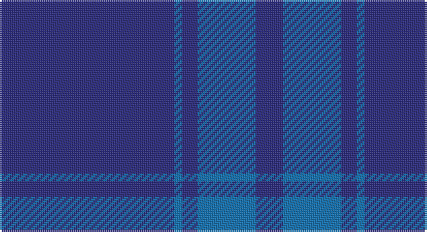

This page is one **sett** — a single exact thread-count. It belongs to the [tartan](/setts/db45b2db4b15db7/)
(the same proportion at any scale), whose colour order is pattern [BBBBB](/stripes/bbbbb/).

Part of the [Asahi](/tartans/asahi/) tartan — the named design grouping this sett with its other cloths.

Sourced from tartans-authority.  It is a [5 stripe tartan](/stripes/stripes5/).

Original link http://www.tartansauthority.com/tartan-ferret/display/6677/

## Register references

External register numbers recorded for this tartan.

- Scottish Tartans Authority (ITI): 6677

## Thread count
DB/90 B4 DB8 B30 DB/14

One full sett is **188 threads**.

## Palette

Palette: <strong>Tartan Register</strong>
<table><thead><tr><th>Colour</th><th>Threads</th><th>Shade</th><th>Base</th><th>OKLCh</th></tr></thead><tbody><tr><td>DB/</td><td style="text-align:right;font-variant-numeric:tabular-nums">90</td><td><code style="background-color:#2C2C80;">#2C2C80</code> <small style="color:#888">#2C2C80</small></td><td>B <code style="background-color:#2A418A;">#2A418A</code></td><td><small style="color:#888">oklch(35.0% 0.138 276.6)</small></td></tr><tr><td>B</td><td style="text-align:right;font-variant-numeric:tabular-nums">4</td><td><code style="background-color:#1474B4;">#1474B4</code> <small style="color:#888">#1474B4</small></td><td>B <code style="background-color:#2A418A;">#2A418A</code></td><td><small style="color:#888">oklch(54.0% 0.129 245.1)</small></td></tr><tr><td>DB</td><td style="text-align:right;font-variant-numeric:tabular-nums">8</td><td><code style="background-color:#2C2C80;">#2C2C80</code> <small style="color:#888">#2C2C80</small></td><td>B <code style="background-color:#2A418A;">#2A418A</code></td><td><small style="color:#888">oklch(35.0% 0.138 276.6)</small></td></tr><tr><td>B</td><td style="text-align:right;font-variant-numeric:tabular-nums">30</td><td><code style="background-color:#1474B4;">#1474B4</code> <small style="color:#888">#1474B4</small></td><td>B <code style="background-color:#2A418A;">#2A418A</code></td><td><small style="color:#888">oklch(54.0% 0.129 245.1)</small></td></tr><tr><td>DB/</td><td style="text-align:right;font-variant-numeric:tabular-nums">14</td><td><code style="background-color:#2C2C80;">#2C2C80</code> <small style="color:#888">#2C2C80</small></td><td>B <code style="background-color:#2A418A;">#2A418A</code></td><td><small style="color:#888">oklch(35.0% 0.138 276.6)</small></td></tr></tbody></table>

# Sample pattern

## Compared to the master

This cloth is one sett of its design; the master sett (the exemplar the design is anchored on) is below for comparison.

<figure style="margin:0"><figcaption style="color:#888;font-size:smaller">this sett</figcaption></figure>
<figure style="margin:0"><figcaption style="color:#888;font-size:smaller"><a href="/setts/w45b2w4b15w7/">master sett →</a></figcaption></figure>

## Nearest tartans

The nearest existing variants by ΔTartan distance, with this tartan at the top so the swatches line up against it.

ΔTartan

Tartan

Sett

—

<a href="/ttd/edit/#slug=db45b2db4b15db7~x2">Asahi (Corporate)</a> <a class="nn-out" href="/variants/s5/db45b2db4b15db7~x2/" title="open its dictionary page">↗</a>

1.70

<a href="/ttd/edit/#slug=db16m4db3r1~x2&amp;base=db45b2db4b15db7~x2">Elliot</a> <a class="nn-out" href="/variants/s4/db16m4db3r1~x2/" title="open its dictionary page">↗</a>

1.72

<a href="/ttd/edit/#slug=db44dy12db9r3~x2&amp;base=db45b2db4b15db7~x2">Elliot (Clan)</a> <a class="nn-out" href="/variants/s4/db44dy12db9r3~x2/" title="open its dictionary page">↗</a>

2.28

<a href="/ttd/edit/#slug=db9dy12db44dy12db9r3~x2&amp;base=db45b2db4b15db7~x2">Elliot</a> <a class="nn-out" href="/variants/s6/db9dy12db44dy12db9r3~x2/" title="open its dictionary page">↗</a>

2.34

<a href="/ttd/edit/#slug=do14db14do14db40do3db2~x2&amp;base=db45b2db4b15db7~x2">Atlin</a> <a class="nn-out" href="/variants/s6/do14db14do14db40do3db2~x2/" title="open its dictionary page">↗</a>

2.35

<a href="/ttd/edit/#slug=db16dr4db3r1~x6&amp;base=db45b2db4b15db7~x2">Elliot Clan Tartan</a> <a class="nn-out" href="/variants/s4/db16dr4db3r1~x6/" title="open its dictionary page">↗</a>

2.59

<a href="/ttd/edit/#slug=db16dr4db3r1~x2&amp;base=db45b2db4b15db7~x2">Elliott</a> <a class="nn-out" href="/variants/s4/db16dr4db3r1~x2/" title="open its dictionary page">↗</a>

2.67

<a href="/ttd/edit/#slug=db42db10db2db2r2db2db10r6db2r3db2~x2&amp;base=db45b2db4b15db7~x2">Loch Monar (Fashion)</a> <a class="nn-out" href="/variants/s11/db42db10db2db2r2db2db10r6db2r3db2~x2/" title="open its dictionary page">↗</a>

2.79

<a href="/variants/s6/db33g3r1~x2/">Norwich No.030</a>

2.88

<a href="/ttd/edit/#slug=db1t1db8r1~x2&amp;base=db45b2db4b15db7~x2">Lochaber #3</a> <a class="nn-out" href="/variants/s4/db1t1db8r1~x2/" title="open its dictionary page">↗</a>

2.88

<a href="/ttd/edit/#slug=dt68b7dt16k16lo4~x2&amp;base=db45b2db4b15db7~x2">Burnett's &amp; Struth (Corporate)</a> <a class="nn-out" href="/variants/s5/dt68b7dt16k16lo4~x2/" title="open its dictionary page">↗</a>

## Neighbour map

Every grey dot is one of 14360 variants placed by the first two principal components of the ΔTartan feature space (44% of its variance). Red is this tartan; blue dots are its nearest — click one to open its page.

<svg viewBox="0 0 640 380" role="img" style="max-width:100%;height:auto;border:1px solid #e0e0e0;border-radius:4px;display:block" xmlns="http://www.w3.org/2000/svg"><image href="/nn/cloud.v1.png" width="640" height="380"/><a href="/variants/s4/db16m4db3r1~x2/"><circle cx="626.0" cy="291.5" r="4" fill="#3465a4"><title>Elliot</title></circle></a><a href="/variants/s4/db44dy12db9r3~x2/"><circle cx="611.5" cy="290.9" r="4" fill="#3465a4"><title>Elliot (Clan)</title></circle></a><a href="/variants/s6/db9dy12db44dy12db9r3~x2/"><circle cx="532.0" cy="267.8" r="4" fill="#3465a4"><title>Elliot</title></circle></a><a href="/variants/s6/do14db14do14db40do3db2~x2/"><circle cx="552.4" cy="295.0" r="4" fill="#3465a4"><title>Atlin</title></circle></a><a href="/variants/s4/db16dr4db3r1~x6/"><circle cx="626.0" cy="305.6" r="4" fill="#3465a4"><title>Elliot Clan Tartan</title></circle></a><a href="/variants/s4/db16dr4db3r1~x2/"><circle cx="602.7" cy="280.5" r="4" fill="#3465a4"><title>Elliott</title></circle></a><a href="/variants/s11/db42db10db2db2r2db2db10r6db2r3db2~x2/"><circle cx="626.0" cy="213.3" r="4" fill="#3465a4"><title>Loch Monar (Fashion)</title></circle></a><a href="/variants/s6/db33g3r1~x2/"><circle cx="626.0" cy="226.0" r="4" fill="#3465a4"><title>Norwich No.030</title></circle></a><a href="/variants/s4/db1t1db8r1~x2/"><circle cx="590.0" cy="280.1" r="4" fill="#3465a4"><title>Lochaber #3</title></circle></a><a href="/variants/s5/dt68b7dt16k16lo4~x2/"><circle cx="547.6" cy="240.9" r="4" fill="#3465a4"><title>Burnett's &amp; Struth (Corporate)</title></circle></a><circle cx="626.0" cy="283.1" r="5" fill="#c00000"/></svg>

ID: /variants/s5/db45b2db4b15db7~x2/
