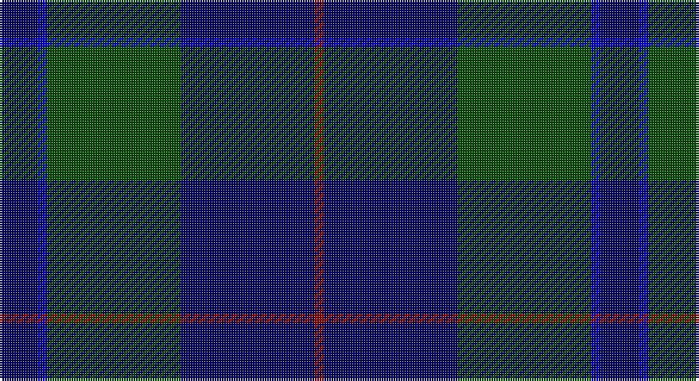

This page is one **sett** — a single exact thread-count. It belongs to the [tartan](/setts/db4dbi1dg14db14r1/)
(the same proportion at any scale), whose colour order is pattern [BBGBR](/stripes/bbgbr/).

Sourced from register-of-tartans.  It is a [5 stripe tartan](/stripes/stripes5/).

Original link https://www.tartanregister.gov.uk/tartanDetails.aspx?ref=4517

## Register references

External register numbers recorded for this tartan.

- Scottish Register of Tartans: [4517](https://www.tartanregister.gov.uk/tartanDetails.aspx?ref=4517)
- Scottish Tartans Authority (ITI): 4313

## Thread count
DB/16 B4 G56 DB56 DR/4

One full sett is **252 threads**.

## Palette

Palette: <strong>Tartan Register</strong> <small style="color:#888">(2 of 4 colours)</small>
<table><thead><tr><th>Colour</th><th>Threads</th><th>Shade</th><th>Base</th><th>OKLCh</th></tr></thead><tbody><tr><td>DB/</td><td style="text-align:right;font-variant-numeric:tabular-nums">16</td><td><code style="background-color:#000064;">#000064</code> <small style="color:#888">#000064</small></td><td>B <code style="background-color:#2A418A;">#2A418A</code></td><td><small style="color:#888">oklch(22.7% 0.158 264.1)</small></td></tr><tr><td>B</td><td style="text-align:right;font-variant-numeric:tabular-nums">4</td><td><code style="background-color:#0000E0;">#0000E0</code> <small style="color:#888">#0000E0</small></td><td>B <code style="background-color:#2A418A;">#2A418A</code></td><td><small style="color:#888">oklch(41.0% 0.284 264.1)</small></td></tr><tr><td>G</td><td style="text-align:right;font-variant-numeric:tabular-nums">56</td><td><code style="background-color:#004C00;">#004C00</code> <small style="color:#888">#004C00</small></td><td>G <code style="background-color:#006100;">#006100</code></td><td><small style="color:#888">oklch(36.1% 0.123 142.5)</small></td></tr><tr><td>DB</td><td style="text-align:right;font-variant-numeric:tabular-nums">56</td><td><code style="background-color:#000064;">#000064</code> <small style="color:#888">#000064</small></td><td>B <code style="background-color:#2A418A;">#2A418A</code></td><td><small style="color:#888">oklch(22.7% 0.158 264.1)</small></td></tr><tr><td>DR/</td><td style="text-align:right;font-variant-numeric:tabular-nums">4</td><td><code style="background-color:#8C0000;">#8C0000</code> <small style="color:#888">#8C0000</small></td><td>R <code style="background-color:#CC0000;">#CC0000</code></td><td><small style="color:#888">oklch(40.2% 0.165 29.2)</small></td></tr></tbody></table>

# Sample pattern

## Nearest tartans

The nearest existing variants by ΔTartan distance, with this tartan at the top so the swatches line up against it.

ΔTartan

Tartan

Sett

—

<a href="/ttd/edit/#slug=db4dbi1dg14db14r1~x4">Wcwm 1255-1</a> <a class="nn-out" href="/variants/s5/db4dbi1dg14db14r1~x4/" title="open its dictionary page">↗</a>

0.72

<a href="/ttd/edit/#slug=k2dg7db2dg7db16r1~x6&amp;base=db4dbi1dg14db14r1~x4">Hutton</a> <a class="nn-out" href="/variants/s6/k2dg7db2dg7db16r1~x6/" title="open its dictionary page">↗</a>

1.16

<a href="/ttd/edit/#slug=dg1db16dg16r1&amp;base=db4dbi1dg14db14r1~x4">Barclay Hunting</a> <a class="nn-out" href="/variants/s4/dg1db16dg16r1/" title="open its dictionary page">↗</a>

1.21

<a href="/ttd/edit/#slug=g26db10k3db2dy2db10~x4&amp;base=db4dbi1dg14db14r1~x4">St. Andrews Old Course Hotel (Corp)</a> <a class="nn-out" href="/variants/s6/g26db10k3db2dy2db10~x4/" title="open its dictionary page">↗</a>

1.26

<a href="/ttd/edit/#slug=dg1db16dg16r1~x2&amp;base=db4dbi1dg14db14r1~x4">Barclay Hunting</a> <a class="nn-out" href="/variants/s4/dg1db16dg16r1~x2/" title="open its dictionary page">↗</a>

1.32

<a href="/ttd/edit/#slug=dg4db12r3db12dg32lr4~x2&amp;base=db4dbi1dg14db14r1~x4">MacIntyre LC</a> <a class="nn-out" href="/variants/s6/dg4db12r3db12dg32lr4~x2/" title="open its dictionary page">↗</a>

1.32

<a href="/ttd/edit/#slug=dg4db12r3db12dg32lr4&amp;base=db4dbi1dg14db14r1~x4">MacIntyre LC</a> <a class="nn-out" href="/variants/s6/dg4db12r3db12dg32lr4/" title="open its dictionary page">↗</a>

1.40

<a href="/ttd/edit/#slug=k4r1k4r1dg14n1dg1~x4&amp;base=db4dbi1dg14db14r1~x4">Pinehurst Resort</a> <a class="nn-out" href="/variants/s7/k4r1k4r1dg14n1dg1~x4/" title="open its dictionary page">↗</a>

1.40

<a href="/ttd/edit/#slug=db24n13db4n4w2~x2&amp;base=db4dbi1dg14db14r1~x4">Gallaecia - Galicia National</a> <a class="nn-out" href="/variants/s5/db24n13db4n4w2~x2/" title="open its dictionary page">↗</a>

1.43

<a href="/ttd/edit/#slug=dg20db2g6db2dg4db27lo2db8~x2&amp;base=db4dbi1dg14db14r1~x4">Kinross (Fashion)</a> <a class="nn-out" href="/variants/s8/dg20db2g6db2dg4db27lo2db8~x2/" title="open its dictionary page">↗</a>

1.52

<a href="/ttd/edit/#slug=r1db12y5db2y4lb1~x2&amp;base=db4dbi1dg14db14r1~x4">Connaught Green</a> <a class="nn-out" href="/variants/s6/r1db12y5db2y4lb1~x2/" title="open its dictionary page">↗</a>

## Neighbour map

Every grey dot is one of 14360 variants placed by the first two principal components of the ΔTartan feature space (44% of its variance). Red is this tartan; blue dots are its nearest — click one to open its page.

<svg viewBox="0 0 640 380" role="img" style="max-width:100%;height:auto;border:1px solid #e0e0e0;border-radius:4px;display:block" xmlns="http://www.w3.org/2000/svg"><image href="/nn/cloud.v1.png" width="640" height="380"/><a href="/variants/s6/k2dg7db2dg7db16r1~x6/"><circle cx="360.6" cy="235.5" r="4" fill="#3465a4"><title>Hutton</title></circle></a><a href="/variants/s4/dg1db16dg16r1/"><circle cx="381.8" cy="261.2" r="4" fill="#3465a4"><title>Barclay Hunting</title></circle></a><a href="/variants/s6/g26db10k3db2dy2db10~x4/"><circle cx="315.5" cy="218.3" r="4" fill="#3465a4"><title>St. Andrews Old Course Hotel (Corp)</title></circle></a><a href="/variants/s4/dg1db16dg16r1~x2/"><circle cx="400.4" cy="270.1" r="4" fill="#3465a4"><title>Barclay Hunting</title></circle></a><a href="/variants/s6/dg4db12r3db12dg32lr4~x2/"><circle cx="322.0" cy="229.6" r="4" fill="#3465a4"><title>MacIntyre LC</title></circle></a><a href="/variants/s6/dg4db12r3db12dg32lr4/"><circle cx="322.0" cy="229.6" r="4" fill="#3465a4"><title>MacIntyre LC</title></circle></a><a href="/variants/s7/k4r1k4r1dg14n1dg1~x4/"><circle cx="393.1" cy="207.8" r="4" fill="#3465a4"><title>Pinehurst Resort</title></circle></a><a href="/variants/s5/db24n13db4n4w2~x2/"><circle cx="397.1" cy="254.9" r="4" fill="#3465a4"><title>Gallaecia - Galicia National</title></circle></a><a href="/variants/s8/dg20db2g6db2dg4db27lo2db8~x2/"><circle cx="333.8" cy="198.5" r="4" fill="#3465a4"><title>Kinross (Fashion)</title></circle></a><a href="/variants/s6/r1db12y5db2y4lb1~x2/"><circle cx="353.3" cy="220.4" r="4" fill="#3465a4"><title>Connaught Green</title></circle></a><circle cx="360.1" cy="243.3" r="5" fill="#c00000"/></svg>

ID: /variants/s5/db4dbi1dg14db14r1~x4/
