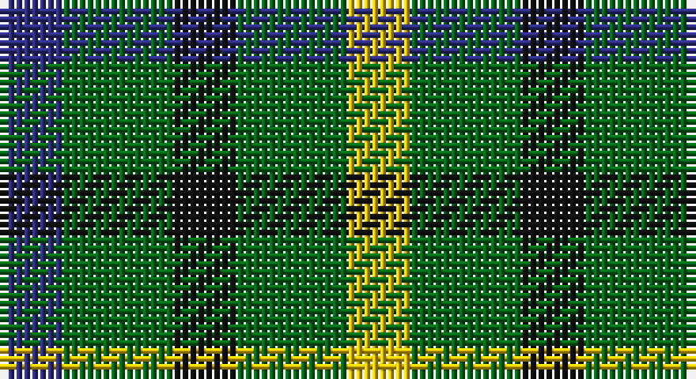

This page is one **sett** — a single exact thread-count. It belongs to the [tartan](/setts/db4g7k4g7ly4/)
(the same proportion at any scale), whose colour order is pattern [BGKGY](/stripes/bgkgy/).

Sourced from register-of-tartans.  It is a [5 stripe tartan](/stripes/stripes5/).

Original link https://www.tartanregister.gov.uk/tartanDetails.aspx?ref=870

## Also known as

This cloth is also recorded under:

- Daks

2 attestations — the source records this cloth was collapsed from (oldest owns this page)

<ul>
<li>01/01/2002 — Daks (House) (register-of-tartans, <a href="https://www.tartanregister.gov.uk/tartanDetails.aspx?ref=870">record</a>)</li>
<li>undated — DAKS House (C.6700.040) (weddslist, <a href="http://www.weddslist.com/cgi-bin/tartans/pg.pl?source=sts">record</a>)</li>
</ul>

## Register references

External register numbers recorded for this tartan.

- Scottish Register of Tartans: [870](https://www.tartanregister.gov.uk/tartanDetails.aspx?ref=870)
- Scottish Tartans Authority (ITI): 2260
- Scottish Tartans World Register: 2260

## Thread count
DB/8 G14 K8 G14 Y/8

One full sett is **88 threads**.

## Palette

Palette: <strong>Tartan Register</strong>
<table><thead><tr><th>Colour</th><th>Threads</th><th>Shade</th><th>Base</th><th>OKLCh</th></tr></thead><tbody><tr><td>DB/</td><td style="text-align:right;font-variant-numeric:tabular-nums">8</td><td><code style="background-color:#2C2C80;">#2C2C80</code> <small style="color:#888">#2C2C80</small></td><td>B <code style="background-color:#2A418A;">#2A418A</code></td><td><small style="color:#888">oklch(35.0% 0.138 276.6)</small></td></tr><tr><td>G</td><td style="text-align:right;font-variant-numeric:tabular-nums">14</td><td><code style="background-color:#006818;">#006818</code> <small style="color:#888">#006818</small></td><td>G <code style="background-color:#006100;">#006100</code></td><td><small style="color:#888">oklch(45.0% 0.142 145.0)</small></td></tr><tr><td>K</td><td style="text-align:right;font-variant-numeric:tabular-nums">8</td><td><code style="background-color:#101010;">#101010</code> <small style="color:#888">#101010</small></td><td>K <code style="background-color:#000000;">#000000</code></td><td><small style="color:#888">oklch(17.3% 0.000 89.9)</small></td></tr><tr><td>G</td><td style="text-align:right;font-variant-numeric:tabular-nums">14</td><td><code style="background-color:#006818;">#006818</code> <small style="color:#888">#006818</small></td><td>G <code style="background-color:#006100;">#006100</code></td><td><small style="color:#888">oklch(45.0% 0.142 145.0)</small></td></tr><tr><td>Y/</td><td style="text-align:right;font-variant-numeric:tabular-nums">8</td><td><code style="background-color:#E8C000;">#E8C000</code> <small style="color:#888">#E8C000</small></td><td>Y <code style="background-color:#F2BF00;">#F2BF00</code></td><td><small style="color:#888">oklch(81.9% 0.168 93.7)</small></td></tr></tbody></table>

# Sample pattern

## Nearest tartans

The nearest existing variants by ΔTartan distance, with this tartan at the top so the swatches line up against it.

ΔTartan

Tartan

Sett

—

<a href="/ttd/edit/#slug=db4g7k4g7ly4~x2">Daks (House)</a> <a class="nn-out" href="/variants/s5/db4g7k4g7ly4~x2/" title="open its dictionary page">↗</a>

1.63

<a href="/ttd/edit/#slug=g4k5g4r2~x2&amp;base=db4g7k4g7ly4~x2">Wilson's No.094</a> <a class="nn-out" href="/variants/s4/g4k5g4r2~x2/" title="open its dictionary page">↗</a>

1.80

<a href="/ttd/edit/#slug=k5g8lo5g3lo5~x4&amp;base=db4g7k4g7ly4~x2">Angle Dress (Fashion)</a> <a class="nn-out" href="/variants/s5/k5g8lo5g3lo5~x4/" title="open its dictionary page">↗</a>

1.80

<a href="/ttd/edit/#slug=g7k4t4~x2&amp;base=db4g7k4g7ly4~x2">Wilson's No.052</a> <a class="nn-out" href="/variants/s3/g7k4t4~x2/" title="open its dictionary page">↗</a>

1.85

<a href="/variants/s4/k6g5r2~x2/">Glen Lyon #1</a>

1.86

<a href="/ttd/edit/#slug=g4dp5g4t2~x2&amp;base=db4g7k4g7ly4~x2">Wilson's No.209</a> <a class="nn-out" href="/variants/s4/g4dp5g4t2~x2/" title="open its dictionary page">↗</a>

1.95

<a href="/ttd/edit/#slug=g2r2g2t1~x4&amp;base=db4g7k4g7ly4~x2">Wilson's No.207</a> <a class="nn-out" href="/variants/s4/g2r2g2t1~x4/" title="open its dictionary page">↗</a>

1.98

<a href="/ttd/edit/#slug=k5g4t2~x2&amp;base=db4g7k4g7ly4~x2">Mull</a> <a class="nn-out" href="/variants/s3/k5g4t2~x2/" title="open its dictionary page">↗</a>

2.02

<a href="/ttd/edit/#slug=r3k6dy4k6ly3~x2&amp;base=db4g7k4g7ly4~x2">Daks, Black (Fashion)</a> <a class="nn-out" href="/variants/s5/r3k6dy4k6ly3~x2/" title="open its dictionary page">↗</a>

2.04

<a href="/ttd/edit/#slug=g7k4r4~x2&amp;base=db4g7k4g7ly4~x2">Wilson's No.202</a> <a class="nn-out" href="/variants/s3/g7k4r4~x2/" title="open its dictionary page">↗</a>

2.05

<a href="/ttd/edit/#slug=dg8k8dg8ly6k3ly6~x2&amp;base=db4g7k4g7ly4~x2">Hage-West (Personal)</a> <a class="nn-out" href="/variants/s6/dg8k8dg8ly6k3ly6~x2/" title="open its dictionary page">↗</a>

## Neighbour map

Every grey dot is one of 14360 variants placed by the first two principal components of the ΔTartan feature space (44% of its variance). Red is this tartan; blue dots are its nearest — click one to open its page.

<svg viewBox="0 0 640 380" role="img" style="max-width:100%;height:auto;border:1px solid #e0e0e0;border-radius:4px;display:block" xmlns="http://www.w3.org/2000/svg"><image href="/nn/cloud.v1.png" width="640" height="380"/><a href="/variants/s4/g4k5g4r2~x2/"><circle cx="199.9" cy="361.0" r="4" fill="#3465a4"><title>Wilson's No.094</title></circle></a><a href="/variants/s5/k5g8lo5g3lo5~x4/"><circle cx="149.2" cy="342.9" r="4" fill="#3465a4"><title>Angle Dress (Fashion)</title></circle></a><a href="/variants/s3/g7k4t4~x2/"><circle cx="153.7" cy="366.0" r="4" fill="#3465a4"><title>Wilson's No.052</title></circle></a><a href="/variants/s4/k6g5r2~x2/"><circle cx="243.1" cy="362.0" r="4" fill="#3465a4"><title>Glen Lyon #1</title></circle></a><a href="/variants/s4/g4dp5g4t2~x2/"><circle cx="217.3" cy="366.0" r="4" fill="#3465a4"><title>Wilson's No.209</title></circle></a><a href="/variants/s4/g2r2g2t1~x4/"><circle cx="226.6" cy="366.0" r="4" fill="#3465a4"><title>Wilson's No.207</title></circle></a><a href="/variants/s3/k5g4t2~x2/"><circle cx="178.2" cy="366.0" r="4" fill="#3465a4"><title>Mull</title></circle></a><a href="/variants/s5/r3k6dy4k6ly3~x2/"><circle cx="146.6" cy="328.9" r="4" fill="#3465a4"><title>Daks, Black (Fashion)</title></circle></a><a href="/variants/s3/g7k4r4~x2/"><circle cx="159.8" cy="366.0" r="4" fill="#3465a4"><title>Wilson's No.202</title></circle></a><a href="/variants/s6/dg8k8dg8ly6k3ly6~x2/"><circle cx="90.4" cy="321.6" r="4" fill="#3465a4"><title>Hage-West (Personal)</title></circle></a><circle cx="132.1" cy="348.2" r="5" fill="#c00000"/></svg>

ID: /variants/s5/db4g7k4g7ly4~x2/
