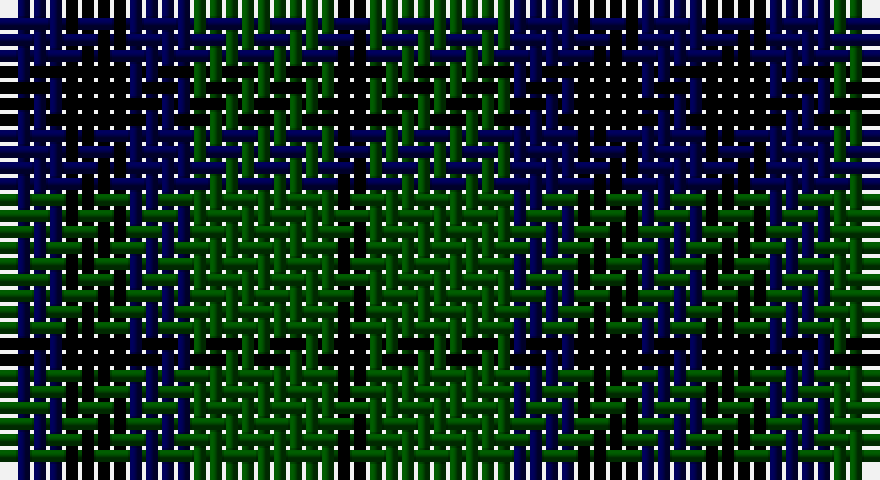

This page is one **sett** — a single exact thread-count. It belongs to the [tartan](/setts/db4k4db4dg9k2/)
(the same proportion at any scale), whose colour order is pattern [BKBGK](/stripes/bkbgk/).

Part of the [Austin](/tartans/austin/) tartan — the named design grouping this sett with its other cloths.

Sourced from weddslist.  It is a [5 stripe tartan](/stripes/stripes5/).

Original link http://www.weddslist.com/cgi-bin/tartans/pg.pl?source=rb

## Also known as

This cloth is also recorded under:

- Austin Clan
- Austin or Keith/Marshall
- Austin, or Keith
- Keith Austin and Marshall
- Keith and Austin

4 attestations — the source records this cloth was collapsed from (oldest owns this page)

<ul>
<li>undated — Austin (weddslist, <a href="http://www.weddslist.com/cgi-bin/tartans/pg.pl?source=rb">record</a>)</li>
<li>undated — Keith and Austin (weddslist, <a href="http://www.weddslist.com/cgi-bin/tartans/pg.pl?source=rb">record</a>)</li>
<li>undated — Austin (weddslist, <a href="http://www.weddslist.com/cgi-bin/tartans/pg.pl?source=x">record</a>)</li>
<li>undated — Keith and Austin (weddslist, <a href="http://www.weddslist.com/cgi-bin/tartans/pg.pl?source=x">record</a>)</li>
</ul>

## Thread count
DB/4 K4 DB4 G9 K/2

One full sett is **40 threads**.

## Palette

Palette: <strong>Tartan Register</strong> <small style="color:#888">(2 of 3 colours)</small>
<table><thead><tr><th>Colour</th><th>Threads</th><th>Shade</th><th>Base</th><th>OKLCh</th></tr></thead><tbody><tr><td>DB/</td><td style="text-align:right;font-variant-numeric:tabular-nums">4</td><td><code style="background-color:#00004C;">#00004C</code> <small style="color:#888">#00004C</small></td><td>B <code style="background-color:#2A418A;">#2A418A</code></td><td><small style="color:#888">oklch(18.8% 0.130 264.1)</small></td></tr><tr><td>K</td><td style="text-align:right;font-variant-numeric:tabular-nums">4</td><td><code style="background-color:#000000;">#000000</code> <small style="color:#888">#000000</small></td><td>K <code style="background-color:#000000;">#000000</code></td><td><small style="color:#888">oklch(0.0% 0.000 0.0)</small></td></tr><tr><td>DB</td><td style="text-align:right;font-variant-numeric:tabular-nums">4</td><td><code style="background-color:#00004C;">#00004C</code> <small style="color:#888">#00004C</small></td><td>B <code style="background-color:#2A418A;">#2A418A</code></td><td><small style="color:#888">oklch(18.8% 0.130 264.1)</small></td></tr><tr><td>G</td><td style="text-align:right;font-variant-numeric:tabular-nums">9</td><td><code style="background-color:#004C00;">#004C00</code> <small style="color:#888">#004C00</small></td><td>G <code style="background-color:#006100;">#006100</code></td><td><small style="color:#888">oklch(36.1% 0.123 142.5)</small></td></tr><tr><td>K/</td><td style="text-align:right;font-variant-numeric:tabular-nums">2</td><td><code style="background-color:#000000;">#000000</code> <small style="color:#888">#000000</small></td><td>K <code style="background-color:#000000;">#000000</code></td><td><small style="color:#888">oklch(0.0% 0.000 0.0)</small></td></tr></tbody></table>

# Sample pattern

## Compared to the master

This cloth is one sett of its design; the master sett (the exemplar the design is anchored on) is below for comparison.

<figure style="margin:0"><figcaption style="color:#888;font-size:smaller">this sett</figcaption></figure>
<figure style="margin:0"><figcaption style="color:#888;font-size:smaller"><a href="/setts/db4k4db4g9k2/">master sett →</a></figcaption></figure>

## Nearest tartans

The nearest existing variants by ΔTartan distance, with this tartan at the top so the swatches line up against it.

ΔTartan

Tartan

Sett

—

<a href="/ttd/edit/#slug=db4k4db4dg9k2">Austin</a> <a class="nn-out" href="/variants/s5/db4k4db4dg9k2/" title="open its dictionary page">↗</a>

0.35

<a href="/ttd/edit/#slug=db4k4db4dg9k2~x2&amp;base=db4k4db4dg9k2">Austin</a> <a class="nn-out" href="/variants/s5/db4k4db4dg9k2~x2/" title="open its dictionary page">↗</a>

1.13

<a href="/ttd/edit/#slug=k3dg14k14dg2db14dg3~x2&amp;base=db4k4db4dg9k2">MacKay</a> <a class="nn-out" href="/variants/s6/k3dg14k14dg2db14dg3~x2/" title="open its dictionary page">↗</a>

1.14

<a href="/ttd/edit/#slug=k3dg14k14dg2db14dg3&amp;base=db4k4db4dg9k2">MacKay</a> <a class="nn-out" href="/variants/s6/k3dg14k14dg2db14dg3/" title="open its dictionary page">↗</a>

1.26

<a href="/ttd/edit/#slug=k1dg6k6db6k1db1~x4&amp;base=db4k4db4dg9k2">Black Watch (smallest sett)</a> <a class="nn-out" href="/variants/s6/k1dg6k6db6k1db1~x4/" title="open its dictionary page">↗</a>

1.27

<a href="/ttd/edit/#slug=db4k4db4g9k2~x2&amp;base=db4k4db4dg9k2">Austin Clan</a> <a class="nn-out" href="/variants/s5/db4k4db4g9k2~x2/" title="open its dictionary page">↗</a>

1.28

<a href="/ttd/edit/#slug=db4dg6lr1dg6k6db6k2~x2&amp;base=db4k4db4dg9k2">MacNiel of Colonsay</a> <a class="nn-out" href="/variants/s7/db4dg6lr1dg6k6db6k2~x2/" title="open its dictionary page">↗</a>

1.28

<a href="/ttd/edit/#slug=db2g6db6dp5db1dp2~x2&amp;base=db4k4db4dg9k2">Unnamed, No 54</a> <a class="nn-out" href="/variants/s6/db2g6db6dp5db1dp2~x2/" title="open its dictionary page">↗</a>

1.44

<a href="/ttd/edit/#slug=k4dg4lr1dg4k4db4k1~x2&amp;base=db4k4db4dg9k2">Graham of Montrose</a> <a class="nn-out" href="/variants/s7/k4dg4lr1dg4k4db4k1~x2/" title="open its dictionary page">↗</a>

1.47

<a href="/ttd/edit/#slug=k9dg9ly2dg9k9db9k3~x2&amp;base=db4k4db4dg9k2">Campbell of Breadalbane</a> <a class="nn-out" href="/variants/s7/k9dg9ly2dg9k9db9k3~x2/" title="open its dictionary page">↗</a>

1.48

<a href="/ttd/edit/#slug=db4dg6lb1dg6k6db6k2~x2&amp;base=db4k4db4dg9k2">MacNeil of Colonsay</a> <a class="nn-out" href="/variants/s7/db4dg6lb1dg6k6db6k2~x2/" title="open its dictionary page">↗</a>

## Neighbour map

Every grey dot is one of 14360 variants placed by the first two principal components of the ΔTartan feature space (44% of its variance). Red is this tartan; blue dots are its nearest — click one to open its page.

<svg viewBox="0 0 640 380" role="img" style="max-width:100%;height:auto;border:1px solid #e0e0e0;border-radius:4px;display:block" xmlns="http://www.w3.org/2000/svg"><image href="/nn/cloud.v1.png" width="640" height="380"/><a href="/variants/s5/db4k4db4dg9k2~x2/"><circle cx="208.5" cy="330.0" r="4" fill="#3465a4"><title>Austin</title></circle></a><a href="/variants/s6/k3dg14k14dg2db14dg3~x2/"><circle cx="231.6" cy="285.5" r="4" fill="#3465a4"><title>MacKay</title></circle></a><a href="/variants/s6/k3dg14k14dg2db14dg3/"><circle cx="217.8" cy="279.1" r="4" fill="#3465a4"><title>MacKay</title></circle></a><a href="/variants/s6/k1dg6k6db6k1db1~x4/"><circle cx="216.3" cy="277.2" r="4" fill="#3465a4"><title>Black Watch (smallest sett)</title></circle></a><a href="/variants/s5/db4k4db4g9k2~x2/"><circle cx="209.3" cy="324.9" r="4" fill="#3465a4"><title>Austin Clan</title></circle></a><a href="/variants/s7/db4dg6lr1dg6k6db6k2~x2/"><circle cx="161.3" cy="287.5" r="4" fill="#3465a4"><title>MacNiel of Colonsay</title></circle></a><a href="/variants/s6/db2g6db6dp5db1dp2~x2/"><circle cx="207.7" cy="289.9" r="4" fill="#3465a4"><title>Unnamed, No 54</title></circle></a><a href="/variants/s7/k4dg4lr1dg4k4db4k1~x2/"><circle cx="145.9" cy="299.0" r="4" fill="#3465a4"><title>Graham of Montrose</title></circle></a><a href="/variants/s7/k9dg9ly2dg9k9db9k3~x2/"><circle cx="155.4" cy="299.0" r="4" fill="#3465a4"><title>Campbell of Breadalbane</title></circle></a><a href="/variants/s7/db4dg6lb1dg6k6db6k2~x2/"><circle cx="145.7" cy="280.2" r="4" fill="#3465a4"><title>MacNeil of Colonsay</title></circle></a><circle cx="199.9" cy="326.3" r="5" fill="#c00000"/></svg>

ID: /variants/s5/db4k4db4dg9k2/
