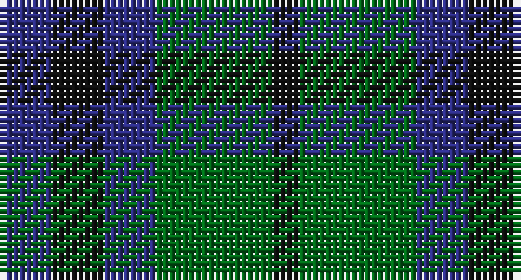

This page is one **sett** — a single exact thread-count. It belongs to the [tartan](/setts/db4k4db4g9k2/)
(the same proportion at any scale), whose colour order is pattern [BKBGK](/stripes/bkbgk/).

Part of the [Austin](/tartans/austin/) tartan — the named design grouping this sett with its other cloths.

Sourced from register-of-tartans.  It is a [5 stripe tartan](/stripes/stripes5/).

Original link https://www.tartanregister.gov.uk/tartanDetails.aspx?ref=137

## Provenance

Earliest known date: 1893 Also recorded in Wilson's of Bannockburn, 1819 pattern book as No. 75 or Austin. D W Stewart writes in 'Old and Rare..'in 1893, "that it is included in every early collection." The Keiths were a powerful Celtic family, who held the hereditary office of Great Marischal of Scotland. They are associated with Dunottar Castle, near Stonehaven.

## Also known as

This cloth is also recorded under:

- Austin Clan
- Austin or Keith/Marshall
- Austin, or Keith
- Keith Austin and Marshall
- Keith and Austin

6 attestations — the source records this cloth was collapsed from (oldest owns this page)

<ul>
<li>01/01/1811 — Austin Clan (register-of-tartans, <a href="https://www.tartanregister.gov.uk/tartanDetails.aspx?ref=137">record</a>)</li>
<li>1811 — Austin (Clan) (tartans-authority, <a href="http://www.tartansauthority.com/tartan-ferret/display/254/">record</a>)</li>
<li>undated — Austin, or Keith (weddslist, <a href="http://www.weddslist.com/cgi-bin/tartans/pg.pl?source=sts">record</a>)</li>
<li>undated — Keith Austin and Marshall (weddslist, <a href="http://www.weddslist.com/cgi-bin/tartans/pg.pl?source=sts">record</a>)</li>
<li>undated — Keith and Austin Clan Tartan (house-of-tartan, <a href="http://www.house-of-tartan.scotland.net/house/TartanViewjs.asp?colr=Def&tnam=253">record</a>)</li>
<li>undated — Austin or Keith/Marshall Clan Tartan (house-of-tartan, <a href="http://www.house-of-tartan.scotland.net/house/TartanViewjs.asp?colr=Def&tnam=254">record</a>)</li>
</ul>

## Register references

External register numbers recorded for this tartan.

- Scottish Register of Tartans: [137](https://www.tartanregister.gov.uk/tartanDetails.aspx?ref=137)
- Scottish Tartans Authority (ITI): 254
- Scottish Tartans World Register: 254

## Thread count
DB/8 K8 DB8 G18 K/4

One full sett is **80 threads**.

## Palette

Palette: <strong>Tartan Register</strong>
<table><thead><tr><th>Colour</th><th>Threads</th><th>Shade</th><th>Base</th><th>OKLCh</th></tr></thead><tbody><tr><td>DB/</td><td style="text-align:right;font-variant-numeric:tabular-nums">8</td><td><code style="background-color:#2C2C80;">#2C2C80</code> <small style="color:#888">#2C2C80</small></td><td>B <code style="background-color:#2A418A;">#2A418A</code></td><td><small style="color:#888">oklch(35.0% 0.138 276.6)</small></td></tr><tr><td>K</td><td style="text-align:right;font-variant-numeric:tabular-nums">8</td><td><code style="background-color:#101010;">#101010</code> <small style="color:#888">#101010</small></td><td>K <code style="background-color:#000000;">#000000</code></td><td><small style="color:#888">oklch(17.3% 0.000 89.9)</small></td></tr><tr><td>DB</td><td style="text-align:right;font-variant-numeric:tabular-nums">8</td><td><code style="background-color:#2C2C80;">#2C2C80</code> <small style="color:#888">#2C2C80</small></td><td>B <code style="background-color:#2A418A;">#2A418A</code></td><td><small style="color:#888">oklch(35.0% 0.138 276.6)</small></td></tr><tr><td>G</td><td style="text-align:right;font-variant-numeric:tabular-nums">18</td><td><code style="background-color:#006818;">#006818</code> <small style="color:#888">#006818</small></td><td>G <code style="background-color:#006100;">#006100</code></td><td><small style="color:#888">oklch(45.0% 0.142 145.0)</small></td></tr><tr><td>K/</td><td style="text-align:right;font-variant-numeric:tabular-nums">4</td><td><code style="background-color:#101010;">#101010</code> <small style="color:#888">#101010</small></td><td>K <code style="background-color:#000000;">#000000</code></td><td><small style="color:#888">oklch(17.3% 0.000 89.9)</small></td></tr></tbody></table>

# Sample pattern

## Nearest tartans

The nearest existing variants by ΔTartan distance, with this tartan at the top so the swatches line up against it.

ΔTartan

Tartan

Sett

—

<a href="/ttd/edit/#slug=db4k4db4g9k2~x2">Austin Clan</a> <a class="nn-out" href="/variants/s5/db4k4db4g9k2~x2/" title="open its dictionary page">↗</a>

1.01

<a href="/ttd/edit/#slug=b6k6b18k18g22k5~x2&amp;base=db4k4db4g9k2~x2">Campbell, The 42nd</a> <a class="nn-out" href="/variants/s6/b6k6b18k18g22k5~x2/" title="open its dictionary page">↗</a>

1.19

<a href="/ttd/edit/#slug=g7k6b7k1b2~x2&amp;base=db4k4db4g9k2~x2">Campbell of Glenlyon</a> <a class="nn-out" href="/variants/s5/g7k6b7k1b2~x2/" title="open its dictionary page">↗</a>

1.19

<a href="/ttd/edit/#slug=g7k6b7k1b2~x4&amp;base=db4k4db4g9k2~x2">Campbell of Glenlyon Check (Clan)</a> <a class="nn-out" href="/variants/s5/g7k6b7k1b2~x4/" title="open its dictionary page">↗</a>

1.22

<a href="/ttd/edit/#slug=db4k4db4dg9k2~x2&amp;base=db4k4db4g9k2~x2">Austin</a> <a class="nn-out" href="/variants/s5/db4k4db4dg9k2~x2/" title="open its dictionary page">↗</a>

1.27

<a href="/ttd/edit/#slug=db4k4db4dg9k2&amp;base=db4k4db4g9k2~x2">Austin</a> <a class="nn-out" href="/variants/s5/db4k4db4dg9k2/" title="open its dictionary page">↗</a>

1.32

<a href="/ttd/edit/#slug=k4dg4ly1dg4k4db4k1~x2&amp;base=db4k4db4g9k2~x2">MacKay Coat</a> <a class="nn-out" href="/variants/s7/k4dg4ly1dg4k4db4k1~x2/" title="open its dictionary page">↗</a>

1.32

<a href="/ttd/edit/#slug=k4dg4k1dg4k4db4ly1~x2&amp;base=db4k4db4g9k2~x2">Unidentified No 39</a> <a class="nn-out" href="/variants/s7/k4dg4k1dg4k4db4ly1~x2/" title="open its dictionary page">↗</a>

1.35

<a href="/ttd/edit/#slug=db4k5dg4r1~x4&amp;base=db4k4db4g9k2~x2">Unidentified pattern #3</a> <a class="nn-out" href="/variants/s4/db4k5dg4r1~x4/" title="open its dictionary page">↗</a>

1.35

<a href="/ttd/edit/#slug=k5g14db12g4~x4&amp;base=db4k4db4g9k2~x2">MacCurdie (Clan?)</a> <a class="nn-out" href="/variants/s4/k5g14db12g4~x4/" title="open its dictionary page">↗</a>

1.38

<a href="/ttd/edit/#slug=db2g6db6dp5db1dp2~x2&amp;base=db4k4db4g9k2~x2">Unnamed, No 54</a> <a class="nn-out" href="/variants/s6/db2g6db6dp5db1dp2~x2/" title="open its dictionary page">↗</a>

## Neighbour map

Every grey dot is one of 14360 variants placed by the first two principal components of the ΔTartan feature space (44% of its variance). Red is this tartan; blue dots are its nearest — click one to open its page.

<svg viewBox="0 0 640 380" role="img" style="max-width:100%;height:auto;border:1px solid #e0e0e0;border-radius:4px;display:block" xmlns="http://www.w3.org/2000/svg"><image href="/nn/cloud.v1.png" width="640" height="380"/><a href="/variants/s6/b6k6b18k18g22k5~x2/"><circle cx="181.0" cy="298.8" r="4" fill="#3465a4"><title>Campbell, The 42nd</title></circle></a><a href="/variants/s5/g7k6b7k1b2~x2/"><circle cx="204.4" cy="290.4" r="4" fill="#3465a4"><title>Campbell of Glenlyon</title></circle></a><a href="/variants/s5/g7k6b7k1b2~x4/"><circle cx="204.4" cy="290.4" r="4" fill="#3465a4"><title>Campbell of Glenlyon Check (Clan)</title></circle></a><a href="/variants/s5/db4k4db4dg9k2~x2/"><circle cx="208.5" cy="330.0" r="4" fill="#3465a4"><title>Austin</title></circle></a><a href="/variants/s5/db4k4db4dg9k2/"><circle cx="199.9" cy="326.3" r="4" fill="#3465a4"><title>Austin</title></circle></a><a href="/variants/s7/k4dg4ly1dg4k4db4k1~x2/"><circle cx="169.1" cy="306.5" r="4" fill="#3465a4"><title>MacKay Coat</title></circle></a><a href="/variants/s7/k4dg4k1dg4k4db4ly1~x2/"><circle cx="169.1" cy="306.5" r="4" fill="#3465a4"><title>Unidentified No 39</title></circle></a><a href="/variants/s4/db4k5dg4r1~x4/"><circle cx="169.5" cy="323.7" r="4" fill="#3465a4"><title>Unidentified pattern #3</title></circle></a><a href="/variants/s4/k5g14db12g4~x4/"><circle cx="265.3" cy="347.3" r="4" fill="#3465a4"><title>MacCurdie (Clan?)</title></circle></a><a href="/variants/s6/db2g6db6dp5db1dp2~x2/"><circle cx="207.7" cy="289.9" r="4" fill="#3465a4"><title>Unnamed, No 54</title></circle></a><circle cx="209.3" cy="324.9" r="5" fill="#c00000"/></svg>

ID: /variants/s5/db4k4db4g9k2~x2/
