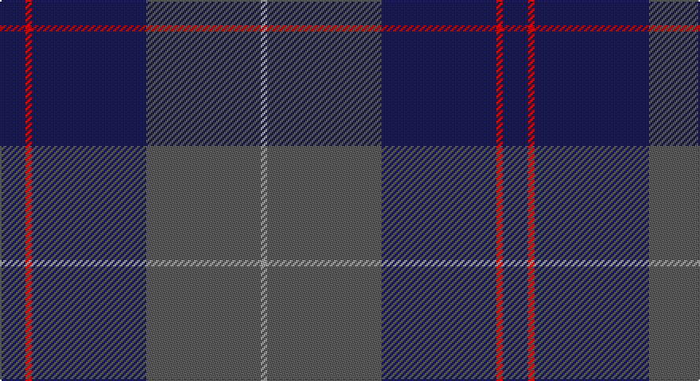

This page is one **sett** — a single exact thread-count. It belongs to the [tartan](/setts/db4r1db18n18lr1/)
(the same proportion at any scale), whose colour order is pattern [BRBBY](/stripes/brbby/).

Sourced from tartans-authority.  It is a [5 stripe tartan](/stripes/stripes5/).

Original link http://www.tartansauthority.com/tartan-ferret/display/8051/

## Register references

External register numbers recorded for this tartan.

- Scottish Tartans Authority (ITI): 8051

## Thread count
DB/16 R4 DB72 N72 Na/4

One full sett is **316 threads**.

## Palette

Palette: <strong>Tartan Register</strong> <small style="color:#888">(3 of 4 colours)</small>
<table><thead><tr><th>Colour</th><th>Threads</th><th>Shade</th><th>Base</th><th>OKLCh</th></tr></thead><tbody><tr><td>DB/</td><td style="text-align:right;font-variant-numeric:tabular-nums">16</td><td><code style="background-color:#1C1C50;">#1C1C50</code> <small style="color:#888">#1C1C50</small></td><td>B <code style="background-color:#2A418A;">#2A418A</code></td><td><small style="color:#888">oklch(26.2% 0.093 277.9)</small></td></tr><tr><td>R</td><td style="text-align:right;font-variant-numeric:tabular-nums">4</td><td><code style="background-color:#C80000;">#C80000</code> <small style="color:#888">#C80000</small></td><td>R <code style="background-color:#CC0000;">#CC0000</code></td><td><small style="color:#888">oklch(52.3% 0.215 29.2)</small></td></tr><tr><td>DB</td><td style="text-align:right;font-variant-numeric:tabular-nums">72</td><td><code style="background-color:#1C1C50;">#1C1C50</code> <small style="color:#888">#1C1C50</small></td><td>B <code style="background-color:#2A418A;">#2A418A</code></td><td><small style="color:#888">oklch(26.2% 0.093 277.9)</small></td></tr><tr><td>N</td><td style="text-align:right;font-variant-numeric:tabular-nums">72</td><td><code style="background-color:#5C5C5C;">#5C5C5C</code> <small style="color:#888">#5C5C5C</small></td><td>B <code style="background-color:#2A418A;">#2A418A</code></td><td><small style="color:#888">oklch(47.5% 0.000 89.9)</small></td></tr><tr><td>Na/</td><td style="text-align:right;font-variant-numeric:tabular-nums">4</td><td><code style="background-color:#A0A0A0;">#A0A0A0</code> <small style="color:#888">#A0A0A0</small></td><td>Y <code style="background-color:#F2BF00;">#F2BF00</code></td><td><small style="color:#888">oklch(70.6% 0.000 89.9)</small></td></tr></tbody></table>

# Sample pattern

## Nearest tartans

The nearest existing variants by ΔTartan distance, with this tartan at the top so the swatches line up against it.

ΔTartan

Tartan

Sett

—

<a href="/ttd/edit/#slug=db4r1db18n18lr1~x4">Ardee (Corporate)</a> <a class="nn-out" href="/variants/s5/db4r1db18n18lr1~x4/" title="open its dictionary page">↗</a>

1.34

<a href="/ttd/edit/#slug=dt62r24lo5dg3~x2&amp;base=db4r1db18n18lr1~x4">Meaux (Personal)</a> <a class="nn-out" href="/variants/s4/dt62r24lo5dg3~x2/" title="open its dictionary page">↗</a>

1.38

<a href="/ttd/edit/#slug=r1db12y5db2y4lb1~x2&amp;base=db4r1db18n18lr1~x4">Connaught Green</a> <a class="nn-out" href="/variants/s6/r1db12y5db2y4lb1~x2/" title="open its dictionary page">↗</a>

1.39

<a href="/ttd/edit/#slug=db8k39db8k39db87r6&amp;base=db4r1db18n18lr1~x4">Largan (?)</a> <a class="nn-out" href="/variants/s6/db8k39db8k39db87r6/" title="open its dictionary page">↗</a>

1.43

<a href="/ttd/edit/#slug=k15db4k15db28r2~x2&amp;base=db4r1db18n18lr1~x4">MacKay (Blue) #2</a> <a class="nn-out" href="/variants/s5/k15db4k15db28r2~x2/" title="open its dictionary page">↗</a>

1.43

<a href="/ttd/edit/#slug=k2dg7db2dg7db16r1~x6&amp;base=db4r1db18n18lr1~x4">Hutton</a> <a class="nn-out" href="/variants/s6/k2dg7db2dg7db16r1~x6/" title="open its dictionary page">↗</a>

1.44

<a href="/ttd/edit/#slug=do15r5do30b32do4lo3~x2&amp;base=db4r1db18n18lr1~x4">Cameron Hunting</a> <a class="nn-out" href="/variants/s6/do15r5do30b32do4lo3~x2/" title="open its dictionary page">↗</a>

1.47

<a href="/ttd/edit/#slug=lo3dy33db24dy2db2dy2~x2&amp;base=db4r1db18n18lr1~x4">Keepers of the Quaich</a> <a class="nn-out" href="/variants/s6/lo3dy33db24dy2db2dy2~x2/" title="open its dictionary page">↗</a>

1.48

<a href="/ttd/edit/#slug=dg20r7db40w2~x2&amp;base=db4r1db18n18lr1~x4">McNiff, Kevin (Personal)</a> <a class="nn-out" href="/variants/s4/dg20r7db40w2~x2/" title="open its dictionary page">↗</a>

1.51

<a href="/ttd/edit/#slug=k4ly1k18db18lb1db4~x4&amp;base=db4r1db18n18lr1~x4">Lyndon Prep (School)</a> <a class="nn-out" href="/variants/s6/k4ly1k18db18lb1db4~x4/" title="open its dictionary page">↗</a>

1.51

<a href="/ttd/edit/#slug=dy11db1dy3dbi1db9r1~x4&amp;base=db4r1db18n18lr1~x4">Dege of Saville Row</a> <a class="nn-out" href="/variants/s6/dy11db1dy3dbi1db9r1~x4/" title="open its dictionary page">↗</a>

## Neighbour map

Every grey dot is one of 14360 variants placed by the first two principal components of the ΔTartan feature space (44% of its variance). Red is this tartan; blue dots are its nearest — click one to open its page.

<svg viewBox="0 0 640 380" role="img" style="max-width:100%;height:auto;border:1px solid #e0e0e0;border-radius:4px;display:block" xmlns="http://www.w3.org/2000/svg"><image href="/nn/cloud.v1.png" width="640" height="380"/><a href="/variants/s4/dt62r24lo5dg3~x2/"><circle cx="471.0" cy="226.5" r="4" fill="#3465a4"><title>Meaux (Personal)</title></circle></a><a href="/variants/s6/r1db12y5db2y4lb1~x2/"><circle cx="353.3" cy="220.4" r="4" fill="#3465a4"><title>Connaught Green</title></circle></a><a href="/variants/s6/db8k39db8k39db87r6/"><circle cx="429.8" cy="255.6" r="4" fill="#3465a4"><title>Largan (?)</title></circle></a><a href="/variants/s5/k15db4k15db28r2~x2/"><circle cx="378.2" cy="271.0" r="4" fill="#3465a4"><title>MacKay (Blue) #2</title></circle></a><a href="/variants/s6/k2dg7db2dg7db16r1~x6/"><circle cx="360.6" cy="235.5" r="4" fill="#3465a4"><title>Hutton</title></circle></a><a href="/variants/s6/do15r5do30b32do4lo3~x2/"><circle cx="348.5" cy="235.0" r="4" fill="#3465a4"><title>Cameron Hunting</title></circle></a><a href="/variants/s6/lo3dy33db24dy2db2dy2~x2/"><circle cx="440.4" cy="221.2" r="4" fill="#3465a4"><title>Keepers of the Quaich</title></circle></a><a href="/variants/s4/dg20r7db40w2~x2/"><circle cx="370.3" cy="222.1" r="4" fill="#3465a4"><title>McNiff, Kevin (Personal)</title></circle></a><a href="/variants/s6/k4ly1k18db18lb1db4~x4/"><circle cx="368.2" cy="220.1" r="4" fill="#3465a4"><title>Lyndon Prep (School)</title></circle></a><a href="/variants/s6/dy11db1dy3dbi1db9r1~x4/"><circle cx="399.4" cy="245.6" r="4" fill="#3465a4"><title>Dege of Saville Row</title></circle></a><circle cx="399.7" cy="228.4" r="5" fill="#c00000"/></svg>

ID: /variants/s5/db4r1db18n18lr1~x4/
