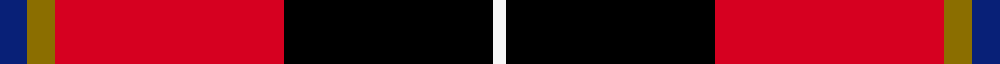

This page is one **sett** — a single exact thread-count. It belongs to the [tartan](/setts/db4y4r33k30w2/)
(the same proportion at any scale), whose colour order is pattern [BGRKW](/stripes/bgrkw/).

Sourced from register-of-tartans.  It is a [5 stripe tartan](/stripes/stripes5/).

Original link https://www.tartanregister.gov.uk/tartanDetails.aspx?ref=10714

## Provenance

Earliest known date: 11 October 2012 This tartan was created by the designer for his wedding and for all those with the surname Wormeck who wish to wear it. The colours are taken from the national and regional flags of Germany and former Prussia, the province of Schleswig-Holstein, Scotland, the Czech Republic and Sweden, all places significant to the designer and his family.

2 attestations — the source records this cloth was collapsed from (oldest owns this page)

<ul>
<li>08/10/2012 — Wormeck (2013) Germany (register-of-tartans, <a href="https://www.tartanregister.gov.uk/tartanDetails.aspx?ref=10714">record</a>)  <em>This tartan was created for all those bearing the name Wormeck in Europe and especially Germany, where there is a new branch of the Wormeck family with its roots on the Baltic shores of Northern Germany (Schleswig-Holstein), and including the old branch of the Wormeck family which has its roots in former Western Prussia, where the family lived until 1945. The Wormeck (2013) Germany tartan may also be used and worn by members of the Sovadina/Sovadinová family living in and nearby the city of Kutná Hora in the Czech Republic, as Eliška Sovadinová and the designer, Marcus Wormeck, married in 2013, uniting the two families. The designer and his wife live in Kiel in Northern Germany. Those bearing the name Wormek, a spelling variation of Wormeck, may also wear and use this tartan as they share the same family roots.</em></li>
<li>undated — Wormeck (2013) German Name Tartan (house-of-tartan, <a href="http://www.house-of-tartan.scotland.net/house/TartanViewjs.asp?colr=Def&tnam=10714">record</a>) </li>
</ul>

## Register references

External register numbers recorded for this tartan.

- Scottish Register of Tartans: [10714](https://www.tartanregister.gov.uk/tartanDetails.aspx?ref=10714)

## Thread count
DB/8 Y8 R66 K60 W/4

One full sett is **280 threads**.

## Palette
<table><thead><tr><th>Colour</th><th>Shade</th><th>OKLCh</th></tr></thead><tbody><tr><td>DB</td><td><code style="background-color:#082077;">#082077</code> <small style="color:#888">#082077</small></td><td><small style="color:#888">oklch(30.0% 0.149 265.1)</small></td></tr><tr><td>R</td><td><code style="background-color:#D60020;">#D60020</code> <small style="color:#888">#D60020</small></td><td><small style="color:#888">oklch(55.2% 0.224 25.5)</small></td></tr><tr><td>K</td><td><code style="background-color:#000000;">#000000</code> <small style="color:#888">#000000</small></td><td><small style="color:#888">oklch(0.0% 0.000 0.0)</small></td></tr><tr><td>Y</td><td><code style="background-color:#8B6E00;">#8B6E00</code> <small style="color:#888">#8B6E00</small></td><td><small style="color:#888">oklch(55.1% 0.113 90.4)</small></td></tr><tr><td>W</td><td><code style="background-color:#F7F7F7;">#F7F7F7</code> <small style="color:#888">#F7F7F7</small></td><td><small style="color:#888">oklch(97.6% 0.000 89.9)</small></td></tr></tbody></table>

# Sample pattern

## Nearest variants

The nearest existing variants by ΔTartan distance, with this cloth at the top so the swatches line up against it.

ΔTartan

Threads

Variant

Sett

—

280

<a href="/variants/s5/db4y4r33k30w2~x2/">Wormeck (2013) Germany</a>

<a href="/ttd/edit/#slug=db1r16k16y1~x4&amp;base=db4y4r33k30w2~x2" title="compare in the TTD">0.76</a>

264

<a href="/variants/s4/db1r16k16y1~x4/">Skinner</a>

<a href="/ttd/edit/#slug=db3k32r27w2~x2&amp;base=db4y4r33k30w2~x2" title="compare in the TTD">0.91</a>

246

<a href="/variants/s4/db3k32r27w2~x2/">Templar Grand Priory USA</a>

<a href="/ttd/edit/#slug=g3y5r13k33w2~x2&amp;base=db4y4r33k30w2~x2" title="compare in the TTD">1.13</a>

214

<a href="/variants/s5/g3y5r13k33w2~x2/">Papua New Guinea Pipes and Drums</a>

<a href="/ttd/edit/#slug=db1r8k8lo1~x4&amp;base=db4y4r33k30w2~x2" title="compare in the TTD">1.14</a>

136

<a href="/variants/s4/db1r8k8lo1~x4/">Skinner (Name)</a>

<a href="/ttd/edit/#slug=g3y5r14k36w3~x2&amp;base=db4y4r33k30w2~x2" title="compare in the TTD">1.20</a>

232

<a href="/variants/s5/g3y5r14k36w3~x2/">Papua New Guinea</a>

<a href="/ttd/edit/#slug=r50k25dg10n5ly2~x2&amp;base=db4y4r33k30w2~x2" title="compare in the TTD">1.23</a>

264

<a href="/variants/s5/r50k25dg10n5ly2~x2/">MacGleish Formal (Personal)</a>

<a href="/ttd/edit/#slug=r50k25g10n5y2~x2&amp;base=db4y4r33k30w2~x2" title="compare in the TTD">1.23</a>

264

<a href="/variants/s5/r50k25g10n5y2~x2/">MacGleish Formal (Personal)</a>

<a href="/ttd/edit/#slug=y1k8r8w1~x4&amp;base=db4y4r33k30w2~x2" title="compare in the TTD">1.44</a>

136

<a href="/variants/s4/y1k8r8w1~x4/">Connel (Clan)</a>

<a href="/ttd/edit/#slug=y1k8r8w1~x2&amp;base=db4y4r33k30w2~x2" title="compare in the TTD">1.44</a>

68

<a href="/variants/s4/y1k8r8w1~x2/">Connel</a>

<a href="/ttd/edit/#slug=y1k8r13g1~x6&amp;base=db4y4r33k30w2~x2" title="compare in the TTD">1.49</a>

264

<a href="/variants/s4/y1k8r13g1~x6/">Billy Apple® Red</a>

## Neighbour map

Every grey dot is one of 13620 variants placed by the first two principal components of the ΔTartan feature space (42% of its variance). Red is this tartan; blue dots are its nearest — click one to open its page.

<svg viewBox="0 0 640 380" role="img" style="max-width:100%;height:auto;border:1px solid #e0e0e0;border-radius:4px;display:block" xmlns="http://www.w3.org/2000/svg"><image href="/nn/cloud.v1.png" width="640" height="380"/><a href="/variants/s4/db1r16k16y1~x4/"><circle cx="266.8" cy="171.4" r="4" fill="#3465a4"><title>Skinner</title></circle></a><a href="/variants/s4/db3k32r27w2~x2/"><circle cx="264.8" cy="173.6" r="4" fill="#3465a4"><title>Templar Grand Priory USA</title></circle></a><a href="/variants/s5/g3y5r13k33w2~x2/"><circle cx="268.8" cy="136.5" r="4" fill="#3465a4"><title>Papua New Guinea Pipes and Drums</title></circle></a><a href="/variants/s4/db1r8k8lo1~x4/"><circle cx="212.8" cy="205.9" r="4" fill="#3465a4"><title>Skinner (Name)</title></circle></a><a href="/variants/s5/g3y5r14k36w3~x2/"><circle cx="257.3" cy="147.8" r="4" fill="#3465a4"><title>Papua New Guinea</title></circle></a><a href="/variants/s5/r50k25dg10n5ly2~x2/"><circle cx="272.2" cy="127.7" r="4" fill="#3465a4"><title>MacGleish Formal (Personal)</title></circle></a><a href="/variants/s5/r50k25g10n5y2~x2/"><circle cx="269.0" cy="127.4" r="4" fill="#3465a4"><title>MacGleish Formal (Personal)</title></circle></a><a href="/variants/s4/y1k8r8w1~x4/"><circle cx="209.2" cy="205.8" r="4" fill="#3465a4"><title>Connel (Clan)</title></circle></a><a href="/variants/s4/y1k8r8w1~x2/"><circle cx="209.2" cy="205.8" r="4" fill="#3465a4"><title>Connel</title></circle></a><a href="/variants/s4/y1k8r13g1~x6/"><circle cx="290.1" cy="176.1" r="4" fill="#3465a4"><title>Billy Apple® Red</title></circle></a><circle cx="218.6" cy="142.9" r="5" fill="#c00000"/><text x="320" y="376" text-anchor="middle" font-size="11" fill="#999">ground</text><text x="11" y="190" text-anchor="middle" font-size="11" fill="#999" transform="rotate(-90 11 190)">complexity</text></svg>

ID: /variants/s5/db4y4r33k30w2~x2/
