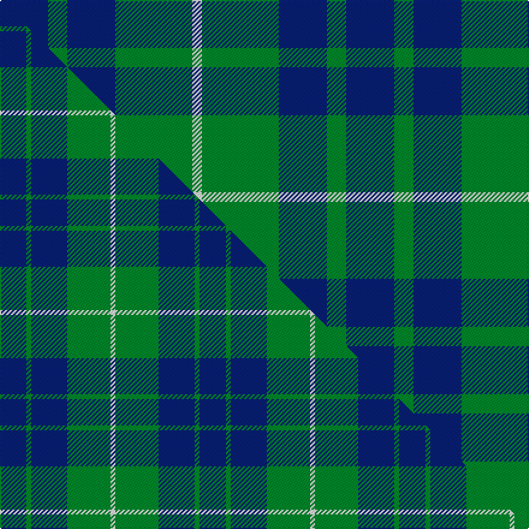

This page is one **sett** — a single exact thread-count. It belongs to the [tartan](/setts/db5g2db5g8w1/)
(the same proportion at any scale), whose colour order is pattern [BGBGW](/stripes/bgbgw/).

Part of the [Hamilton Hunting](/tartans/hamilton-hunting/) tartan — the named design grouping this sett with its other cloths.

Sourced from weddslist.  It is a [5 stripe tartan](/stripes/stripes5/).

Original link http://www.weddslist.com/cgi-bin/tartans/pg.pl?source=sts

## Provenance

Earliest known date: pre 2003 Sample presented to the Scottish Tartans Society by Wiebe Stodel.

2 attestations — the source records this cloth was collapsed from (oldest owns this page)

<ul>
<li>undated — Hamilton, hunting (weddslist, <a href="http://www.weddslist.com/cgi-bin/tartans/pg.pl?source=sts">record</a>) </li>
<li>undated — Hamilton Hunting Clan Tartan (house-of-tartan, <a href="http://www.house-of-tartan.scotland.net/house/TartanViewjs.asp?colr=Def&tnam=139">record</a>) </li>
</ul>

## Thread count
DB/40 G16 DB40 G64 W/8

One full sett is **288 threads**.

## Palette
<table><thead><tr><th>Colour</th><th>Shade</th><th>OKLCh</th></tr></thead><tbody><tr><td>DB</td><td><code style="background-color:#082077;">#082077</code> <small style="color:#888">#082077</small></td><td><small style="color:#888">oklch(30.0% 0.149 265.1)</small></td></tr><tr><td>G</td><td><code style="background-color:#008B2A;">#008B2A</code> <small style="color:#888">#008B2A</small></td><td><small style="color:#888">oklch(55.4% 0.170 145.9)</small></td></tr><tr><td>W</td><td><code style="background-color:#F7F7F7;">#F7F7F7</code> <small style="color:#888">#F7F7F7</small></td><td><small style="color:#888">oklch(97.6% 0.000 89.9)</small></td></tr></tbody></table>

# Sample pattern

## Compared to the master

This cloth is one sett of its design; the master sett (the exemplar the design is anchored on) is below for comparison.

Its **ΔTartan distance** from the master is **0.78** — the same measure the nearest-tartans table ranks by (0 is identical; a re-scale of the same cloth is near 0, a recolour or a different proportion further).

<figure class="master-compare" style="margin:0">

this sett
master sett ★

<figcaption style="color:#888;font-size:smaller">One weave of this sett against the <a href="/setts/db11g2db15g18w2/">master sett ★</a>, split on the diagonal: a shared proportion runs seamlessly across it with only the shades shifting; a different proportion breaks on it.</figcaption>
</figure>

## Nearest variants

The nearest existing variants by ΔTartan distance, with this cloth at the top so the swatches line up against it.

ΔTartan

Threads

Variant

Sett

—

288

<a href="/variants/s5/db5g2db5g8w1~x8/">Hamilton, hunting</a>

<a href="/ttd/edit/#slug=db11g2db15g18w2~x2&amp;base=db5g2db5g8w1~x8" title="compare in the TTD">0.39</a>

166

<a href="/variants/s5/db11g2db15g18w2~x2/">Hamilton Hunting</a>

<a href="/ttd/edit/#slug=db8g2db8g15lb2~x4&amp;base=db5g2db5g8w1~x8" title="compare in the TTD">0.57</a>

240

<a href="/variants/s5/db8g2db8g15lb2~x4/">Hamilton Green Hunting</a>

<a href="/ttd/edit/#slug=lb9dt3lb1dt12y1~x4&amp;base=db5g2db5g8w1~x8" title="compare in the TTD">1.01</a>

168

<a href="/variants/s5/lb9dt3lb1dt12y1~x4/">North Sea Commission</a>

<a href="/ttd/edit/#slug=dr2g3db2g14db14lr2~x2&amp;base=db5g2db5g8w1~x8" title="compare in the TTD">1.21</a>

140

<a href="/variants/s6/dr2g3db2g14db14lr2~x2/">Irving of Bonshaw Tower (Personal)</a>

<a href="/ttd/edit/#slug=db26dr6g16db8g3dr2~x2&amp;base=db5g2db5g8w1~x8" title="compare in the TTD">1.45</a>

188

<a href="/variants/s6/db26dr6g16db8g3dr2~x2/">Perthshire (New) District Tartan</a>

<a href="/ttd/edit/#slug=db4w1db12g12db1g4~x2&amp;base=db5g2db5g8w1~x8" title="compare in the TTD">1.51</a>

120

<a href="/variants/s6/db4w1db12g12db1g4~x2/">Unidentified Tweed</a>

<a href="/ttd/edit/#slug=db2g7db7w1~x2&amp;base=db5g2db5g8w1~x8" title="compare in the TTD">1.61</a>

62

<a href="/variants/s4/db2g7db7w1~x2/">Unidentified No 78</a>

<a href="/ttd/edit/#slug=db3g11lb2db11b6g3~x2&amp;base=db5g2db5g8w1~x8" title="compare in the TTD">1.86</a>

132

<a href="/variants/s6/db3g11lb2db11b6g3~x2/">Unnamed, No 29</a>

<a href="/ttd/edit/#slug=db3g11t2db11ti6g3~x2~t2304245-ti2607245&amp;base=db5g2db5g8w1~x8" title="compare in the TTD">1.86</a>

132

<a href="/variants/s6/db3g11t2db11ti6g3~x2~t2304245-ti2607245/">Unidentified No 29</a>

<a href="/ttd/edit/#slug=dg35db40w11y3dg7~x2&amp;base=db5g2db5g8w1~x8" title="compare in the TTD">1.90</a>

300

<a href="/variants/s5/dg35db40w11y3dg7~x2/">Fife Ethylene Plant</a>

## Neighbour map

Every grey dot is one of 13620 variants placed by the first two principal components of the ΔTartan feature space (42% of its variance). Red is this tartan; blue dots are its nearest — click one to open its page.

<svg viewBox="0 0 640 380" role="img" style="max-width:100%;height:auto;border:1px solid #e0e0e0;border-radius:4px;display:block" xmlns="http://www.w3.org/2000/svg"><image href="/nn/cloud.v1.png" width="640" height="380"/><a href="/variants/s5/db11g2db15g18w2~x2/"><circle cx="341.1" cy="271.6" r="4" fill="#3465a4"><title>Hamilton Hunting</title></circle></a><a href="/variants/s5/db8g2db8g15lb2~x4/"><circle cx="319.9" cy="283.2" r="4" fill="#3465a4"><title>Hamilton Green Hunting</title></circle></a><a href="/variants/s5/lb9dt3lb1dt12y1~x4/"><circle cx="366.5" cy="236.5" r="4" fill="#3465a4"><title>North Sea Commission</title></circle></a><a href="/variants/s6/dr2g3db2g14db14lr2~x2/"><circle cx="288.8" cy="244.8" r="4" fill="#3465a4"><title>Irving of Bonshaw Tower (Personal)</title></circle></a><a href="/variants/s6/db26dr6g16db8g3dr2~x2/"><circle cx="378.9" cy="244.0" r="4" fill="#3465a4"><title>Perthshire (New) District Tartan</title></circle></a><a href="/variants/s6/db4w1db12g12db1g4~x2/"><circle cx="348.5" cy="244.7" r="4" fill="#3465a4"><title>Unidentified Tweed</title></circle></a><a href="/variants/s4/db2g7db7w1~x2/"><circle cx="322.9" cy="292.5" r="4" fill="#3465a4"><title>Unidentified No 78</title></circle></a><a href="/variants/s6/db3g11lb2db11b6g3~x2/"><circle cx="226.1" cy="285.9" r="4" fill="#3465a4"><title>Unnamed, No 29</title></circle></a><a href="/variants/s6/db3g11t2db11ti6g3~x2~t2304245-ti2607245/"><circle cx="225.7" cy="287.2" r="4" fill="#3465a4"><title>Unidentified No 29</title></circle></a><a href="/variants/s5/dg35db40w11y3dg7~x2/"><circle cx="277.5" cy="229.7" r="4" fill="#3465a4"><title>Fife Ethylene Plant</title></circle></a><circle cx="303.2" cy="288.2" r="5" fill="#c00000"/><text x="320" y="376" text-anchor="middle" font-size="11" fill="#999">ground</text><text x="11" y="190" text-anchor="middle" font-size="11" fill="#999" transform="rotate(-90 11 190)">complexity</text></svg>

ID: /variants/s5/db5g2db5g8w1~x8/
