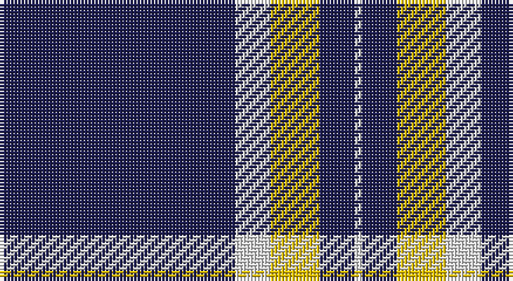

This page is one **sett** — a single exact thread-count. It belongs to the [tartan](/setts/db67w10ly14db10w2/)
(the same proportion at any scale), whose colour order is pattern [BWYBW](/stripes/bwybw/).

Sourced from tartans-authority.  It is a [5 stripe tartan](/stripes/stripes5/).

Original link http://www.tartansauthority.com/tartan-ferret/display/8146/

## Register references

External register numbers recorded for this tartan.

- Scottish Register of Tartans: [8146](https://www.tartanregister.gov.uk/tartanDetails?ref=8146)
- Scottish Tartans Authority (ITI): 8146

## Thread count
DB/67 LN10 Y14 DB10 LN/2

One full sett is **137 threads**.

## Palette

Palette: <strong>Tartan Register</strong>
<table><thead><tr><th>Colour</th><th>Threads</th><th>Shade</th><th>Base</th><th>OKLCh</th></tr></thead><tbody><tr><td>DB/</td><td style="text-align:right;font-variant-numeric:tabular-nums">67</td><td><code style="background-color:#1C1C50;">#1C1C50</code> <small style="color:#888">#1C1C50</small></td><td>B <code style="background-color:#2A418A;">#2A418A</code></td><td><small style="color:#888">oklch(26.2% 0.093 277.9)</small></td></tr><tr><td>LN</td><td style="text-align:right;font-variant-numeric:tabular-nums">10</td><td><code style="background-color:#E0E0E0;">#E0E0E0</code> <small style="color:#888">#E0E0E0</small></td><td>W <code style="background-color:#F7F7F7;">#F7F7F7</code></td><td><small style="color:#888">oklch(90.7% 0.000 89.9)</small></td></tr><tr><td>Y</td><td style="text-align:right;font-variant-numeric:tabular-nums">14</td><td><code style="background-color:#E8C000;">#E8C000</code> <small style="color:#888">#E8C000</small></td><td>Y <code style="background-color:#F2BF00;">#F2BF00</code></td><td><small style="color:#888">oklch(81.9% 0.168 93.7)</small></td></tr><tr><td>DB</td><td style="text-align:right;font-variant-numeric:tabular-nums">10</td><td><code style="background-color:#1C1C50;">#1C1C50</code> <small style="color:#888">#1C1C50</small></td><td>B <code style="background-color:#2A418A;">#2A418A</code></td><td><small style="color:#888">oklch(26.2% 0.093 277.9)</small></td></tr><tr><td>LN/</td><td style="text-align:right;font-variant-numeric:tabular-nums">2</td><td><code style="background-color:#E0E0E0;">#E0E0E0</code> <small style="color:#888">#E0E0E0</small></td><td>W <code style="background-color:#F7F7F7;">#F7F7F7</code></td><td><small style="color:#888">oklch(90.7% 0.000 89.9)</small></td></tr></tbody></table>

# Sample pattern

## Nearest tartans

The nearest existing variants by ΔTartan distance, with this tartan at the top so the swatches line up against it.

ΔTartan

Tartan

Sett

—

<a href="/ttd/edit/#slug=db67w10ly14db10w2">St. John (Corporate?)</a> <a class="nn-out" href="/variants/s5/db67w10ly14db10w2/" title="open its dictionary page">↗</a>

1.21

<a href="/ttd/edit/#slug=w6r13dt80w4dt2w4&amp;base=db67w10ly14db10w2">Montrose Football Club</a> <a class="nn-out" href="/variants/s6/w6r13dt80w4dt2w4/" title="open its dictionary page">↗</a>

1.28

<a href="/ttd/edit/#slug=db39ly8r3w1~x4&amp;base=db67w10ly14db10w2">Norwich University (Corporate)</a> <a class="nn-out" href="/variants/s4/db39ly8r3w1~x4/" title="open its dictionary page">↗</a>

1.37

<a href="/variants/s7/db16wi4db1wi2db24w1lo4~x2/">Talisker</a>

1.45

<a href="/ttd/edit/#slug=db80r7w1r7ly20db15~x2&amp;base=db67w10ly14db10w2">Auchtermuchty Tartan Army (Corp)</a> <a class="nn-out" href="/variants/s6/db80r7w1r7ly20db15~x2/" title="open its dictionary page">↗</a>

1.45

<a href="/ttd/edit/#slug=db39lo8r3w1~x4&amp;base=db67w10ly14db10w2">Norwich University</a> <a class="nn-out" href="/variants/s4/db39lo8r3w1~x4/" title="open its dictionary page">↗</a>

1.47

<a href="/ttd/edit/#slug=w6ly3db3ly2db3ly4db48ly4&amp;base=db67w10ly14db10w2">Morris Welsh Name Tartan</a> <a class="nn-out" href="/variants/s8/w6ly3db3ly2db3ly4db48ly4/" title="open its dictionary page">↗</a>

1.47

<a href="/ttd/edit/#slug=db80r8w1r8ly20db15~x2&amp;base=db67w10ly14db10w2">Auchtermuchty Tartan Army</a> <a class="nn-out" href="/variants/s6/db80r8w1r8ly20db15~x2/" title="open its dictionary page">↗</a>

1.54

<a href="/ttd/edit/#slug=w4ly3db3ly2db3ly4db48ly4&amp;base=db67w10ly14db10w2">Morris of Wales</a> <a class="nn-out" href="/variants/s8/w4ly3db3ly2db3ly4db48ly4/" title="open its dictionary page">↗</a>

1.68

<a href="/ttd/edit/#slug=r1k20lb5r1~x4&amp;base=db67w10ly14db10w2">Dobelman (Personal)</a> <a class="nn-out" href="/variants/s4/r1k20lb5r1~x4/" title="open its dictionary page">↗</a>

1.70

<a href="/ttd/edit/#slug=k75y26y3k4ly6~x2&amp;base=db67w10ly14db10w2">Perry Ancient (Personal)</a> <a class="nn-out" href="/variants/s5/k75y26y3k4ly6~x2/" title="open its dictionary page">↗</a>

## Neighbour map

Every grey dot is one of 14360 variants placed by the first two principal components of the ΔTartan feature space (44% of its variance). Red is this tartan; blue dots are its nearest — click one to open its page.

<svg viewBox="0 0 640 380" role="img" style="max-width:100%;height:auto;border:1px solid #e0e0e0;border-radius:4px;display:block" xmlns="http://www.w3.org/2000/svg"><image href="/nn/cloud.v1.png" width="640" height="380"/><a href="/variants/s6/w6r13dt80w4dt2w4/"><circle cx="523.0" cy="137.3" r="4" fill="#3465a4"><title>Montrose Football Club</title></circle></a><a href="/variants/s4/db39ly8r3w1~x4/"><circle cx="503.0" cy="153.2" r="4" fill="#3465a4"><title>Norwich University (Corporate)</title></circle></a><a href="/variants/s7/db16wi4db1wi2db24w1lo4~x2/"><circle cx="481.3" cy="155.7" r="4" fill="#3465a4"><title>Talisker</title></circle></a><a href="/variants/s6/db80r7w1r7ly20db15~x2/"><circle cx="485.8" cy="125.4" r="4" fill="#3465a4"><title>Auchtermuchty Tartan Army (Corp)</title></circle></a><a href="/variants/s4/db39lo8r3w1~x4/"><circle cx="519.0" cy="164.6" r="4" fill="#3465a4"><title>Norwich University</title></circle></a><a href="/variants/s8/w6ly3db3ly2db3ly4db48ly4/"><circle cx="479.4" cy="132.6" r="4" fill="#3465a4"><title>Morris Welsh Name Tartan</title></circle></a><a href="/variants/s6/db80r8w1r8ly20db15~x2/"><circle cx="475.3" cy="125.7" r="4" fill="#3465a4"><title>Auchtermuchty Tartan Army</title></circle></a><a href="/variants/s8/w4ly3db3ly2db3ly4db48ly4/"><circle cx="501.9" cy="133.3" r="4" fill="#3465a4"><title>Morris of Wales</title></circle></a><a href="/variants/s4/r1k20lb5r1~x4/"><circle cx="478.4" cy="199.1" r="4" fill="#3465a4"><title>Dobelman (Personal)</title></circle></a><a href="/variants/s5/k75y26y3k4ly6~x2/"><circle cx="462.0" cy="183.0" r="4" fill="#3465a4"><title>Perry Ancient (Personal)</title></circle></a><circle cx="481.7" cy="165.0" r="5" fill="#c00000"/></svg>

ID: /variants/s5/db67w10ly14db10w2/
