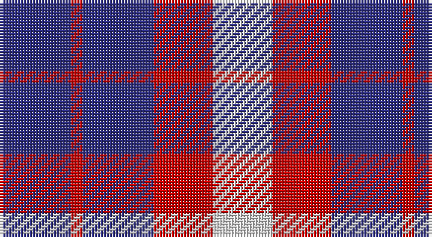

This page is one **sett** — a single exact thread-count. It belongs to the [tartan](/setts/db6r1db6r5w5/)
(the same proportion at any scale), whose colour order is pattern [BRBRW](/stripes/brbrw/).

Part of the [U.S. Coast Guard](/tartans/u-s-coast-guard/) tartan — the named design grouping this sett with its other cloths.

Sourced from tartans-authority.  It is a [5 stripe tartan](/stripes/stripes5/).

Original link http://www.tartansauthority.com/tartan-ferret/display/4068/

## Register references

External register numbers recorded for this tartan.

- Scottish Tartans Authority (ITI): 4068

## Thread count
DB/24 R4 DB24 R20 LN/20

One full sett is **140 threads**.

## Palette

Palette: <strong>Tartan Register</strong>
<table><thead><tr><th>Colour</th><th>Threads</th><th>Shade</th><th>Base</th><th>OKLCh</th></tr></thead><tbody><tr><td>DB/</td><td style="text-align:right;font-variant-numeric:tabular-nums">24</td><td><code style="background-color:#2C2C80;">#2C2C80</code> <small style="color:#888">#2C2C80</small></td><td>B <code style="background-color:#2A418A;">#2A418A</code></td><td><small style="color:#888">oklch(35.0% 0.138 276.6)</small></td></tr><tr><td>R</td><td style="text-align:right;font-variant-numeric:tabular-nums">4</td><td><code style="background-color:#C80000;">#C80000</code> <small style="color:#888">#C80000</small></td><td>R <code style="background-color:#CC0000;">#CC0000</code></td><td><small style="color:#888">oklch(52.3% 0.215 29.2)</small></td></tr><tr><td>DB</td><td style="text-align:right;font-variant-numeric:tabular-nums">24</td><td><code style="background-color:#2C2C80;">#2C2C80</code> <small style="color:#888">#2C2C80</small></td><td>B <code style="background-color:#2A418A;">#2A418A</code></td><td><small style="color:#888">oklch(35.0% 0.138 276.6)</small></td></tr><tr><td>R</td><td style="text-align:right;font-variant-numeric:tabular-nums">20</td><td><code style="background-color:#C80000;">#C80000</code> <small style="color:#888">#C80000</small></td><td>R <code style="background-color:#CC0000;">#CC0000</code></td><td><small style="color:#888">oklch(52.3% 0.215 29.2)</small></td></tr><tr><td>LN/</td><td style="text-align:right;font-variant-numeric:tabular-nums">20</td><td><code style="background-color:#E0E0E0;">#E0E0E0</code> <small style="color:#888">#E0E0E0</small></td><td>W <code style="background-color:#F7F7F7;">#F7F7F7</code></td><td><small style="color:#888">oklch(90.7% 0.000 89.9)</small></td></tr></tbody></table>

# Sample pattern

## Compared to the master

This cloth is one sett of its design; the master sett (the exemplar the design is anchored on) is below for comparison.

<figure style="margin:0"><figcaption style="color:#888;font-size:smaller">this sett</figcaption></figure>
<figure style="margin:0"><figcaption style="color:#888;font-size:smaller"><a href="/setts/r5db6r1db6r1db6r5w5/">master sett →</a></figcaption></figure>

## Nearest tartans

The nearest existing variants by ΔTartan distance, with this tartan at the top so the swatches line up against it.

ΔTartan

Tartan

Sett

—

<a href="/ttd/edit/#slug=db6r1db6r5w5~x4">U.S. Coast Guard (Corporate)</a> <a class="nn-out" href="/variants/s5/db6r1db6r5w5~x4/" title="open its dictionary page">↗</a>

1.13

<a href="/ttd/edit/#slug=r5db6r1db6r1db6r5w5~x4&amp;base=db6r1db6r5w5~x4">U.S. Coast Guard</a> <a class="nn-out" href="/variants/s8/r5db6r1db6r1db6r5w5~x4/" title="open its dictionary page">↗</a>

1.41

<a href="/ttd/edit/#slug=db7w1r7db4r2db4w2~x2&amp;base=db6r1db6r5w5~x4">Coronation</a> <a class="nn-out" href="/variants/s7/db7w1r7db4r2db4w2~x2/" title="open its dictionary page">↗</a>

1.44

<a href="/ttd/edit/#slug=db20k5db18lo26k6~x2&amp;base=db6r1db6r5w5~x4">Johore Regiment (Military)</a> <a class="nn-out" href="/variants/s5/db20k5db18lo26k6~x2/" title="open its dictionary page">↗</a>

1.81

<a href="/ttd/edit/#slug=db2db4ly1db1ly2db4ly2~x12&amp;base=db6r1db6r5w5~x4">Creek Indian Nation (District)</a> <a class="nn-out" href="/variants/s7/db2db4ly1db1ly2db4ly2~x12/" title="open its dictionary page">↗</a>

1.82

<a href="/ttd/edit/#slug=db13r5g5w3~x8&amp;base=db6r1db6r5w5~x4">International Highland Games Fed.</a> <a class="nn-out" href="/variants/s4/db13r5g5w3~x8/" title="open its dictionary page">↗</a>

1.83

<a href="/ttd/edit/#slug=db11r4ly9db4ly2db11~x2&amp;base=db6r1db6r5w5~x4">Unidentified Sample</a> <a class="nn-out" href="/variants/s6/db11r4ly9db4ly2db11~x2/" title="open its dictionary page">↗</a>

1.84

<a href="/ttd/edit/#slug=db9r12g9db5w2~x4&amp;base=db6r1db6r5w5~x4">Battle of Prestonpans (1745) Heritage Trust, The</a> <a class="nn-out" href="/variants/s5/db9r12g9db5w2~x4/" title="open its dictionary page">↗</a>

1.84

<a href="/ttd/edit/#slug=db20k5db18ly26k6~x2&amp;base=db6r1db6r5w5~x4">Jahore</a> <a class="nn-out" href="/variants/s5/db20k5db18ly26k6~x2/" title="open its dictionary page">↗</a>

1.85

<a href="/ttd/edit/#slug=db10w3db12ly14r4~x2&amp;base=db6r1db6r5w5~x4">MacLeod, of Argentina</a> <a class="nn-out" href="/variants/s5/db10w3db12ly14r4~x2/" title="open its dictionary page">↗</a>

1.87

<a href="/variants/s8/db20k5db18lo26k6~x2/">Johore Regiment</a>

## Neighbour map

Every grey dot is one of 14360 variants placed by the first two principal components of the ΔTartan feature space (44% of its variance). Red is this tartan; blue dots are its nearest — click one to open its page.

<svg viewBox="0 0 640 380" role="img" style="max-width:100%;height:auto;border:1px solid #e0e0e0;border-radius:4px;display:block" xmlns="http://www.w3.org/2000/svg"><image href="/nn/cloud.v1.png" width="640" height="380"/><a href="/variants/s8/r5db6r1db6r1db6r5w5~x4/"><circle cx="222.8" cy="255.0" r="4" fill="#3465a4"><title>U.S. Coast Guard</title></circle></a><a href="/variants/s7/db7w1r7db4r2db4w2~x2/"><circle cx="275.9" cy="244.0" r="4" fill="#3465a4"><title>Coronation</title></circle></a><a href="/variants/s5/db20k5db18lo26k6~x2/"><circle cx="226.7" cy="276.1" r="4" fill="#3465a4"><title>Johore Regiment (Military)</title></circle></a><a href="/variants/s7/db2db4ly1db1ly2db4ly2~x12/"><circle cx="162.6" cy="257.6" r="4" fill="#3465a4"><title>Creek Indian Nation (District)</title></circle></a><a href="/variants/s4/db13r5g5w3~x8/"><circle cx="193.9" cy="271.4" r="4" fill="#3465a4"><title>International Highland Games Fed.</title></circle></a><a href="/variants/s6/db11r4ly9db4ly2db11~x2/"><circle cx="292.7" cy="266.5" r="4" fill="#3465a4"><title>Unidentified Sample</title></circle></a><a href="/variants/s5/db9r12g9db5w2~x4/"><circle cx="120.3" cy="253.3" r="4" fill="#3465a4"><title>Battle of Prestonpans (1745) Heritage Trust, The</title></circle></a><a href="/variants/s5/db20k5db18ly26k6~x2/"><circle cx="205.7" cy="266.2" r="4" fill="#3465a4"><title>Jahore</title></circle></a><a href="/variants/s5/db10w3db12ly14r4~x2/"><circle cx="186.2" cy="256.5" r="4" fill="#3465a4"><title>MacLeod, of Argentina</title></circle></a><a href="/variants/s8/db20k5db18lo26k6~x2/"><circle cx="195.4" cy="253.2" r="4" fill="#3465a4"><title>Johore Regiment</title></circle></a><circle cx="211.3" cy="278.4" r="5" fill="#c00000"/></svg>

ID: /variants/s5/db6r1db6r5w5~x4/
