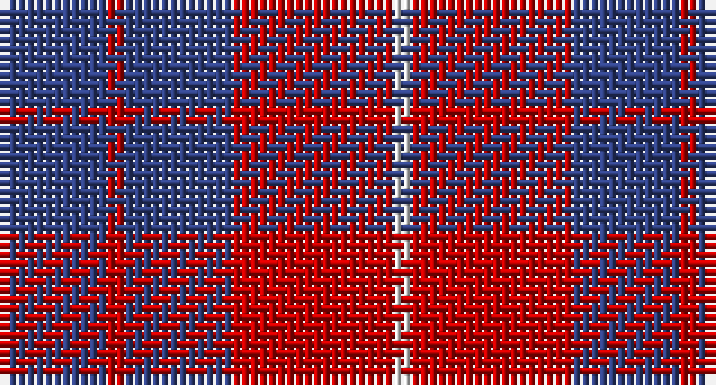

This page is one **sett** — a single exact thread-count. It belongs to the [tartan](/setts/db6r1db6r9w1/)
(the same proportion at any scale), whose colour order is pattern [BRBRW](/stripes/brbrw/).

Sourced from weddslist.  It is a [5 stripe tartan](/stripes/stripes5/).

Original link http://www.weddslist.com/cgi-bin/tartans/pg.pl?source=sts

## Thread count
B/12 R2 B12 R18 LN/2

One full sett is **78 threads**.

## Palette

Palette: <strong>Tartan Dictionary</strong> <small style="color:#888">(1 of 3 colours)</small>
<table><thead><tr><th>Colour</th><th>Threads</th><th>Shade</th><th>Base</th><th>OKLCh</th></tr></thead><tbody><tr><td>B/</td><td style="text-align:right;font-variant-numeric:tabular-nums">12</td><td><code style="background-color:#304080;">#304080</code> <small style="color:#888">#304080</small></td><td>B <code style="background-color:#2A418A;">#2A418A</code></td><td><small style="color:#888">oklch(39.4% 0.109 270.2)</small></td></tr><tr><td>R</td><td style="text-align:right;font-variant-numeric:tabular-nums">2</td><td><code style="background-color:#C00000;">#C00000</code> <small style="color:#888">#C00000</small></td><td>R <code style="background-color:#CC0000;">#CC0000</code></td><td><small style="color:#888">oklch(50.7% 0.208 29.2)</small></td></tr><tr><td>B</td><td style="text-align:right;font-variant-numeric:tabular-nums">12</td><td><code style="background-color:#304080;">#304080</code> <small style="color:#888">#304080</small></td><td>B <code style="background-color:#2A418A;">#2A418A</code></td><td><small style="color:#888">oklch(39.4% 0.109 270.2)</small></td></tr><tr><td>R</td><td style="text-align:right;font-variant-numeric:tabular-nums">18</td><td><code style="background-color:#C00000;">#C00000</code> <small style="color:#888">#C00000</small></td><td>R <code style="background-color:#CC0000;">#CC0000</code></td><td><small style="color:#888">oklch(50.7% 0.208 29.2)</small></td></tr><tr><td>LN/</td><td style="text-align:right;font-variant-numeric:tabular-nums">2</td><td><code style="background-color:#E0E0E0;">#E0E0E0</code> <small style="color:#888">#E0E0E0</small></td><td>W <code style="background-color:#F7F7F7;">#F7F7F7</code></td><td><small style="color:#888">oklch(90.7% 0.000 89.9)</small></td></tr></tbody></table>

# Sample pattern

## Nearest tartans

The nearest existing variants by ΔTartan distance, with this tartan at the top so the swatches line up against it.

ΔTartan

Tartan

Sett

—

<a href="/ttd/edit/#slug=db6r1db6r9w1~x2">Hamilton, (Red)</a> <a class="nn-out" href="/variants/s5/db6r1db6r9w1~x2/" title="open its dictionary page">↗</a>

0.60

<a href="/ttd/edit/#slug=db6r1db6r9w1~x4&amp;base=db6r1db6r9w1~x2">Hamilton Red Clan Tartan</a> <a class="nn-out" href="/variants/s5/db6r1db6r9w1~x4/" title="open its dictionary page">↗</a>

0.76

<a href="/ttd/edit/#slug=r12db2r12db17w2r2~x2&amp;base=db6r1db6r9w1~x2">British European</a> <a class="nn-out" href="/variants/s6/r12db2r12db17w2r2~x2/" title="open its dictionary page">↗</a>

0.76

<a href="/ttd/edit/#slug=r12db2r12db17w2r2~x4&amp;base=db6r1db6r9w1~x2">British European (Corporate)</a> <a class="nn-out" href="/variants/s6/r12db2r12db17w2r2~x4/" title="open its dictionary page">↗</a>

0.81

<a href="/ttd/edit/#slug=db8r2db8r15w2~x4&amp;base=db6r1db6r9w1~x2">Hamilton (Clan)</a> <a class="nn-out" href="/variants/s5/db8r2db8r15w2~x4/" title="open its dictionary page">↗</a>

0.91

<a href="/ttd/edit/#slug=db6r39db10r10db21ly5~x2&amp;base=db6r1db6r9w1~x2">Rajput</a> <a class="nn-out" href="/variants/s6/db6r39db10r10db21ly5~x2/" title="open its dictionary page">↗</a>

0.97

<a href="/ttd/edit/#slug=db48r18db6r13ly4r14~x2&amp;base=db6r1db6r9w1~x2">Butler</a> <a class="nn-out" href="/variants/s6/db48r18db6r13ly4r14~x2/" title="open its dictionary page">↗</a>

1.09

<a href="/ttd/edit/#slug=r12g8r54db45g6&amp;base=db6r1db6r9w1~x2">Wotherspoon</a> <a class="nn-out" href="/variants/s5/r12g8r54db45g6/" title="open its dictionary page">↗</a>

1.17

<a href="/ttd/edit/#slug=db15w2r20db2r4~x2&amp;base=db6r1db6r9w1~x2">Masai Shuka 25 (Artefact)</a> <a class="nn-out" href="/variants/s5/db15w2r20db2r4~x2/" title="open its dictionary page">↗</a>

1.27

<a href="/ttd/edit/#slug=dp23dg8dp23dg35w5~x2&amp;base=db6r1db6r9w1~x2">Baru</a> <a class="nn-out" href="/variants/s5/dp23dg8dp23dg35w5~x2/" title="open its dictionary page">↗</a>

1.27

<a href="/ttd/edit/#slug=db11w1r12db6r1db6w1~x2&amp;base=db6r1db6r9w1~x2">Coronation</a> <a class="nn-out" href="/variants/s7/db11w1r12db6r1db6w1~x2/" title="open its dictionary page">↗</a>

## Neighbour map

Every grey dot is one of 14360 variants placed by the first two principal components of the ΔTartan feature space (44% of its variance). Red is this tartan; blue dots are its nearest — click one to open its page.

<svg viewBox="0 0 640 380" role="img" style="max-width:100%;height:auto;border:1px solid #e0e0e0;border-radius:4px;display:block" xmlns="http://www.w3.org/2000/svg"><image href="/nn/cloud.v1.png" width="640" height="380"/><a href="/variants/s5/db6r1db6r9w1~x4/"><circle cx="320.0" cy="245.1" r="4" fill="#3465a4"><title>Hamilton Red Clan Tartan</title></circle></a><a href="/variants/s6/r12db2r12db17w2r2~x2/"><circle cx="347.1" cy="236.0" r="4" fill="#3465a4"><title>British European</title></circle></a><a href="/variants/s6/r12db2r12db17w2r2~x4/"><circle cx="347.1" cy="236.0" r="4" fill="#3465a4"><title>British European (Corporate)</title></circle></a><a href="/variants/s5/db8r2db8r15w2~x4/"><circle cx="294.6" cy="246.3" r="4" fill="#3465a4"><title>Hamilton (Clan)</title></circle></a><a href="/variants/s6/db6r39db10r10db21ly5~x2/"><circle cx="348.3" cy="248.4" r="4" fill="#3465a4"><title>Rajput</title></circle></a><a href="/variants/s6/db48r18db6r13ly4r14~x2/"><circle cx="348.0" cy="214.1" r="4" fill="#3465a4"><title>Butler</title></circle></a><a href="/variants/s5/r12g8r54db45g6/"><circle cx="340.6" cy="241.5" r="4" fill="#3465a4"><title>Wotherspoon</title></circle></a><a href="/variants/s5/db15w2r20db2r4~x2/"><circle cx="357.8" cy="219.9" r="4" fill="#3465a4"><title>Masai Shuka 25 (Artefact)</title></circle></a><a href="/variants/s5/dp23dg8dp23dg35w5~x2/"><circle cx="292.8" cy="279.1" r="4" fill="#3465a4"><title>Baru</title></circle></a><a href="/variants/s7/db11w1r12db6r1db6w1~x2/"><circle cx="377.6" cy="219.0" r="4" fill="#3465a4"><title>Coronation</title></circle></a><circle cx="331.8" cy="251.8" r="5" fill="#c00000"/></svg>

ID: /variants/s5/db6r1db6r9w1~x2/
