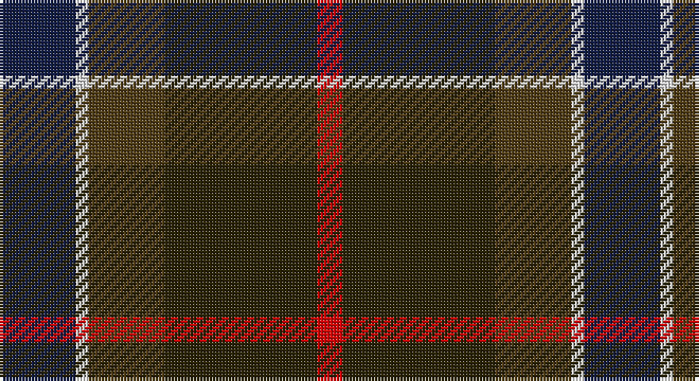

This page is one **sett** — a single exact thread-count. It belongs to the [tartan](/setts/db6w1dyi6dy12r2/)
(the same proportion at any scale), whose colour order is pattern [BWGGR](/stripes/bwggr/).

Sourced from register-of-tartans.  It is a [5 stripe tartan](/stripes/stripes5/).

Original link https://www.tartanregister.gov.uk/tartanDetails.aspx?ref=4444

## Register references

External register numbers recorded for this tartan.

- Scottish Register of Tartans: [4444](https://www.tartanregister.gov.uk/tartanDetails.aspx?ref=4444)
- Scottish Tartans World Register: 2928

## Thread count
DB/24 LN4 T24 K48 R/8

One full sett is **184 threads**.

## Palette

Palette: <strong>Tartan Register</strong> <small style="color:#888">(4 of 5 colours)</small>
<table><thead><tr><th>Colour</th><th>Threads</th><th>Shade</th><th>Base</th><th>OKLCh</th></tr></thead><tbody><tr><td>DB/</td><td style="text-align:right;font-variant-numeric:tabular-nums">24</td><td><code style="background-color:#141E46;">#141E46</code> <small style="color:#888">#141E46</small></td><td>B <code style="background-color:#2A418A;">#2A418A</code></td><td><small style="color:#888">oklch(25.2% 0.076 269.7)</small></td></tr><tr><td>LN</td><td style="text-align:right;font-variant-numeric:tabular-nums">4</td><td><code style="background-color:#E0E0E0;">#E0E0E0</code> <small style="color:#888">#E0E0E0</small></td><td>W <code style="background-color:#F7F7F7;">#F7F7F7</code></td><td><small style="color:#888">oklch(90.7% 0.000 89.9)</small></td></tr><tr><td>T</td><td style="text-align:right;font-variant-numeric:tabular-nums">24</td><td><code style="background-color:#503C14;">#503C14</code> <small style="color:#888">#503C14</small></td><td>G <code style="background-color:#006100;">#006100</code></td><td><small style="color:#888">oklch(37.0% 0.062 81.8)</small></td></tr><tr><td>K</td><td style="text-align:right;font-variant-numeric:tabular-nums">48</td><td><code style="background-color:#2A2303;">#2A2303</code> <small style="color:#888">#2A2303</small></td><td>G <code style="background-color:#006100;">#006100</code></td><td><small style="color:#888">oklch(25.7% 0.049 96.8)</small></td></tr><tr><td>R/</td><td style="text-align:right;font-variant-numeric:tabular-nums">8</td><td><code style="background-color:#DC0000;">#DC0000</code> <small style="color:#888">#DC0000</small></td><td>R <code style="background-color:#CC0000;">#CC0000</code></td><td><small style="color:#888">oklch(56.2% 0.230 29.2)</small></td></tr></tbody></table>

# Sample pattern

## Nearest tartans

The nearest existing variants by ΔTartan distance, with this tartan at the top so the swatches line up against it.

ΔTartan

Tartan

Sett

—

<a href="/ttd/edit/#slug=db6w1dyi6dy12r2~x4">Vass (Personal)</a> <a class="nn-out" href="/variants/s5/db6w1dyi6dy12r2~x4/" title="open its dictionary page">↗</a>

1.03

<a href="/ttd/edit/#slug=r1n12k6ly1do10r1~x4&amp;base=db6w1dyi6dy12r2~x4">Andover (Fashion)</a> <a class="nn-out" href="/variants/s6/r1n12k6ly1do10r1~x4/" title="open its dictionary page">↗</a>

1.04

<a href="/variants/s6/r1n12ki6k1do10r1~x4/">Andover</a>

1.07

<a href="/ttd/edit/#slug=lo4k28r2do22t8do3~x2&amp;base=db6w1dyi6dy12r2~x4">Loch Long One Design</a> <a class="nn-out" href="/variants/s6/lo4k28r2do22t8do3~x2/" title="open its dictionary page">↗</a>

1.10

<a href="/ttd/edit/#slug=dy6r3dy34k16ly3dt22r4~x2&amp;base=db6w1dyi6dy12r2~x4">Ballantrae (Macnaughtons)</a> <a class="nn-out" href="/variants/s7/dy6r3dy34k16ly3dt22r4~x2/" title="open its dictionary page">↗</a>

1.16

<a href="/ttd/edit/#slug=r2do22g22do3db12y2~x2&amp;base=db6w1dyi6dy12r2~x4">Lisbon</a> <a class="nn-out" href="/variants/s6/r2do22g22do3db12y2~x2/" title="open its dictionary page">↗</a>

1.18

<a href="/ttd/edit/#slug=r3db22k11dg32ly3~x2&amp;base=db6w1dyi6dy12r2~x4">Cultoquhey Hotel Corporate Tartan</a> <a class="nn-out" href="/variants/s5/r3db22k11dg32ly3~x2/" title="open its dictionary page">↗</a>

1.19

<a href="/ttd/edit/#slug=k7t3dy30db30w3~x2&amp;base=db6w1dyi6dy12r2~x4">Douglas, (Brown)</a> <a class="nn-out" href="/variants/s5/k7t3dy30db30w3~x2/" title="open its dictionary page">↗</a>

1.21

<a href="/ttd/edit/#slug=dg5b2dg9dt19r9ly2~x2&amp;base=db6w1dyi6dy12r2~x4">Lyle and Scott</a> <a class="nn-out" href="/variants/s6/dg5b2dg9dt19r9ly2~x2/" title="open its dictionary page">↗</a>

1.22

<a href="/ttd/edit/#slug=ly1dy10k8r8dy1lyi1~x4&amp;base=db6w1dyi6dy12r2~x4">Unidentified #66</a> <a class="nn-out" href="/variants/s6/ly1dy10k8r8dy1lyi1~x4/" title="open its dictionary page">↗</a>

1.22

<a href="/ttd/edit/#slug=db7r26db7dg24ly2~x2&amp;base=db6w1dyi6dy12r2~x4">McCarthy, Old</a> <a class="nn-out" href="/variants/s5/db7r26db7dg24ly2~x2/" title="open its dictionary page">↗</a>

## Neighbour map

Every grey dot is one of 14360 variants placed by the first two principal components of the ΔTartan feature space (44% of its variance). Red is this tartan; blue dots are its nearest — click one to open its page.

<svg viewBox="0 0 640 380" role="img" style="max-width:100%;height:auto;border:1px solid #e0e0e0;border-radius:4px;display:block" xmlns="http://www.w3.org/2000/svg"><image href="/nn/cloud.v1.png" width="640" height="380"/><a href="/variants/s6/r1n12k6ly1do10r1~x4/"><circle cx="241.5" cy="208.7" r="4" fill="#3465a4"><title>Andover (Fashion)</title></circle></a><a href="/variants/s6/r1n12ki6k1do10r1~x4/"><circle cx="255.4" cy="217.3" r="4" fill="#3465a4"><title>Andover</title></circle></a><a href="/variants/s6/lo4k28r2do22t8do3~x2/"><circle cx="265.3" cy="202.2" r="4" fill="#3465a4"><title>Loch Long One Design</title></circle></a><a href="/variants/s7/dy6r3dy34k16ly3dt22r4~x2/"><circle cx="264.2" cy="205.0" r="4" fill="#3465a4"><title>Ballantrae (Macnaughtons)</title></circle></a><a href="/variants/s6/r2do22g22do3db12y2~x2/"><circle cx="240.9" cy="218.7" r="4" fill="#3465a4"><title>Lisbon</title></circle></a><a href="/variants/s5/r3db22k11dg32ly3~x2/"><circle cx="271.5" cy="244.1" r="4" fill="#3465a4"><title>Cultoquhey Hotel Corporate Tartan</title></circle></a><a href="/variants/s5/k7t3dy30db30w3~x2/"><circle cx="259.5" cy="229.8" r="4" fill="#3465a4"><title>Douglas, (Brown)</title></circle></a><a href="/variants/s6/dg5b2dg9dt19r9ly2~x2/"><circle cx="220.3" cy="226.4" r="4" fill="#3465a4"><title>Lyle and Scott</title></circle></a><a href="/variants/s6/ly1dy10k8r8dy1lyi1~x4/"><circle cx="219.4" cy="215.3" r="4" fill="#3465a4"><title>Unidentified #66</title></circle></a><a href="/variants/s5/db7r26db7dg24ly2~x2/"><circle cx="274.0" cy="241.6" r="4" fill="#3465a4"><title>McCarthy, Old</title></circle></a><circle cx="252.8" cy="235.5" r="5" fill="#c00000"/></svg>

ID: /variants/s5/db6w1dyi6dy12r2~x4/
