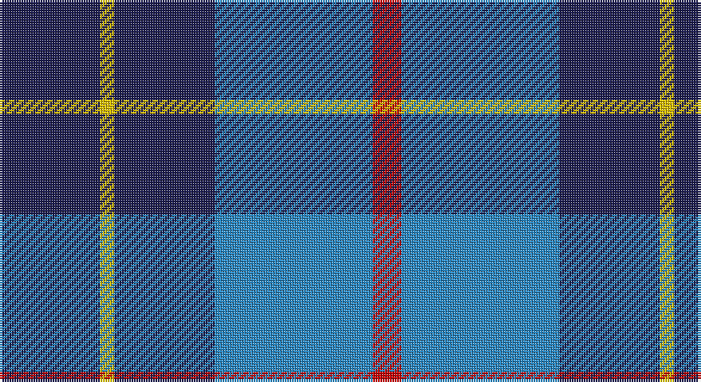

This page is one **sett** — a single exact thread-count. It belongs to the [tartan](/setts/db7ly1db7t11r2/)
(the same proportion at any scale), whose colour order is pattern [BYBBR](/stripes/bybbr/).

Sourced from tartans-authority.  It is a [5 stripe tartan](/stripes/stripes5/).

Original link http://www.tartansauthority.com/tartan-ferret/display/7348/

## Register references

External register numbers recorded for this tartan.

- Scottish Tartans Authority (ITI): 7348

## Thread count
DB/42 Y6 DB42 B66 R/12

One full sett is **282 threads**.

## Palette

Palette: <strong>Tartan Register</strong>
<table><thead><tr><th>Colour</th><th>Threads</th><th>Shade</th><th>Base</th><th>OKLCh</th></tr></thead><tbody><tr><td>DB/</td><td style="text-align:right;font-variant-numeric:tabular-nums">42</td><td><code style="background-color:#1C1C50;">#1C1C50</code> <small style="color:#888">#1C1C50</small></td><td>B <code style="background-color:#2A418A;">#2A418A</code></td><td><small style="color:#888">oklch(26.2% 0.093 277.9)</small></td></tr><tr><td>Y</td><td style="text-align:right;font-variant-numeric:tabular-nums">6</td><td><code style="background-color:#E8C000;">#E8C000</code> <small style="color:#888">#E8C000</small></td><td>Y <code style="background-color:#F2BF00;">#F2BF00</code></td><td><small style="color:#888">oklch(81.9% 0.168 93.7)</small></td></tr><tr><td>DB</td><td style="text-align:right;font-variant-numeric:tabular-nums">42</td><td><code style="background-color:#1C1C50;">#1C1C50</code> <small style="color:#888">#1C1C50</small></td><td>B <code style="background-color:#2A418A;">#2A418A</code></td><td><small style="color:#888">oklch(26.2% 0.093 277.9)</small></td></tr><tr><td>B</td><td style="text-align:right;font-variant-numeric:tabular-nums">66</td><td><code style="background-color:#2888C4;">#2888C4</code> <small style="color:#888">#2888C4</small></td><td>B <code style="background-color:#2A418A;">#2A418A</code></td><td><small style="color:#888">oklch(60.1% 0.125 241.5)</small></td></tr><tr><td>R/</td><td style="text-align:right;font-variant-numeric:tabular-nums">12</td><td><code style="background-color:#C80000;">#C80000</code> <small style="color:#888">#C80000</small></td><td>R <code style="background-color:#CC0000;">#CC0000</code></td><td><small style="color:#888">oklch(52.3% 0.215 29.2)</small></td></tr></tbody></table>

# Sample pattern

## Nearest tartans

The nearest existing variants by ΔTartan distance, with this tartan at the top so the swatches line up against it.

ΔTartan

Tartan

Sett

—

<a href="/ttd/edit/#slug=db7ly1db7t11r2~x6">Brazell (Personal)</a> <a class="nn-out" href="/variants/s5/db7ly1db7t11r2~x6/" title="open its dictionary page">↗</a>

1.09

<a href="/ttd/edit/#slug=b23dt18w5dt2r14dt18~x2&amp;base=db7ly1db7t11r2~x6">Pitt (Name)</a> <a class="nn-out" href="/variants/s6/b23dt18w5dt2r14dt18~x2/" title="open its dictionary page">↗</a>

1.25

<a href="/ttd/edit/#slug=r21dbi43db86w10&amp;base=db7ly1db7t11r2~x6">Fong Wedding (Personal)</a> <a class="nn-out" href="/variants/s4/r21dbi43db86w10/" title="open its dictionary page">↗</a>

1.26

<a href="/ttd/edit/#slug=r21db43dt86lb10&amp;base=db7ly1db7t11r2~x6">Fong (Personal)</a> <a class="nn-out" href="/variants/s4/r21db43dt86lb10/" title="open its dictionary page">↗</a>

1.26

<a href="/ttd/edit/#slug=b11k1b3k5dp9lo1~x2&amp;base=db7ly1db7t11r2~x6">Joker Fancy Tartan</a> <a class="nn-out" href="/variants/s6/b11k1b3k5dp9lo1~x2/" title="open its dictionary page">↗</a>

1.30

<a href="/ttd/edit/#slug=k3lb10db2g6db18g2~x2&amp;base=db7ly1db7t11r2~x6">Crombie House Check</a> <a class="nn-out" href="/variants/s6/k3lb10db2g6db18g2~x2/" title="open its dictionary page">↗</a>

1.31

<a href="/ttd/edit/#slug=b30k12dt12k2w3~x2&amp;base=db7ly1db7t11r2~x6">MacNeil - 1994 (Personal)</a> <a class="nn-out" href="/variants/s5/b30k12dt12k2w3~x2/" title="open its dictionary page">↗</a>

1.32

<a href="/ttd/edit/#slug=k15ly2k10db18w3~x2&amp;base=db7ly1db7t11r2~x6">College of Radiographers Corporate Tartan</a> <a class="nn-out" href="/variants/s5/k15ly2k10db18w3~x2/" title="open its dictionary page">↗</a>

1.34

<a href="/ttd/edit/#slug=db9ly9db9t23r3~x2&amp;base=db7ly1db7t11r2~x6">Tilburg (District)</a> <a class="nn-out" href="/variants/s5/db9ly9db9t23r3~x2/" title="open its dictionary page">↗</a>

1.36

<a href="/ttd/edit/#slug=db7ly1db7b11r2~x6&amp;base=db7ly1db7t11r2~x6">Brazell (Personal)</a> <a class="nn-out" href="/variants/s5/db7ly1db7b11r2~x6/" title="open its dictionary page">↗</a>

1.37

<a href="/ttd/edit/#slug=k15lo2k10db18lb3~x2&amp;base=db7ly1db7t11r2~x6">College of Radiographers</a> <a class="nn-out" href="/variants/s5/k15lo2k10db18lb3~x2/" title="open its dictionary page">↗</a>

## Neighbour map

Every grey dot is one of 14360 variants placed by the first two principal components of the ΔTartan feature space (44% of its variance). Red is this tartan; blue dots are its nearest — click one to open its page.

<svg viewBox="0 0 640 380" role="img" style="max-width:100%;height:auto;border:1px solid #e0e0e0;border-radius:4px;display:block" xmlns="http://www.w3.org/2000/svg"><image href="/nn/cloud.v1.png" width="640" height="380"/><a href="/variants/s6/b23dt18w5dt2r14dt18~x2/"><circle cx="223.4" cy="234.9" r="4" fill="#3465a4"><title>Pitt (Name)</title></circle></a><a href="/variants/s4/r21dbi43db86w10/"><circle cx="259.0" cy="238.0" r="4" fill="#3465a4"><title>Fong Wedding (Personal)</title></circle></a><a href="/variants/s4/r21db43dt86lb10/"><circle cx="291.7" cy="258.7" r="4" fill="#3465a4"><title>Fong (Personal)</title></circle></a><a href="/variants/s6/b11k1b3k5dp9lo1~x2/"><circle cx="263.6" cy="229.4" r="4" fill="#3465a4"><title>Joker Fancy Tartan</title></circle></a><a href="/variants/s6/k3lb10db2g6db18g2~x2/"><circle cx="226.8" cy="209.5" r="4" fill="#3465a4"><title>Crombie House Check</title></circle></a><a href="/variants/s5/b30k12dt12k2w3~x2/"><circle cx="280.1" cy="212.0" r="4" fill="#3465a4"><title>MacNeil - 1994 (Personal)</title></circle></a><a href="/variants/s5/k15ly2k10db18w3~x2/"><circle cx="267.1" cy="245.9" r="4" fill="#3465a4"><title>College of Radiographers Corporate Tartan</title></circle></a><a href="/variants/s5/db9ly9db9t23r3~x2/"><circle cx="194.3" cy="246.6" r="4" fill="#3465a4"><title>Tilburg (District)</title></circle></a><a href="/variants/s5/db7ly1db7b11r2~x6/"><circle cx="241.6" cy="230.6" r="4" fill="#3465a4"><title>Brazell (Personal)</title></circle></a><a href="/variants/s5/k15lo2k10db18lb3~x2/"><circle cx="273.6" cy="254.0" r="4" fill="#3465a4"><title>College of Radiographers</title></circle></a><circle cx="265.1" cy="236.9" r="5" fill="#c00000"/></svg>

ID: /variants/s5/db7ly1db7t11r2~x6/
