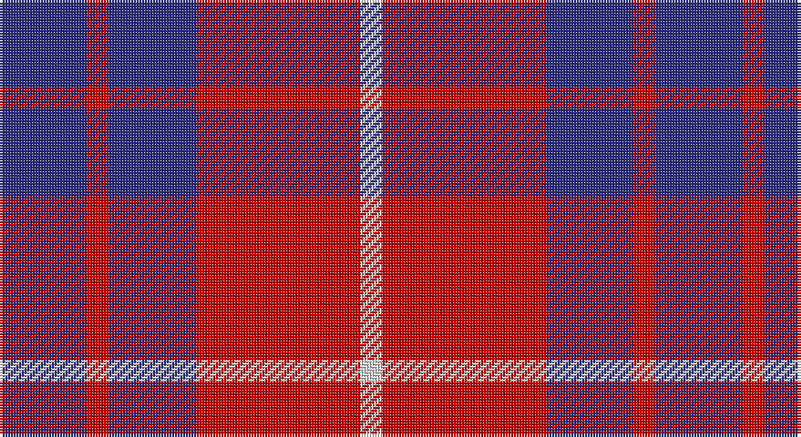

This page is one **sett** — a single exact thread-count. It belongs to the [tartan](/setts/db8r2db8r15w2/)
(the same proportion at any scale), whose colour order is pattern [BRBRW](/stripes/brbrw/).

Part of the [Hamilton](/tartans/hamilton/) tartan — the named design grouping this sett with its other cloths.

Sourced from tartans-authority.  It is a [5 stripe tartan](/stripes/stripes5/).

Original link http://www.tartansauthority.com/tartan-ferret/display/477/

## Also known as

This cloth is also recorded under:

- Hamilton Green
- Hamilton Green Hunting
- Hamilton Red
- Hamilton,

## Register references

External register numbers recorded for this tartan.

- Scottish Tartans Authority (ITI): 477

## Thread count
DB/32 R8 DB32 R60 LN/8

One full sett is **240 threads**.

## Palette

Palette: <strong>Tartan Register</strong>
<table><thead><tr><th>Colour</th><th>Threads</th><th>Shade</th><th>Base</th><th>OKLCh</th></tr></thead><tbody><tr><td>DB/</td><td style="text-align:right;font-variant-numeric:tabular-nums">32</td><td><code style="background-color:#2C2C80;">#2C2C80</code> <small style="color:#888">#2C2C80</small></td><td>B <code style="background-color:#2A418A;">#2A418A</code></td><td><small style="color:#888">oklch(35.0% 0.138 276.6)</small></td></tr><tr><td>R</td><td style="text-align:right;font-variant-numeric:tabular-nums">8</td><td><code style="background-color:#C80000;">#C80000</code> <small style="color:#888">#C80000</small></td><td>R <code style="background-color:#CC0000;">#CC0000</code></td><td><small style="color:#888">oklch(52.3% 0.215 29.2)</small></td></tr><tr><td>DB</td><td style="text-align:right;font-variant-numeric:tabular-nums">32</td><td><code style="background-color:#2C2C80;">#2C2C80</code> <small style="color:#888">#2C2C80</small></td><td>B <code style="background-color:#2A418A;">#2A418A</code></td><td><small style="color:#888">oklch(35.0% 0.138 276.6)</small></td></tr><tr><td>R</td><td style="text-align:right;font-variant-numeric:tabular-nums">60</td><td><code style="background-color:#C80000;">#C80000</code> <small style="color:#888">#C80000</small></td><td>R <code style="background-color:#CC0000;">#CC0000</code></td><td><small style="color:#888">oklch(52.3% 0.215 29.2)</small></td></tr><tr><td>LN/</td><td style="text-align:right;font-variant-numeric:tabular-nums">8</td><td><code style="background-color:#E0E0E0;">#E0E0E0</code> <small style="color:#888">#E0E0E0</small></td><td>W <code style="background-color:#F7F7F7;">#F7F7F7</code></td><td><small style="color:#888">oklch(90.7% 0.000 89.9)</small></td></tr></tbody></table>

# Sample pattern

## Compared to the master

This cloth is one sett of its design; the master sett (the exemplar the design is anchored on) is below for comparison.

<figure style="margin:0"><figcaption style="color:#888;font-size:smaller">this sett</figcaption></figure>
<figure style="margin:0"><figcaption style="color:#888;font-size:smaller"><a href="/setts/db8g2db8g15lb2/">master sett →</a></figcaption></figure>

## Nearest tartans

The nearest existing variants by ΔTartan distance, with this tartan at the top so the swatches line up against it.

ΔTartan

Tartan

Sett

—

<a href="/ttd/edit/#slug=db8r2db8r15w2~x4">Hamilton (Clan)</a> <a class="nn-out" href="/variants/s5/db8r2db8r15w2~x4/" title="open its dictionary page">↗</a>

0.57

<a href="/ttd/edit/#slug=db6r1db6r9w1~x4&amp;base=db8r2db8r15w2~x4">Hamilton Red Clan Tartan</a> <a class="nn-out" href="/variants/s5/db6r1db6r9w1~x4/" title="open its dictionary page">↗</a>

0.81

<a href="/ttd/edit/#slug=db6r1db6r9w1~x2&amp;base=db8r2db8r15w2~x4">Hamilton, (Red)</a> <a class="nn-out" href="/variants/s5/db6r1db6r9w1~x2/" title="open its dictionary page">↗</a>

0.95

<a href="/ttd/edit/#slug=r12db2r12db17w2r2~x2&amp;base=db8r2db8r15w2~x4">British European</a> <a class="nn-out" href="/variants/s6/r12db2r12db17w2r2~x2/" title="open its dictionary page">↗</a>

0.95

<a href="/ttd/edit/#slug=r12db2r12db17w2r2~x4&amp;base=db8r2db8r15w2~x4">British European (Corporate)</a> <a class="nn-out" href="/variants/s6/r12db2r12db17w2r2~x4/" title="open its dictionary page">↗</a>

1.09

<a href="/ttd/edit/#slug=db15w2r20db2r4~x2&amp;base=db8r2db8r15w2~x4">Masai Shuka 25 (Artefact)</a> <a class="nn-out" href="/variants/s5/db15w2r20db2r4~x2/" title="open its dictionary page">↗</a>

1.12

<a href="/ttd/edit/#slug=db48r18db6r13ly4r14~x2&amp;base=db8r2db8r15w2~x4">Butler</a> <a class="nn-out" href="/variants/s6/db48r18db6r13ly4r14~x2/" title="open its dictionary page">↗</a>

1.16

<a href="/ttd/edit/#slug=r5dg3r18db18dg3~x4&amp;base=db8r2db8r15w2~x4">Wotherspoon</a> <a class="nn-out" href="/variants/s5/r5dg3r18db18dg3~x4/" title="open its dictionary page">↗</a>

1.18

<a href="/ttd/edit/#slug=db3r24db3r3db25w3~x2&amp;base=db8r2db8r15w2~x4">Matthews (Personal)</a> <a class="nn-out" href="/variants/s6/db3r24db3r3db25w3~x2/" title="open its dictionary page">↗</a>

1.30

<a href="/ttd/edit/#slug=r15db8r2db8r2db8r15w2~x4&amp;base=db8r2db8r15w2~x4">Hamilton</a> <a class="nn-out" href="/variants/s8/r15db8r2db8r2db8r15w2~x4/" title="open its dictionary page">↗</a>

1.31

<a href="/ttd/edit/#slug=db6r1db6r9lb1~x2&amp;base=db8r2db8r15w2~x4">Hamilton</a> <a class="nn-out" href="/variants/s5/db6r1db6r9lb1~x2/" title="open its dictionary page">↗</a>

## Neighbour map

Every grey dot is one of 14360 variants placed by the first two principal components of the ΔTartan feature space (44% of its variance). Red is this tartan; blue dots are its nearest — click one to open its page.

<svg viewBox="0 0 640 380" role="img" style="max-width:100%;height:auto;border:1px solid #e0e0e0;border-radius:4px;display:block" xmlns="http://www.w3.org/2000/svg"><image href="/nn/cloud.v1.png" width="640" height="380"/><a href="/variants/s5/db6r1db6r9w1~x4/"><circle cx="320.0" cy="245.1" r="4" fill="#3465a4"><title>Hamilton Red Clan Tartan</title></circle></a><a href="/variants/s5/db6r1db6r9w1~x2/"><circle cx="331.8" cy="251.8" r="4" fill="#3465a4"><title>Hamilton, (Red)</title></circle></a><a href="/variants/s6/r12db2r12db17w2r2~x2/"><circle cx="347.1" cy="236.0" r="4" fill="#3465a4"><title>British European</title></circle></a><a href="/variants/s6/r12db2r12db17w2r2~x4/"><circle cx="347.1" cy="236.0" r="4" fill="#3465a4"><title>British European (Corporate)</title></circle></a><a href="/variants/s5/db15w2r20db2r4~x2/"><circle cx="357.8" cy="219.9" r="4" fill="#3465a4"><title>Masai Shuka 25 (Artefact)</title></circle></a><a href="/variants/s6/db48r18db6r13ly4r14~x2/"><circle cx="348.0" cy="214.1" r="4" fill="#3465a4"><title>Butler</title></circle></a><a href="/variants/s5/r5dg3r18db18dg3~x4/"><circle cx="289.7" cy="257.0" r="4" fill="#3465a4"><title>Wotherspoon</title></circle></a><a href="/variants/s6/db3r24db3r3db25w3~x2/"><circle cx="331.1" cy="212.1" r="4" fill="#3465a4"><title>Matthews (Personal)</title></circle></a><a href="/variants/s8/r15db8r2db8r2db8r15w2~x4/"><circle cx="331.9" cy="230.5" r="4" fill="#3465a4"><title>Hamilton</title></circle></a><a href="/variants/s5/db6r1db6r9lb1~x2/"><circle cx="298.6" cy="241.2" r="4" fill="#3465a4"><title>Hamilton</title></circle></a><circle cx="294.6" cy="246.3" r="5" fill="#c00000"/></svg>

ID: /variants/s5/db8r2db8r15w2~x4/
