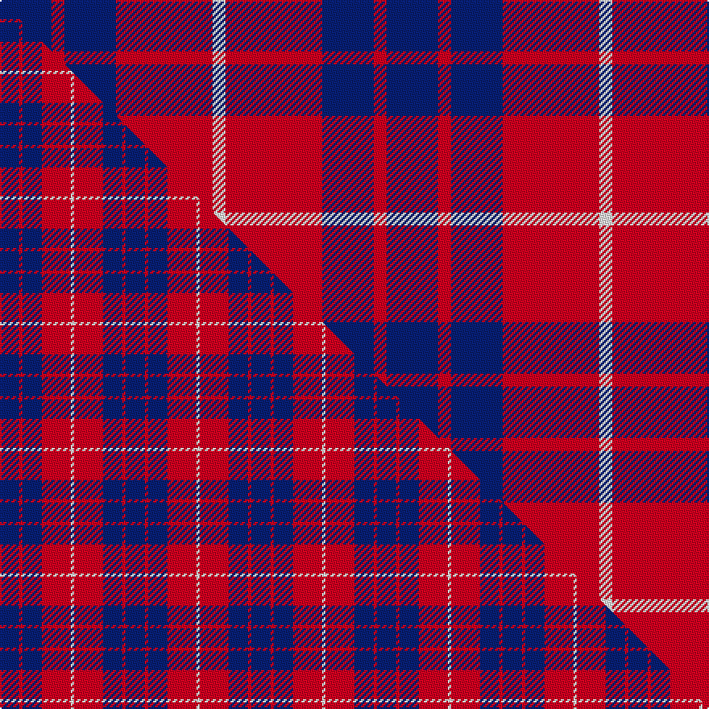

This page is one **sett** — a single exact thread-count. It belongs to the [tartan](/setts/db8r2db8r15w2/)
(the same proportion at any scale), whose colour order is pattern [BRBRW](/stripes/brbrw/).

Part of the [Hamilton](/tartans/hamilton/) tartan — the named design grouping this sett with its other cloths.

Sourced from tartans-authority.  It is a [5 stripe tartan](/stripes/stripes5/).

Original link http://www.tartansauthority.com/tartan-ferret/display/477/

## Register references

External register numbers recorded for this tartan.

- Scottish Tartans Authority (ITI): 477

## Thread count
DB/32 R8 DB32 R60 W/8

One full sett is **240 threads**.

## Palette
<table><thead><tr><th>Colour</th><th>Shade</th><th>OKLCh</th></tr></thead><tbody><tr><td>DB</td><td><code style="background-color:#082077;">#082077</code> <small style="color:#888">#082077</small></td><td><small style="color:#888">oklch(30.0% 0.149 265.1)</small></td></tr><tr><td>W</td><td><code style="background-color:#F7F7F7;">#F7F7F7</code> <small style="color:#888">#F7F7F7</small></td><td><small style="color:#888">oklch(97.6% 0.000 89.9)</small></td></tr><tr><td>R</td><td><code style="background-color:#D60020;">#D60020</code> <small style="color:#888">#D60020</small></td><td><small style="color:#888">oklch(55.2% 0.224 25.5)</small></td></tr></tbody></table>

# Sample pattern

## Compared to the master

This cloth is one sett of its design; the master sett (the exemplar the design is anchored on) is below for comparison.

Its **ΔTartan distance** from the master is **0.59** — the same measure the nearest-tartans table ranks by (0 is identical; a re-scale of the same cloth is near 0, a recolour or a different proportion further).

<figure class="master-compare" style="margin:0">

this sett
master sett ★

<figcaption style="color:#888;font-size:smaller">One weave of this sett against the <a href="/setts/db6r1db6r9w1/">master sett ★</a>, split on the diagonal: a shared proportion runs seamlessly across it with only the shades shifting; a different proportion breaks on it.</figcaption>
</figure>

## Nearest variants

The nearest existing variants by ΔTartan distance, with this cloth at the top so the swatches line up against it.

ΔTartan

Threads

Variant

Sett

—

240

<a href="/variants/s5/db8r2db8r15w2~x4/">Hamilton (Clan)</a>

<a href="/ttd/edit/#slug=db6r1db6r9w1~x2&amp;base=db8r2db8r15w2~x4" title="compare in the TTD">0.41</a>

78

<a href="/variants/s5/db6r1db6r9w1~x2/">Hamilton</a>

<a href="/ttd/edit/#slug=db6r1db6r9w1~x4&amp;base=db8r2db8r15w2~x4" title="compare in the TTD">0.41</a>

156

<a href="/variants/s5/db6r1db6r9w1~x4/">Hamilton Red Clan Tartan</a>

<a href="/ttd/edit/#slug=db15w2r20db2r4~x2&amp;base=db8r2db8r15w2~x4" title="compare in the TTD">0.62</a>

134

<a href="/variants/s5/db15w2r20db2r4~x2/">Masai Shuka 25 (Artefact)</a>

<a href="/ttd/edit/#slug=g3r2db22r22db2w3~x2&amp;base=db8r2db8r15w2~x4" title="compare in the TTD">0.92</a>

204

<a href="/variants/s6/g3r2db22r22db2w3~x2/">Galloway Red</a>

<a href="/ttd/edit/#slug=r9db1g2db5w1~x12&amp;base=db8r2db8r15w2~x4" title="compare in the TTD">1.59</a>

312

<a href="/variants/s5/r9db1g2db5w1~x12/">McIntosh, Georgina (Personal)</a>

<a href="/ttd/edit/#slug=db3r24db3r3db25w3~x2&amp;base=db8r2db8r15w2~x4" title="compare in the TTD">1.69</a>

232

<a href="/variants/s6/db3r24db3r3db25w3~x2/">Matthews (Personal)</a>

<a href="/ttd/edit/#slug=r12db2r12db17w2r2~x4&amp;base=db8r2db8r15w2~x4" title="compare in the TTD">1.71</a>

320

<a href="/variants/s6/r12db2r12db17w2r2~x4/">British European (Corporate)</a>

<a href="/ttd/edit/#slug=r12db2r12db17w2r2~x2~r1807033&amp;base=db8r2db8r15w2~x4" title="compare in the TTD">1.71</a>

160

<a href="/variants/s6/r12db2r12db17w2r2~x2~r1807033/">British European</a>

<a href="/ttd/edit/#slug=db1r14g7db7r1~x4&amp;base=db8r2db8r15w2~x4" title="compare in the TTD">1.79</a>

232

<a href="/variants/s5/db1r14g7db7r1~x4/">Fraser of Boblainy, Hugh (Personal)</a>

<a href="/ttd/edit/#slug=db1r16db6y4db6w1~x4&amp;base=db8r2db8r15w2~x4" title="compare in the TTD">1.92</a>

264

<a href="/variants/s6/db1r16db6y4db6w1~x4/">Superfast Ferries (Corporate)</a>

## Neighbour map

Every grey dot is one of 13620 variants placed by the first two principal components of the ΔTartan feature space (42% of its variance). Red is this tartan; blue dots are its nearest — click one to open its page.

<svg viewBox="0 0 640 380" role="img" style="max-width:100%;height:auto;border:1px solid #e0e0e0;border-radius:4px;display:block" xmlns="http://www.w3.org/2000/svg"><image href="/nn/cloud.v1.png" width="640" height="380"/><a href="/variants/s5/db6r1db6r9w1~x2/"><circle cx="315.4" cy="242.2" r="4" fill="#3465a4"><title>Hamilton</title></circle></a><a href="/variants/s5/db6r1db6r9w1~x4/"><circle cx="315.4" cy="242.2" r="4" fill="#3465a4"><title>Hamilton Red Clan Tartan</title></circle></a><a href="/variants/s5/db15w2r20db2r4~x2/"><circle cx="348.9" cy="218.2" r="4" fill="#3465a4"><title>Masai Shuka 25 (Artefact)</title></circle></a><a href="/variants/s6/g3r2db22r22db2w3~x2/"><circle cx="274.3" cy="186.0" r="4" fill="#3465a4"><title>Galloway Red</title></circle></a><a href="/variants/s5/r9db1g2db5w1~x12/"><circle cx="273.6" cy="213.3" r="4" fill="#3465a4"><title>McIntosh, Georgina (Personal)</title></circle></a><a href="/variants/s6/db3r24db3r3db25w3~x2/"><circle cx="322.7" cy="210.5" r="4" fill="#3465a4"><title>Matthews (Personal)</title></circle></a><a href="/variants/s6/r12db2r12db17w2r2~x4/"><circle cx="326.8" cy="222.0" r="4" fill="#3465a4"><title>British European (Corporate)</title></circle></a><a href="/variants/s6/r12db2r12db17w2r2~x2~r1807033/"><circle cx="344.6" cy="230.2" r="4" fill="#3465a4"><title>British European</title></circle></a><a href="/variants/s5/db1r14g7db7r1~x4/"><circle cx="309.8" cy="219.0" r="4" fill="#3465a4"><title>Fraser of Boblainy, Hugh (Personal)</title></circle></a><a href="/variants/s6/db1r16db6y4db6w1~x4/"><circle cx="295.3" cy="185.7" r="4" fill="#3465a4"><title>Superfast Ferries (Corporate)</title></circle></a><circle cx="292.6" cy="247.4" r="5" fill="#c00000"/><text x="320" y="376" text-anchor="middle" font-size="11" fill="#999">ground</text><text x="11" y="190" text-anchor="middle" font-size="11" fill="#999" transform="rotate(-90 11 190)">complexity</text></svg>

ID: /variants/s5/db8r2db8r15w2~x4/
