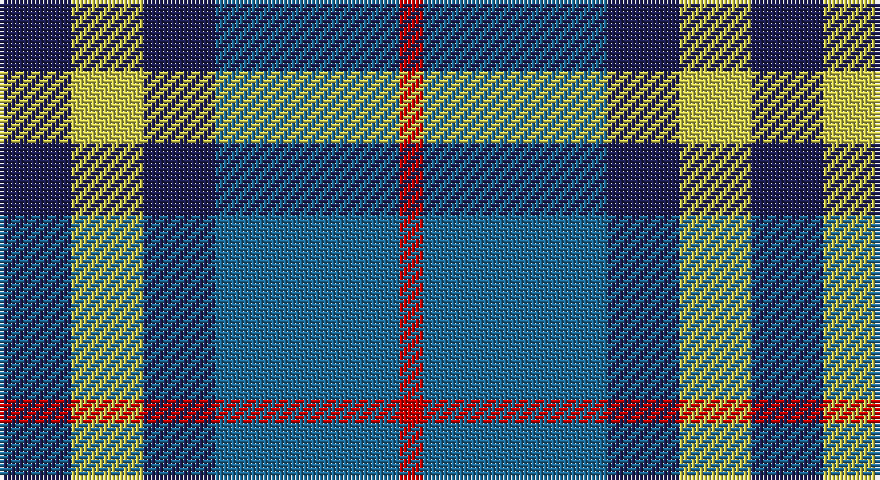

This page is one **sett** — a single exact thread-count. It belongs to the [tartan](/setts/db9ly9db9t23r3/)
(the same proportion at any scale), whose colour order is pattern [BYBBR](/stripes/bybbr/).

Sourced from tartans-authority.  It is a [5 stripe tartan](/stripes/stripes5/).

Original link http://www.tartansauthority.com/tartan-ferret/display/7464/

2 attestations — the source records this cloth was collapsed from (oldest owns this page)

<ul>
<li>Aug 2007 — Tilburg (District) (tartans-authority, <a href="http://www.tartansauthority.com/tartan-ferret/display/7464/">record</a>)</li>
<li>undated — Tilburg (register-of-tartans, <a href="https://www.tartanregister.gov.uk/tartanDetails.aspx?ref=5509">record</a>)</li>
</ul>

## Register references

External register numbers recorded for this tartan.

- Scottish Register of Tartans: [5509](https://www.tartanregister.gov.uk/tartanDetails.aspx?ref=5509)
- Scottish Tartans Authority (ITI): 7464

## Thread count
DB/18 LG18 DB18 B46 R/6

One full sett is **188 threads**.

## Palette

Palette: <strong>Tartan Register</strong> <small style="color:#888">(2 of 4 colours)</small>
<table><thead><tr><th>Colour</th><th>Threads</th><th>Shade</th><th>Base</th><th>OKLCh</th></tr></thead><tbody><tr><td>DB/</td><td style="text-align:right;font-variant-numeric:tabular-nums">18</td><td><code style="background-color:#1C1C50;">#1C1C50</code> <small style="color:#888">#1C1C50</small></td><td>B <code style="background-color:#2A418A;">#2A418A</code></td><td><small style="color:#888">oklch(26.2% 0.093 277.9)</small></td></tr><tr><td>LG</td><td style="text-align:right;font-variant-numeric:tabular-nums">18</td><td><code style="background-color:#C8C44C;">#C8C44C</code> <small style="color:#888">#C8C44C</small></td><td>Y <code style="background-color:#F2BF00;">#F2BF00</code></td><td><small style="color:#888">oklch(80.1% 0.140 107.4)</small></td></tr><tr><td>DB</td><td style="text-align:right;font-variant-numeric:tabular-nums">18</td><td><code style="background-color:#1C1C50;">#1C1C50</code> <small style="color:#888">#1C1C50</small></td><td>B <code style="background-color:#2A418A;">#2A418A</code></td><td><small style="color:#888">oklch(26.2% 0.093 277.9)</small></td></tr><tr><td>B</td><td style="text-align:right;font-variant-numeric:tabular-nums">46</td><td><code style="background-color:#1C6894;">#1C6894</code> <small style="color:#888">#1C6894</small></td><td>B <code style="background-color:#2A418A;">#2A418A</code></td><td><small style="color:#888">oklch(49.4% 0.100 239.6)</small></td></tr><tr><td>R/</td><td style="text-align:right;font-variant-numeric:tabular-nums">6</td><td><code style="background-color:#C80000;">#C80000</code> <small style="color:#888">#C80000</small></td><td>R <code style="background-color:#CC0000;">#CC0000</code></td><td><small style="color:#888">oklch(52.3% 0.215 29.2)</small></td></tr></tbody></table>

# Sample pattern

## Nearest tartans

The nearest existing variants by ΔTartan distance, with this tartan at the top so the swatches line up against it.

ΔTartan

Tartan

Sett

—

<a href="/ttd/edit/#slug=db9ly9db9t23r3~x2">Tilburg (District)</a> <a class="nn-out" href="/variants/s5/db9ly9db9t23r3~x2/" title="open its dictionary page">↗</a>

0.81

<a href="/ttd/edit/#slug=k11t38r11g11k5~x2&amp;base=db9ly9db9t23r3~x2">All as One (Corporate)</a> <a class="nn-out" href="/variants/s5/k11t38r11g11k5~x2/" title="open its dictionary page">↗</a>

0.98

<a href="/ttd/edit/#slug=b23dt18w5dt2r14dt18~x2&amp;base=db9ly9db9t23r3~x2">Pitt (Name)</a> <a class="nn-out" href="/variants/s6/b23dt18w5dt2r14dt18~x2/" title="open its dictionary page">↗</a>

1.02

<a href="/ttd/edit/#slug=db10g10r5w1~x2&amp;base=db9ly9db9t23r3~x2">Thorntons Law (Corporate)</a> <a class="nn-out" href="/variants/s4/db10g10r5w1~x2/" title="open its dictionary page">↗</a>

1.08

<a href="/ttd/edit/#slug=k3lb10db2g6db18g2~x2&amp;base=db9ly9db9t23r3~x2">Crombie House Check</a> <a class="nn-out" href="/variants/s6/k3lb10db2g6db18g2~x2/" title="open its dictionary page">↗</a>

1.11

<a href="/ttd/edit/#slug=r15w10db48t32r6~x2&amp;base=db9ly9db9t23r3~x2">Lands of Liberty (Fashion)</a> <a class="nn-out" href="/variants/s5/r15w10db48t32r6~x2/" title="open its dictionary page">↗</a>

1.11

<a href="/ttd/edit/#slug=dr5b35k24b9g9dr5~x2&amp;base=db9ly9db9t23r3~x2">Notre Dame Marching Guard (Corp)</a> <a class="nn-out" href="/variants/s6/dr5b35k24b9g9dr5~x2/" title="open its dictionary page">↗</a>

1.13

<a href="/ttd/edit/#slug=k4w2g13k13t12k2~x2&amp;base=db9ly9db9t23r3~x2">Melville</a> <a class="nn-out" href="/variants/s6/k4w2g13k13t12k2~x2/" title="open its dictionary page">↗</a>

1.15

<a href="/ttd/edit/#slug=db2g13db11t4w9db2~x2&amp;base=db9ly9db9t23r3~x2">Loch Leven Check Trade Tartan</a> <a class="nn-out" href="/variants/s6/db2g13db11t4w9db2~x2/" title="open its dictionary page">↗</a>

1.18

<a href="/ttd/edit/#slug=b10k10b10dg26ly5~x2&amp;base=db9ly9db9t23r3~x2">Marshall of Keith (Personal)</a> <a class="nn-out" href="/variants/s5/b10k10b10dg26ly5~x2/" title="open its dictionary page">↗</a>

1.19

<a href="/ttd/edit/#slug=db9k7o5r1o5k1o2~x4&amp;base=db9ly9db9t23r3~x2">Greyhound Grenadiers (Corporate)</a> <a class="nn-out" href="/variants/s7/db9k7o5r1o5k1o2~x4/" title="open its dictionary page">↗</a>

## Neighbour map

Every grey dot is one of 14360 variants placed by the first two principal components of the ΔTartan feature space (44% of its variance). Red is this tartan; blue dots are its nearest — click one to open its page.

<svg viewBox="0 0 640 380" role="img" style="max-width:100%;height:auto;border:1px solid #e0e0e0;border-radius:4px;display:block" xmlns="http://www.w3.org/2000/svg"><image href="/nn/cloud.v1.png" width="640" height="380"/><a href="/variants/s5/k11t38r11g11k5~x2/"><circle cx="228.1" cy="232.4" r="4" fill="#3465a4"><title>All as One (Corporate)</title></circle></a><a href="/variants/s6/b23dt18w5dt2r14dt18~x2/"><circle cx="223.4" cy="234.9" r="4" fill="#3465a4"><title>Pitt (Name)</title></circle></a><a href="/variants/s4/db10g10r5w1~x2/"><circle cx="177.9" cy="242.9" r="4" fill="#3465a4"><title>Thorntons Law (Corporate)</title></circle></a><a href="/variants/s6/k3lb10db2g6db18g2~x2/"><circle cx="226.8" cy="209.5" r="4" fill="#3465a4"><title>Crombie House Check</title></circle></a><a href="/variants/s5/r15w10db48t32r6~x2/"><circle cx="185.6" cy="224.2" r="4" fill="#3465a4"><title>Lands of Liberty (Fashion)</title></circle></a><a href="/variants/s6/dr5b35k24b9g9dr5~x2/"><circle cx="235.3" cy="235.7" r="4" fill="#3465a4"><title>Notre Dame Marching Guard (Corp)</title></circle></a><a href="/variants/s6/k4w2g13k13t12k2~x2/"><circle cx="166.3" cy="239.3" r="4" fill="#3465a4"><title>Melville</title></circle></a><a href="/variants/s6/db2g13db11t4w9db2~x2/"><circle cx="131.0" cy="233.8" r="4" fill="#3465a4"><title>Loch Leven Check Trade Tartan</title></circle></a><a href="/variants/s5/b10k10b10dg26ly5~x2/"><circle cx="157.6" cy="265.5" r="4" fill="#3465a4"><title>Marshall of Keith (Personal)</title></circle></a><a href="/variants/s7/db9k7o5r1o5k1o2~x4/"><circle cx="185.3" cy="222.0" r="4" fill="#3465a4"><title>Greyhound Grenadiers (Corporate)</title></circle></a><circle cx="194.3" cy="246.6" r="5" fill="#c00000"/></svg>

ID: /variants/s5/db9ly9db9t23r3~x2/
