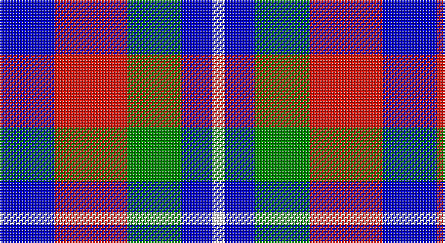

This page is one **sett** — a single exact thread-count. It belongs to the [tartan](/setts/db9r12g9db5w2/)
(the same proportion at any scale), whose colour order is pattern [BRGBW](/stripes/brgbw/).

Sourced from register-of-tartans.  It is a [5 stripe tartan](/stripes/stripes5/).

Original link https://www.tartanregister.gov.uk/tartanDetails.aspx?ref=10841

## Register references

External register numbers recorded for this tartan.

- Scottish Register of Tartans: [10841](https://www.tartanregister.gov.uk/tartanDetails.aspx?ref=10841)

## Thread count
B/36 R48 G36 B20 W/8

One full sett is **252 threads**.

## Palette

Palette: <strong>Tartan Register</strong> <small style="color:#888">(3 of 4 colours)</small>
<table><thead><tr><th>Colour</th><th>Threads</th><th>Shade</th><th>Base</th><th>OKLCh</th></tr></thead><tbody><tr><td>B/</td><td style="text-align:right;font-variant-numeric:tabular-nums">36</td><td><code style="background-color:#0000CD;">#0000CD</code> <small style="color:#888">#0000CD</small></td><td>B <code style="background-color:#2A418A;">#2A418A</code></td><td><small style="color:#888">oklch(38.3% 0.266 264.1)</small></td></tr><tr><td>R</td><td style="text-align:right;font-variant-numeric:tabular-nums">48</td><td><code style="background-color:#E3170D;">#E3170D</code> <small style="color:#888">#E3170D</small></td><td>R <code style="background-color:#CC0000;">#CC0000</code></td><td><small style="color:#888">oklch(58.1% 0.230 29.4)</small></td></tr><tr><td>G</td><td style="text-align:right;font-variant-numeric:tabular-nums">36</td><td><code style="background-color:#008B00;">#008B00</code> <small style="color:#888">#008B00</small></td><td>G <code style="background-color:#006100;">#006100</code></td><td><small style="color:#888">oklch(55.2% 0.188 142.5)</small></td></tr><tr><td>B</td><td style="text-align:right;font-variant-numeric:tabular-nums">20</td><td><code style="background-color:#0000CD;">#0000CD</code> <small style="color:#888">#0000CD</small></td><td>B <code style="background-color:#2A418A;">#2A418A</code></td><td><small style="color:#888">oklch(38.3% 0.266 264.1)</small></td></tr><tr><td>W/</td><td style="text-align:right;font-variant-numeric:tabular-nums">8</td><td><code style="background-color:#FFFFFF;">#FFFFFF</code> <small style="color:#888">#FFFFFF</small></td><td>W <code style="background-color:#F7F7F7;">#F7F7F7</code></td><td><small style="color:#888">oklch(100.0% 0.000 89.9)</small></td></tr></tbody></table>

# Sample pattern

## Nearest tartans

The nearest existing variants by ΔTartan distance, with this tartan at the top so the swatches line up against it.

ΔTartan

Tartan

Sett

—

<a href="/ttd/edit/#slug=db9r12g9db5w2~x4">Battle of Prestonpans (1745) Heritage Trust, The</a> <a class="nn-out" href="/variants/s5/db9r12g9db5w2~x4/" title="open its dictionary page">↗</a>

1.29

<a href="/ttd/edit/#slug=db10g10r5w1~x2&amp;base=db9r12g9db5w2~x4">Thorntons Law (Corporate)</a> <a class="nn-out" href="/variants/s4/db10g10r5w1~x2/" title="open its dictionary page">↗</a>

1.35

<a href="/ttd/edit/#slug=g3db3dp4w1~x4&amp;base=db9r12g9db5w2~x4">Pride of the Glen</a> <a class="nn-out" href="/variants/s4/g3db3dp4w1~x4/" title="open its dictionary page">↗</a>

1.37

<a href="/ttd/edit/#slug=g21db34r14w6~x2&amp;base=db9r12g9db5w2~x4">Harbison (2015)</a> <a class="nn-out" href="/variants/s4/g21db34r14w6~x2/" title="open its dictionary page">↗</a>

1.37

<a href="/ttd/edit/#slug=db9r12dg9db5w2~x4&amp;base=db9r12g9db5w2~x4">Battle of Prestonpans (1745) Herit</a> <a class="nn-out" href="/variants/s5/db9r12dg9db5w2~x4/" title="open its dictionary page">↗</a>

1.39

<a href="/ttd/edit/#slug=db13w13db4ly2g8r3~x2&amp;base=db9r12g9db5w2~x4">Unidentified (Winterbottom)</a> <a class="nn-out" href="/variants/s6/db13w13db4ly2g8r3~x2/" title="open its dictionary page">↗</a>

1.39

<a href="/ttd/edit/#slug=r15w10db48t32r6~x2&amp;base=db9r12g9db5w2~x4">Lands of Liberty (Fashion)</a> <a class="nn-out" href="/variants/s5/r15w10db48t32r6~x2/" title="open its dictionary page">↗</a>

1.40

<a href="/ttd/edit/#slug=db3dg6ly1r3~x10&amp;base=db9r12g9db5w2~x4">Delroeux, John Michael (Personal)</a> <a class="nn-out" href="/variants/s4/db3dg6ly1r3~x10/" title="open its dictionary page">↗</a>

1.41

<a href="/ttd/edit/#slug=r2db4r6db2lb6k1ly2~x2&amp;base=db9r12g9db5w2~x4">Unidentified Printing</a> <a class="nn-out" href="/variants/s7/r2db4r6db2lb6k1ly2~x2/" title="open its dictionary page">↗</a>

1.43

<a href="/ttd/edit/#slug=k4w3k4o9r1~x4&amp;base=db9r12g9db5w2~x4">Oban Grey District Tartan</a> <a class="nn-out" href="/variants/s5/k4w3k4o9r1~x4/" title="open its dictionary page">↗</a>

1.45

<a href="/ttd/edit/#slug=k4w3k4y9r1~x4&amp;base=db9r12g9db5w2~x4">Oban Grey</a> <a class="nn-out" href="/variants/s5/k4w3k4y9r1~x4/" title="open its dictionary page">↗</a>

## Neighbour map

Every grey dot is one of 14360 variants placed by the first two principal components of the ΔTartan feature space (44% of its variance). Red is this tartan; blue dots are its nearest — click one to open its page.

<svg viewBox="0 0 640 380" role="img" style="max-width:100%;height:auto;border:1px solid #e0e0e0;border-radius:4px;display:block" xmlns="http://www.w3.org/2000/svg"><image href="/nn/cloud.v1.png" width="640" height="380"/><a href="/variants/s4/db10g10r5w1~x2/"><circle cx="177.9" cy="242.9" r="4" fill="#3465a4"><title>Thorntons Law (Corporate)</title></circle></a><a href="/variants/s4/g3db3dp4w1~x4/"><circle cx="99.7" cy="298.2" r="4" fill="#3465a4"><title>Pride of the Glen</title></circle></a><a href="/variants/s4/g21db34r14w6~x2/"><circle cx="175.6" cy="267.1" r="4" fill="#3465a4"><title>Harbison (2015)</title></circle></a><a href="/variants/s5/db9r12dg9db5w2~x4/"><circle cx="150.2" cy="264.3" r="4" fill="#3465a4"><title>Battle of Prestonpans (1745) Herit</title></circle></a><a href="/variants/s6/db13w13db4ly2g8r3~x2/"><circle cx="113.0" cy="207.2" r="4" fill="#3465a4"><title>Unidentified (Winterbottom)</title></circle></a><a href="/variants/s5/r15w10db48t32r6~x2/"><circle cx="185.6" cy="224.2" r="4" fill="#3465a4"><title>Lands of Liberty (Fashion)</title></circle></a><a href="/variants/s4/db3dg6ly1r3~x10/"><circle cx="170.4" cy="258.1" r="4" fill="#3465a4"><title>Delroeux, John Michael (Personal)</title></circle></a><a href="/variants/s7/r2db4r6db2lb6k1ly2~x2/"><circle cx="83.9" cy="205.0" r="4" fill="#3465a4"><title>Unidentified Printing</title></circle></a><a href="/variants/s5/k4w3k4o9r1~x4/"><circle cx="185.2" cy="223.7" r="4" fill="#3465a4"><title>Oban Grey District Tartan</title></circle></a><a href="/variants/s5/k4w3k4y9r1~x4/"><circle cx="186.9" cy="224.9" r="4" fill="#3465a4"><title>Oban Grey</title></circle></a><circle cx="120.3" cy="253.3" r="5" fill="#c00000"/></svg>

ID: /variants/s5/db9r12g9db5w2~x4/
