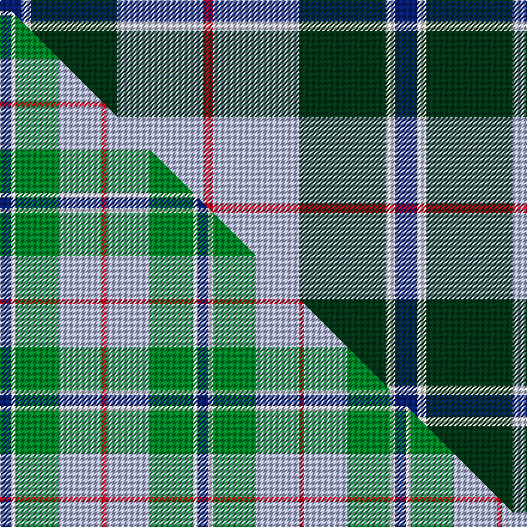

This page is one **sett** — a single exact thread-count. It belongs to the [tartan](/setts/db9w4dg36lb36r4/)
(the same proportion at any scale), whose colour order is pattern [BWGWR](/stripes/bwgwr/).

Part of the [Alvis of Lee](/tartans/alvis-of-lee/) tartan — the named design grouping this sett with its other cloths.

Sourced from tartans-authority.  It is a [5 stripe tartan](/stripes/stripes5/).

Original link https://www.tartanregister.gov.uk/tartanDetails.aspx?ref=643

Dataset <small>— provenance for this record, inherited from the source manifest</small>

<dl class="dataset-prov">
<dt>source</dt><dd><a href="/sources/tartans-authority/">Scottish Tartans Authority</a></dd>
<dt>data captured from</dt><dd><a href="https://github.com/thetartan/tartan-database/blob/master/data/tartans-authority/data.csv">https://github.com/thetartan/tartan-database/blob/master/data/tartans-authority/data.csv</a></dd>
<dt>data date</dt><dd>1st April 1985 <small>(this record)</small></dd>
<dt>licence</dt><dd><a href="https://creativecommons.org/licenses/by-nc-nd/4.0/">CC BY-NC-ND 4.0</a></dd>
</dl>

Capture chain <small>— the hands this data passed through, oldest first; each capture carries its own licence</small>

<ol class="capture-chain">
<li><a href="https://www.tartansauthority.com/">Scottish Tartans Authority</a> <small>the heritage body's archive — its tartan-ferret record browser is retired (links repaired to the SRT, above)</small></li>
<li><a href="https://github.com/thetartan/tartan-database">thetartan/tartan-database</a> <small>2016-2017</small> · <a href="https://creativecommons.org/licenses/by-nc-nd/4.0/">CC BY-NC-ND 4.0</a> <small>Levko Kravets's frozen compilation — the capture we vendored, and where its CC licence text came from</small></li>
<li>this dictionary <small>captured 2026-06-10 · commit 5bf86c7566</small> <small>each re-capture is a git commit to data/sources</small></li>
</ol>

## Register references

External register numbers recorded for this tartan.

- Scottish Tartans Authority (ITI): 643

## Thread count
DB/18 W8 DG72 LB72 R/8

One full sett is **330 threads**.

## Palette
<table><thead><tr><th>Colour</th><th>Shade</th><th>OKLCh</th></tr></thead><tbody><tr><td>LB</td><td><code style="background-color:#B5BBDE;">#B5BBDE</code> <small style="color:#888">#B5BBDE</small></td><td><small style="color:#888">oklch(79.9% 0.050 277.6)</small></td></tr><tr><td>DB</td><td><code style="background-color:#082077;">#082077</code> <small style="color:#888">#082077</small></td><td><small style="color:#888">oklch(30.0% 0.149 265.1)</small></td></tr><tr><td>DG</td><td><code style="background-color:#053819;">#053819</code> <small style="color:#888">#053819</small></td><td><small style="color:#888">oklch(30.0% 0.075 151.3)</small></td></tr><tr><td>W</td><td><code style="background-color:#F7F7F7;">#F7F7F7</code> <small style="color:#888">#F7F7F7</small></td><td><small style="color:#888">oklch(97.6% 0.000 89.9)</small></td></tr><tr><td>R</td><td><code style="background-color:#D60020;">#D60020</code> <small style="color:#888">#D60020</small></td><td><small style="color:#888">oklch(55.2% 0.224 25.5)</small></td></tr></tbody></table>

# Sample pattern

## Compared to the master

This cloth is one sett of its design; the master sett (the exemplar the design is anchored on) is below for comparison.

Its **ΔTartan distance** from the master is **0.17** — the same measure the nearest-tartans table ranks by (0 is identical; a re-scale of the same cloth is near 0, a recolour or a different proportion further).

<figure class="master-compare" style="margin:0">

this sett
master sett ★

<figcaption style="color:#888;font-size:smaller">One weave of this sett against the <a href="/setts/db9w4g36lb36r4/">master sett ★</a>, split on the diagonal: a shared proportion runs seamlessly across it with only the shades shifting; a different proportion breaks on it.</figcaption>
</figure>

## Nearest tartan variants

The nearest existing variants by ΔTartan distance, with this cloth at the top so the swatches line up against it.

ΔTartan

Threads

Variant

Sett

—

330

<a href="/variants/s5/db9w4dg36lb36r4~x2/">Alvis of Lee (Personal)</a>

<a href="/ttd/edit/#slug=db9w4g36lb36r4&amp;base=db9w4dg36lb36r4~x2" title="compare in the TTD">0.17</a>

165

<a href="/variants/s5/db9w4g36lb36r4/">Alvis of Lee (Personal)</a>

<a href="/ttd/edit/#slug=w3b12db1g15o3w1~x4~b2409265-db1406275&amp;base=db9w4dg36lb36r4~x2" title="compare in the TTD">1.69</a>

264

<a href="/variants/s6/w3b12db1g15o3w1~x4~b2409265-db1406275/">Eeraerts, Laurent (Personal)</a>

<a href="/ttd/edit/#slug=g15r3db11w2&amp;base=db9w4dg36lb36r4~x2" title="compare in the TTD">1.76</a>

45

<a href="/variants/s4/g15r3db11w2/">MacNab WI2</a>

<a href="/ttd/edit/#slug=k2lb2g8db8w1~x2&amp;base=db9w4dg36lb36r4~x2" title="compare in the TTD">1.82</a>

78

<a href="/variants/s5/k2lb2g8db8w1~x2/">Douglas</a>

<a href="/ttd/edit/#slug=k2lb2g8db8w1&amp;base=db9w4dg36lb36r4~x2" title="compare in the TTD">1.82</a>

39

<a href="/variants/s5/k2lb2g8db8w1/">Douglas</a>

<a href="/ttd/edit/#slug=k7lb3g18db18w2~x2&amp;base=db9w4dg36lb36r4~x2" title="compare in the TTD">1.83</a>

174

<a href="/variants/s5/k7lb3g18db18w2~x2/">Bhatti (Name)</a>

<a href="/ttd/edit/#slug=k1lb1g8db8w1~x4&amp;base=db9w4dg36lb36r4~x2" title="compare in the TTD">1.84</a>

144

<a href="/variants/s5/k1lb1g8db8w1~x4/">Douglas</a>

<a href="/ttd/edit/#slug=r5t3g24db24r4y2~x2~t2405244-db1406275&amp;base=db9w4dg36lb36r4~x2" title="compare in the TTD">1.86</a>

234

<a href="/variants/s6/r5t3g24db24r4y2~x2~t2405244-db1406275/">Canine All Dogs</a>

<a href="/ttd/edit/#slug=db13y2r4g2lb8w2~x6&amp;base=db9w4dg36lb36r4~x2" title="compare in the TTD">1.87</a>

282

<a href="/variants/s6/db13y2r4g2lb8w2~x6/">Meh Dundee</a>

<a href="/ttd/edit/#slug=w4g28db18r4db18y3~x2&amp;base=db9w4dg36lb36r4~x2" title="compare in the TTD">2.02</a>

286

<a href="/variants/s6/w4g28db18r4db18y3~x2/">MacIntyre, Inglis</a>

## Neighbour map

Every grey dot is one of 13620 variants placed by the first two principal components of the ΔTartan feature space (42% of its variance). Red is this tartan; blue dots are its nearest — click one to open its page.

<svg viewBox="0 0 640 380" role="img" style="max-width:100%;height:auto;border:1px solid #e0e0e0;border-radius:4px;display:block" xmlns="http://www.w3.org/2000/svg"><image href="/nn/cloud.v1.png" width="640" height="380"/><a href="/variants/s5/db9w4g36lb36r4/"><circle cx="222.3" cy="223.3" r="4" fill="#3465a4"><title>Alvis of Lee (Personal)</title></circle></a><a href="/variants/s6/w3b12db1g15o3w1~x4~b2409265-db1406275/"><circle cx="237.8" cy="187.3" r="4" fill="#3465a4"><title>Eeraerts, Laurent (Personal)</title></circle></a><a href="/variants/s4/g15r3db11w2/"><circle cx="245.4" cy="254.9" r="4" fill="#3465a4"><title>MacNab WI2</title></circle></a><a href="/variants/s5/k2lb2g8db8w1~x2/"><circle cx="150.1" cy="216.8" r="4" fill="#3465a4"><title>Douglas</title></circle></a><a href="/variants/s5/k2lb2g8db8w1/"><circle cx="150.1" cy="216.8" r="4" fill="#3465a4"><title>Douglas</title></circle></a><a href="/variants/s5/k7lb3g18db18w2~x2/"><circle cx="148.9" cy="212.5" r="4" fill="#3465a4"><title>Bhatti (Name)</title></circle></a><a href="/variants/s5/k1lb1g8db8w1~x4/"><circle cx="197.4" cy="204.9" r="4" fill="#3465a4"><title>Douglas</title></circle></a><a href="/variants/s6/r5t3g24db24r4y2~x2~t2405244-db1406275/"><circle cx="236.3" cy="196.4" r="4" fill="#3465a4"><title>Canine All Dogs</title></circle></a><a href="/variants/s6/db13y2r4g2lb8w2~x6/"><circle cx="143.5" cy="200.7" r="4" fill="#3465a4"><title>Meh Dundee</title></circle></a><a href="/variants/s6/w4g28db18r4db18y3~x2/"><circle cx="235.9" cy="214.5" r="4" fill="#3465a4"><title>MacIntyre, Inglis</title></circle></a><circle cx="196.8" cy="210.2" r="5" fill="#c00000"/><text x="320" y="376" text-anchor="middle" font-size="11" fill="#999">ground</text><text x="11" y="190" text-anchor="middle" font-size="11" fill="#999" transform="rotate(-90 11 190)">complexity</text></svg>

ID: /variants/s5/db9w4dg36lb36r4~x2/
