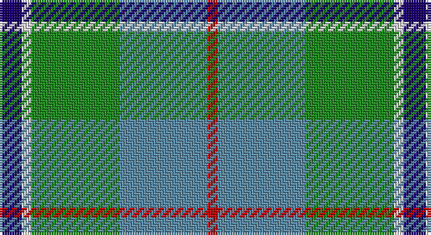

This page is one **sett** — a single exact thread-count. It belongs to the [tartan](/setts/db9w4g36t36r4/)
(the same proportion at any scale), whose colour order is pattern [BWGBR](/stripes/bwgbr/).

Sourced from register-of-tartans.  It is a [5 stripe tartan](/stripes/stripes5/).

Original link https://www.tartanregister.gov.uk/tartanDetails.aspx?ref=2081

## Provenance

Earliest known date: 1985 Designed for the Baron of Lee

## Also known as

This cloth is also recorded under:

- Alvis of Lee Personal
- Alvis, of Lee

3 attestations — the source records this cloth was collapsed from (oldest owns this page)

<ul>
<li>01/04/1985 — Alvis of Lee (Personal) (register-of-tartans, <a href="https://www.tartanregister.gov.uk/tartanDetails.aspx?ref=2081">record</a>)</li>
<li>undated — Alvis, of Lee (weddslist, <a href="http://www.weddslist.com/cgi-bin/tartans/pg.pl?source=sts">record</a>)</li>
<li>undated — Alvis of Lee Personal Tartan (house-of-tartan, <a href="http://www.house-of-tartan.scotland.net/house/TartanViewjs.asp?colr=Def&tnam=643">record</a>)</li>
</ul>

## Register references

External register numbers recorded for this tartan.

- Scottish Register of Tartans: [2081](https://www.tartanregister.gov.uk/tartanDetails.aspx?ref=2081)
- Scottish Tartans Authority (ITI): 643
- Scottish Tartans World Register: 643

## Thread count
DB/9 LN4 G36 B36 R/4

One full sett is **165 threads**.

## Palette

Palette: <strong>Tartan Register</strong> <small style="color:#888">(4 of 5 colours)</small>
<table><thead><tr><th>Colour</th><th>Threads</th><th>Shade</th><th>Base</th><th>OKLCh</th></tr></thead><tbody><tr><td>DB/</td><td style="text-align:right;font-variant-numeric:tabular-nums">9</td><td><code style="background-color:#1C0070;">#1C0070</code> <small style="color:#888">#1C0070</small></td><td>B <code style="background-color:#2A418A;">#2A418A</code></td><td><small style="color:#888">oklch(26.3% 0.162 277.1)</small></td></tr><tr><td>LN</td><td style="text-align:right;font-variant-numeric:tabular-nums">4</td><td><code style="background-color:#E0E0E0;">#E0E0E0</code> <small style="color:#888">#E0E0E0</small></td><td>W <code style="background-color:#F7F7F7;">#F7F7F7</code></td><td><small style="color:#888">oklch(90.7% 0.000 89.9)</small></td></tr><tr><td>G</td><td style="text-align:right;font-variant-numeric:tabular-nums">36</td><td><code style="background-color:#228B22;">#228B22</code> <small style="color:#888">#228B22</small></td><td>G <code style="background-color:#006100;">#006100</code></td><td><small style="color:#888">oklch(55.8% 0.169 142.9)</small></td></tr><tr><td>B</td><td style="text-align:right;font-variant-numeric:tabular-nums">36</td><td><code style="background-color:#5C8CA8;">#5C8CA8</code> <small style="color:#888">#5C8CA8</small></td><td>B <code style="background-color:#2A418A;">#2A418A</code></td><td><small style="color:#888">oklch(61.7% 0.067 235.0)</small></td></tr><tr><td>R/</td><td style="text-align:right;font-variant-numeric:tabular-nums">4</td><td><code style="background-color:#C80000;">#C80000</code> <small style="color:#888">#C80000</small></td><td>R <code style="background-color:#CC0000;">#CC0000</code></td><td><small style="color:#888">oklch(52.3% 0.215 29.2)</small></td></tr></tbody></table>

# Sample pattern

## Nearest tartans

The nearest existing variants by ΔTartan distance, with this tartan at the top so the swatches line up against it.

ΔTartan

Tartan

Sett

—

<a href="/ttd/edit/#slug=db9w4g36t36r4">Alvis of Lee (Personal)</a> <a class="nn-out" href="/variants/s5/db9w4g36t36r4/" title="open its dictionary page">↗</a>

0.75

<a href="/ttd/edit/#slug=db9w4g36t36r4~x2&amp;base=db9w4g36t36r4">Alvis of Lee (Personal)</a> <a class="nn-out" href="/variants/s5/db9w4g36t36r4~x2/" title="open its dictionary page">↗</a>

0.97

<a href="/ttd/edit/#slug=r7ly3g28db28w3~x2&amp;base=db9w4g36t36r4">Turnbull, hunting</a> <a class="nn-out" href="/variants/s5/r7ly3g28db28w3~x2/" title="open its dictionary page">↗</a>

1.17

<a href="/ttd/edit/#slug=g11lo10dp11b33w3~x2&amp;base=db9w4g36t36r4">Sterling, Rob (Florida) (Personal)</a> <a class="nn-out" href="/variants/s5/g11lo10dp11b33w3~x2/" title="open its dictionary page">↗</a>

1.18

<a href="/ttd/edit/#slug=b30ly3dy11ly3g33r6~x2&amp;base=db9w4g36t36r4">Balfour Hunting</a> <a class="nn-out" href="/variants/s6/b30ly3dy11ly3g33r6~x2/" title="open its dictionary page">↗</a>

1.24

<a href="/ttd/edit/#slug=k1t1g8db8w1~x4&amp;base=db9w4g36t36r4">Douglas</a> <a class="nn-out" href="/variants/s5/k1t1g8db8w1~x4/" title="open its dictionary page">↗</a>

1.25

<a href="/ttd/edit/#slug=k9lr6n22g28ly2~x2&amp;base=db9w4g36t36r4">Wellington (Lochcarron)</a> <a class="nn-out" href="/variants/s5/k9lr6n22g28ly2~x2/" title="open its dictionary page">↗</a>

1.28

<a href="/ttd/edit/#slug=g11lo10dt11b33w3~x2&amp;base=db9w4g36t36r4">Sterling (Name)</a> <a class="nn-out" href="/variants/s5/g11lo10dt11b33w3~x2/" title="open its dictionary page">↗</a>

1.36

<a href="/ttd/edit/#slug=lb2k2g8gi8r1gi1w1~x4&amp;base=db9w4g36t36r4">Lundy (Personal)</a> <a class="nn-out" href="/variants/s7/lb2k2g8gi8r1gi1w1~x4/" title="open its dictionary page">↗</a>

1.37

<a href="/ttd/edit/#slug=t4g16ly2db7t28w4~x2&amp;base=db9w4g36t36r4">Allanton (Fashion)</a> <a class="nn-out" href="/variants/s6/t4g16ly2db7t28w4~x2/" title="open its dictionary page">↗</a>

1.39

<a href="/ttd/edit/#slug=k3r1ly1t11g13t5r1ly1~x4&amp;base=db9w4g36t36r4">Snodgrass (Clan)</a> <a class="nn-out" href="/variants/s8/k3r1ly1t11g13t5r1ly1~x4/" title="open its dictionary page">↗</a>

## Neighbour map

Every grey dot is one of 14360 variants placed by the first two principal components of the ΔTartan feature space (44% of its variance). Red is this tartan; blue dots are its nearest — click one to open its page.

<svg viewBox="0 0 640 380" role="img" style="max-width:100%;height:auto;border:1px solid #e0e0e0;border-radius:4px;display:block" xmlns="http://www.w3.org/2000/svg"><image href="/nn/cloud.v1.png" width="640" height="380"/><a href="/variants/s5/db9w4g36t36r4~x2/"><circle cx="221.1" cy="221.0" r="4" fill="#3465a4"><title>Alvis of Lee (Personal)</title></circle></a><a href="/variants/s5/r7ly3g28db28w3~x2/"><circle cx="206.8" cy="209.7" r="4" fill="#3465a4"><title>Turnbull, hunting</title></circle></a><a href="/variants/s5/g11lo10dp11b33w3~x2/"><circle cx="229.1" cy="214.4" r="4" fill="#3465a4"><title>Sterling, Rob (Florida) (Personal)</title></circle></a><a href="/variants/s6/b30ly3dy11ly3g33r6~x2/"><circle cx="216.7" cy="209.7" r="4" fill="#3465a4"><title>Balfour Hunting</title></circle></a><a href="/variants/s5/k1t1g8db8w1~x4/"><circle cx="210.1" cy="212.6" r="4" fill="#3465a4"><title>Douglas</title></circle></a><a href="/variants/s5/k9lr6n22g28ly2~x2/"><circle cx="230.4" cy="221.8" r="4" fill="#3465a4"><title>Wellington (Lochcarron)</title></circle></a><a href="/variants/s5/g11lo10dt11b33w3~x2/"><circle cx="228.7" cy="219.6" r="4" fill="#3465a4"><title>Sterling (Name)</title></circle></a><a href="/variants/s7/lb2k2g8gi8r1gi1w1~x4/"><circle cx="157.6" cy="181.9" r="4" fill="#3465a4"><title>Lundy (Personal)</title></circle></a><a href="/variants/s6/t4g16ly2db7t28w4~x2/"><circle cx="281.0" cy="190.4" r="4" fill="#3465a4"><title>Allanton (Fashion)</title></circle></a><a href="/variants/s8/k3r1ly1t11g13t5r1ly1~x4/"><circle cx="225.9" cy="163.8" r="4" fill="#3465a4"><title>Snodgrass (Clan)</title></circle></a><circle cx="213.3" cy="216.7" r="5" fill="#c00000"/></svg>

ID: /variants/s5/db9w4g36t36r4/
