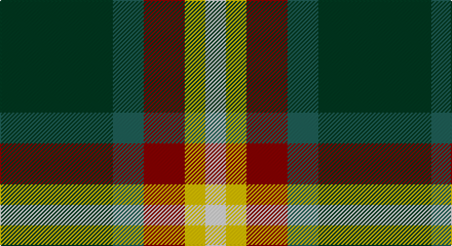

This page is one **sett** — a single exact thread-count. It belongs to the [tartan](/setts/dg11dgi3r4ly2w2/)
(the same proportion at any scale), whose colour order is pattern [GGRYW](/stripes/ggryw/).

Sourced from register-of-tartans.  It is a [5 stripe tartan](/stripes/stripes5/).

Original link https://www.tartanregister.gov.uk/tartanDetails.aspx?ref=3333

## Provenance

Earliest known date: 2005 Anthony Thomson designed this tartan to make a silk stole in 2005. He returned in 2007 to have a kilt made up in heavyweight wool.

## Also known as

This cloth is also recorded under:

- Phinn Personal

3 attestations — the source records this cloth was collapsed from (oldest owns this page)

<ul>
<li>01/01/2005 — Phinn (Personal) (register-of-tartans, <a href="https://www.tartanregister.gov.uk/tartanDetails.aspx?ref=3333">record</a>)</li>
<li>2005 — Phinn (Personal) (tartans-authority, <a href="http://www.tartansauthority.com/tartan-ferret/display/7104/">record</a>)</li>
<li>undated — Phinn Personal Tartan (house-of-tartan, <a href="http://www.house-of-tartan.scotland.net/house/TartanViewjs.asp?colr=Def&tnam=7104">record</a>)</li>
</ul>

## Register references

External register numbers recorded for this tartan.

- Scottish Register of Tartans: [3333](https://www.tartanregister.gov.uk/tartanDetails.aspx?ref=3333)
- Scottish Tartans Authority (ITI): 7104

## Thread count
DG/110 G30 DR40 Y20 LN/20

One full sett is **310 threads**.

## Palette

Palette: <strong>Tartan Register</strong> <small style="color:#888">(4 of 5 colours)</small>
<table><thead><tr><th>Colour</th><th>Threads</th><th>Shade</th><th>Base</th><th>OKLCh</th></tr></thead><tbody><tr><td>DG/</td><td style="text-align:right;font-variant-numeric:tabular-nums">110</td><td><code style="background-color:#003820;">#003820</code> <small style="color:#888">#003820</small></td><td>G <code style="background-color:#006100;">#006100</code></td><td><small style="color:#888">oklch(30.0% 0.070 158.3)</small></td></tr><tr><td>G</td><td style="text-align:right;font-variant-numeric:tabular-nums">30</td><td><code style="background-color:#206058;">#206058</code> <small style="color:#888">#206058</small></td><td>G <code style="background-color:#006100;">#006100</code></td><td><small style="color:#888">oklch(44.6% 0.066 183.7)</small></td></tr><tr><td>DR</td><td style="text-align:right;font-variant-numeric:tabular-nums">40</td><td><code style="background-color:#880000;">#880000</code> <small style="color:#888">#880000</small></td><td>R <code style="background-color:#CC0000;">#CC0000</code></td><td><small style="color:#888">oklch(39.4% 0.162 29.2)</small></td></tr><tr><td>Y</td><td style="text-align:right;font-variant-numeric:tabular-nums">20</td><td><code style="background-color:#E8C000;">#E8C000</code> <small style="color:#888">#E8C000</small></td><td>Y <code style="background-color:#F2BF00;">#F2BF00</code></td><td><small style="color:#888">oklch(81.9% 0.168 93.7)</small></td></tr><tr><td>LN/</td><td style="text-align:right;font-variant-numeric:tabular-nums">20</td><td><code style="background-color:#E0E0E0;">#E0E0E0</code> <small style="color:#888">#E0E0E0</small></td><td>W <code style="background-color:#F7F7F7;">#F7F7F7</code></td><td><small style="color:#888">oklch(90.7% 0.000 89.9)</small></td></tr></tbody></table>

# Sample pattern

## Nearest tartans

The nearest existing variants by ΔTartan distance, with this tartan at the top so the swatches line up against it.

ΔTartan

Tartan

Sett

—

<a href="/ttd/edit/#slug=dg11dgi3r4ly2w2~x10">Phinn (Personal)</a> <a class="nn-out" href="/variants/s5/dg11dgi3r4ly2w2~x10/" title="open its dictionary page">↗</a>

0.80

<a href="/ttd/edit/#slug=g15ly3r3dp8w2~x6&amp;base=dg11dgi3r4ly2w2~x10">ChuMac (Personal)</a> <a class="nn-out" href="/variants/s5/g15ly3r3dp8w2~x6/" title="open its dictionary page">↗</a>

1.12

<a href="/ttd/edit/#slug=k4t3p11g14ly2~x2&amp;base=dg11dgi3r4ly2w2~x10">Wellington, No 122</a> <a class="nn-out" href="/variants/s5/k4t3p11g14ly2~x2/" title="open its dictionary page">↗</a>

1.14

<a href="/ttd/edit/#slug=g6k1r1t2r2~x4&amp;base=dg11dgi3r4ly2w2~x10">Wilson's, No 193</a> <a class="nn-out" href="/variants/s5/g6k1r1t2r2~x4/" title="open its dictionary page">↗</a>

1.16

<a href="/ttd/edit/#slug=g7p3w1lg2g1k2p1~x8&amp;base=dg11dgi3r4ly2w2~x10">Lindley-Highfield Name Tartan</a> <a class="nn-out" href="/variants/s7/g7p3w1lg2g1k2p1~x8/" title="open its dictionary page">↗</a>

1.17

<a href="/ttd/edit/#slug=dg7dp3w1g2dg1r2dp1~x8&amp;base=dg11dgi3r4ly2w2~x10">Lindley-Highfield (Name)</a> <a class="nn-out" href="/variants/s7/dg7dp3w1g2dg1r2dp1~x8/" title="open its dictionary page">↗</a>

1.22

<a href="/ttd/edit/#slug=k2t1p6g6r1g1~x4&amp;base=dg11dgi3r4ly2w2~x10">Wilson's, No 183</a> <a class="nn-out" href="/variants/s6/k2t1p6g6r1g1~x4/" title="open its dictionary page">↗</a>

1.25

<a href="/ttd/edit/#slug=dg62g17ly12t8o8~x2&amp;base=dg11dgi3r4ly2w2~x10">Dundhuin Hunting (Personal)</a> <a class="nn-out" href="/variants/s5/dg62g17ly12t8o8~x2/" title="open its dictionary page">↗</a>

1.26

<a href="/ttd/edit/#slug=k4t3p11g14w2~x2&amp;base=dg11dgi3r4ly2w2~x10">Wellington, No 229</a> <a class="nn-out" href="/variants/s5/k4t3p11g14w2~x2/" title="open its dictionary page">↗</a>

1.30

<a href="/ttd/edit/#slug=g7p3w1lg2g1lp2p1~x8&amp;base=dg11dgi3r4ly2w2~x10">Lindley-Highfield of Ballumbie Castle</a> <a class="nn-out" href="/variants/s7/g7p3w1lg2g1lp2p1~x8/" title="open its dictionary page">↗</a>

1.30

<a href="/ttd/edit/#slug=k5db4g24r21w3~x2&amp;base=dg11dgi3r4ly2w2~x10">Sachie Hara Scottish Check (Personal)</a> <a class="nn-out" href="/variants/s5/k5db4g24r21w3~x2/" title="open its dictionary page">↗</a>

## Neighbour map

Every grey dot is one of 14360 variants placed by the first two principal components of the ΔTartan feature space (44% of its variance). Red is this tartan; blue dots are its nearest — click one to open its page.

<svg viewBox="0 0 640 380" role="img" style="max-width:100%;height:auto;border:1px solid #e0e0e0;border-radius:4px;display:block" xmlns="http://www.w3.org/2000/svg"><image href="/nn/cloud.v1.png" width="640" height="380"/><a href="/variants/s5/g15ly3r3dp8w2~x6/"><circle cx="205.2" cy="211.4" r="4" fill="#3465a4"><title>ChuMac (Personal)</title></circle></a><a href="/variants/s5/k4t3p11g14ly2~x2/"><circle cx="147.4" cy="214.7" r="4" fill="#3465a4"><title>Wellington, No 122</title></circle></a><a href="/variants/s5/g6k1r1t2r2~x4/"><circle cx="224.5" cy="237.6" r="4" fill="#3465a4"><title>Wilson's, No 193</title></circle></a><a href="/variants/s7/g7p3w1lg2g1k2p1~x8/"><circle cx="162.6" cy="190.2" r="4" fill="#3465a4"><title>Lindley-Highfield Name Tartan</title></circle></a><a href="/variants/s7/dg7dp3w1g2dg1r2dp1~x8/"><circle cx="185.0" cy="195.1" r="4" fill="#3465a4"><title>Lindley-Highfield (Name)</title></circle></a><a href="/variants/s6/k2t1p6g6r1g1~x4/"><circle cx="161.0" cy="206.6" r="4" fill="#3465a4"><title>Wilson's, No 183</title></circle></a><a href="/variants/s5/dg62g17ly12t8o8~x2/"><circle cx="268.7" cy="200.5" r="4" fill="#3465a4"><title>Dundhuin Hunting (Personal)</title></circle></a><a href="/variants/s5/k4t3p11g14w2~x2/"><circle cx="145.5" cy="214.0" r="4" fill="#3465a4"><title>Wellington, No 229</title></circle></a><a href="/variants/s7/g7p3w1lg2g1lp2p1~x8/"><circle cx="169.8" cy="188.1" r="4" fill="#3465a4"><title>Lindley-Highfield of Ballumbie Castle</title></circle></a><a href="/variants/s5/k5db4g24r21w3~x2/"><circle cx="193.5" cy="202.6" r="4" fill="#3465a4"><title>Sachie Hara Scottish Check (Personal)</title></circle></a><circle cx="191.0" cy="224.9" r="5" fill="#c00000"/></svg>

ID: /variants/s5/dg11dgi3r4ly2w2~x10/
