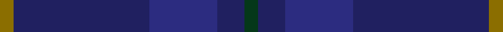
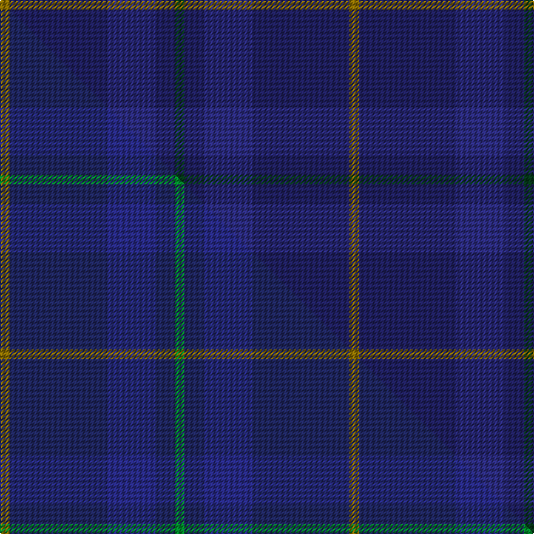

This is one **variant** — a specific cloth: this exact thread count and colourway, with its own
provenance below. It is one weaving of the [sett](/setts/dg1db2dbi5db10y1/) (the scale-free proportion — the
same cloth at any scale or shade), whose colour order is pattern [GBBBG](/stripes/gbbbg/).

Part of the [Open Championship](/tartans/open-championship-2/) tartan — the named design grouping this sett with its other cloths.

Sourced from tartans-authority.  It is a [5 stripe tartan](/stripes/stripes5/).

Original link [https://www.tartanregister.gov.uk/tartanDetails.aspx?ref=6513](https://www.tartanregister.gov.uk/tartanDetails.aspx?ref=6513)

Dataset <small>— provenance for this record, inherited from the source manifest</small>

<dl class="dataset-prov">
<dt>source</dt><dd><a href="/sources/tartans-authority/">Scottish Tartans Authority</a></dd>
<dt>data captured from</dt><dd><a href="https://github.com/thetartan/tartan-database/blob/master/data/tartans-authority/data.csv">https://github.com/thetartan/tartan-database/blob/master/data/tartans-authority/data.csv</a></dd>
<dt>data date</dt><dd>2000 circa <small>(this record)</small></dd>
<dt>licence</dt><dd><a href="https://creativecommons.org/licenses/by-nc-nd/4.0/">CC BY-NC-ND 4.0</a></dd>
</dl>

Capture chain <small>— the hands this data passed through, oldest first; each capture carries its own licence</small>

<ol class="capture-chain">
<li><a href="https://www.tartansauthority.com/">Scottish Tartans Authority</a> <small>the heritage body's archive — its tartan-ferret record browser is retired (links repaired to the SRT, above)</small></li>
<li><a href="https://github.com/thetartan/tartan-database">thetartan/tartan-database</a> <small>2016-2017</small> · <a href="https://creativecommons.org/licenses/by-nc-nd/4.0/">CC BY-NC-ND 4.0</a> <small>Levko Kravets's frozen compilation — the capture we vendored, and where its CC licence text came from</small></li>
<li>this dictionary <small>captured 2026-06-10 · commit 5bf86c7566</small> <small>each re-capture is a git commit to data/sources</small></li>
</ol>

## Register references

External register numbers recorded for this tartan.

- Scottish Tartans Authority (ITI): 6513

## Thread count
Y/8 DB80 DBi40 DB16 DG/8

One full sett is **288 threads**.

## Palette
<table><thead><tr><th>Colour</th><th>Shade</th><th>OKLCh</th></tr></thead><tbody><tr><td>DB</td><td><code style="background-color:#2C2C80;">#2C2C80</code> <small style="color:#888">#2C2C80</small></td><td><small style="color:#888">oklch(35.0% 0.138 276.6)</small></td></tr><tr><td>DB</td><td><code style="background-color:#202060;">#202060</code> <small style="color:#888">#202060</small></td><td><small style="color:#888">oklch(28.9% 0.111 276.9)</small></td></tr><tr><td>DG</td><td><code style="background-color:#053819;">#053819</code> <small style="color:#888">#053819</small></td><td><small style="color:#888">oklch(30.0% 0.075 151.3)</small></td></tr><tr><td>Y</td><td><code style="background-color:#8B6E00;">#8B6E00</code> <small style="color:#888">#8B6E00</small></td><td><small style="color:#888">oklch(55.1% 0.113 90.4)</small></td></tr></tbody></table>

# Sample pattern

## Compared to the master

This cloth is one sett of its design; the master sett (the exemplar the design is anchored on) is below for comparison.

Its **ΔTartan distance** from the master is **0.06** — the same measure the nearest-tartans table ranks by (0 is identical; a re-scale of the same cloth is near 0, a recolour or a different proportion further).

<figure class="master-compare" style="margin:0">

this sett
master sett ★

<figcaption style="color:#888;font-size:smaller">One weave of this sett against the <a href="/setts/y1db10dbi5db2g1/">master sett ★</a>, split on the diagonal: a shared proportion runs seamlessly across it with only the shades shifting; a different proportion breaks on it.</figcaption>
</figure>

## Nearest tartan variants

The nearest existing variants by ΔTartan distance, with this cloth at the top so the swatches line up against it.

ΔTartan

Threads

Variant

Sett

—

288

<a href="/variants/s5/dg1db2dbi5db10y1~x8~db1204274-dbi1406275/">Open Championship (2000) (Corporate)</a>

<a href="/ttd/edit/#slug=y1dt10db5dt2g1~x8~dt1204274-db1406275&amp;base=dg1db2dbi5db10y1~x8~db1204274-dbi1406275" title="compare in the TTD">0.03</a>

288

<a href="/variants/s5/y1db10dbi5db2g1~x8~db1204274-dbi1406275/">Open Championship (2000)</a>

<a href="/ttd/edit/#slug=y1db11dbi5db2g1~x4~db1003265-dbi1605267&amp;base=dg1db2dbi5db10y1~x8~db1204274-dbi1406275" title="compare in the TTD">0.21</a>

152

<a href="/variants/s5/y1db11dbi5db2g1~x4~db1003265-dbi1605267/">Open Championship, The</a>

<a href="/ttd/edit/#slug=dbi88db35w3db10~dbi1406275-db1404245&amp;base=dg1db2dbi5db10y1~x8~db1204274-dbi1406275" title="compare in the TTD">1.59</a>

174

<a href="/variants/s4/dbi88db35w3db10~dbi1406275-db1404245/">Scottish Tourist Board (1990)</a>

<a href="/ttd/edit/#slug=db88dt35w3dt10~db1406275-dt1204274&amp;base=dg1db2dbi5db10y1~x8~db1204274-dbi1406275" title="compare in the TTD">1.59</a>

174

<a href="/variants/s4/dbi88db35w3db10~dbi1406275-db1204274/">Scottish Tourist Board (1990) Corporate Tartan</a>

<a href="/ttd/edit/#slug=db28dt49y3dt49db28w4~x2~db1406275-dt1204274&amp;base=dg1db2dbi5db10y1~x8~db1204274-dbi1406275" title="compare in the TTD">2.39</a>

580

<a href="/variants/s6/dbi28db49y3db49dbi28w4~x2~dbi1406275-db1204274/">MacKerrell of Hillhouse Htg Family Tartan</a>

<a href="/ttd/edit/#slug=dp3dt15db15r2db15y3~x2&amp;base=dg1db2dbi5db10y1~x8~db1204274-dbi1406275" title="compare in the TTD">2.43</a>

200

<a href="/variants/s6/dp3dt15db15r2db15y3~x2/">H.M.S. DUNCAN</a>

<a href="/ttd/edit/#slug=r2db35dt35ly1~x2~db1406275-dt1204274&amp;base=dg1db2dbi5db10y1~x8~db1204274-dbi1406275" title="compare in the TTD">2.52</a>

286

<a href="/variants/s4/r2dbi35db35ly1~x2~dbi1406275-db1204274/">Mackaw (Corporate)</a>

<a href="/ttd/edit/#slug=dy11dt1dy3db1dt9r1~x4~dt1204274-db1406275&amp;base=dg1db2dbi5db10y1~x8~db1204274-dbi1406275" title="compare in the TTD">2.60</a>

160

<a href="/variants/s6/dy11db1dy3dbi1db9r1~x4~db1204274-dbi1406275/">Dege of Saville Row Corporate Tartan</a>

<a href="/ttd/edit/#slug=db44dy12db9dr3~x2&amp;base=dg1db2dbi5db10y1~x8~db1204274-dbi1406275" title="compare in the TTD">2.62</a>

178

<a href="/variants/s4/db44dy12db9dr3~x2/">Elliot (Clan)</a>

<a href="/ttd/edit/#slug=db4b1dg14db14dr1~x4~db0906265-b1611266&amp;base=dg1db2dbi5db10y1~x8~db1204274-dbi1406275" title="compare in the TTD">2.67</a>

252

<a href="/variants/s5/db4b1dg14db14dr1~x4~db0906265-b1611266/">Wcwm 1255-1</a>

## Neighbour map

Every grey dot is one of 13621 variants placed by the first two principal components of the ΔTartan feature space (42% of its variance). Red is this tartan; blue dots are its nearest — click one to open its page.

<svg viewBox="0 0 640 380" role="img" style="max-width:100%;height:auto;border:1px solid #e0e0e0;border-radius:4px;display:block" xmlns="http://www.w3.org/2000/svg"><image href="/nn/cloud.v1.png" width="640" height="380"/><a href="/variants/s5/y1db10dbi5db2g1~x8~db1204274-dbi1406275/"><circle cx="547.5" cy="287.0" r="4" fill="#3465a4"><title>Open Championship (2000)</title></circle></a><a href="/variants/s5/y1db11dbi5db2g1~x4~db1003265-dbi1605267/"><circle cx="516.4" cy="260.9" r="4" fill="#3465a4"><title>Open Championship, The</title></circle></a><a href="/variants/s4/dbi88db35w3db10~dbi1406275-db1404245/"><circle cx="626.0" cy="306.7" r="4" fill="#3465a4"><title>Scottish Tourist Board (1990)</title></circle></a><a href="/variants/s4/dbi88db35w3db10~dbi1406275-db1204274/"><circle cx="626.0" cy="308.7" r="4" fill="#3465a4"><title>Scottish Tourist Board (1990) Corporate Tartan</title></circle></a><a href="/variants/s6/dbi28db49y3db49dbi28w4~x2~dbi1406275-db1204274/"><circle cx="566.0" cy="293.3" r="4" fill="#3465a4"><title>MacKerrell of Hillhouse Htg Family Tartan</title></circle></a><a href="/variants/s6/dp3dt15db15r2db15y3~x2/"><circle cx="397.2" cy="268.3" r="4" fill="#3465a4"><title>H.M.S. DUNCAN</title></circle></a><a href="/variants/s4/r2dbi35db35ly1~x2~dbi1406275-db1204274/"><circle cx="611.4" cy="273.8" r="4" fill="#3465a4"><title>Mackaw (Corporate)</title></circle></a><a href="/variants/s6/dy11db1dy3dbi1db9r1~x4~db1204274-dbi1406275/"><circle cx="490.3" cy="257.6" r="4" fill="#3465a4"><title>Dege of Saville Row Corporate Tartan</title></circle></a><a href="/variants/s4/db44dy12db9dr3~x2/"><circle cx="626.0" cy="293.0" r="4" fill="#3465a4"><title>Elliot (Clan)</title></circle></a><a href="/variants/s5/db4b1dg14db14dr1~x4~db0906265-b1611266/"><circle cx="476.9" cy="266.0" r="4" fill="#3465a4"><title>Wcwm 1255-1</title></circle></a><circle cx="617.9" cy="312.3" r="5" fill="#c00000"/><text x="320" y="376" text-anchor="middle" font-size="11" fill="#999">ground</text><text x="11" y="190" text-anchor="middle" font-size="11" fill="#999" transform="rotate(-90 11 190)">complexity</text></svg>

ID: /variants/s5/dg1db2dbi5db10y1~x8~db1204274-dbi1406275/
