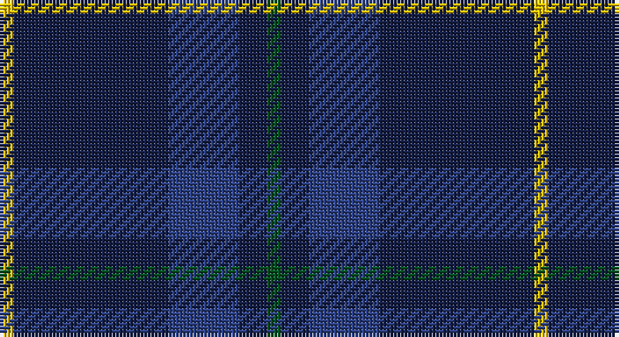

This page is one **sett** — a single exact thread-count. It belongs to the [tartan](/setts/dg1db2dbi5db11ly1/)
(the same proportion at any scale), whose colour order is pattern [GBBBY](/stripes/gbbby/).

Sourced from register-of-tartans.  It is a [5 stripe tartan](/stripes/stripes5/).

Original link https://www.tartanregister.gov.uk/tartanDetails.aspx?ref=3258

## Register references

External register numbers recorded for this tartan.

- Scottish Register of Tartans: [3258](https://www.tartanregister.gov.uk/tartanDetails.aspx?ref=3258)
- Scottish Tartans World Register: 2803

## Thread count
Y/4 DB44 B20 DB8 G/4

One full sett is **152 threads**.

## Palette

Palette: <strong>Tartan Register</strong>
<table><thead><tr><th>Colour</th><th>Threads</th><th>Shade</th><th>Base</th><th>OKLCh</th></tr></thead><tbody><tr><td>Y/</td><td style="text-align:right;font-variant-numeric:tabular-nums">4</td><td><code style="background-color:#E8C000;">#E8C000</code> <small style="color:#888">#E8C000</small></td><td>Y <code style="background-color:#F2BF00;">#F2BF00</code></td><td><small style="color:#888">oklch(81.9% 0.168 93.7)</small></td></tr><tr><td>DB</td><td style="text-align:right;font-variant-numeric:tabular-nums">44</td><td><code style="background-color:#141E46;">#141E46</code> <small style="color:#888">#141E46</small></td><td>B <code style="background-color:#2A418A;">#2A418A</code></td><td><small style="color:#888">oklch(25.2% 0.076 269.7)</small></td></tr><tr><td>B</td><td style="text-align:right;font-variant-numeric:tabular-nums">20</td><td><code style="background-color:#2C4084;">#2C4084</code> <small style="color:#888">#2C4084</small></td><td>B <code style="background-color:#2A418A;">#2A418A</code></td><td><small style="color:#888">oklch(39.4% 0.117 268.3)</small></td></tr><tr><td>DB</td><td style="text-align:right;font-variant-numeric:tabular-nums">8</td><td><code style="background-color:#141E46;">#141E46</code> <small style="color:#888">#141E46</small></td><td>B <code style="background-color:#2A418A;">#2A418A</code></td><td><small style="color:#888">oklch(25.2% 0.076 269.7)</small></td></tr><tr><td>G/</td><td style="text-align:right;font-variant-numeric:tabular-nums">4</td><td><code style="background-color:#005020;">#005020</code> <small style="color:#888">#005020</small></td><td>G <code style="background-color:#006100;">#006100</code></td><td><small style="color:#888">oklch(37.7% 0.105 149.6)</small></td></tr></tbody></table>

# Sample pattern

## Nearest tartans

The nearest existing variants by ΔTartan distance, with this tartan at the top so the swatches line up against it.

ΔTartan

Tartan

Sett

—

<a href="/ttd/edit/#slug=dg1db2dbi5db11ly1~x4">Open Championship, The</a> <a class="nn-out" href="/variants/s5/dg1db2dbi5db11ly1~x4/" title="open its dictionary page">↗</a>

1.16

<a href="/ttd/edit/#slug=db31k8dp4w2~x4&amp;base=dg1db2dbi5db11ly1~x4">Osborne, Luke Alexander (Personal)</a> <a class="nn-out" href="/variants/s4/db31k8dp4w2~x4/" title="open its dictionary page">↗</a>

1.25

<a href="/ttd/edit/#slug=dg1db2dbi5db10ly1~x8&amp;base=dg1db2dbi5db11ly1~x4">Open Championship (2000)</a> <a class="nn-out" href="/variants/s5/dg1db2dbi5db10ly1~x8/" title="open its dictionary page">↗</a>

1.38

<a href="/ttd/edit/#slug=db9k4lb1k4db9r1~x4&amp;base=dg1db2dbi5db11ly1~x4">Scottish Nuclear</a> <a class="nn-out" href="/variants/s6/db9k4lb1k4db9r1~x4/" title="open its dictionary page">↗</a>

1.40

<a href="/ttd/edit/#slug=db24n13db4n4w2~x2&amp;base=dg1db2dbi5db11ly1~x4">Gallaecia - Galicia National</a> <a class="nn-out" href="/variants/s5/db24n13db4n4w2~x2/" title="open its dictionary page">↗</a>

1.42

<a href="/ttd/edit/#slug=db20dp2db3dp2db14g18db4~x2&amp;base=dg1db2dbi5db11ly1~x4">Pringle, James (Fashion)</a> <a class="nn-out" href="/variants/s7/db20dp2db3dp2db14g18db4~x2/" title="open its dictionary page">↗</a>

1.42

<a href="/ttd/edit/#slug=db1k3db1k3db8r1~x4&amp;base=dg1db2dbi5db11ly1~x4">Morgan (MacKay Blue) Clan Tartan</a> <a class="nn-out" href="/variants/s6/db1k3db1k3db8r1~x4/" title="open its dictionary page">↗</a>

1.44

<a href="/ttd/edit/#slug=db50do4db12do23ly4do4~x2&amp;base=dg1db2dbi5db11ly1~x4">Sligo, County</a> <a class="nn-out" href="/variants/s6/db50do4db12do23ly4do4~x2/" title="open its dictionary page">↗</a>

1.45

<a href="/ttd/edit/#slug=t5db30k25t5db30dp3t5~x2&amp;base=dg1db2dbi5db11ly1~x4">Van Loo Tartan</a> <a class="nn-out" href="/variants/s7/t5db30k25t5db30dp3t5~x2/" title="open its dictionary page">↗</a>

1.45

<a href="/ttd/edit/#slug=t5db30k25t5db30dp2t5~x2&amp;base=dg1db2dbi5db11ly1~x4">Van Loo (Personal)</a> <a class="nn-out" href="/variants/s7/t5db30k25t5db30dp2t5~x2/" title="open its dictionary page">↗</a>

1.47

<a href="/ttd/edit/#slug=dbi9g16db59ly4~x2&amp;base=dg1db2dbi5db11ly1~x4">Oxford University (Corporate)</a> <a class="nn-out" href="/variants/s4/dbi9g16db59ly4~x2/" title="open its dictionary page">↗</a>

## Neighbour map

Every grey dot is one of 14360 variants placed by the first two principal components of the ΔTartan feature space (44% of its variance). Red is this tartan; blue dots are its nearest — click one to open its page.

<svg viewBox="0 0 640 380" role="img" style="max-width:100%;height:auto;border:1px solid #e0e0e0;border-radius:4px;display:block" xmlns="http://www.w3.org/2000/svg"><image href="/nn/cloud.v1.png" width="640" height="380"/><a href="/variants/s4/db31k8dp4w2~x4/"><circle cx="473.5" cy="245.9" r="4" fill="#3465a4"><title>Osborne, Luke Alexander (Personal)</title></circle></a><a href="/variants/s5/dg1db2dbi5db10ly1~x8/"><circle cx="422.5" cy="265.8" r="4" fill="#3465a4"><title>Open Championship (2000)</title></circle></a><a href="/variants/s6/db9k4lb1k4db9r1~x4/"><circle cx="382.0" cy="258.2" r="4" fill="#3465a4"><title>Scottish Nuclear</title></circle></a><a href="/variants/s5/db24n13db4n4w2~x2/"><circle cx="397.1" cy="254.9" r="4" fill="#3465a4"><title>Gallaecia - Galicia National</title></circle></a><a href="/variants/s7/db20dp2db3dp2db14g18db4~x2/"><circle cx="434.7" cy="264.7" r="4" fill="#3465a4"><title>Pringle, James (Fashion)</title></circle></a><a href="/variants/s6/db1k3db1k3db8r1~x4/"><circle cx="404.2" cy="272.9" r="4" fill="#3465a4"><title>Morgan (MacKay Blue) Clan Tartan</title></circle></a><a href="/variants/s6/db50do4db12do23ly4do4~x2/"><circle cx="472.0" cy="248.4" r="4" fill="#3465a4"><title>Sligo, County</title></circle></a><a href="/variants/s7/t5db30k25t5db30dp3t5~x2/"><circle cx="349.0" cy="241.2" r="4" fill="#3465a4"><title>Van Loo Tartan</title></circle></a><a href="/variants/s7/t5db30k25t5db30dp2t5~x2/"><circle cx="369.8" cy="225.8" r="4" fill="#3465a4"><title>Van Loo (Personal)</title></circle></a><a href="/variants/s4/dbi9g16db59ly4~x2/"><circle cx="422.5" cy="231.1" r="4" fill="#3465a4"><title>Oxford University (Corporate)</title></circle></a><circle cx="424.2" cy="249.5" r="5" fill="#c00000"/></svg>

ID: /variants/s5/dg1db2dbi5db11ly1~x4/
