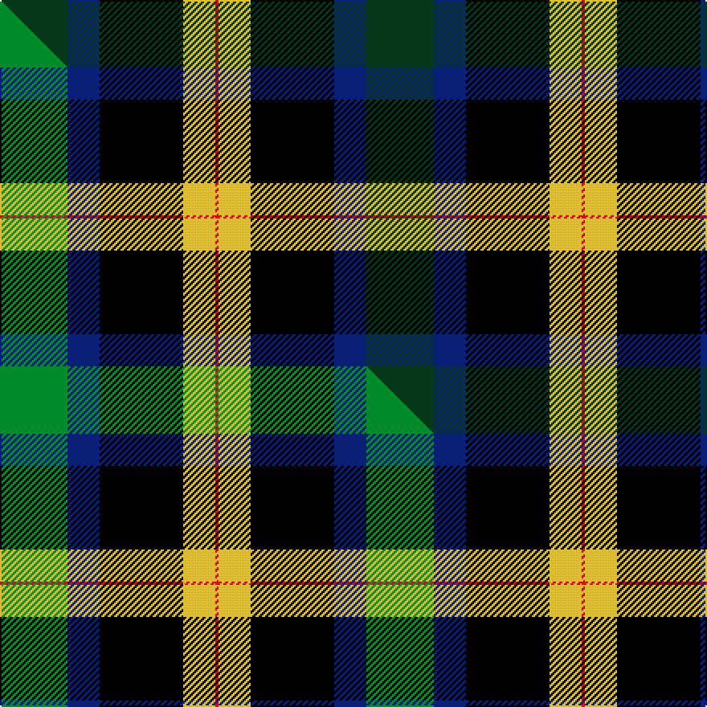

This page is one **sett** — a single exact thread-count. It belongs to the [tartan](/setts/dg21db10k26ly10r1/)
(the same proportion at any scale), whose colour order is pattern [GBKYR](/stripes/gbkyr/).

Part of the [Charles-Carberry](/tartans/charles-carberry/) tartan — the named design grouping this sett with its other cloths.

Sourced from tartans-authority.  It is a [5 stripe tartan](/stripes/stripes5/).

Original link https://www.tartanregister.gov.uk/tartanDetails.aspx?ref=10960

Dataset <small>— provenance for this record, inherited from the source manifest</small>

<dl class="dataset-prov">
<dt>source</dt><dd><a href="/sources/tartans-authority/">Scottish Tartans Authority</a></dd>
<dt>data captured from</dt><dd><a href="https://github.com/thetartan/tartan-database/blob/master/data/tartans-authority/data.csv">https://github.com/thetartan/tartan-database/blob/master/data/tartans-authority/data.csv</a></dd>
<dt>data date</dt><dd>2013 <small>(this record)</small></dd>
<dt>licence</dt><dd><a href="https://creativecommons.org/licenses/by-nc-nd/4.0/">CC BY-NC-ND 4.0</a></dd>
</dl>

Capture chain <small>— the hands this data passed through, oldest first; each capture carries its own licence</small>

<ol class="capture-chain">
<li><a href="https://www.tartansauthority.com/">Scottish Tartans Authority</a> <small>the heritage body's archive — its tartan-ferret record browser is retired (links repaired to the SRT, above)</small></li>
<li><a href="https://github.com/thetartan/tartan-database">thetartan/tartan-database</a> <small>2016-2017</small> · <a href="https://creativecommons.org/licenses/by-nc-nd/4.0/">CC BY-NC-ND 4.0</a> <small>Levko Kravets's frozen compilation — the capture we vendored, and where its CC licence text came from</small></li>
<li>this dictionary <small>captured 2026-06-10 · commit 5bf86c7566</small> <small>each re-capture is a git commit to data/sources</small></li>
</ol>

## Register references

External register numbers recorded for this tartan.

- Scottish Register of Tartans: [10960](https://www.tartanregister.gov.uk/tartanDetails?ref=10960)
- Scottish Tartans Authority (ITI): 10960

## Thread count
DG/42 DB20 K52 LY20 R/2

One full sett is **228 threads**.

## Palette
<table><thead><tr><th>Colour</th><th>Shade</th><th>OKLCh</th></tr></thead><tbody><tr><td>DB</td><td><code style="background-color:#082077;">#082077</code> <small style="color:#888">#082077</small></td><td><small style="color:#888">oklch(30.0% 0.149 265.1)</small></td></tr><tr><td>DG</td><td><code style="background-color:#053819;">#053819</code> <small style="color:#888">#053819</small></td><td><small style="color:#888">oklch(30.0% 0.075 151.3)</small></td></tr><tr><td>K</td><td><code style="background-color:#000000;">#000000</code> <small style="color:#888">#000000</small></td><td><small style="color:#888">oklch(0.0% 0.000 0.0)</small></td></tr><tr><td>LY</td><td><code style="background-color:#DCBC32;">#DCBC32</code> <small style="color:#888">#DCBC32</small></td><td><small style="color:#888">oklch(80.0% 0.150 95.2)</small></td></tr><tr><td>R</td><td><code style="background-color:#D60020;">#D60020</code> <small style="color:#888">#D60020</small></td><td><small style="color:#888">oklch(55.2% 0.224 25.5)</small></td></tr></tbody></table>

# Sample pattern

## Compared to the master

This cloth is one sett of its design; the master sett (the exemplar the design is anchored on) is below for comparison.

Its **ΔTartan distance** from the master is **0.14** — the same measure the nearest-tartans table ranks by (0 is identical; a re-scale of the same cloth is near 0, a recolour or a different proportion further).

<figure class="master-compare" style="margin:0">

this sett
master sett ★

<figcaption style="color:#888;font-size:smaller">One weave of this sett against the <a href="/setts/g21db10k26ly10r1/">master sett ★</a>, split on the diagonal: a shared proportion runs seamlessly across it with only the shades shifting; a different proportion breaks on it.</figcaption>
</figure>

## Nearest tartan variants

The nearest existing variants by ΔTartan distance, with this cloth at the top so the swatches line up against it.

ΔTartan

Threads

Variant

Sett

—

228

<a href="/variants/s5/dg21db10k26ly10r1~x2/">Charles-Carberry (Personal)</a>

<a href="/ttd/edit/#slug=g21db10k26ly10r1~x2&amp;base=dg21db10k26ly10r1~x2" title="compare in the TTD">0.14</a>

228

<a href="/variants/s5/g21db10k26ly10r1~x2/">Charles-Carberry (Personal)</a>

<a href="/ttd/edit/#slug=db31g2k20y2dg24~x2~g2408144-dg1806142&amp;base=dg21db10k26ly10r1~x2" title="compare in the TTD">1.41</a>

206

<a href="/variants/s5/db31g2k20y2dg24~x2~g2408144-dg1806142/">Landels (Personal)</a>

<a href="/ttd/edit/#slug=db20k20g20r1~x2&amp;base=dg21db10k26ly10r1~x2" title="compare in the TTD">1.47</a>

202

<a href="/variants/s4/db20k20g20r1~x2/">Gunn 2011, Robert (Personal)</a>

<a href="/ttd/edit/#slug=t20k20g20r1~x2&amp;base=dg21db10k26ly10r1~x2" title="compare in the TTD">1.47</a>

202

<a href="/variants/s4/t20k20g20r1~x2/">Gunn (2011) Personal Tartan</a>

<a href="/ttd/edit/#slug=db19k8lb1g10o3~x2&amp;base=dg21db10k26ly10r1~x2" title="compare in the TTD">1.74</a>

120

<a href="/variants/s5/db19k8lb1g10o3~x2/">Unidentified #50</a>

<a href="/ttd/edit/#slug=dg37k22w4r15y3~x2&amp;base=dg21db10k26ly10r1~x2" title="compare in the TTD">1.81</a>

244

<a href="/variants/s5/dg37k22w4r15y3~x2/">Oakley (2015)</a>

<a href="/ttd/edit/#slug=r1g14k14r2db14lb1~x2&amp;base=dg21db10k26ly10r1~x2" title="compare in the TTD">2.02</a>

180

<a href="/variants/s6/r1g14k14r2db14lb1~x2/">Wilson's No.221</a>

<a href="/ttd/edit/#slug=k11dp4lb1g9~x4&amp;base=dg21db10k26ly10r1~x2" title="compare in the TTD">2.16</a>

120

<a href="/variants/s4/k11dp4lb1g9~x4/">Wilson's, No 228</a>

<a href="/ttd/edit/#slug=y4k1dg16k16r1w3~x2&amp;base=dg21db10k26ly10r1~x2" title="compare in the TTD">2.22</a>

150

<a href="/variants/s6/y4k1dg16k16r1w3~x2/">MacLamroc</a>

<a href="/ttd/edit/#slug=b8k11w3k11dg22dr2~x2&amp;base=dg21db10k26ly10r1~x2" title="compare in the TTD">2.30</a>

208

<a href="/variants/s6/b8k11w3k11dg22dr2~x2/">Loch Katrine</a>

## Neighbour map

Every grey dot is one of 13620 variants placed by the first two principal components of the ΔTartan feature space (42% of its variance). Red is this tartan; blue dots are its nearest — click one to open its page.

<svg viewBox="0 0 640 380" role="img" style="max-width:100%;height:auto;border:1px solid #e0e0e0;border-radius:4px;display:block" xmlns="http://www.w3.org/2000/svg"><image href="/nn/cloud.v1.png" width="640" height="380"/><a href="/variants/s5/g21db10k26ly10r1~x2/"><circle cx="149.8" cy="170.8" r="4" fill="#3465a4"><title>Charles-Carberry (Personal)</title></circle></a><a href="/variants/s5/db31g2k20y2dg24~x2~g2408144-dg1806142/"><circle cx="193.3" cy="191.6" r="4" fill="#3465a4"><title>Landels (Personal)</title></circle></a><a href="/variants/s4/db20k20g20r1~x2/"><circle cx="165.5" cy="220.3" r="4" fill="#3465a4"><title>Gunn 2011, Robert (Personal)</title></circle></a><a href="/variants/s4/t20k20g20r1~x2/"><circle cx="156.0" cy="221.0" r="4" fill="#3465a4"><title>Gunn (2011) Personal Tartan</title></circle></a><a href="/variants/s5/db19k8lb1g10o3~x2/"><circle cx="211.9" cy="176.5" r="4" fill="#3465a4"><title>Unidentified #50</title></circle></a><a href="/variants/s5/dg37k22w4r15y3~x2/"><circle cx="188.1" cy="181.8" r="4" fill="#3465a4"><title>Oakley (2015)</title></circle></a><a href="/variants/s6/r1g14k14r2db14lb1~x2/"><circle cx="125.4" cy="171.2" r="4" fill="#3465a4"><title>Wilson's No.221</title></circle></a><a href="/variants/s4/k11dp4lb1g9~x4/"><circle cx="190.3" cy="224.7" r="4" fill="#3465a4"><title>Wilson's, No 228</title></circle></a><a href="/variants/s6/y4k1dg16k16r1w3~x2/"><circle cx="189.7" cy="150.6" r="4" fill="#3465a4"><title>MacLamroc</title></circle></a><a href="/variants/s6/b8k11w3k11dg22dr2~x2/"><circle cx="153.7" cy="192.5" r="4" fill="#3465a4"><title>Loch Katrine</title></circle></a><circle cx="164.4" cy="172.2" r="5" fill="#c00000"/><text x="320" y="376" text-anchor="middle" font-size="11" fill="#999">ground</text><text x="11" y="190" text-anchor="middle" font-size="11" fill="#999" transform="rotate(-90 11 190)">complexity</text></svg>

ID: /variants/s5/dg21db10k26ly10r1~x2/
