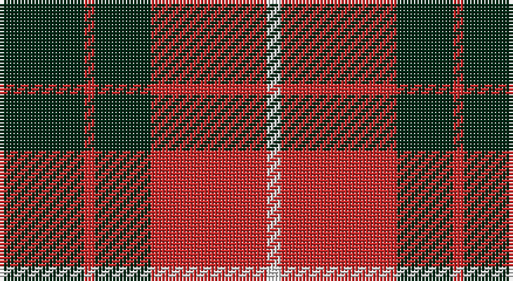

This page is one **sett** — a single exact thread-count. It belongs to the [tartan](/setts/dg24r3dg16r33w4/)
(the same proportion at any scale), whose colour order is pattern [GRGRW](/stripes/grgrw/).

Part of the [Unidentified](/tartans/unidentified/) tartan — the named design grouping this sett with its other cloths.

Sourced from register-of-tartans.  It is a [5 stripe tartan](/stripes/stripes5/).

Original link https://www.tartanregister.gov.uk/tartanDetails.aspx?ref=4350

## Also known as

This cloth is also recorded under:

- Unidentified #10
- Unidentified #12
- Unidentified #14
- Unidentified #15
- Unidentified #16
- Unidentified #18
- Unidentified #2
- Unidentified #21
- Unidentified #22
- Unidentified #24
- Unidentified #25
- Unidentified #28
- Unidentified #29
- Unidentified #30
- Unidentified #31
- Unidentified #32
- Unidentified #36
- Unidentified #37
- Unidentified #38
- Unidentified #40
- Unidentified #43
- Unidentified #44
- Unidentified #45
- Unidentified #46
- Unidentified #47
- Unidentified #48
- Unidentified #49
- Unidentified #5
- Unidentified #50
- Unidentified #51
- Unidentified #52
- Unidentified #53
- Unidentified #54
- Unidentified #55
- Unidentified #56
- Unidentified #57
- Unidentified #58
- Unidentified #59
- Unidentified #60
- Unidentified #61
- Unidentified #62
- Unidentified #63
- Unidentified #64
- Unidentified #65
- Unidentified #66
- Unidentified #7
- Unidentified #8
- Unidentified #9
- Unidentified 16
- Unidentified Artifact
- Unidentified Plaid
- Unidentified Plaid #11
- Unidentified Plaid #13
- Unidentified Plaid #2
- Unidentified Plaid #3
- Unidentified Plaid #7
- Unidentified Plaid #8
- Unidentified Plaid #9
- Unidentified Portrait

## Register references

External register numbers recorded for this tartan.

- Scottish Register of Tartans: [4350](https://www.tartanregister.gov.uk/tartanDetails.aspx?ref=4350)
- Scottish Tartans World Register: 990

## Thread count
DG/24 R3 DG16 R33 LN/4

One full sett is **132 threads**.

## Palette

Palette: <strong>Tartan Register</strong>
<table><thead><tr><th>Colour</th><th>Threads</th><th>Shade</th><th>Base</th><th>OKLCh</th></tr></thead><tbody><tr><td>DG/</td><td style="text-align:right;font-variant-numeric:tabular-nums">24</td><td><code style="background-color:#002814;">#002814</code> <small style="color:#888">#002814</small></td><td>G <code style="background-color:#006100;">#006100</code></td><td><small style="color:#888">oklch(24.4% 0.059 156.5)</small></td></tr><tr><td>R</td><td style="text-align:right;font-variant-numeric:tabular-nums">3</td><td><code style="background-color:#C82828;">#C82828</code> <small style="color:#888">#C82828</small></td><td>R <code style="background-color:#CC0000;">#CC0000</code></td><td><small style="color:#888">oklch(54.2% 0.196 26.8)</small></td></tr><tr><td>DG</td><td style="text-align:right;font-variant-numeric:tabular-nums">16</td><td><code style="background-color:#002814;">#002814</code> <small style="color:#888">#002814</small></td><td>G <code style="background-color:#006100;">#006100</code></td><td><small style="color:#888">oklch(24.4% 0.059 156.5)</small></td></tr><tr><td>R</td><td style="text-align:right;font-variant-numeric:tabular-nums">33</td><td><code style="background-color:#C82828;">#C82828</code> <small style="color:#888">#C82828</small></td><td>R <code style="background-color:#CC0000;">#CC0000</code></td><td><small style="color:#888">oklch(54.2% 0.196 26.8)</small></td></tr><tr><td>LN/</td><td style="text-align:right;font-variant-numeric:tabular-nums">4</td><td><code style="background-color:#E0E0E0;">#E0E0E0</code> <small style="color:#888">#E0E0E0</small></td><td>W <code style="background-color:#F7F7F7;">#F7F7F7</code></td><td><small style="color:#888">oklch(90.7% 0.000 89.9)</small></td></tr></tbody></table>

# Sample pattern

## Compared to the master

This cloth is one sett of its design; the master sett (the exemplar the design is anchored on) is below for comparison.

<figure style="margin:0"><figcaption style="color:#888;font-size:smaller">this sett</figcaption></figure>
<figure style="margin:0"><figcaption style="color:#888;font-size:smaller"><a href="/setts/dp4r3dp26r26dg26r4/">master sett →</a></figcaption></figure>

## Nearest tartans

The nearest existing variants by ΔTartan distance, with this tartan at the top so the swatches line up against it.

ΔTartan

Tartan

Sett

—

<a href="/ttd/edit/#slug=dg24r3dg16r33w4">Unidentified Plaid #3</a> <a class="nn-out" href="/variants/s5/dg24r3dg16r33w4/" title="open its dictionary page">↗</a>

0.94

<a href="/ttd/edit/#slug=k18r4k18r32w3~x2&amp;base=dg24r3dg16r33w4">Munro (Black and Red)</a> <a class="nn-out" href="/variants/s5/k18r4k18r32w3~x2/" title="open its dictionary page">↗</a>

0.95

<a href="/ttd/edit/#slug=r3k25r25k10lb3~x2&amp;base=dg24r3dg16r33w4">Bodog.com</a> <a class="nn-out" href="/variants/s5/r3k25r25k10lb3~x2/" title="open its dictionary page">↗</a>

1.00

<a href="/variants/s4/r10dg4ly1~x8/">Lugo (2013)</a>

1.03

<a href="/ttd/edit/#slug=t6do28lo20t3~x2&amp;base=dg24r3dg16r33w4">Prince of Orange</a> <a class="nn-out" href="/variants/s4/t6do28lo20t3~x2/" title="open its dictionary page">↗</a>

1.03

<a href="/ttd/edit/#slug=k2r6k2r6k12ly1~x4&amp;base=dg24r3dg16r33w4">MacQueen</a> <a class="nn-out" href="/variants/s6/k2r6k2r6k12ly1~x4/" title="open its dictionary page">↗</a>

1.04

<a href="/ttd/edit/#slug=k8r1k8r11ly1r1~x4&amp;base=dg24r3dg16r33w4">Swanstrom (Personal)</a> <a class="nn-out" href="/variants/s6/k8r1k8r11ly1r1~x4/" title="open its dictionary page">↗</a>

1.06

<a href="/ttd/edit/#slug=k1r8k8ly1~x6&amp;base=dg24r3dg16r33w4">Wallace</a> <a class="nn-out" href="/variants/s4/k1r8k8ly1~x6/" title="open its dictionary page">↗</a>

1.06

<a href="/ttd/edit/#slug=k1r8k8ly1~x4&amp;base=dg24r3dg16r33w4">Wallace (Clan)</a> <a class="nn-out" href="/variants/s4/k1r8k8ly1~x4/" title="open its dictionary page">↗</a>

1.13

<a href="/ttd/edit/#slug=r19k8r18k50w14k6&amp;base=dg24r3dg16r33w4">Knights Breton</a> <a class="nn-out" href="/variants/s6/r19k8r18k50w14k6/" title="open its dictionary page">↗</a>

1.15

<a href="/ttd/edit/#slug=k3r15k11ly2k4r3~x2&amp;base=dg24r3dg16r33w4">Brodie (Clan)</a> <a class="nn-out" href="/variants/s6/k3r15k11ly2k4r3~x2/" title="open its dictionary page">↗</a>

## Neighbour map

Every grey dot is one of 14360 variants placed by the first two principal components of the ΔTartan feature space (44% of its variance). Red is this tartan; blue dots are its nearest — click one to open its page.

<svg viewBox="0 0 640 380" role="img" style="max-width:100%;height:auto;border:1px solid #e0e0e0;border-radius:4px;display:block" xmlns="http://www.w3.org/2000/svg"><image href="/nn/cloud.v1.png" width="640" height="380"/><a href="/variants/s5/k18r4k18r32w3~x2/"><circle cx="300.8" cy="228.3" r="4" fill="#3465a4"><title>Munro (Black and Red)</title></circle></a><a href="/variants/s5/r3k25r25k10lb3~x2/"><circle cx="316.6" cy="238.4" r="4" fill="#3465a4"><title>Bodog.com</title></circle></a><a href="/variants/s4/r10dg4ly1~x8/"><circle cx="330.2" cy="249.6" r="4" fill="#3465a4"><title>Lugo (2013)</title></circle></a><a href="/variants/s4/t6do28lo20t3~x2/"><circle cx="282.1" cy="245.5" r="4" fill="#3465a4"><title>Prince of Orange</title></circle></a><a href="/variants/s6/k2r6k2r6k12ly1~x4/"><circle cx="341.5" cy="217.7" r="4" fill="#3465a4"><title>MacQueen</title></circle></a><a href="/variants/s6/k8r1k8r11ly1r1~x4/"><circle cx="335.5" cy="215.7" r="4" fill="#3465a4"><title>Swanstrom (Personal)</title></circle></a><a href="/variants/s4/k1r8k8ly1~x6/"><circle cx="304.9" cy="243.9" r="4" fill="#3465a4"><title>Wallace</title></circle></a><a href="/variants/s4/k1r8k8ly1~x4/"><circle cx="304.9" cy="243.9" r="4" fill="#3465a4"><title>Wallace (Clan)</title></circle></a><a href="/variants/s6/r19k8r18k50w14k6/"><circle cx="288.2" cy="224.7" r="4" fill="#3465a4"><title>Knights Breton</title></circle></a><a href="/variants/s6/k3r15k11ly2k4r3~x2/"><circle cx="287.0" cy="228.9" r="4" fill="#3465a4"><title>Brodie (Clan)</title></circle></a><circle cx="307.5" cy="232.1" r="5" fill="#c00000"/></svg>

ID: /variants/s5/dg24r3dg16r33w4/
