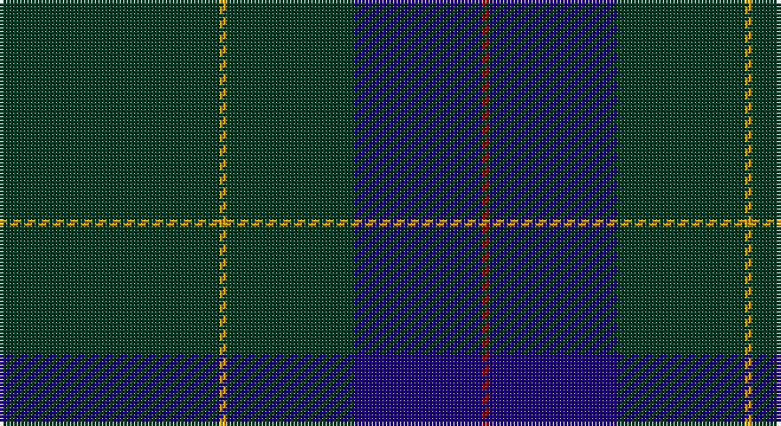

This page is one **sett** — a single exact thread-count. It belongs to the [tartan](/setts/dg31lo1dg18db18r1/)
(the same proportion at any scale), whose colour order is pattern [GYGBR](/stripes/gygbr/).

Sourced from register-of-tartans.  It is a [5 stripe tartan](/stripes/stripes5/).

Original link https://www.tartanregister.gov.uk/tartanDetails.aspx?ref=2962

2 attestations — the source records this cloth was collapsed from (oldest owns this page)

<ul>
<li>01/01/1996 — Miramichi (register-of-tartans, <a href="https://www.tartanregister.gov.uk/tartanDetails.aspx?ref=2962">record</a>)</li>
<li>1996 — Miramichi (P&D) (tartans-authority, <a href="http://www.tartansauthority.com/tartan-ferret/display/5678/">record</a>)</li>
</ul>

## Register references

External register numbers recorded for this tartan.

- Scottish Register of Tartans: [2962](https://www.tartanregister.gov.uk/tartanDetails.aspx?ref=2962)
- Scottish Tartans Authority (ITI): 5678

## Thread count
DG/62 DY2 DG36 DB36 DR/2

One full sett is **212 threads**.

## Palette

Palette: <strong>Tartan Register</strong> <small style="color:#888">(3 of 4 colours)</small>
<table><thead><tr><th>Colour</th><th>Threads</th><th>Shade</th><th>Base</th><th>OKLCh</th></tr></thead><tbody><tr><td>DG/</td><td style="text-align:right;font-variant-numeric:tabular-nums">62</td><td><code style="background-color:#003820;">#003820</code> <small style="color:#888">#003820</small></td><td>G <code style="background-color:#006100;">#006100</code></td><td><small style="color:#888">oklch(30.0% 0.070 158.3)</small></td></tr><tr><td>DY</td><td style="text-align:right;font-variant-numeric:tabular-nums">2</td><td><code style="background-color:#D09800;">#D09800</code> <small style="color:#888">#D09800</small></td><td>Y <code style="background-color:#F2BF00;">#F2BF00</code></td><td><small style="color:#888">oklch(71.4% 0.147 82.1)</small></td></tr><tr><td>DG</td><td style="text-align:right;font-variant-numeric:tabular-nums">36</td><td><code style="background-color:#003820;">#003820</code> <small style="color:#888">#003820</small></td><td>G <code style="background-color:#006100;">#006100</code></td><td><small style="color:#888">oklch(30.0% 0.070 158.3)</small></td></tr><tr><td>DB</td><td style="text-align:right;font-variant-numeric:tabular-nums">36</td><td><code style="background-color:#1C0070;">#1C0070</code> <small style="color:#888">#1C0070</small></td><td>B <code style="background-color:#2A418A;">#2A418A</code></td><td><small style="color:#888">oklch(26.3% 0.162 277.1)</small></td></tr><tr><td>DR/</td><td style="text-align:right;font-variant-numeric:tabular-nums">2</td><td><code style="background-color:#880000;">#880000</code> <small style="color:#888">#880000</small></td><td>R <code style="background-color:#CC0000;">#CC0000</code></td><td><small style="color:#888">oklch(39.4% 0.162 29.2)</small></td></tr></tbody></table>

# Sample pattern

## Nearest tartans

The nearest existing variants by ΔTartan distance, with this tartan at the top so the swatches line up against it.

ΔTartan

Tartan

Sett

—

<a href="/ttd/edit/#slug=dg31lo1dg18db18r1~x2">Miramichi</a> <a class="nn-out" href="/variants/s5/dg31lo1dg18db18r1~x2/" title="open its dictionary page">↗</a>

1.31

<a href="/ttd/edit/#slug=dt40o2dt20g19db2&amp;base=dg31lo1dg18db18r1~x2">Lloyd (Welsh Name)</a> <a class="nn-out" href="/variants/s5/dt40o2dt20g19db2/" title="open its dictionary page">↗</a>

1.39

<a href="/ttd/edit/#slug=dt68t7dt16k16lo4~x2&amp;base=dg31lo1dg18db18r1~x2">Burnetts &amp; Struth</a> <a class="nn-out" href="/variants/s5/dt68t7dt16k16lo4~x2/" title="open its dictionary page">↗</a>

1.56

<a href="/ttd/edit/#slug=k40dg15k10r2k10lo2~x2&amp;base=dg31lo1dg18db18r1~x2">Kalkofen (Name)</a> <a class="nn-out" href="/variants/s6/k40dg15k10r2k10lo2~x2/" title="open its dictionary page">↗</a>

1.62

<a href="/ttd/edit/#slug=dt68b7dt16k16lo4~x2&amp;base=dg31lo1dg18db18r1~x2">Burnett's &amp; Struth (Corporate)</a> <a class="nn-out" href="/variants/s5/dt68b7dt16k16lo4~x2/" title="open its dictionary page">↗</a>

1.83

<a href="/ttd/edit/#slug=db13k3db20dy70db20dy30w3~x2&amp;base=dg31lo1dg18db18r1~x2">Unidentified #44</a> <a class="nn-out" href="/variants/s7/db13k3db20dy70db20dy30w3~x2/" title="open its dictionary page">↗</a>

1.87

<a href="/ttd/edit/#slug=k40dg15k10r2k10ly2k10~x2&amp;base=dg31lo1dg18db18r1~x2">Langhein Family Tartan</a> <a class="nn-out" href="/variants/s7/k40dg15k10r2k10ly2k10~x2/" title="open its dictionary page">↗</a>

1.94

<a href="/ttd/edit/#slug=r5dt40w1dt13g8k4~x2&amp;base=dg31lo1dg18db18r1~x2">London Scottish Rugby Club</a> <a class="nn-out" href="/variants/s6/r5dt40w1dt13g8k4~x2/" title="open its dictionary page">↗</a>

2.01

<a href="/ttd/edit/#slug=dt62r24lo5dg3~x2&amp;base=dg31lo1dg18db18r1~x2">Meaux (Personal)</a> <a class="nn-out" href="/variants/s4/dt62r24lo5dg3~x2/" title="open its dictionary page">↗</a>

2.02

<a href="/ttd/edit/#slug=k30dt6k6dt41t2~x2&amp;base=dg31lo1dg18db18r1~x2">Williams (New York) (Personal)</a> <a class="nn-out" href="/variants/s5/k30dt6k6dt41t2~x2/" title="open its dictionary page">↗</a>

2.05

<a href="/variants/s10/k40dg15k10r2k10lo2~x2/">Kalkofen</a>

## Neighbour map

Every grey dot is one of 14360 variants placed by the first two principal components of the ΔTartan feature space (44% of its variance). Red is this tartan; blue dots are its nearest — click one to open its page.

<svg viewBox="0 0 640 380" role="img" style="max-width:100%;height:auto;border:1px solid #e0e0e0;border-radius:4px;display:block" xmlns="http://www.w3.org/2000/svg"><image href="/nn/cloud.v1.png" width="640" height="380"/><a href="/variants/s5/dt40o2dt20g19db2/"><circle cx="542.4" cy="267.8" r="4" fill="#3465a4"><title>Lloyd (Welsh Name)</title></circle></a><a href="/variants/s5/dt68t7dt16k16lo4~x2/"><circle cx="550.9" cy="245.0" r="4" fill="#3465a4"><title>Burnetts &amp; Struth</title></circle></a><a href="/variants/s6/k40dg15k10r2k10lo2~x2/"><circle cx="566.0" cy="243.4" r="4" fill="#3465a4"><title>Kalkofen (Name)</title></circle></a><a href="/variants/s5/dt68b7dt16k16lo4~x2/"><circle cx="547.6" cy="240.9" r="4" fill="#3465a4"><title>Burnett's &amp; Struth (Corporate)</title></circle></a><a href="/variants/s7/db13k3db20dy70db20dy30w3~x2/"><circle cx="481.5" cy="221.2" r="4" fill="#3465a4"><title>Unidentified #44</title></circle></a><a href="/variants/s7/k40dg15k10r2k10ly2k10~x2/"><circle cx="568.2" cy="233.5" r="4" fill="#3465a4"><title>Langhein Family Tartan</title></circle></a><a href="/variants/s6/r5dt40w1dt13g8k4~x2/"><circle cx="524.1" cy="170.6" r="4" fill="#3465a4"><title>London Scottish Rugby Club</title></circle></a><a href="/variants/s4/dt62r24lo5dg3~x2/"><circle cx="471.0" cy="226.5" r="4" fill="#3465a4"><title>Meaux (Personal)</title></circle></a><a href="/variants/s5/k30dt6k6dt41t2~x2/"><circle cx="474.1" cy="271.1" r="4" fill="#3465a4"><title>Williams (New York) (Personal)</title></circle></a><a href="/variants/s10/k40dg15k10r2k10lo2~x2/"><circle cx="511.0" cy="230.5" r="4" fill="#3465a4"><title>Kalkofen</title></circle></a><circle cx="537.2" cy="245.2" r="5" fill="#c00000"/></svg>

ID: /variants/s5/dg31lo1dg18db18r1~x2/
