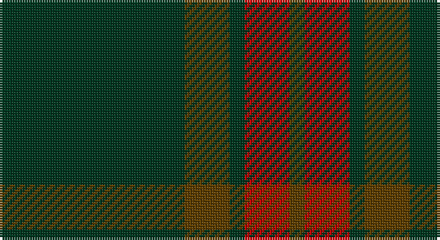

This page is one **sett** — a single exact thread-count. It belongs to the [tartan](/setts/dg37dy9dg3r9dy3/)
(the same proportion at any scale), whose colour order is pattern [GGGRG](/stripes/gggrg/).

Part of the [Glen Trool](/tartans/glen-trool/) tartan — the named design grouping this sett with its other cloths.

Sourced from house-of-tartan.  It is a [5 stripe tartan](/stripes/stripes5/).

Original link http://www.house-of-tartan.scotland.net/house/TartanViewjs.asp?colr=Def&tnam=914

## Provenance

Earliest known date: pre 1945 Glen Trool is in the Galloway Uplands in the Southwest of Scotland. The tartan began life as a trade sett - a colourful fashion fabric - and was given a name merely to identify it. It proved very popular and is now recognised as a District Tartan.

## Also known as

This cloth is also recorded under:

- Glen Boig

## Thread count
DG/74 T18 DG6 R18 T/6

One full sett is **164 threads**.

## Palette

Palette: <strong>Tartan Register</strong>
<table><thead><tr><th>Colour</th><th>Threads</th><th>Shade</th><th>Base</th><th>OKLCh</th></tr></thead><tbody><tr><td>DG/</td><td style="text-align:right;font-variant-numeric:tabular-nums">74</td><td><code style="background-color:#003820;">#003820</code> <small style="color:#888">#003820</small></td><td>G <code style="background-color:#006100;">#006100</code></td><td><small style="color:#888">oklch(30.0% 0.070 158.3)</small></td></tr><tr><td>T</td><td style="text-align:right;font-variant-numeric:tabular-nums">18</td><td><code style="background-color:#604000;">#604000</code> <small style="color:#888">#604000</small></td><td>G <code style="background-color:#006100;">#006100</code></td><td><small style="color:#888">oklch(39.8% 0.083 76.8)</small></td></tr><tr><td>DG</td><td style="text-align:right;font-variant-numeric:tabular-nums">6</td><td><code style="background-color:#003820;">#003820</code> <small style="color:#888">#003820</small></td><td>G <code style="background-color:#006100;">#006100</code></td><td><small style="color:#888">oklch(30.0% 0.070 158.3)</small></td></tr><tr><td>R</td><td style="text-align:right;font-variant-numeric:tabular-nums">18</td><td><code style="background-color:#C80000;">#C80000</code> <small style="color:#888">#C80000</small></td><td>R <code style="background-color:#CC0000;">#CC0000</code></td><td><small style="color:#888">oklch(52.3% 0.215 29.2)</small></td></tr><tr><td>T/</td><td style="text-align:right;font-variant-numeric:tabular-nums">6</td><td><code style="background-color:#604000;">#604000</code> <small style="color:#888">#604000</small></td><td>G <code style="background-color:#006100;">#006100</code></td><td><small style="color:#888">oklch(39.8% 0.083 76.8)</small></td></tr></tbody></table>

# Sample pattern

## Compared to the master

This cloth is one sett of its design; the master sett (the exemplar the design is anchored on) is below for comparison.

<figure style="margin:0"><figcaption style="color:#888;font-size:smaller">this sett</figcaption></figure>
<figure style="margin:0"><figcaption style="color:#888;font-size:smaller"><a href="/setts/dg42o10dg3r10o3/">master sett →</a></figcaption></figure>

## Nearest tartans

The nearest existing variants by ΔTartan distance, with this tartan at the top so the swatches line up against it.

ΔTartan

Tartan

Sett

—

<a href="/ttd/edit/#slug=dg37dy9dg3r9dy3~x2">Glen Trool District Tartan</a> <a class="nn-out" href="/variants/s5/dg37dy9dg3r9dy3~x2/" title="open its dictionary page">↗</a>

0.92

<a href="/ttd/edit/#slug=dg42o10dg3r10o3~x2&amp;base=dg37dy9dg3r9dy3~x2">Glen Trool (Fashion)</a> <a class="nn-out" href="/variants/s5/dg42o10dg3r10o3~x2/" title="open its dictionary page">↗</a>

0.97

<a href="/ttd/edit/#slug=r6dg2db2dg17r2~x4&amp;base=dg37dy9dg3r9dy3~x2">Loton (Personal)</a> <a class="nn-out" href="/variants/s5/r6dg2db2dg17r2~x4/" title="open its dictionary page">↗</a>

1.37

<a href="/ttd/edit/#slug=dg37o9dg3r9o3~x2&amp;base=dg37dy9dg3r9dy3~x2">Glen Trool</a> <a class="nn-out" href="/variants/s5/dg37o9dg3r9o3~x2/" title="open its dictionary page">↗</a>

1.38

<a href="/ttd/edit/#slug=g37o9g3dr9o3~x2&amp;base=dg37dy9dg3r9dy3~x2">Glen Boig</a> <a class="nn-out" href="/variants/s5/g37o9g3dr9o3~x2/" title="open its dictionary page">↗</a>

1.46

<a href="/ttd/edit/#slug=dr6lr2dr30dg12dr3dg12dr3~x2&amp;base=dg37dy9dg3r9dy3~x2">Crawford</a> <a class="nn-out" href="/variants/s7/dr6lr2dr30dg12dr3dg12dr3~x2/" title="open its dictionary page">↗</a>

1.46

<a href="/ttd/edit/#slug=dr6lr2dr30dg12dr3dg12dr3&amp;base=dg37dy9dg3r9dy3~x2">Crawford</a> <a class="nn-out" href="/variants/s7/dr6lr2dr30dg12dr3dg12dr3/" title="open its dictionary page">↗</a>

1.51

<a href="/ttd/edit/#slug=dy3db3dy3db27dy40y3&amp;base=dg37dy9dg3r9dy3~x2">Keeper of the Quaich</a> <a class="nn-out" href="/variants/s6/dy3db3dy3db27dy40y3/" title="open its dictionary page">↗</a>

1.56

<a href="/ttd/edit/#slug=g3r16g4k6g28r2g3~x2&amp;base=dg37dy9dg3r9dy3~x2">Maxwell Htg (Clan)</a> <a class="nn-out" href="/variants/s7/g3r16g4k6g28r2g3~x2/" title="open its dictionary page">↗</a>

1.61

<a href="/ttd/edit/#slug=do40n19k2n2lb2~x4&amp;base=dg37dy9dg3r9dy3~x2">National Ballet of Canada</a> <a class="nn-out" href="/variants/s5/do40n19k2n2lb2~x4/" title="open its dictionary page">↗</a>

1.65

<a href="/ttd/edit/#slug=n6k16n6k16n45k4~x2&amp;base=dg37dy9dg3r9dy3~x2">Grey Spirit Fashion Tartan</a> <a class="nn-out" href="/variants/s6/n6k16n6k16n45k4~x2/" title="open its dictionary page">↗</a>

## Neighbour map

Every grey dot is one of 14360 variants placed by the first two principal components of the ΔTartan feature space (44% of its variance). Red is this tartan; blue dots are its nearest — click one to open its page.

<svg viewBox="0 0 640 380" role="img" style="max-width:100%;height:auto;border:1px solid #e0e0e0;border-radius:4px;display:block" xmlns="http://www.w3.org/2000/svg"><image href="/nn/cloud.v1.png" width="640" height="380"/><a href="/variants/s5/dg42o10dg3r10o3~x2/"><circle cx="466.7" cy="241.0" r="4" fill="#3465a4"><title>Glen Trool (Fashion)</title></circle></a><a href="/variants/s5/r6dg2db2dg17r2~x4/"><circle cx="452.6" cy="267.9" r="4" fill="#3465a4"><title>Loton (Personal)</title></circle></a><a href="/variants/s5/dg37o9dg3r9o3~x2/"><circle cx="441.0" cy="239.0" r="4" fill="#3465a4"><title>Glen Trool</title></circle></a><a href="/variants/s5/g37o9g3dr9o3~x2/"><circle cx="492.4" cy="271.6" r="4" fill="#3465a4"><title>Glen Boig</title></circle></a><a href="/variants/s7/dr6lr2dr30dg12dr3dg12dr3~x2/"><circle cx="492.2" cy="253.5" r="4" fill="#3465a4"><title>Crawford</title></circle></a><a href="/variants/s7/dr6lr2dr30dg12dr3dg12dr3/"><circle cx="492.2" cy="253.5" r="4" fill="#3465a4"><title>Crawford</title></circle></a><a href="/variants/s6/dy3db3dy3db27dy40y3/"><circle cx="471.9" cy="248.1" r="4" fill="#3465a4"><title>Keeper of the Quaich</title></circle></a><a href="/variants/s7/g3r16g4k6g28r2g3~x2/"><circle cx="419.5" cy="223.7" r="4" fill="#3465a4"><title>Maxwell Htg (Clan)</title></circle></a><a href="/variants/s5/do40n19k2n2lb2~x4/"><circle cx="463.6" cy="207.9" r="4" fill="#3465a4"><title>National Ballet of Canada</title></circle></a><a href="/variants/s6/n6k16n6k16n45k4~x2/"><circle cx="460.0" cy="269.0" r="4" fill="#3465a4"><title>Grey Spirit Fashion Tartan</title></circle></a><circle cx="476.5" cy="258.8" r="5" fill="#c00000"/></svg>

ID: /variants/s5/dg37dy9dg3r9dy3~x2/
