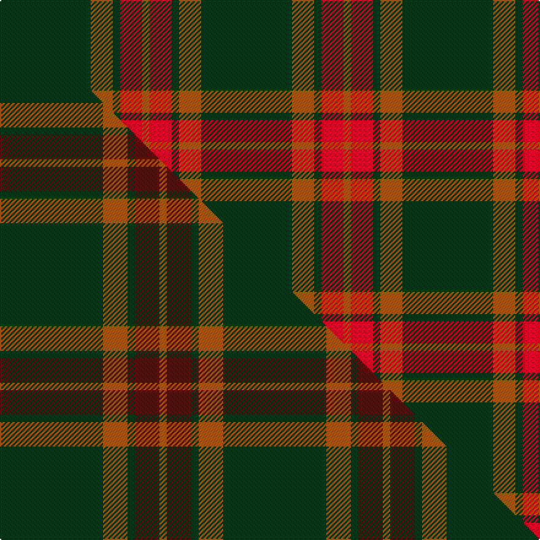

This is one **variant** — a specific cloth: this exact thread count and colourway, with its own
provenance below. It is one weaving of the [sett](/tartans/g/gl/glen-trool-2/) (the scale-free proportion — the
same cloth at any scale or shade), whose colour order is pattern [GRGRR](/stripes/grgrr/).

Part of the [Glen Trool](/tartans/g/gl/glen-trool-2/) tartan — the named design grouping this sett with its other cloths.

Sourced from weddslist.  It is a [5 stripe tartan](/stripes/stripes5/).

Original link [http://www.weddslist.com/cgi-bin/tartans/pg.pl?source=sts](http://www.weddslist.com/cgi-bin/tartans/pg.pl?source=sts)

Dataset <small>— provenance for this record, inherited from the source manifest</small>

<dl class="dataset-prov">
<dt>source</dt><dd><a href="/sources/weddslist/">Weddslist</a></dd>
<dt>data captured from</dt><dd><a href="https://github.com/thetartan/tartan-database/blob/master/data/weddslist/data.csv">https://github.com/thetartan/tartan-database/blob/master/data/weddslist/data.csv</a></dd>
<dt>data date</dt><dd>2016-11-17 <small>(dataset default)</small></dd>
<dt>licence</dt><dd><a href="https://creativecommons.org/licenses/by-nc-nd/4.0/">CC BY-NC-ND 4.0</a></dd>
</dl>

Capture chain <small>— the hands this data passed through, oldest first; each capture carries its own licence</small>

<ol class="capture-chain">
<li><a href="https://www.weddslist.com/tartans/">Weddslist</a> <small>the living privately compiled reference</small></li>
<li><a href="https://github.com/thetartan/tartan-database">thetartan/tartan-database</a> <small>2016-2017</small> · <a href="https://creativecommons.org/licenses/by-nc-nd/4.0/">CC BY-NC-ND 4.0</a> <small>Levko Kravets's frozen compilation — the capture we vendored, and where its CC licence text came from</small></li>
<li>this dictionary <small>captured 2026-06-10 · commit 5bf86c7566</small> <small>each re-capture is a git commit to data/sources</small></li>
</ol>

## Thread count
DG/74 O18 DG6 R18 O/6

One full sett is **164 threads**.

## Palette
<table><thead><tr><th>Colour</th><th>Shade</th><th>OKLCh</th></tr></thead><tbody><tr><td>DG</td><td><code style="background-color:#053819;">#053819</code> <small style="color:#888">#053819</small></td><td><small style="color:#888">oklch(30.0% 0.075 151.3)</small></td></tr><tr><td>O</td><td><code style="background-color:#A65C11;">#A65C11</code> <small style="color:#888">#A65C11</small></td><td><small style="color:#888">oklch(55.0% 0.125 58.3)</small></td></tr><tr><td>R</td><td><code style="background-color:#D60020;">#D60020</code> <small style="color:#888">#D60020</small></td><td><small style="color:#888">oklch(55.2% 0.224 25.5)</small></td></tr></tbody></table>

# Sample pattern

## Compared to the master

This cloth is one sett of its design; the master sett (the exemplar the design is anchored on) is below for comparison.

Its **ΔTartan distance** from the master is **0.23** — the same measure the nearest-tartans table ranks by (0 is identical; a re-scale of the same cloth is near 0, a recolour or a different proportion further).

<figure class="master-compare" style="margin:0">

this sett
master sett ★

<figcaption style="color:#888;font-size:smaller">One weave of this sett against the <a href="/setts/dg42o10dg3dr10o3/">master sett ★</a>, split on the diagonal: a shared proportion runs seamlessly across it with only the shades shifting; a different proportion breaks on it.</figcaption>
</figure>

## Nearest tartan variants

The nearest existing variants by ΔTartan distance, with this cloth at the top so the swatches line up against it.

ΔTartan

Threads

Variant

Sett

—

164

<a href="/variants/s5/dg37o9dg3r9o3~x2/">Glen Trool</a>

<a href="/ttd/edit/#slug=dg42o10dg3dr10o3~x2&amp;base=dg37o9dg3r9o3~x2" title="compare in the TTD">0.23</a>

182

<a href="/variants/s5/dg42o10dg3dr10o3~x2/">Glen Trool (Fashion)</a>

<a href="/ttd/edit/#slug=dg37dy9dg3r9dy3~x2&amp;base=dg37o9dg3r9o3~x2" title="compare in the TTD">2.63</a>

164

<a href="/variants/s5/dg37dy9dg3r9dy3~x2/">Glen Trool District Tartan</a>

<a href="/ttd/edit/#slug=r2dg1r1dg10w1~x4&amp;base=dg37o9dg3r9o3~x2" title="compare in the TTD">2.79</a>

108

<a href="/variants/s5/r2dg1r1dg10w1~x4/">Welsh National District Tartan</a>

<a href="/ttd/edit/#slug=dg11y1dg1y6k1y1~x4&amp;base=dg37o9dg3r9o3~x2" title="compare in the TTD">3.17</a>

120

<a href="/variants/s6/dg11y1dg1y6k1y1~x4/">Big Spruce Brewing</a>

<a href="/ttd/edit/#slug=dg11y1dg1y6k1y1~x8&amp;base=dg37o9dg3r9o3~x2" title="compare in the TTD">3.17</a>

240

<a href="/variants/s6/dg11y1dg1y6k1y1~x8/">Big Spruce Brewing</a>

<a href="/ttd/edit/#slug=dr8g2dr2k1dr1g2~x10&amp;base=dg37o9dg3r9o3~x2" title="compare in the TTD">3.26</a>

220

<a href="/variants/s6/dr8g2dr2k1dr1g2~x10/">Waverley Care Aids Trust (Corporate)</a>

<a href="/ttd/edit/#slug=g16r1g2r11~x8&amp;base=dg37o9dg3r9o3~x2" title="compare in the TTD">3.42</a>

264

<a href="/variants/s4/g16r1g2r11~x8/">Middleton</a>

<a href="/ttd/edit/#slug=do44o3do4w3do4o44~x2&amp;base=dg37o9dg3r9o3~x2" title="compare in the TTD">3.54</a>

232

<a href="/variants/s6/do44o3do4w3do4o44~x2/">Wcwm 1166-2</a>

<a href="/ttd/edit/#slug=g22dt5r4dt5r3~x2&amp;base=dg37o9dg3r9o3~x2" title="compare in the TTD">3.57</a>

106

<a href="/variants/s5/g22dt5r4dt5r3~x2/">Romsdal</a>

<a href="/ttd/edit/#slug=db2o28g13o2db13o2~x4&amp;base=dg37o9dg3r9o3~x2" title="compare in the TTD">3.62</a>

464

<a href="/variants/s6/db2o28g13o2db13o2~x4/">Edinchat</a>

## Neighbour map

Every grey dot is one of 13656 variants placed by the first two principal components of the ΔTartan feature space (42% of its variance). Red is this tartan; blue dots are its nearest — click one to open its page. The map is a flat projection of a many-dimensional space — [how to read it](/posts/neighbourhood-maps/).

<svg viewBox="0 0 640 380" role="img" style="max-width:100%;height:auto;border:1px solid #e0e0e0;border-radius:4px;display:block" xmlns="http://www.w3.org/2000/svg"><image href="/nn/cloud.v1.png" width="640" height="380"/><a href="/variants/s5/dg42o10dg3dr10o3~x2/"><circle cx="517.1" cy="237.3" r="4" fill="#3465a4"><title>Glen Trool (Fashion)</title></circle></a><a href="/variants/s5/dg37dy9dg3r9dy3~x2/"><circle cx="508.5" cy="245.5" r="4" fill="#3465a4"><title>Glen Trool District Tartan</title></circle></a><a href="/variants/s5/r2dg1r1dg10w1~x4/"><circle cx="448.6" cy="200.4" r="4" fill="#3465a4"><title>Welsh National District Tartan</title></circle></a><a href="/variants/s6/dg11y1dg1y6k1y1~x4/"><circle cx="393.8" cy="208.8" r="4" fill="#3465a4"><title>Big Spruce Brewing</title></circle></a><a href="/variants/s6/dg11y1dg1y6k1y1~x8/"><circle cx="393.8" cy="208.8" r="4" fill="#3465a4"><title>Big Spruce Brewing</title></circle></a><a href="/variants/s6/dr8g2dr2k1dr1g2~x10/"><circle cx="414.5" cy="217.6" r="4" fill="#3465a4"><title>Waverley Care Aids Trust (Corporate)</title></circle></a><a href="/variants/s4/g16r1g2r11~x8/"><circle cx="443.0" cy="246.6" r="4" fill="#3465a4"><title>Middleton</title></circle></a><a href="/variants/s6/do44o3do4w3do4o44~x2/"><circle cx="413.9" cy="205.3" r="4" fill="#3465a4"><title>Wcwm 1166-2</title></circle></a><a href="/variants/s5/g22dt5r4dt5r3~x2/"><circle cx="350.1" cy="252.3" r="4" fill="#3465a4"><title>Romsdal</title></circle></a><a href="/variants/s6/db2o28g13o2db13o2~x4/"><circle cx="359.0" cy="216.3" r="4" fill="#3465a4"><title>Edinchat</title></circle></a><circle cx="445.3" cy="219.0" r="5" fill="#c00000"/><text x="320" y="376" text-anchor="middle" font-size="11" fill="#999">ground</text><text x="11" y="190" text-anchor="middle" font-size="11" fill="#999" transform="rotate(-90 11 190)">complexity</text></svg>

ID: /variants/s5/dg37o9dg3r9o3~x2/
