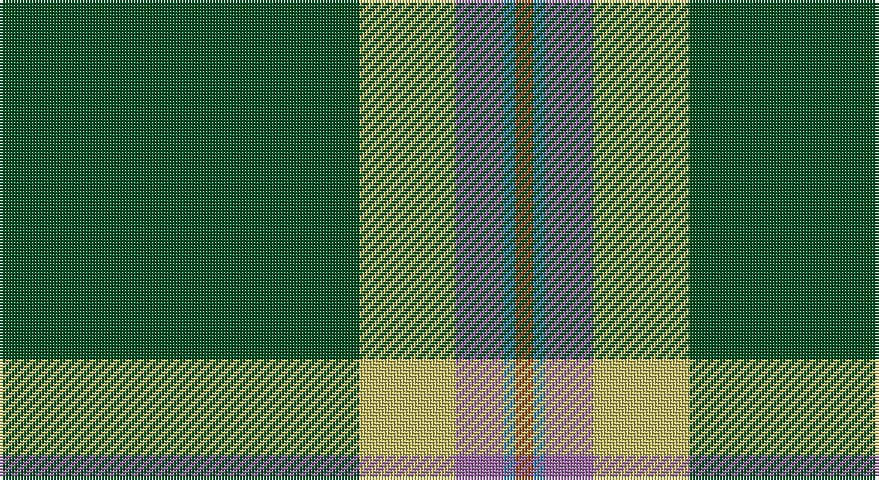

This page is one **sett** — a single exact thread-count. It belongs to the [tartan](/setts/dg60ly16m8t2o3/)
(the same proportion at any scale), whose colour order is pattern [GYRBR](/stripes/gyrbr/).

Sourced from register-of-tartans.  It is a [5 stripe tartan](/stripes/stripes5/).

Original link https://www.tartanregister.gov.uk/tartanDetails.aspx?ref=11594

## Register references

External register numbers recorded for this tartan.

- Scottish Register of Tartans: [11594](https://www.tartanregister.gov.uk/tartanDetails.aspx?ref=11594)

## Thread count
G/120 LG32 LP16 B4 T/6

One full sett is **230 threads**.

## Palette

Palette: <strong>Tartan Register</strong>
<table><thead><tr><th>Colour</th><th>Threads</th><th>Shade</th><th>Base</th><th>OKLCh</th></tr></thead><tbody><tr><td>G/</td><td style="text-align:right;font-variant-numeric:tabular-nums">120</td><td><code style="background-color:#005020;">#005020</code> <small style="color:#888">#005020</small></td><td>G <code style="background-color:#006100;">#006100</code></td><td><small style="color:#888">oklch(37.7% 0.105 149.6)</small></td></tr><tr><td>LG</td><td style="text-align:right;font-variant-numeric:tabular-nums">32</td><td><code style="background-color:#C4BC68;">#C4BC68</code> <small style="color:#888">#C4BC68</small></td><td>Y <code style="background-color:#F2BF00;">#F2BF00</code></td><td><small style="color:#888">oklch(78.4% 0.107 103.7)</small></td></tr><tr><td>LP</td><td style="text-align:right;font-variant-numeric:tabular-nums">16</td><td><code style="background-color:#9C68A4;">#9C68A4</code> <small style="color:#888">#9C68A4</small></td><td>R <code style="background-color:#CC0000;">#CC0000</code></td><td><small style="color:#888">oklch(59.4% 0.107 322.0)</small></td></tr><tr><td>B</td><td style="text-align:right;font-variant-numeric:tabular-nums">4</td><td><code style="background-color:#3C82AF;">#3C82AF</code> <small style="color:#888">#3C82AF</small></td><td>B <code style="background-color:#2A418A;">#2A418A</code></td><td><small style="color:#888">oklch(58.1% 0.099 239.8)</small></td></tr><tr><td>T/</td><td style="text-align:right;font-variant-numeric:tabular-nums">6</td><td><code style="background-color:#98481C;">#98481C</code> <small style="color:#888">#98481C</small></td><td>R <code style="background-color:#CC0000;">#CC0000</code></td><td><small style="color:#888">oklch(49.6% 0.121 46.1)</small></td></tr></tbody></table>

# Sample pattern

## Nearest tartans

The nearest existing variants by ΔTartan distance, with this tartan at the top so the swatches line up against it.

ΔTartan

Tartan

Sett

—

<a href="/ttd/edit/#slug=dg60ly16m8t2o3~x2">Isle of Raasay</a> <a class="nn-out" href="/variants/s5/dg60ly16m8t2o3~x2/" title="open its dictionary page">↗</a>

1.04

<a href="/ttd/edit/#slug=db6w3r3g55k10r3~x4&amp;base=dg60ly16m8t2o3~x2">Military Medical Memorial (USA)</a> <a class="nn-out" href="/variants/s6/db6w3r3g55k10r3~x4/" title="open its dictionary page">↗</a>

1.20

<a href="/ttd/edit/#slug=k3g2k3g18r2db2lo1~x4&amp;base=dg60ly16m8t2o3~x2">Selvon-Bruce (Personal)</a> <a class="nn-out" href="/variants/s7/k3g2k3g18r2db2lo1~x4/" title="open its dictionary page">↗</a>

1.28

<a href="/ttd/edit/#slug=dg40k3w1k5r1k2ri10~x2&amp;base=dg60ly16m8t2o3~x2">Aviemore Highland (Corporate)</a> <a class="nn-out" href="/variants/s7/dg40k3w1k5r1k2ri10~x2/" title="open its dictionary page">↗</a>

1.34

<a href="/ttd/edit/#slug=g10loi3w2k2g8k22g43lo4~x2&amp;base=dg60ly16m8t2o3~x2">Celtic Pride</a> <a class="nn-out" href="/variants/s8/g10loi3w2k2g8k22g43lo4~x2/" title="open its dictionary page">↗</a>

1.38

<a href="/ttd/edit/#slug=lo2db4g60dp30w1~x2&amp;base=dg60ly16m8t2o3~x2">McGuinness, Tam (Personal)</a> <a class="nn-out" href="/variants/s5/lo2db4g60dp30w1~x2/" title="open its dictionary page">↗</a>

1.39

<a href="/ttd/edit/#slug=g50db20k3db2o2db5~x2&amp;base=dg60ly16m8t2o3~x2">St Andrews Hotel, Golf Resort, and SPA</a> <a class="nn-out" href="/variants/s6/g50db20k3db2o2db5~x2/" title="open its dictionary page">↗</a>

1.43

<a href="/ttd/edit/#slug=n4ly1k4dg32k4r2~x2&amp;base=dg60ly16m8t2o3~x2">Tough (Personal)</a> <a class="nn-out" href="/variants/s6/n4ly1k4dg32k4r2~x2/" title="open its dictionary page">↗</a>

1.49

<a href="/ttd/edit/#slug=k2w2db8k4g33r2g16w2~x2&amp;base=dg60ly16m8t2o3~x2">Sarros (Personal) XX</a> <a class="nn-out" href="/variants/s8/k2w2db8k4g33r2g16w2~x2/" title="open its dictionary page">↗</a>

1.50

<a href="/ttd/edit/#slug=w8r6lo2g34b3~x2&amp;base=dg60ly16m8t2o3~x2">Milling-Kristensen (Personal)</a> <a class="nn-out" href="/variants/s5/w8r6lo2g34b3~x2/" title="open its dictionary page">↗</a>

1.50

<a href="/ttd/edit/#slug=g55p7r24g12db4ly3db4~x2&amp;base=dg60ly16m8t2o3~x2">Crieff, and Strathearn</a> <a class="nn-out" href="/variants/s7/g55p7r24g12db4ly3db4~x2/" title="open its dictionary page">↗</a>

## Neighbour map

Every grey dot is one of 14360 variants placed by the first two principal components of the ΔTartan feature space (44% of its variance). Red is this tartan; blue dots are its nearest — click one to open its page.

<svg viewBox="0 0 640 380" role="img" style="max-width:100%;height:auto;border:1px solid #e0e0e0;border-radius:4px;display:block" xmlns="http://www.w3.org/2000/svg"><image href="/nn/cloud.v1.png" width="640" height="380"/><a href="/variants/s6/db6w3r3g55k10r3~x4/"><circle cx="410.7" cy="150.4" r="4" fill="#3465a4"><title>Military Medical Memorial (USA)</title></circle></a><a href="/variants/s7/k3g2k3g18r2db2lo1~x4/"><circle cx="378.6" cy="155.1" r="4" fill="#3465a4"><title>Selvon-Bruce (Personal)</title></circle></a><a href="/variants/s7/dg40k3w1k5r1k2ri10~x2/"><circle cx="420.3" cy="110.2" r="4" fill="#3465a4"><title>Aviemore Highland (Corporate)</title></circle></a><a href="/variants/s8/g10loi3w2k2g8k22g43lo4~x2/"><circle cx="382.5" cy="151.4" r="4" fill="#3465a4"><title>Celtic Pride</title></circle></a><a href="/variants/s5/lo2db4g60dp30w1~x2/"><circle cx="426.0" cy="136.2" r="4" fill="#3465a4"><title>McGuinness, Tam (Personal)</title></circle></a><a href="/variants/s6/g50db20k3db2o2db5~x2/"><circle cx="416.1" cy="173.6" r="4" fill="#3465a4"><title>St Andrews Hotel, Golf Resort, and SPA</title></circle></a><a href="/variants/s6/n4ly1k4dg32k4r2~x2/"><circle cx="441.6" cy="143.1" r="4" fill="#3465a4"><title>Tough (Personal)</title></circle></a><a href="/variants/s8/k2w2db8k4g33r2g16w2~x2/"><circle cx="405.8" cy="156.2" r="4" fill="#3465a4"><title>Sarros (Personal) XX</title></circle></a><a href="/variants/s5/w8r6lo2g34b3~x2/"><circle cx="367.9" cy="169.8" r="4" fill="#3465a4"><title>Milling-Kristensen (Personal)</title></circle></a><a href="/variants/s7/g55p7r24g12db4ly3db4~x2/"><circle cx="357.8" cy="155.0" r="4" fill="#3465a4"><title>Crieff, and Strathearn</title></circle></a><circle cx="424.2" cy="151.7" r="5" fill="#c00000"/></svg>

ID: /variants/s5/dg60ly16m8t2o3~x2/
