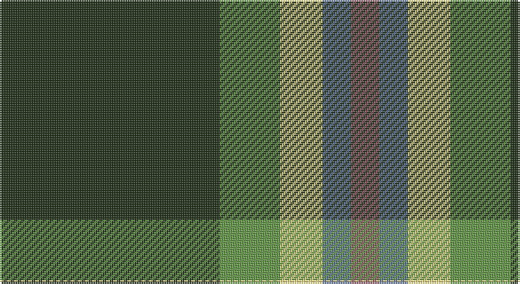

This page is one **sett** — a single exact thread-count. It belongs to the [tartan](/setts/dg62g17ly12t8o8/)
(the same proportion at any scale), whose colour order is pattern [GGYBR](/stripes/ggybr/).

Sourced from register-of-tartans.  It is a [5 stripe tartan](/stripes/stripes5/).

Original link https://www.tartanregister.gov.uk/tartanDetails.aspx?ref=10230

## Register references

External register numbers recorded for this tartan.

- Scottish Register of Tartans: [10230](https://www.tartanregister.gov.uk/tartanDetails.aspx?ref=10230)

## Thread count
K/124 LG34 LY24 B16 LT/16

One full sett is **288 threads**.

## Palette

Palette: <strong>Tartan Register</strong> <small style="color:#888">(3 of 5 colours)</small>
<table><thead><tr><th>Colour</th><th>Threads</th><th>Shade</th><th>Base</th><th>OKLCh</th></tr></thead><tbody><tr><td>K/</td><td style="text-align:right;font-variant-numeric:tabular-nums">124</td><td><code style="background-color:#23321B;">#23321B</code> <small style="color:#888">#23321B</small></td><td>G <code style="background-color:#006100;">#006100</code></td><td><small style="color:#888">oklch(29.7% 0.045 135.3)</small></td></tr><tr><td>LG</td><td style="text-align:right;font-variant-numeric:tabular-nums">34</td><td><code style="background-color:#649848;">#649848</code> <small style="color:#888">#649848</small></td><td>G <code style="background-color:#006100;">#006100</code></td><td><small style="color:#888">oklch(62.4% 0.125 135.7)</small></td></tr><tr><td>LY</td><td style="text-align:right;font-variant-numeric:tabular-nums">24</td><td><code style="background-color:#F8E38C;">#F8E38C</code> <small style="color:#888">#F8E38C</small></td><td>Y <code style="background-color:#F2BF00;">#F2BF00</code></td><td><small style="color:#888">oklch(91.4% 0.110 96.2)</small></td></tr><tr><td>B</td><td style="text-align:right;font-variant-numeric:tabular-nums">16</td><td><code style="background-color:#5F749C;">#5F749C</code> <small style="color:#888">#5F749C</small></td><td>B <code style="background-color:#2A418A;">#2A418A</code></td><td><small style="color:#888">oklch(55.8% 0.067 262.9)</small></td></tr><tr><td>LT/</td><td style="text-align:right;font-variant-numeric:tabular-nums">16</td><td><code style="background-color:#905966;">#905966</code> <small style="color:#888">#905966</small></td><td>R <code style="background-color:#CC0000;">#CC0000</code></td><td><small style="color:#888">oklch(52.9% 0.074 4.6)</small></td></tr></tbody></table>

# Sample pattern

## Nearest tartans

The nearest existing variants by ΔTartan distance, with this tartan at the top so the swatches line up against it.

ΔTartan

Tartan

Sett

—

<a href="/ttd/edit/#slug=dg62g17ly12t8o8~x2">Dundhuin Hunting (Personal)</a> <a class="nn-out" href="/variants/s5/dg62g17ly12t8o8~x2/" title="open its dictionary page">↗</a>

1.05

<a href="/ttd/edit/#slug=k17dg48ly4r10lb12dg4&amp;base=dg62g17ly12t8o8~x2">Asheville Firefighters, The</a> <a class="nn-out" href="/variants/s6/k17dg48ly4r10lb12dg4/" title="open its dictionary page">↗</a>

1.14

<a href="/ttd/edit/#slug=r17db7lo8g58k6~x2&amp;base=dg62g17ly12t8o8~x2">St Johns County Sheriff Office (Cor)</a> <a class="nn-out" href="/variants/s5/r17db7lo8g58k6~x2/" title="open its dictionary page">↗</a>

1.15

<a href="/ttd/edit/#slug=k17g48ly4r10db12g4&amp;base=dg62g17ly12t8o8~x2">Asheville Firefighters, The</a> <a class="nn-out" href="/variants/s6/k17g48ly4r10db12g4/" title="open its dictionary page">↗</a>

1.24

<a href="/ttd/edit/#slug=g15ly3r3dp8w2~x6&amp;base=dg62g17ly12t8o8~x2">ChuMac (Personal)</a> <a class="nn-out" href="/variants/s5/g15ly3r3dp8w2~x6/" title="open its dictionary page">↗</a>

1.25

<a href="/ttd/edit/#slug=dg11dgi3r4ly2w2~x10&amp;base=dg62g17ly12t8o8~x2">Phinn (Personal)</a> <a class="nn-out" href="/variants/s5/dg11dgi3r4ly2w2~x10/" title="open its dictionary page">↗</a>

1.27

<a href="/ttd/edit/#slug=r17db7lo8dg58k6~x2&amp;base=dg62g17ly12t8o8~x2">St Johns County's Sheriff's Office</a> <a class="nn-out" href="/variants/s5/r17db7lo8dg58k6~x2/" title="open its dictionary page">↗</a>

1.33

<a href="/ttd/edit/#slug=o10k1db3g3ly1~x6&amp;base=dg62g17ly12t8o8~x2">Celtic Norse Heritage Society</a> <a class="nn-out" href="/variants/s5/o10k1db3g3ly1~x6/" title="open its dictionary page">↗</a>

1.33

<a href="/ttd/edit/#slug=dp4g10r1w1~x2&amp;base=dg62g17ly12t8o8~x2">Wilson's No.189</a> <a class="nn-out" href="/variants/s4/dp4g10r1w1~x2/" title="open its dictionary page">↗</a>

1.37

<a href="/ttd/edit/#slug=r6g4do14w4do7g30lo4~x2&amp;base=dg62g17ly12t8o8~x2">Newfoundland</a> <a class="nn-out" href="/variants/s7/r6g4do14w4do7g30lo4~x2/" title="open its dictionary page">↗</a>

1.37

<a href="/ttd/edit/#slug=dg50r5dg8w10dg8db8dg8lo21~x2&amp;base=dg62g17ly12t8o8~x2">St Patrick's Krewe</a> <a class="nn-out" href="/variants/s8/dg50r5dg8w10dg8db8dg8lo21~x2/" title="open its dictionary page">↗</a>

## Neighbour map

Every grey dot is one of 14360 variants placed by the first two principal components of the ΔTartan feature space (44% of its variance). Red is this tartan; blue dots are its nearest — click one to open its page.

<svg viewBox="0 0 640 380" role="img" style="max-width:100%;height:auto;border:1px solid #e0e0e0;border-radius:4px;display:block" xmlns="http://www.w3.org/2000/svg"><image href="/nn/cloud.v1.png" width="640" height="380"/><a href="/variants/s6/k17dg48ly4r10lb12dg4/"><circle cx="261.5" cy="178.8" r="4" fill="#3465a4"><title>Asheville Firefighters, The</title></circle></a><a href="/variants/s5/r17db7lo8g58k6~x2/"><circle cx="325.0" cy="200.8" r="4" fill="#3465a4"><title>St Johns County Sheriff Office (Cor)</title></circle></a><a href="/variants/s6/k17g48ly4r10db12g4/"><circle cx="278.3" cy="190.3" r="4" fill="#3465a4"><title>Asheville Firefighters, The</title></circle></a><a href="/variants/s5/g15ly3r3dp8w2~x6/"><circle cx="205.2" cy="211.4" r="4" fill="#3465a4"><title>ChuMac (Personal)</title></circle></a><a href="/variants/s5/dg11dgi3r4ly2w2~x10/"><circle cx="191.0" cy="224.9" r="4" fill="#3465a4"><title>Phinn (Personal)</title></circle></a><a href="/variants/s5/r17db7lo8dg58k6~x2/"><circle cx="316.8" cy="198.3" r="4" fill="#3465a4"><title>St Johns County's Sheriff's Office</title></circle></a><a href="/variants/s5/o10k1db3g3ly1~x6/"><circle cx="260.1" cy="190.9" r="4" fill="#3465a4"><title>Celtic Norse Heritage Society</title></circle></a><a href="/variants/s4/dp4g10r1w1~x2/"><circle cx="342.5" cy="224.4" r="4" fill="#3465a4"><title>Wilson's No.189</title></circle></a><a href="/variants/s7/r6g4do14w4do7g30lo4~x2/"><circle cx="232.5" cy="197.7" r="4" fill="#3465a4"><title>Newfoundland</title></circle></a><a href="/variants/s8/dg50r5dg8w10dg8db8dg8lo21~x2/"><circle cx="293.5" cy="165.6" r="4" fill="#3465a4"><title>St Patrick's Krewe</title></circle></a><circle cx="268.7" cy="200.5" r="5" fill="#c00000"/></svg>

ID: /variants/s5/dg62g17ly12t8o8~x2/
