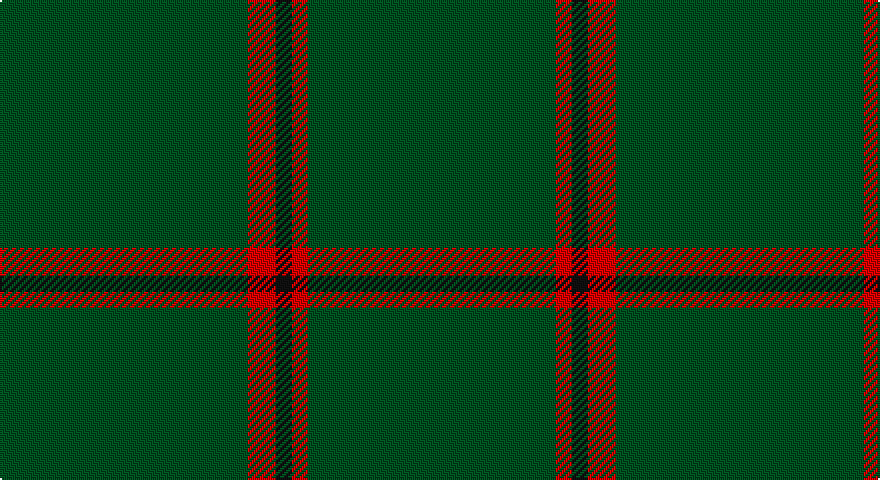

This page is one **sett** — a single exact thread-count. It belongs to the [tartan](/setts/dg62r7k4r4dg62/)
(the same proportion at any scale), whose colour order is pattern [GRKRG](/stripes/grkrg/).

Part of the [MacNab](/tartans/macnab/) tartan — the named design grouping this sett with its other cloths.

Sourced from register-of-tartans.  It is a [5 stripe tartan](/stripes/stripes5/).

Original link https://www.tartanregister.gov.uk/tartanDetails.aspx?ref=2672

## Also known as

This cloth is also recorded under:

- MacNab 3
- MacNab, Ancient

## Register references

External register numbers recorded for this tartan.

- Scottish Register of Tartans: [2672](https://www.tartanregister.gov.uk/tartanDetails.aspx?ref=2672)
- Scottish Tartans World Register: 2743

## Thread count
G/124 R14 K8 R8 G/124

One full sett is **308 threads**.

## Palette

Palette: <strong>Tartan Register</strong>
<table><thead><tr><th>Colour</th><th>Threads</th><th>Shade</th><th>Base</th><th>OKLCh</th></tr></thead><tbody><tr><td>G/</td><td style="text-align:right;font-variant-numeric:tabular-nums">124</td><td><code style="background-color:#005020;">#005020</code> <small style="color:#888">#005020</small></td><td>G <code style="background-color:#006100;">#006100</code></td><td><small style="color:#888">oklch(37.7% 0.105 149.6)</small></td></tr><tr><td>R</td><td style="text-align:right;font-variant-numeric:tabular-nums">14</td><td><code style="background-color:#DC0000;">#DC0000</code> <small style="color:#888">#DC0000</small></td><td>R <code style="background-color:#CC0000;">#CC0000</code></td><td><small style="color:#888">oklch(56.2% 0.230 29.2)</small></td></tr><tr><td>K</td><td style="text-align:right;font-variant-numeric:tabular-nums">8</td><td><code style="background-color:#101010;">#101010</code> <small style="color:#888">#101010</small></td><td>K <code style="background-color:#000000;">#000000</code></td><td><small style="color:#888">oklch(17.3% 0.000 89.9)</small></td></tr><tr><td>R</td><td style="text-align:right;font-variant-numeric:tabular-nums">8</td><td><code style="background-color:#DC0000;">#DC0000</code> <small style="color:#888">#DC0000</small></td><td>R <code style="background-color:#CC0000;">#CC0000</code></td><td><small style="color:#888">oklch(56.2% 0.230 29.2)</small></td></tr><tr><td>G/</td><td style="text-align:right;font-variant-numeric:tabular-nums">124</td><td><code style="background-color:#005020;">#005020</code> <small style="color:#888">#005020</small></td><td>G <code style="background-color:#006100;">#006100</code></td><td><small style="color:#888">oklch(37.7% 0.105 149.6)</small></td></tr></tbody></table>

# Sample pattern

## Compared to the master

This cloth is one sett of its design; the master sett (the exemplar the design is anchored on) is below for comparison.

<figure style="margin:0"><figcaption style="color:#888;font-size:smaller">this sett</figcaption></figure>
<figure style="margin:0"><figcaption style="color:#888;font-size:smaller"><a href="/setts/dg8dr1dg1dr1dg1dr6r8dr1r8dr6dg7dr1dg1/">master sett →</a></figcaption></figure>

## Nearest tartans

The nearest existing variants by ΔTartan distance, with this tartan at the top so the swatches line up against it.

ΔTartan

Tartan

Sett

—

<a href="/ttd/edit/#slug=dg62r7k4r4dg62~x2">MacNab, Ancient</a> <a class="nn-out" href="/variants/s5/dg62r7k4r4dg62~x2/" title="open its dictionary page">↗</a>

1.32

<a href="/ttd/edit/#slug=g2dp2g20g2g2dp1~x4&amp;base=dg62r7k4r4dg62~x2">Walters (Personal)</a> <a class="nn-out" href="/variants/s6/g2dp2g20g2g2dp1~x4/" title="open its dictionary page">↗</a>

1.54

<a href="/ttd/edit/#slug=k2g2g19g2g2g19r2~x2&amp;base=dg62r7k4r4dg62~x2">Kenmore Hunting (Fashion)</a> <a class="nn-out" href="/variants/s7/k2g2g19g2g2g19r2~x2/" title="open its dictionary page">↗</a>

1.84

<a href="/ttd/edit/#slug=dg30r2dg8r1dg5w2&amp;base=dg62r7k4r4dg62~x2">Dewi Sant</a> <a class="nn-out" href="/variants/s6/dg30r2dg8r1dg5w2/" title="open its dictionary page">↗</a>

1.90

<a href="/ttd/edit/#slug=dg2dy2dg15dy1w1dg15dy2dg2~x2&amp;base=dg62r7k4r4dg62~x2">Bannockbane Hunting</a> <a class="nn-out" href="/variants/s8/dg2dy2dg15dy1w1dg15dy2dg2~x2/" title="open its dictionary page">↗</a>

1.98

<a href="/ttd/edit/#slug=r2g19g2g2g19g2lo2~x2&amp;base=dg62r7k4r4dg62~x2">Kenmore Hunting</a> <a class="nn-out" href="/variants/s7/r2g19g2g2g19g2lo2~x2/" title="open its dictionary page">↗</a>

2.00

<a href="/ttd/edit/#slug=dy10ly1dy30y3~x4&amp;base=dg62r7k4r4dg62~x2">Pasteur</a> <a class="nn-out" href="/variants/s4/dy10ly1dy30y3~x4/" title="open its dictionary page">↗</a>

2.06

<a href="/variants/s10/gi2dp2gi20gi2gi2g1~x4/">Walters (Personal)</a>

2.15

<a href="/variants/s8/r8g3r4g44w4~x2/">Welsh National</a>

2.29

<a href="/ttd/edit/#slug=do10ly1do30y3~x4&amp;base=dg62r7k4r4dg62~x2">Pasteur Fancy Tartan</a> <a class="nn-out" href="/variants/s4/do10ly1do30y3~x4/" title="open its dictionary page">↗</a>

2.29

<a href="/ttd/edit/#slug=g23r3g7r3g23dp7~x2&amp;base=dg62r7k4r4dg62~x2">Highland Spring (1997)</a> <a class="nn-out" href="/variants/s6/g23r3g7r3g23dp7~x2/" title="open its dictionary page">↗</a>

## Neighbour map

Every grey dot is one of 14360 variants placed by the first two principal components of the ΔTartan feature space (44% of its variance). Red is this tartan; blue dots are its nearest — click one to open its page.

<svg viewBox="0 0 640 380" role="img" style="max-width:100%;height:auto;border:1px solid #e0e0e0;border-radius:4px;display:block" xmlns="http://www.w3.org/2000/svg"><image href="/nn/cloud.v1.png" width="640" height="380"/><a href="/variants/s6/g2dp2g20g2g2dp1~x4/"><circle cx="626.0" cy="226.0" r="4" fill="#3465a4"><title>Walters (Personal)</title></circle></a><a href="/variants/s7/k2g2g19g2g2g19r2~x2/"><circle cx="626.0" cy="256.8" r="4" fill="#3465a4"><title>Kenmore Hunting (Fashion)</title></circle></a><a href="/variants/s6/dg30r2dg8r1dg5w2/"><circle cx="626.0" cy="202.3" r="4" fill="#3465a4"><title>Dewi Sant</title></circle></a><a href="/variants/s8/dg2dy2dg15dy1w1dg15dy2dg2~x2/"><circle cx="626.0" cy="241.8" r="4" fill="#3465a4"><title>Bannockbane Hunting</title></circle></a><a href="/variants/s7/r2g19g2g2g19g2lo2~x2/"><circle cx="626.0" cy="276.2" r="4" fill="#3465a4"><title>Kenmore Hunting</title></circle></a><a href="/variants/s4/dy10ly1dy30y3~x4/"><circle cx="626.0" cy="239.1" r="4" fill="#3465a4"><title>Pasteur</title></circle></a><a href="/variants/s10/gi2dp2gi20gi2gi2g1~x4/"><circle cx="626.0" cy="218.8" r="4" fill="#3465a4"><title>Walters (Personal)</title></circle></a><a href="/variants/s8/r8g3r4g44w4~x2/"><circle cx="575.0" cy="207.6" r="4" fill="#3465a4"><title>Welsh National</title></circle></a><a href="/variants/s4/do10ly1do30y3~x4/"><circle cx="626.0" cy="232.1" r="4" fill="#3465a4"><title>Pasteur Fancy Tartan</title></circle></a><a href="/variants/s6/g23r3g7r3g23dp7~x2/"><circle cx="515.0" cy="278.5" r="4" fill="#3465a4"><title>Highland Spring (1997)</title></circle></a><circle cx="626.0" cy="264.5" r="5" fill="#c00000"/></svg>

ID: /variants/s5/dg62r7k4r4dg62~x2/
