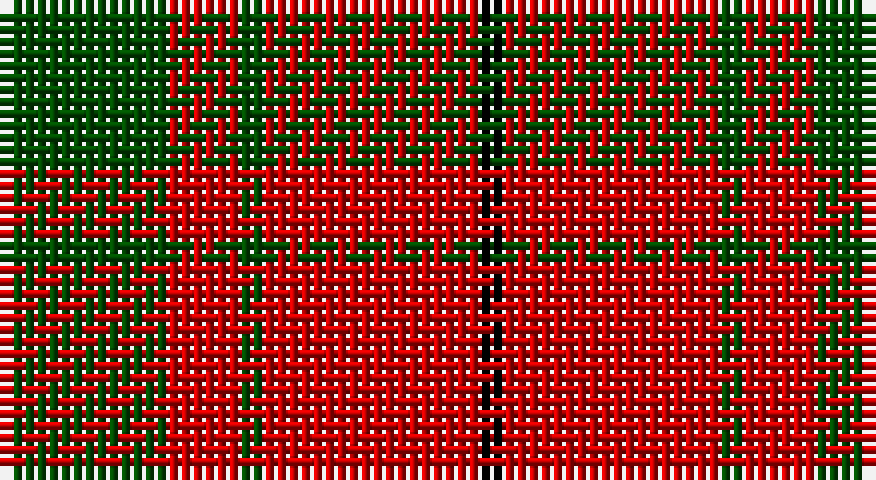

This page is one **sett** — a single exact thread-count. It belongs to the [tartan](/setts/dg7r3dg1r9k1/)
(the same proportion at any scale), whose colour order is pattern [GRGRK](/stripes/grgrk/).

Part of the [MacDonald of Sleat](/tartans/macdonald-of-sleat/) tartan — the named design grouping this sett with its other cloths.

Sourced from weddslist.  It is a [5 stripe tartan](/stripes/stripes5/).

Original link http://www.weddslist.com/cgi-bin/tartans/pg.pl?source=rb

## Also known as

This cloth is also recorded under:

- MacCullough
- MacDonald Lord of the Isles #2
- MacDonald of the Isles Portrait
- MacDonald, Lord of The Isles
- MacDonald, Lord of the Isles

## Thread count
G/14 R6 G2 R18 K/2

One full sett is **68 threads**.

## Palette

Palette: <strong>Tartan Register</strong>
<table><thead><tr><th>Colour</th><th>Threads</th><th>Shade</th><th>Base</th><th>OKLCh</th></tr></thead><tbody><tr><td>G/</td><td style="text-align:right;font-variant-numeric:tabular-nums">14</td><td><code style="background-color:#004C00;">#004C00</code> <small style="color:#888">#004C00</small></td><td>G <code style="background-color:#006100;">#006100</code></td><td><small style="color:#888">oklch(36.1% 0.123 142.5)</small></td></tr><tr><td>R</td><td style="text-align:right;font-variant-numeric:tabular-nums">6</td><td><code style="background-color:#C80000;">#C80000</code> <small style="color:#888">#C80000</small></td><td>R <code style="background-color:#CC0000;">#CC0000</code></td><td><small style="color:#888">oklch(52.3% 0.215 29.2)</small></td></tr><tr><td>G</td><td style="text-align:right;font-variant-numeric:tabular-nums">2</td><td><code style="background-color:#004C00;">#004C00</code> <small style="color:#888">#004C00</small></td><td>G <code style="background-color:#006100;">#006100</code></td><td><small style="color:#888">oklch(36.1% 0.123 142.5)</small></td></tr><tr><td>R</td><td style="text-align:right;font-variant-numeric:tabular-nums">18</td><td><code style="background-color:#C80000;">#C80000</code> <small style="color:#888">#C80000</small></td><td>R <code style="background-color:#CC0000;">#CC0000</code></td><td><small style="color:#888">oklch(52.3% 0.215 29.2)</small></td></tr><tr><td>K/</td><td style="text-align:right;font-variant-numeric:tabular-nums">2</td><td><code style="background-color:#000000;">#000000</code> <small style="color:#888">#000000</small></td><td>K <code style="background-color:#000000;">#000000</code></td><td><small style="color:#888">oklch(0.0% 0.000 0.0)</small></td></tr></tbody></table>

# Sample pattern

## Compared to the master

This cloth is one sett of its design; the master sett (the exemplar the design is anchored on) is below for comparison.

<figure style="margin:0"><figcaption style="color:#888;font-size:smaller">this sett</figcaption></figure>
<figure style="margin:0"><figcaption style="color:#888;font-size:smaller"><a href="/setts/g16r5g2r18k2/">master sett →</a></figcaption></figure>

## Nearest tartans

The nearest existing variants by ΔTartan distance, with this tartan at the top so the swatches line up against it.

ΔTartan

Tartan

Sett

—

<a href="/ttd/edit/#slug=dg7r3dg1r9k1~x2">MacDonald of Sleat</a> <a class="nn-out" href="/variants/s5/dg7r3dg1r9k1~x2/" title="open its dictionary page">↗</a>

0.44

<a href="/ttd/edit/#slug=dg16r5dg2r18k2~x2&amp;base=dg7r3dg1r9k1~x2">MacDonald Lord of the Isles #2</a> <a class="nn-out" href="/variants/s5/dg16r5dg2r18k2~x2/" title="open its dictionary page">↗</a>

0.76

<a href="/variants/s4/r10dg4ly1~x8/">Lugo (2013)</a>

0.78

<a href="/ttd/edit/#slug=g16r5g2r18k2~x2&amp;base=dg7r3dg1r9k1~x2">MacDonald, Lord of The Isles (Artef)</a> <a class="nn-out" href="/variants/s5/g16r5g2r18k2~x2/" title="open its dictionary page">↗</a>

0.85

<a href="/ttd/edit/#slug=r3dg20r25w3~x4&amp;base=dg7r3dg1r9k1~x2">MacKinnon #6</a> <a class="nn-out" href="/variants/s4/r3dg20r25w3~x4/" title="open its dictionary page">↗</a>

0.98

<a href="/ttd/edit/#slug=dg16r5dg2r18k2&amp;base=dg7r3dg1r9k1~x2">MacDonald of Sleat</a> <a class="nn-out" href="/variants/s5/dg16r5dg2r18k2/" title="open its dictionary page">↗</a>

0.99

<a href="/ttd/edit/#slug=r6g21k8r28k2r4~x2&amp;base=dg7r3dg1r9k1~x2">Dunbar</a> <a class="nn-out" href="/variants/s6/r6g21k8r28k2r4~x2/" title="open its dictionary page">↗</a>

1.01

<a href="/ttd/edit/#slug=r1g3r1g3r8ly1~x8&amp;base=dg7r3dg1r9k1~x2">Cameron</a> <a class="nn-out" href="/variants/s6/r1g3r1g3r8ly1~x8/" title="open its dictionary page">↗</a>

1.11

<a href="/ttd/edit/#slug=r4g14r5k6r24g2r4~x2&amp;base=dg7r3dg1r9k1~x2">Auld Lang Syne (red) Tartan</a> <a class="nn-out" href="/variants/s7/r4g14r5k6r24g2r4~x2/" title="open its dictionary page">↗</a>

1.13

<a href="/variants/s4/r10dg4lo1~x8/">Lugo (2013)</a>

1.13

<a href="/ttd/edit/#slug=k1r5g10r5g1~x4&amp;base=dg7r3dg1r9k1~x2">Murray, Lord George (Hose)</a> <a class="nn-out" href="/variants/s5/k1r5g10r5g1~x4/" title="open its dictionary page">↗</a>

## Neighbour map

Every grey dot is one of 14360 variants placed by the first two principal components of the ΔTartan feature space (44% of its variance). Red is this tartan; blue dots are its nearest — click one to open its page.

<svg viewBox="0 0 640 380" role="img" style="max-width:100%;height:auto;border:1px solid #e0e0e0;border-radius:4px;display:block" xmlns="http://www.w3.org/2000/svg"><image href="/nn/cloud.v1.png" width="640" height="380"/><a href="/variants/s5/dg16r5dg2r18k2~x2/"><circle cx="342.1" cy="233.7" r="4" fill="#3465a4"><title>MacDonald Lord of the Isles #2</title></circle></a><a href="/variants/s4/r10dg4ly1~x8/"><circle cx="330.2" cy="249.6" r="4" fill="#3465a4"><title>Lugo (2013)</title></circle></a><a href="/variants/s5/g16r5g2r18k2~x2/"><circle cx="351.5" cy="241.0" r="4" fill="#3465a4"><title>MacDonald, Lord of The Isles (Artef)</title></circle></a><a href="/variants/s4/r3dg20r25w3~x4/"><circle cx="333.9" cy="240.8" r="4" fill="#3465a4"><title>MacKinnon #6</title></circle></a><a href="/variants/s5/dg16r5dg2r18k2/"><circle cx="362.4" cy="250.4" r="4" fill="#3465a4"><title>MacDonald of Sleat</title></circle></a><a href="/variants/s6/r6g21k8r28k2r4~x2/"><circle cx="344.5" cy="208.5" r="4" fill="#3465a4"><title>Dunbar</title></circle></a><a href="/variants/s6/r1g3r1g3r8ly1~x8/"><circle cx="369.6" cy="227.2" r="4" fill="#3465a4"><title>Cameron</title></circle></a><a href="/variants/s7/r4g14r5k6r24g2r4~x2/"><circle cx="393.5" cy="206.4" r="4" fill="#3465a4"><title>Auld Lang Syne (red) Tartan</title></circle></a><a href="/variants/s4/r10dg4lo1~x8/"><circle cx="348.8" cy="264.4" r="4" fill="#3465a4"><title>Lugo (2013)</title></circle></a><a href="/variants/s5/k1r5g10r5g1~x4/"><circle cx="323.1" cy="240.3" r="4" fill="#3465a4"><title>Murray, Lord George (Hose)</title></circle></a><circle cx="353.6" cy="237.9" r="5" fill="#c00000"/></svg>

ID: /variants/s5/dg7r3dg1r9k1~x2/
