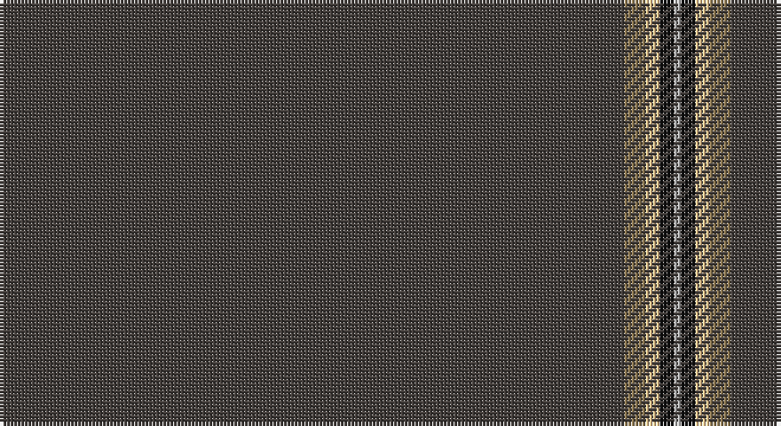

This page is one **sett** — a single exact thread-count. It belongs to the [tartan](/setts/do88o3ly2k2lr1/)
(the same proportion at any scale), whose colour order is pattern [BRYKY](/stripes/bryky/).

Part of the [Eternity](/tartans/eternity/) tartan — the named design grouping this sett with its other cloths.

Sourced from register-of-tartans.  It is a [5 stripe tartan](/stripes/stripes5/).

Original link https://www.tartanregister.gov.uk/tartanDetails.aspx?ref=10214

## Also known as

This cloth is also recorded under:

- Eternity, Dedicated 2 Weddings

## Register references

External register numbers recorded for this tartan.

- Scottish Register of Tartans: [10214](https://www.tartanregister.gov.uk/tartanDetails.aspx?ref=10214)

## Thread count
N/176 LT6 LY4 K4 Na/2

One full sett is **206 threads**.

## Palette

Palette: <strong>Tartan Register</strong> <small style="color:#888">(2 of 5 colours)</small>
<table><thead><tr><th>Colour</th><th>Threads</th><th>Shade</th><th>Base</th><th>OKLCh</th></tr></thead><tbody><tr><td>N/</td><td style="text-align:right;font-variant-numeric:tabular-nums">176</td><td><code style="background-color:#433E3B;">#433E3B</code> <small style="color:#888">#433E3B</small></td><td>B <code style="background-color:#2A418A;">#2A418A</code></td><td><small style="color:#888">oklch(36.8% 0.009 53.2)</small></td></tr><tr><td>LT</td><td style="text-align:right;font-variant-numeric:tabular-nums">6</td><td><code style="background-color:#8C7853;">#8C7853</code> <small style="color:#888">#8C7853</small></td><td>R <code style="background-color:#CC0000;">#CC0000</code></td><td><small style="color:#888">oklch(58.2% 0.058 82.4)</small></td></tr><tr><td>LY</td><td style="text-align:right;font-variant-numeric:tabular-nums">4</td><td><code style="background-color:#EEC591;">#EEC591</code> <small style="color:#888">#EEC591</small></td><td>Y <code style="background-color:#F2BF00;">#F2BF00</code></td><td><small style="color:#888">oklch(84.7% 0.082 73.0)</small></td></tr><tr><td>K</td><td style="text-align:right;font-variant-numeric:tabular-nums">4</td><td><code style="background-color:#101010;">#101010</code> <small style="color:#888">#101010</small></td><td>K <code style="background-color:#000000;">#000000</code></td><td><small style="color:#888">oklch(17.3% 0.000 89.9)</small></td></tr><tr><td>Na/</td><td style="text-align:right;font-variant-numeric:tabular-nums">2</td><td><code style="background-color:#B0B0B0;">#B0B0B0</code> <small style="color:#888">#B0B0B0</small></td><td>Y <code style="background-color:#F2BF00;">#F2BF00</code></td><td><small style="color:#888">oklch(75.7% 0.000 89.9)</small></td></tr></tbody></table>

# Sample pattern

## Nearest tartans

The nearest existing variants by ΔTartan distance, with this tartan at the top so the swatches line up against it.

ΔTartan

Tartan

Sett

—

<a href="/ttd/edit/#slug=do88o3ly2k2lr1~x2">Eternity, Dedicated 2 Weddings</a> <a class="nn-out" href="/variants/s5/do88o3ly2k2lr1~x2/" title="open its dictionary page">↗</a>

1.83

<a href="/variants/s5/n88dy3lo2ki2k1~x2/">Eternity Fashion Tartan</a>

1.95

<a href="/ttd/edit/#slug=dy96db8dy8w3dy8g3dy8r3~x2&amp;base=do88o3ly2k2lr1~x2">Burnett of Leys Hunting Family Tartan</a> <a class="nn-out" href="/variants/s8/dy96db8dy8w3dy8g3dy8r3~x2/" title="open its dictionary page">↗</a>

2.11

<a href="/ttd/edit/#slug=k50r1db3dp1~x4&amp;base=do88o3ly2k2lr1~x2">Alich (Personal)</a> <a class="nn-out" href="/variants/s4/k50r1db3dp1~x4/" title="open its dictionary page">↗</a>

2.17

<a href="/ttd/edit/#slug=k50r1dt3dp1~x4&amp;base=do88o3ly2k2lr1~x2">Alich (Personal)</a> <a class="nn-out" href="/variants/s4/k50r1dt3dp1~x4/" title="open its dictionary page">↗</a>

2.24

<a href="/ttd/edit/#slug=lr1r12dg2r1dg162r12ly1~x2&amp;base=do88o3ly2k2lr1~x2">MacFie</a> <a class="nn-out" href="/variants/s7/lr1r12dg2r1dg162r12ly1~x2/" title="open its dictionary page">↗</a>

2.30

<a href="/ttd/edit/#slug=o96db8o8w3o8g3o8r3~x2&amp;base=do88o3ly2k2lr1~x2">Burnett, of Leys hunting</a> <a class="nn-out" href="/variants/s8/o96db8o8w3o8g3o8r3~x2/" title="open its dictionary page">↗</a>

2.40

<a href="/ttd/edit/#slug=dg60r2dg8r1dg5k2&amp;base=do88o3ly2k2lr1~x2">St. David's (District)</a> <a class="nn-out" href="/variants/s6/dg60r2dg8r1dg5k2/" title="open its dictionary page">↗</a>

2.43

<a href="/ttd/edit/#slug=k99r5k4r3k2y1~x2&amp;base=do88o3ly2k2lr1~x2">Allt Dubh (Black Burn)</a> <a class="nn-out" href="/variants/s6/k99r5k4r3k2y1~x2/" title="open its dictionary page">↗</a>

2.46

<a href="/ttd/edit/#slug=k200dy3lo3dy3lo3&amp;base=do88o3ly2k2lr1~x2">SmartWool</a> <a class="nn-out" href="/variants/s5/k200dy3lo3dy3lo3/" title="open its dictionary page">↗</a>

2.50

<a href="/ttd/edit/#slug=t8lo2t8dg7t57k3lb1~x2&amp;base=do88o3ly2k2lr1~x2">Cullen (Christian Hill) (Personal)</a> <a class="nn-out" href="/variants/s7/t8lo2t8dg7t57k3lb1~x2/" title="open its dictionary page">↗</a>

## Neighbour map

Every grey dot is one of 14360 variants placed by the first two principal components of the ΔTartan feature space (44% of its variance). Red is this tartan; blue dots are its nearest — click one to open its page.

<svg viewBox="0 0 640 380" role="img" style="max-width:100%;height:auto;border:1px solid #e0e0e0;border-radius:4px;display:block" xmlns="http://www.w3.org/2000/svg"><image href="/nn/cloud.v1.png" width="640" height="380"/><a href="/variants/s5/n88dy3lo2ki2k1~x2/"><circle cx="626.0" cy="175.5" r="4" fill="#3465a4"><title>Eternity Fashion Tartan</title></circle></a><a href="/variants/s8/dy96db8dy8w3dy8g3dy8r3~x2/"><circle cx="626.0" cy="145.9" r="4" fill="#3465a4"><title>Burnett of Leys Hunting Family Tartan</title></circle></a><a href="/variants/s4/k50r1db3dp1~x4/"><circle cx="626.0" cy="213.2" r="4" fill="#3465a4"><title>Alich (Personal)</title></circle></a><a href="/variants/s4/k50r1dt3dp1~x4/"><circle cx="626.0" cy="216.9" r="4" fill="#3465a4"><title>Alich (Personal)</title></circle></a><a href="/variants/s7/lr1r12dg2r1dg162r12ly1~x2/"><circle cx="626.0" cy="148.6" r="4" fill="#3465a4"><title>MacFie</title></circle></a><a href="/variants/s8/o96db8o8w3o8g3o8r3~x2/"><circle cx="626.0" cy="154.7" r="4" fill="#3465a4"><title>Burnett, of Leys hunting</title></circle></a><a href="/variants/s6/dg60r2dg8r1dg5k2/"><circle cx="626.0" cy="199.7" r="4" fill="#3465a4"><title>St. David's (District)</title></circle></a><a href="/variants/s6/k99r5k4r3k2y1~x2/"><circle cx="626.0" cy="193.3" r="4" fill="#3465a4"><title>Allt Dubh (Black Burn)</title></circle></a><a href="/variants/s5/k200dy3lo3dy3lo3/"><circle cx="626.0" cy="190.9" r="4" fill="#3465a4"><title>SmartWool</title></circle></a><a href="/variants/s7/t8lo2t8dg7t57k3lb1~x2/"><circle cx="626.0" cy="132.5" r="4" fill="#3465a4"><title>Cullen (Christian Hill) (Personal)</title></circle></a><circle cx="626.0" cy="154.9" r="5" fill="#c00000"/></svg>

ID: /variants/s5/do88o3ly2k2lr1~x2/
