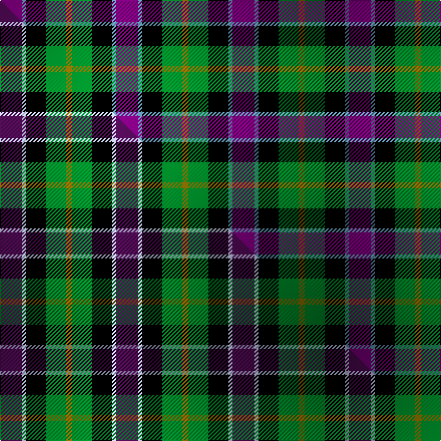

This is one **variant** — a specific cloth: this exact thread count and colourway, with its own
provenance below. It is one weaving of the [sett](/setts/dp11t2k10g10y3/) (the scale-free proportion — the
same cloth at any scale or shade), whose colour order is pattern [BBKGG](/stripes/bbkgg/).

Part of the [Nobiliary Fraternity. . .](/tartans/n/no/nobiliary-fraternity/) tartan — the named design grouping this sett with its other cloths.

Sourced from register-of-tartans.  It is a [5 stripe tartan](/stripes/stripes5/).

Original link [https://www.tartanregister.gov.uk/tartanDetails.aspx?ref=3144](https://www.tartanregister.gov.uk/tartanDetails.aspx?ref=3144)

Dataset <small>— provenance for this record, inherited from the source manifest</small>

<dl class="dataset-prov">
<dt>source</dt><dd><a href="/sources/register-of-tartans/">Scottish Register of Tartans</a></dd>
<dt>data captured from</dt><dd><a href="https://github.com/thetartan/tartan-database/blob/master/data/register-of-tartans/data.csv">https://github.com/thetartan/tartan-database/blob/master/data/register-of-tartans/data.csv</a></dd>
<dt>data date</dt><dd>1819 <small>(this record)</small></dd>
<dt>licence</dt><dd><a href="https://www.tartanregister.gov.uk/copyright">Crown copyright</a></dd>
</dl>

Capture chain <small>— the hands this data passed through, oldest first; each capture carries its own licence</small>

<ol class="capture-chain">
<li><a href="https://www.tartanregister.gov.uk/">Scottish Register of Tartans</a> · <a href="https://www.tartanregister.gov.uk/copyright">Crown copyright</a> <small>the living register — still published by National Records of Scotland</small></li>
<li><a href="https://github.com/thetartan/tartan-database">thetartan/tartan-database</a> <small>2016-2017</small> · <a href="https://creativecommons.org/licenses/by-nc-nd/4.0/">CC BY-NC-ND 4.0</a> <small>Levko Kravets's frozen compilation — the capture we vendored, and where its CC licence text came from</small></li>
<li>this dictionary <small>captured 2026-06-10 · commit 5bf86c7566</small> <small>each re-capture is a git commit to data/sources</small></li>
</ol>

## Register references

External register numbers recorded for this tartan.

- Scottish Register of Tartans: [3144](https://www.tartanregister.gov.uk/tartanDetails.aspx?ref=3144)
- Scottish Tartans Authority (ITI): 6997

## Thread count
DP/22 T4 K20 G20 Y/6

One full sett is **116 threads**.

## Palette
<table><thead><tr><th>Colour</th><th>Shade</th><th>OKLCh</th></tr></thead><tbody><tr><td>T</td><td><code style="background-color:#2888C4;">#2888C4</code> <small style="color:#888">#2888C4</small></td><td><small style="color:#888">oklch(60.1% 0.125 241.5)</small></td></tr><tr><td>T</td><td><code style="background-color:#5C8CA8;">#5C8CA8</code> <small style="color:#888">#5C8CA8</small></td><td><small style="color:#888">oklch(61.7% 0.067 235.0)</small></td></tr><tr><td>DG</td><td><code style="background-color:#053819;">#053819</code> <small style="color:#888">#053819</small></td><td><small style="color:#888">oklch(30.0% 0.075 151.3)</small></td></tr><tr><td>DP</td><td><code style="background-color:#440044;">#440044</code> <small style="color:#888">#440044</small></td><td><small style="color:#888">oklch(27.1% 0.125 328.4)</small></td></tr><tr><td>G</td><td><code style="background-color:#008B2A;">#008B2A</code> <small style="color:#888">#008B2A</small></td><td><small style="color:#888">oklch(55.4% 0.170 145.9)</small></td></tr><tr><td>K</td><td><code style="background-color:#000000;">#000000</code> <small style="color:#888">#000000</small></td><td><small style="color:#888">oklch(0.0% 0.000 0.0)</small></td></tr><tr><td>B</td><td><code style="background-color:#466CC8;">#466CC8</code> <small style="color:#888">#466CC8</small></td><td><small style="color:#888">oklch(55.1% 0.149 265.0)</small></td></tr><tr><td>DP</td><td><code style="background-color:#780078;">#780078</code> <small style="color:#888">#780078</small></td><td><small style="color:#888">oklch(40.2% 0.185 328.4)</small></td></tr><tr><td>Y</td><td><code style="background-color:#8B6E00;">#8B6E00</code> <small style="color:#888">#8B6E00</small></td><td><small style="color:#888">oklch(55.1% 0.113 90.4)</small></td></tr></tbody></table>

# Sample pattern

## Compared to the master

This cloth is one sett of its design; the master sett (the exemplar the design is anchored on) is below for comparison.

Its **ΔTartan distance** from the master is **0.09** — the same measure the nearest-tartans table ranks by (0 is identical; a re-scale of the same cloth is near 0, a recolour or a different proportion further).

<figure class="master-compare" style="margin:0">

this sett
master sett ★

<figcaption style="color:#888;font-size:smaller">One weave of this sett against the <a href="/setts/dp11lb2k10g10y3/">master sett ★</a>, split on the diagonal: a shared proportion runs seamlessly across it with only the shades shifting; a different proportion breaks on it.</figcaption>
</figure>

## Nearest tartan variants

The nearest existing variants by ΔTartan distance, with this cloth at the top so the swatches line up against it.

ΔTartan

Threads

Variant

Sett

—

116

<a href="/variants/s5/dp11t2k10g10y3~x2~dp1607327-t2503227/">Nobiliary Fraternity</a>

<a href="/ttd/edit/#slug=dp11lb2k10g10y3~x2&amp;base=dp11t2k10g10y3~x2~dp1607327-t2503227" title="compare in the TTD">0.09</a>

116

<a href="/variants/s5/dp11lb2k10g10y3~x2/">Wilson's No.217</a>

<a href="/ttd/edit/#slug=dp11lb2k10g10y2~x2&amp;base=dp11t2k10g10y3~x2~dp1607327-t2503227" title="compare in the TTD">0.13</a>

114

<a href="/variants/s5/dp11lb2k10g10y2~x2/">Wilson's, No 217</a>

<a href="/ttd/edit/#slug=dp11y2k10g10lo2~x2~dp1607327&amp;base=dp11t2k10g10y3~x2~dp1607327-t2503227" title="compare in the TTD">0.60</a>

114

<a href="/variants/s5/dp11y2k10g10lo2~x2~dp1607327/">Selkirk (Personal) Original</a>

<a href="/ttd/edit/#slug=dp11y2k10g10lo2~x2&amp;base=dp11t2k10g10y3~x2~dp1607327-t2503227" title="compare in the TTD">0.63</a>

114

<a href="/variants/s5/dp11y2k10g10lo2~x2/">Selkirk (Name)</a>

<a href="/ttd/edit/#slug=dp27db4k27g27lo4~x2&amp;base=dp11t2k10g10y3~x2~dp1607327-t2503227" title="compare in the TTD">0.67</a>

294

<a href="/variants/s5/dp27db4k27g27lo4~x2/">Selkirk (Personal)</a>

<a href="/ttd/edit/#slug=dp5k5g5w1~x4~dp1607327&amp;base=dp11t2k10g10y3~x2~dp1607327-t2503227" title="compare in the TTD">0.70</a>

104

<a href="/variants/s4/dp5k5g5w1~x4~dp1607327/">Wilson's No.220</a>

<a href="/ttd/edit/#slug=dp6k5g5r1~x2&amp;base=dp11t2k10g10y3~x2~dp1607327-t2503227" title="compare in the TTD">0.72</a>

54

<a href="/variants/s4/dp6k5g5r1~x2/">Unidentified No 60</a>

<a href="/ttd/edit/#slug=dp8k11g9r2~x2~dp1607327&amp;base=dp11t2k10g10y3~x2~dp1607327-t2503227" title="compare in the TTD">0.96</a>

100

<a href="/variants/s4/dp8k11g9r2~x2~dp1607327/">Norwich Collection No. 60</a>

<a href="/ttd/edit/#slug=dp8k11g9r2~x2&amp;base=dp11t2k10g10y3~x2~dp1607327-t2503227" title="compare in the TTD">0.96</a>

100

<a href="/variants/s4/dp8k11g9r2~x2/">Wilson's, No 159</a>

<a href="/ttd/edit/#slug=g9k11dp8lb2~x2&amp;base=dp11t2k10g10y3~x2~dp1607327-t2503227" title="compare in the TTD">0.96</a>

98

<a href="/variants/s4/g9k11dp8lb2~x2/">Wilson's No.228</a>

## Neighbour map

Every grey dot is one of 13656 variants placed by the first two principal components of the ΔTartan feature space (42% of its variance). Red is this tartan; blue dots are its nearest — click one to open its page. The map is a flat projection of a many-dimensional space — [how to read it](/posts/neighbourhood-maps/).

<svg viewBox="0 0 640 380" role="img" style="max-width:100%;height:auto;border:1px solid #e0e0e0;border-radius:4px;display:block" xmlns="http://www.w3.org/2000/svg"><image href="/nn/cloud.v1.png" width="640" height="380"/><a href="/variants/s5/dp11lb2k10g10y3~x2/"><circle cx="73.1" cy="223.0" r="4" fill="#3465a4"><title>Wilson's No.217</title></circle></a><a href="/variants/s5/dp11lb2k10g10y2~x2/"><circle cx="84.5" cy="235.4" r="4" fill="#3465a4"><title>Wilson's, No 217</title></circle></a><a href="/variants/s5/dp11y2k10g10lo2~x2~dp1607327/"><circle cx="82.2" cy="218.4" r="4" fill="#3465a4"><title>Selkirk (Personal) Original</title></circle></a><a href="/variants/s5/dp11y2k10g10lo2~x2/"><circle cx="85.4" cy="235.3" r="4" fill="#3465a4"><title>Selkirk (Name)</title></circle></a><a href="/variants/s5/dp27db4k27g27lo4~x2/"><circle cx="98.3" cy="223.9" r="4" fill="#3465a4"><title>Selkirk (Personal)</title></circle></a><a href="/variants/s4/dp5k5g5w1~x4~dp1607327/"><circle cx="88.8" cy="277.0" r="4" fill="#3465a4"><title>Wilson's No.220</title></circle></a><a href="/variants/s4/dp6k5g5r1~x2/"><circle cx="124.6" cy="269.8" r="4" fill="#3465a4"><title>Unidentified No 60</title></circle></a><a href="/variants/s4/dp8k11g9r2~x2~dp1607327/"><circle cx="115.7" cy="269.4" r="4" fill="#3465a4"><title>Norwich Collection No. 60</title></circle></a><a href="/variants/s4/dp8k11g9r2~x2/"><circle cx="119.6" cy="272.2" r="4" fill="#3465a4"><title>Wilson's, No 159</title></circle></a><a href="/variants/s4/g9k11dp8lb2~x2/"><circle cx="115.0" cy="273.3" r="4" fill="#3465a4"><title>Wilson's No.228</title></circle></a><circle cx="76.0" cy="240.7" r="5" fill="#c00000"/><text x="320" y="376" text-anchor="middle" font-size="11" fill="#999">ground</text><text x="11" y="190" text-anchor="middle" font-size="11" fill="#999" transform="rotate(-90 11 190)">complexity</text></svg>

ID: /variants/s5/dp11t2k10g10y3~x2~dp1607327-t2503227/
