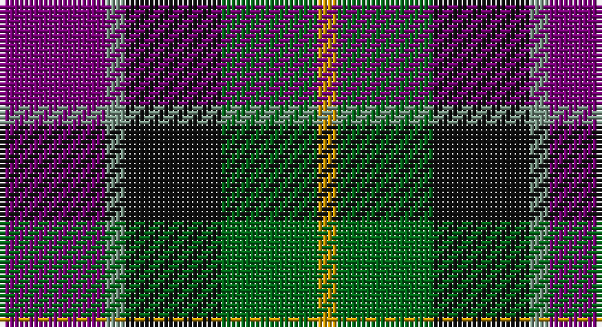

This page is one **sett** — a single exact thread-count. It belongs to the [tartan](/setts/dp11y2k10g10lo2/)
(the same proportion at any scale), whose colour order is pattern [BGKGY](/stripes/bgkgy/).

Part of the [Selkirk](/tartans/selkirk/) tartan — the named design grouping this sett with its other cloths.

Sourced from tartans-authority.  It is a [5 stripe tartan](/stripes/stripes5/).

Original link http://www.tartansauthority.com/tartan-ferret/display/3196/

## Also known as

This cloth is also recorded under:

- Selkirk Original

## Register references

External register numbers recorded for this tartan.

- Scottish Tartans Authority (ITI): 3196

## Thread count
P/22 LG4 K20 G20 DY/4

One full sett is **114 threads**.

## Palette

Palette: <strong>Tartan Register</strong> <small style="color:#888">(4 of 5 colours)</small>
<table><thead><tr><th>Colour</th><th>Threads</th><th>Shade</th><th>Base</th><th>OKLCh</th></tr></thead><tbody><tr><td>P/</td><td style="text-align:right;font-variant-numeric:tabular-nums">22</td><td><code style="background-color:#780078;">#780078</code> <small style="color:#888">#780078</small></td><td>B <code style="background-color:#2A418A;">#2A418A</code></td><td><small style="color:#888">oklch(40.2% 0.185 328.4)</small></td></tr><tr><td>LG</td><td style="text-align:right;font-variant-numeric:tabular-nums">4</td><td><code style="background-color:#789484;">#789484</code> <small style="color:#888">#789484</small></td><td>G <code style="background-color:#006100;">#006100</code></td><td><small style="color:#888">oklch(64.0% 0.040 160.0)</small></td></tr><tr><td>K</td><td style="text-align:right;font-variant-numeric:tabular-nums">20</td><td><code style="background-color:#101010;">#101010</code> <small style="color:#888">#101010</small></td><td>K <code style="background-color:#000000;">#000000</code></td><td><small style="color:#888">oklch(17.3% 0.000 89.9)</small></td></tr><tr><td>G</td><td style="text-align:right;font-variant-numeric:tabular-nums">20</td><td><code style="background-color:#006818;">#006818</code> <small style="color:#888">#006818</small></td><td>G <code style="background-color:#006100;">#006100</code></td><td><small style="color:#888">oklch(45.0% 0.142 145.0)</small></td></tr><tr><td>DY/</td><td style="text-align:right;font-variant-numeric:tabular-nums">4</td><td><code style="background-color:#D09800;">#D09800</code> <small style="color:#888">#D09800</small></td><td>Y <code style="background-color:#F2BF00;">#F2BF00</code></td><td><small style="color:#888">oklch(71.4% 0.147 82.1)</small></td></tr></tbody></table>

# Sample pattern

## Nearest tartans

The nearest existing variants by ΔTartan distance, with this tartan at the top so the swatches line up against it.

ΔTartan

Tartan

Sett

—

<a href="/ttd/edit/#slug=dp11y2k10g10lo2~x2">Selkirk (Name)</a> <a class="nn-out" href="/variants/s5/dp11y2k10g10lo2~x2/" title="open its dictionary page">↗</a>

0.47

<a href="/ttd/edit/#slug=dp11t2k10g10ly3~x2&amp;base=dp11y2k10g10lo2~x2">Nobiliary Fraternity</a> <a class="nn-out" href="/variants/s5/dp11t2k10g10ly3~x2/" title="open its dictionary page">↗</a>

0.62

<a href="/ttd/edit/#slug=dp27db4k27g27lo4~x2&amp;base=dp11y2k10g10lo2~x2">Selkirk (Personal)</a> <a class="nn-out" href="/variants/s5/dp27db4k27g27lo4~x2/" title="open its dictionary page">↗</a>

0.79

<a href="/ttd/edit/#slug=g15dg18db23w4r8~x2&amp;base=dp11y2k10g10lo2~x2">Friebe (2014)</a> <a class="nn-out" href="/variants/s5/g15dg18db23w4r8~x2/" title="open its dictionary page">↗</a>

0.82

<a href="/ttd/edit/#slug=dp2g6k2db6k1r2~x4&amp;base=dp11y2k10g10lo2~x2">MacCaughan, or MacEachain</a> <a class="nn-out" href="/variants/s6/dp2g6k2db6k1r2~x4/" title="open its dictionary page">↗</a>

0.96

<a href="/ttd/edit/#slug=r10db6g24dbi24r6ly3&amp;base=dp11y2k10g10lo2~x2">Canine All Dogs (Fashion)</a> <a class="nn-out" href="/variants/s6/r10db6g24dbi24r6ly3/" title="open its dictionary page">↗</a>

0.99

<a href="/variants/s5/dp20k5ki19g19ly2~x2/">Martin Hunting</a>

0.99

<a href="/ttd/edit/#slug=r2k1db6k2g6m2~x4&amp;base=dp11y2k10g10lo2~x2">MacEachain (Clan)</a> <a class="nn-out" href="/variants/s6/r2k1db6k2g6m2~x4/" title="open its dictionary page">↗</a>

1.01

<a href="/ttd/edit/#slug=r1db7k7g7w1~x6&amp;base=dp11y2k10g10lo2~x2">Davidson of Tulloch (Clan)</a> <a class="nn-out" href="/variants/s5/r1db7k7g7w1~x6/" title="open its dictionary page">↗</a>

1.01

<a href="/ttd/edit/#slug=k3g8k8r2db8w2~x2&amp;base=dp11y2k10g10lo2~x2">Mitchell Family Tartan</a> <a class="nn-out" href="/variants/s6/k3g8k8r2db8w2~x2/" title="open its dictionary page">↗</a>

1.02

<a href="/ttd/edit/#slug=r4g11k11g2n11ly3~x4&amp;base=dp11y2k10g10lo2~x2">Casely (Name)</a> <a class="nn-out" href="/variants/s6/r4g11k11g2n11ly3~x4/" title="open its dictionary page">↗</a>

## Neighbour map

Every grey dot is one of 14360 variants placed by the first two principal components of the ΔTartan feature space (44% of its variance). Red is this tartan; blue dots are its nearest — click one to open its page.

<svg viewBox="0 0 640 380" role="img" style="max-width:100%;height:auto;border:1px solid #e0e0e0;border-radius:4px;display:block" xmlns="http://www.w3.org/2000/svg"><image href="/nn/cloud.v1.png" width="640" height="380"/><a href="/variants/s5/dp11t2k10g10ly3~x2/"><circle cx="87.8" cy="247.3" r="4" fill="#3465a4"><title>Nobiliary Fraternity</title></circle></a><a href="/variants/s5/dp27db4k27g27lo4~x2/"><circle cx="136.0" cy="244.5" r="4" fill="#3465a4"><title>Selkirk (Personal)</title></circle></a><a href="/variants/s5/g15dg18db23w4r8~x2/"><circle cx="91.0" cy="251.4" r="4" fill="#3465a4"><title>Friebe (2014)</title></circle></a><a href="/variants/s6/dp2g6k2db6k1r2~x4/"><circle cx="94.1" cy="227.1" r="4" fill="#3465a4"><title>MacCaughan, or MacEachain</title></circle></a><a href="/variants/s6/r10db6g24dbi24r6ly3/"><circle cx="141.9" cy="215.2" r="4" fill="#3465a4"><title>Canine All Dogs (Fashion)</title></circle></a><a href="/variants/s5/dp20k5ki19g19ly2~x2/"><circle cx="137.9" cy="229.9" r="4" fill="#3465a4"><title>Martin Hunting</title></circle></a><a href="/variants/s6/r2k1db6k2g6m2~x4/"><circle cx="118.6" cy="242.0" r="4" fill="#3465a4"><title>MacEachain (Clan)</title></circle></a><a href="/variants/s5/r1db7k7g7w1~x6/"><circle cx="126.6" cy="242.8" r="4" fill="#3465a4"><title>Davidson of Tulloch (Clan)</title></circle></a><a href="/variants/s6/k3g8k8r2db8w2~x2/"><circle cx="94.7" cy="257.5" r="4" fill="#3465a4"><title>Mitchell Family Tartan</title></circle></a><a href="/variants/s6/r4g11k11g2n11ly3~x4/"><circle cx="98.4" cy="244.4" r="4" fill="#3465a4"><title>Casely (Name)</title></circle></a><circle cx="111.6" cy="248.1" r="5" fill="#c00000"/></svg>

ID: /variants/s5/dp11y2k10g10lo2~x2/
