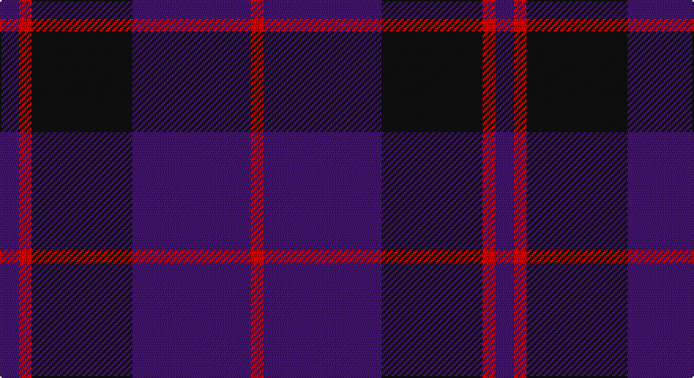

This page is one **sett** — a single exact thread-count. It belongs to the [tartan](/setts/dp12r8k64dp75r8/)
(the same proportion at any scale), whose colour order is pattern [BRKBR](/stripes/brkbr/).

Sourced from register-of-tartans.  It is a [5 stripe tartan](/stripes/stripes5/).

Original link https://www.tartanregister.gov.uk/tartanDetails.aspx?ref=11395

## Register references

External register numbers recorded for this tartan.

- Scottish Register of Tartans: [11395](https://www.tartanregister.gov.uk/tartanDetails.aspx?ref=11395)

## Thread count
DB/12 R8 K64 DB75 R/8

One full sett is **314 threads**.

## Palette

Palette: <strong>Logan (The Scottish Gael, 1831)</strong> <small style="color:#888">(2 of 3 colours)</small>
<table><thead><tr><th>Colour</th><th>Threads</th><th>Shade</th><th>Base</th><th>OKLCh</th></tr></thead><tbody><tr><td>DB/</td><td style="text-align:right;font-variant-numeric:tabular-nums">12</td><td><code style="background-color:#43146F;">#43146F</code> <small style="color:#888">#43146F</small></td><td>B <code style="background-color:#2A418A;">#2A418A</code></td><td><small style="color:#888">oklch(32.3% 0.145 302.0)</small></td></tr><tr><td>R</td><td style="text-align:right;font-variant-numeric:tabular-nums">8</td><td><code style="background-color:#DC0000;">#DC0000</code> <small style="color:#888">#DC0000</small></td><td>R <code style="background-color:#CC0000;">#CC0000</code></td><td><small style="color:#888">oklch(56.2% 0.230 29.2)</small></td></tr><tr><td>K</td><td style="text-align:right;font-variant-numeric:tabular-nums">64</td><td><code style="background-color:#101010;">#101010</code> <small style="color:#888">#101010</small></td><td>K <code style="background-color:#000000;">#000000</code></td><td><small style="color:#888">oklch(17.3% 0.000 89.9)</small></td></tr><tr><td>DB</td><td style="text-align:right;font-variant-numeric:tabular-nums">75</td><td><code style="background-color:#43146F;">#43146F</code> <small style="color:#888">#43146F</small></td><td>B <code style="background-color:#2A418A;">#2A418A</code></td><td><small style="color:#888">oklch(32.3% 0.145 302.0)</small></td></tr><tr><td>R/</td><td style="text-align:right;font-variant-numeric:tabular-nums">8</td><td><code style="background-color:#DC0000;">#DC0000</code> <small style="color:#888">#DC0000</small></td><td>R <code style="background-color:#CC0000;">#CC0000</code></td><td><small style="color:#888">oklch(56.2% 0.230 29.2)</small></td></tr></tbody></table>

# Sample pattern

## Nearest tartans

The nearest existing variants by ΔTartan distance, with this tartan at the top so the swatches line up against it.

ΔTartan

Tartan

Sett

—

<a href="/ttd/edit/#slug=dp12r8k64dp75r8">Laurel Cadre, The</a> <a class="nn-out" href="/variants/s5/dp12r8k64dp75r8/" title="open its dictionary page">↗</a>

1.16

<a href="/ttd/edit/#slug=db1r3db1r3db6g1~x8&amp;base=dp12r8k64dp75r8">Robbins</a> <a class="nn-out" href="/variants/s6/db1r3db1r3db6g1~x8/" title="open its dictionary page">↗</a>

1.23

<a href="/ttd/edit/#slug=db13n6r51db51n5~x2&amp;base=dp12r8k64dp75r8">Hillsdale (Corporate?)</a> <a class="nn-out" href="/variants/s5/db13n6r51db51n5~x2/" title="open its dictionary page">↗</a>

1.34

<a href="/ttd/edit/#slug=k3db23k17r2~x2&amp;base=dp12r8k64dp75r8">Wellington Variation</a> <a class="nn-out" href="/variants/s4/k3db23k17r2~x2/" title="open its dictionary page">↗</a>

1.35

<a href="/ttd/edit/#slug=db1k3db1k3db8r1~x4&amp;base=dp12r8k64dp75r8">Morgan (MacKay Blue) Clan Tartan</a> <a class="nn-out" href="/variants/s6/db1k3db1k3db8r1~x4/" title="open its dictionary page">↗</a>

1.38

<a href="/ttd/edit/#slug=db5k2db14k14db2lr2~x2&amp;base=dp12r8k64dp75r8">Royal Scotsman Train (Corporate)</a> <a class="nn-out" href="/variants/s6/db5k2db14k14db2lr2~x2/" title="open its dictionary page">↗</a>

1.41

<a href="/ttd/edit/#slug=dp30db30y4db4y4db5r6~x2&amp;base=dp12r8k64dp75r8">Komissarov, Dmitry (Personal)</a> <a class="nn-out" href="/variants/s7/dp30db30y4db4y4db5r6~x2/" title="open its dictionary page">↗</a>

1.48

<a href="/ttd/edit/#slug=db1m3db1m3db6g1~x4&amp;base=dp12r8k64dp75r8">Robbins Family Tartan</a> <a class="nn-out" href="/variants/s6/db1m3db1m3db6g1~x4/" title="open its dictionary page">↗</a>

1.49

<a href="/ttd/edit/#slug=dp26r6g16dp8g3r2~x2&amp;base=dp12r8k64dp75r8">Perthshire Tourist Board (Corporate)</a> <a class="nn-out" href="/variants/s6/dp26r6g16dp8g3r2~x2/" title="open its dictionary page">↗</a>

1.54

<a href="/ttd/edit/#slug=k15db4k15db28r2~x2&amp;base=dp12r8k64dp75r8">MacKay (Blue) #2</a> <a class="nn-out" href="/variants/s5/k15db4k15db28r2~x2/" title="open its dictionary page">↗</a>

1.57

<a href="/ttd/edit/#slug=k4r2k12db12k1lo2~x2&amp;base=dp12r8k64dp75r8">Robert Gordon University</a> <a class="nn-out" href="/variants/s6/k4r2k12db12k1lo2~x2/" title="open its dictionary page">↗</a>

## Neighbour map

Every grey dot is one of 14360 variants placed by the first two principal components of the ΔTartan feature space (44% of its variance). Red is this tartan; blue dots are its nearest — click one to open its page.

<svg viewBox="0 0 640 380" role="img" style="max-width:100%;height:auto;border:1px solid #e0e0e0;border-radius:4px;display:block" xmlns="http://www.w3.org/2000/svg"><image href="/nn/cloud.v1.png" width="640" height="380"/><a href="/variants/s6/db1r3db1r3db6g1~x8/"><circle cx="332.0" cy="274.0" r="4" fill="#3465a4"><title>Robbins</title></circle></a><a href="/variants/s5/db13n6r51db51n5~x2/"><circle cx="386.6" cy="268.1" r="4" fill="#3465a4"><title>Hillsdale (Corporate?)</title></circle></a><a href="/variants/s4/k3db23k17r2~x2/"><circle cx="394.4" cy="286.2" r="4" fill="#3465a4"><title>Wellington Variation</title></circle></a><a href="/variants/s6/db1k3db1k3db8r1~x4/"><circle cx="404.2" cy="272.9" r="4" fill="#3465a4"><title>Morgan (MacKay Blue) Clan Tartan</title></circle></a><a href="/variants/s6/db5k2db14k14db2lr2~x2/"><circle cx="353.0" cy="271.7" r="4" fill="#3465a4"><title>Royal Scotsman Train (Corporate)</title></circle></a><a href="/variants/s7/dp30db30y4db4y4db5r6~x2/"><circle cx="292.1" cy="227.0" r="4" fill="#3465a4"><title>Komissarov, Dmitry (Personal)</title></circle></a><a href="/variants/s6/db1m3db1m3db6g1~x4/"><circle cx="355.1" cy="281.2" r="4" fill="#3465a4"><title>Robbins Family Tartan</title></circle></a><a href="/variants/s6/dp26r6g16dp8g3r2~x2/"><circle cx="378.4" cy="240.4" r="4" fill="#3465a4"><title>Perthshire Tourist Board (Corporate)</title></circle></a><a href="/variants/s5/k15db4k15db28r2~x2/"><circle cx="378.2" cy="271.0" r="4" fill="#3465a4"><title>MacKay (Blue) #2</title></circle></a><a href="/variants/s6/k4r2k12db12k1lo2~x2/"><circle cx="338.6" cy="238.5" r="4" fill="#3465a4"><title>Robert Gordon University</title></circle></a><circle cx="367.2" cy="260.0" r="5" fill="#c00000"/></svg>

ID: /variants/s5/dp12r8k64dp75r8/
