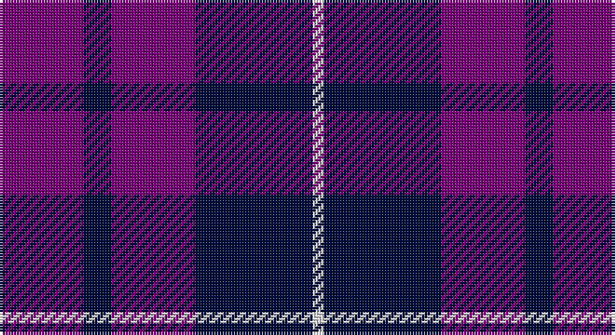

This page is one **sett** — a single exact thread-count. It belongs to the [tartan](/setts/dp15k5dp15k21w2/)
(the same proportion at any scale), whose colour order is pattern [BKBKW](/stripes/bkbkw/).

Part of the [Highland Spirit](/tartans/highland-spirit/) tartan — the named design grouping this sett with its other cloths.

Sourced from tartans-authority.  It is a [5 stripe tartan](/stripes/stripes5/).

Original link http://www.tartansauthority.com/tartan-ferret/display/5739/

## Also known as

This cloth is also recorded under:

- Highland Spirit Weavers

## Register references

External register numbers recorded for this tartan.

- Scottish Tartans Authority (ITI): 5739

## Thread count
P/30 DB10 P30 DB42 LN/4

One full sett is **198 threads**.

## Palette

Palette: <strong>Tartan Register</strong> <small style="color:#888">(2 of 3 colours)</small>
<table><thead><tr><th>Colour</th><th>Threads</th><th>Shade</th><th>Base</th><th>OKLCh</th></tr></thead><tbody><tr><td>P/</td><td style="text-align:right;font-variant-numeric:tabular-nums">30</td><td><code style="background-color:#780078;">#780078</code> <small style="color:#888">#780078</small></td><td>B <code style="background-color:#2A418A;">#2A418A</code></td><td><small style="color:#888">oklch(40.2% 0.185 328.4)</small></td></tr><tr><td>DB</td><td style="text-align:right;font-variant-numeric:tabular-nums">10</td><td><code style="background-color:#000C3C;">#000C3C</code> <small style="color:#888">#000C3C</small></td><td>K <code style="background-color:#000000;">#000000</code></td><td><small style="color:#888">oklch(18.7% 0.094 263.0)</small></td></tr><tr><td>P</td><td style="text-align:right;font-variant-numeric:tabular-nums">30</td><td><code style="background-color:#780078;">#780078</code> <small style="color:#888">#780078</small></td><td>B <code style="background-color:#2A418A;">#2A418A</code></td><td><small style="color:#888">oklch(40.2% 0.185 328.4)</small></td></tr><tr><td>DB</td><td style="text-align:right;font-variant-numeric:tabular-nums">42</td><td><code style="background-color:#000C3C;">#000C3C</code> <small style="color:#888">#000C3C</small></td><td>K <code style="background-color:#000000;">#000000</code></td><td><small style="color:#888">oklch(18.7% 0.094 263.0)</small></td></tr><tr><td>LN/</td><td style="text-align:right;font-variant-numeric:tabular-nums">4</td><td><code style="background-color:#E0E0E0;">#E0E0E0</code> <small style="color:#888">#E0E0E0</small></td><td>W <code style="background-color:#F7F7F7;">#F7F7F7</code></td><td><small style="color:#888">oklch(90.7% 0.000 89.9)</small></td></tr></tbody></table>

# Sample pattern

## Compared to the master

This cloth is one sett of its design; the master sett (the exemplar the design is anchored on) is below for comparison.

<figure style="margin:0"><figcaption style="color:#888;font-size:smaller">this sett</figcaption></figure>
<figure style="margin:0"><figcaption style="color:#888;font-size:smaller"><a href="/setts/k21dp15k5dp15k5dp15k21w2/">master sett →</a></figcaption></figure>

## Nearest tartans

The nearest existing variants by ΔTartan distance, with this tartan at the top so the swatches line up against it.

ΔTartan

Tartan

Sett

—

<a href="/ttd/edit/#slug=dp15k5dp15k21w2~x2">Highland Spirit (Fashion)</a> <a class="nn-out" href="/variants/s5/dp15k5dp15k21w2~x2/" title="open its dictionary page">↗</a>

1.09

<a href="/ttd/edit/#slug=k21dp15k5dp15k5dp15k21w2~x2&amp;base=dp15k5dp15k21w2~x2">Highland Spirit</a> <a class="nn-out" href="/variants/s8/k21dp15k5dp15k5dp15k21w2~x2/" title="open its dictionary page">↗</a>

1.43

<a href="/variants/s4/r10db10lo1~x4/">Mother's Pride</a>

1.49

<a href="/ttd/edit/#slug=db1r3db1r3db6g1~x8&amp;base=dp15k5dp15k21w2~x2">Robbins</a> <a class="nn-out" href="/variants/s6/db1r3db1r3db6g1~x8/" title="open its dictionary page">↗</a>

1.52

<a href="/ttd/edit/#slug=dp27k10dp27k35ly6&amp;base=dp15k5dp15k21w2~x2">Moorlands (Corporate)</a> <a class="nn-out" href="/variants/s5/dp27k10dp27k35ly6/" title="open its dictionary page">↗</a>

1.58

<a href="/ttd/edit/#slug=dp23dg8dp23dg35w5~x2&amp;base=dp15k5dp15k21w2~x2">Baru</a> <a class="nn-out" href="/variants/s5/dp23dg8dp23dg35w5~x2/" title="open its dictionary page">↗</a>

1.59

<a href="/ttd/edit/#slug=db6r1db6r9lr1~x2&amp;base=dp15k5dp15k21w2~x2">Hamilton</a> <a class="nn-out" href="/variants/s5/db6r1db6r9lr1~x2/" title="open its dictionary page">↗</a>

1.70

<a href="/ttd/edit/#slug=db10r24db4r3db24w2r6db6~x2&amp;base=dp15k5dp15k21w2~x2">Embrace, The</a> <a class="nn-out" href="/variants/s8/db10r24db4r3db24w2r6db6~x2/" title="open its dictionary page">↗</a>

1.72

<a href="/ttd/edit/#slug=dp12r8k64dp75r8&amp;base=dp15k5dp15k21w2~x2">Laurel Cadre, The</a> <a class="nn-out" href="/variants/s5/dp12r8k64dp75r8/" title="open its dictionary page">↗</a>

1.87

<a href="/ttd/edit/#slug=k15r8ly2db25k5db13k5~x2&amp;base=dp15k5dp15k21w2~x2">Gifford (Personal)</a> <a class="nn-out" href="/variants/s7/k15r8ly2db25k5db13k5~x2/" title="open its dictionary page">↗</a>

1.87

<a href="/ttd/edit/#slug=r6db35k36db36w6&amp;base=dp15k5dp15k21w2~x2">Davidson of Tulloch Clan Tartan</a> <a class="nn-out" href="/variants/s5/r6db35k36db36w6/" title="open its dictionary page">↗</a>

## Neighbour map

Every grey dot is one of 14360 variants placed by the first two principal components of the ΔTartan feature space (44% of its variance). Red is this tartan; blue dots are its nearest — click one to open its page.

<svg viewBox="0 0 640 380" role="img" style="max-width:100%;height:auto;border:1px solid #e0e0e0;border-radius:4px;display:block" xmlns="http://www.w3.org/2000/svg"><image href="/nn/cloud.v1.png" width="640" height="380"/><a href="/variants/s8/k21dp15k5dp15k5dp15k21w2~x2/"><circle cx="339.4" cy="262.4" r="4" fill="#3465a4"><title>Highland Spirit</title></circle></a><a href="/variants/s4/r10db10lo1~x4/"><circle cx="393.0" cy="297.9" r="4" fill="#3465a4"><title>Mother's Pride</title></circle></a><a href="/variants/s6/db1r3db1r3db6g1~x8/"><circle cx="332.0" cy="274.0" r="4" fill="#3465a4"><title>Robbins</title></circle></a><a href="/variants/s5/dp27k10dp27k35ly6/"><circle cx="285.8" cy="287.6" r="4" fill="#3465a4"><title>Moorlands (Corporate)</title></circle></a><a href="/variants/s5/dp23dg8dp23dg35w5~x2/"><circle cx="292.8" cy="279.1" r="4" fill="#3465a4"><title>Baru</title></circle></a><a href="/variants/s5/db6r1db6r9lr1~x2/"><circle cx="312.5" cy="251.2" r="4" fill="#3465a4"><title>Hamilton</title></circle></a><a href="/variants/s8/db10r24db4r3db24w2r6db6~x2/"><circle cx="352.3" cy="212.9" r="4" fill="#3465a4"><title>Embrace, The</title></circle></a><a href="/variants/s5/dp12r8k64dp75r8/"><circle cx="367.2" cy="260.0" r="4" fill="#3465a4"><title>Laurel Cadre, The</title></circle></a><a href="/variants/s7/k15r8ly2db25k5db13k5~x2/"><circle cx="299.5" cy="226.1" r="4" fill="#3465a4"><title>Gifford (Personal)</title></circle></a><a href="/variants/s5/r6db35k36db36w6/"><circle cx="305.4" cy="275.2" r="4" fill="#3465a4"><title>Davidson of Tulloch Clan Tartan</title></circle></a><circle cx="336.3" cy="268.5" r="5" fill="#c00000"/></svg>

ID: /variants/s5/dp15k5dp15k21w2~x2/
