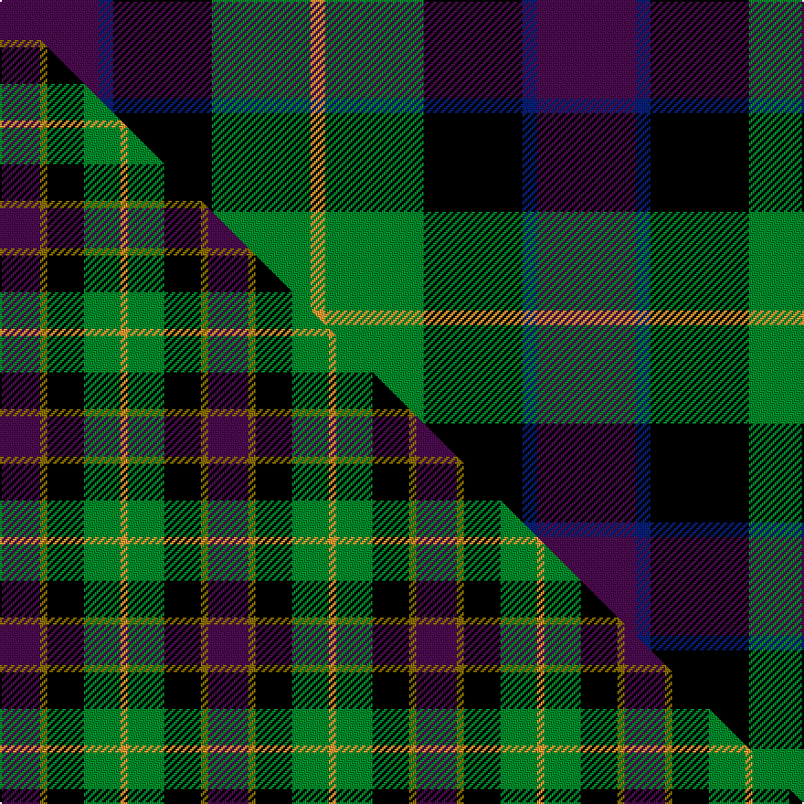

This is one **variant** — a specific cloth: this exact thread count and colourway, with its own
provenance below. It is one weaving of the [sett](/tartans/s/se/selkirk-2/) (the scale-free proportion — the
same cloth at any scale or shade), whose colour order is pattern [BBKGY](/stripes/bbkgy/).

Part of the [Selkirk](/tartans/s/se/selkirk-2/) tartan — the named design grouping this sett with its other cloths.

Sourced from tartans-authority.  It is a [5 stripe tartan](/stripes/stripes5/).

Original link <code>http://www.tartansauthority.com/tartan-ferret/display/3195/</code> — retired · [Internet Archive copy](https://web.archive.org/web/*/http://www.tartansauthority.com/tartan-ferret/display/3195/*)

Dataset <small>— provenance for this record, inherited from the source manifest</small>

<dl class="dataset-prov">
<dt>source</dt><dd><a href="/sources/tartans-authority/">Scottish Tartans Authority</a></dd>
<dt>data captured from</dt><dd><a href="https://github.com/thetartan/tartan-database/blob/master/data/tartans-authority/data.csv">https://github.com/thetartan/tartan-database/blob/master/data/tartans-authority/data.csv</a></dd>
<dt>data date</dt><dd>1995 <small>(this record)</small></dd>
<dt>licence</dt><dd><a href="https://creativecommons.org/licenses/by-nc-nd/4.0/">CC BY-NC-ND 4.0</a></dd>
</dl>

Capture chain <small>— the hands this data passed through, oldest first; each capture carries its own licence</small>

<ol class="capture-chain">
<li><a href="https://www.tartansauthority.com/">Scottish Tartans Authority</a> <small>the heritage body’s archive — its tartan-ferret record browser is retired; dead record links are shown unlinked, with an Internet Archive copy (ITI numbers are not SRT references)</small></li>
<li><a href="https://github.com/thetartan/tartan-database">thetartan/tartan-database</a> <small>2016-2017</small> · <a href="https://creativecommons.org/licenses/by-nc-nd/4.0/">CC BY-NC-ND 4.0</a> <small>Levko Kravets's frozen compilation — the capture we vendored, and where its CC licence text came from</small></li>
<li>this dictionary <small>captured 2026-06-10 · commit 5bf86c7566</small> <small>each re-capture is a git commit to data/sources</small></li>
</ol>

## Register references

External register numbers recorded for this tartan.

- Scottish Tartans Authority (ITI): 3195

## Thread count
DP/54 DB8 K54 G54 LO/8

One full sett is **294 threads**.

## Palette
<table><thead><tr><th>Colour</th><th>Shade</th><th>OKLCh</th></tr></thead><tbody><tr><td>DB</td><td><code style="background-color:#082077;">#082077</code> <small style="color:#888">#082077</small></td><td><small style="color:#888">oklch(30.0% 0.149 265.1)</small></td></tr><tr><td>LO</td><td><code style="background-color:#FF9C34;">#FF9C34</code> <small style="color:#888">#FF9C34</small></td><td><small style="color:#888">oklch(77.9% 0.161 61.8)</small></td></tr><tr><td>G</td><td><code style="background-color:#008B2A;">#008B2A</code> <small style="color:#888">#008B2A</small></td><td><small style="color:#888">oklch(55.4% 0.170 145.9)</small></td></tr><tr><td>K</td><td><code style="background-color:#000000;">#000000</code> <small style="color:#888">#000000</small></td><td><small style="color:#888">oklch(0.0% 0.000 0.0)</small></td></tr><tr><td>DP</td><td><code style="background-color:#4B0B4F;">#4B0B4F</code> <small style="color:#888">#4B0B4F</small></td><td><small style="color:#888">oklch(30.1% 0.125 325.4)</small></td></tr></tbody></table>

# Sample pattern

## Compared to the master

This cloth is one sett of its design; the master sett (the exemplar the design is anchored on) is below for comparison.

Its **ΔTartan distance** from the master is **0.63** — the same measure the nearest-tartans table ranks by (0 is identical; a re-scale of the same cloth is near 0, a recolour or a different proportion further).

<figure class="master-compare" style="margin:0">

this sett
master sett ★

<figcaption style="color:#888;font-size:smaller">One weave of this sett against the <a href="/setts/dp11y2k10g10lo2/">master sett ★</a>, split on the diagonal: a shared proportion runs seamlessly across it with only the shades shifting; a different proportion breaks on it.</figcaption>
</figure>

## Nearest tartan variants

The nearest existing variants by ΔTartan distance, with this cloth at the top so the swatches line up against it.

ΔTartan

Threads

Variant

Sett

—

294

<a href="/variants/s5/dp27db4k27g27lo4~x2/">Selkirk (Personal)</a>

<a href="/ttd/edit/#slug=dp11y2k10g10lo2~x2&amp;base=dp27db4k27g27lo4~x2" title="compare in the TTD">0.63</a>

114

<a href="/variants/s5/dp11y2k10g10lo2~x2/">Selkirk (Name)</a>

<a href="/ttd/edit/#slug=dp11lb2k10g10y2~x2&amp;base=dp27db4k27g27lo4~x2" title="compare in the TTD">0.65</a>

114

<a href="/variants/s5/dp11lb2k10g10y2~x2/">Wilson's, No 217</a>

<a href="/ttd/edit/#slug=dp11lb2k10g10y3~x2&amp;base=dp27db4k27g27lo4~x2" title="compare in the TTD">0.65</a>

116

<a href="/variants/s5/dp11lb2k10g10y3~x2/">Wilson's No.217</a>

<a href="/ttd/edit/#slug=dp11y2k10g10lo2~x2~dp1607327&amp;base=dp27db4k27g27lo4~x2" title="compare in the TTD">0.66</a>

114

<a href="/variants/s5/dp11y2k10g10lo2~x2~dp1607327/">Selkirk (Personal) Original</a>

<a href="/ttd/edit/#slug=dp11t2k10g10y3~x2~dp1607327-t2503227&amp;base=dp27db4k27g27lo4~x2" title="compare in the TTD">0.67</a>

116

<a href="/variants/s5/dp11t2k10g10y3~x2~dp1607327-t2503227/">Nobiliary Fraternity</a>

<a href="/ttd/edit/#slug=k4lb3g12dp13y2~x2&amp;base=dp27db4k27g27lo4~x2" title="compare in the TTD">1.46</a>

124

<a href="/variants/s5/k4lb3g12dp13y2~x2/">Wilson's, No 176</a>

<a href="/ttd/edit/#slug=k4lb3g13dp12w2~x2&amp;base=dp27db4k27g27lo4~x2" title="compare in the TTD">1.46</a>

124

<a href="/variants/s5/k4lb3g13dp12w2~x2/">Wilson's No 148</a>

<a href="/ttd/edit/#slug=db6g27db3k19dp27w3~x2&amp;base=dp27db4k27g27lo4~x2" title="compare in the TTD">1.54</a>

322

<a href="/variants/s6/db6g27db3k19dp27w3~x2/">Gold Brothers</a>

<a href="/ttd/edit/#slug=r4g11k11g2db11dg3~x4&amp;base=dp27db4k27g27lo4~x2" title="compare in the TTD">1.75</a>

308

<a href="/variants/s6/r4g11k11g2db11dg3~x4/">Casely</a>

<a href="/ttd/edit/#slug=r7db20r4k18g20dp5~x2&amp;base=dp27db4k27g27lo4~x2" title="compare in the TTD">1.83</a>

272

<a href="/variants/s6/r7db20r4k18g20dp5~x2/">Williamson (Personal)</a>

## Neighbour map

Every grey dot is one of 13657 variants placed by the first two principal components of the ΔTartan feature space (42% of its variance). Red is this tartan; blue dots are its nearest — click one to open its page. The map is a flat projection of a many-dimensional space — [how to read it](/posts/neighbourhood-maps/).

<svg viewBox="0 0 640 380" role="img" style="max-width:100%;height:auto;border:1px solid #e0e0e0;border-radius:4px;display:block" xmlns="http://www.w3.org/2000/svg"><image href="/nn/cloud.v1.png" width="640" height="380"/><a href="/variants/s5/dp11y2k10g10lo2~x2/"><circle cx="85.4" cy="235.3" r="4" fill="#3465a4"><title>Selkirk (Name)</title></circle></a><a href="/variants/s5/dp11lb2k10g10y2~x2/"><circle cx="84.5" cy="235.4" r="4" fill="#3465a4"><title>Wilson's, No 217</title></circle></a><a href="/variants/s5/dp11lb2k10g10y3~x2/"><circle cx="73.1" cy="223.0" r="4" fill="#3465a4"><title>Wilson's No.217</title></circle></a><a href="/variants/s5/dp11y2k10g10lo2~x2~dp1607327/"><circle cx="82.2" cy="218.4" r="4" fill="#3465a4"><title>Selkirk (Personal) Original</title></circle></a><a href="/variants/s5/dp11t2k10g10y3~x2~dp1607327-t2503227/"><circle cx="76.0" cy="240.7" r="4" fill="#3465a4"><title>Nobiliary Fraternity</title></circle></a><a href="/variants/s5/k4lb3g12dp13y2~x2/"><circle cx="137.2" cy="220.3" r="4" fill="#3465a4"><title>Wilson's, No 176</title></circle></a><a href="/variants/s5/k4lb3g13dp12w2~x2/"><circle cx="134.1" cy="223.7" r="4" fill="#3465a4"><title>Wilson's No 148</title></circle></a><a href="/variants/s6/db6g27db3k19dp27w3~x2/"><circle cx="113.9" cy="197.6" r="4" fill="#3465a4"><title>Gold Brothers</title></circle></a><a href="/variants/s6/r4g11k11g2db11dg3~x4/"><circle cx="72.9" cy="233.0" r="4" fill="#3465a4"><title>Casely</title></circle></a><a href="/variants/s6/r7db20r4k18g20dp5~x2/"><circle cx="51.7" cy="233.3" r="4" fill="#3465a4"><title>Williamson (Personal)</title></circle></a><circle cx="98.3" cy="223.9" r="5" fill="#c00000"/><text x="320" y="376" text-anchor="middle" font-size="11" fill="#999">ground</text><text x="11" y="190" text-anchor="middle" font-size="11" fill="#999" transform="rotate(-90 11 190)">complexity</text></svg>

ID: /variants/s5/dp27db4k27g27lo4~x2/
