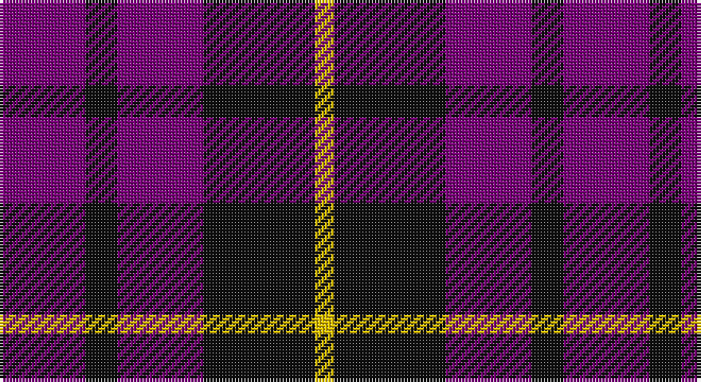

This page is one **sett** — a single exact thread-count. It belongs to the [tartan](/setts/dp27k10dp27k35ly6/)
(the same proportion at any scale), whose colour order is pattern [BKBKY](/stripes/bkbky/).

Sourced from tartans-authority.  It is a [5 stripe tartan](/stripes/stripes5/).

Original link http://www.tartansauthority.com/tartan-ferret/display/8076/

## Register references

External register numbers recorded for this tartan.

- Scottish Tartans Authority (ITI): 8076

## Thread count
P/27 K10 P27 K35 Y/6

One full sett is **177 threads**.

## Palette

Palette: <strong>Tartan Register</strong>
<table><thead><tr><th>Colour</th><th>Threads</th><th>Shade</th><th>Base</th><th>OKLCh</th></tr></thead><tbody><tr><td>P/</td><td style="text-align:right;font-variant-numeric:tabular-nums">27</td><td><code style="background-color:#780078;">#780078</code> <small style="color:#888">#780078</small></td><td>B <code style="background-color:#2A418A;">#2A418A</code></td><td><small style="color:#888">oklch(40.2% 0.185 328.4)</small></td></tr><tr><td>K</td><td style="text-align:right;font-variant-numeric:tabular-nums">10</td><td><code style="background-color:#101010;">#101010</code> <small style="color:#888">#101010</small></td><td>K <code style="background-color:#000000;">#000000</code></td><td><small style="color:#888">oklch(17.3% 0.000 89.9)</small></td></tr><tr><td>P</td><td style="text-align:right;font-variant-numeric:tabular-nums">27</td><td><code style="background-color:#780078;">#780078</code> <small style="color:#888">#780078</small></td><td>B <code style="background-color:#2A418A;">#2A418A</code></td><td><small style="color:#888">oklch(40.2% 0.185 328.4)</small></td></tr><tr><td>K</td><td style="text-align:right;font-variant-numeric:tabular-nums">35</td><td><code style="background-color:#101010;">#101010</code> <small style="color:#888">#101010</small></td><td>K <code style="background-color:#000000;">#000000</code></td><td><small style="color:#888">oklch(17.3% 0.000 89.9)</small></td></tr><tr><td>Y/</td><td style="text-align:right;font-variant-numeric:tabular-nums">6</td><td><code style="background-color:#E8C000;">#E8C000</code> <small style="color:#888">#E8C000</small></td><td>Y <code style="background-color:#F2BF00;">#F2BF00</code></td><td><small style="color:#888">oklch(81.9% 0.168 93.7)</small></td></tr></tbody></table>

# Sample pattern

## Nearest tartans

The nearest existing variants by ΔTartan distance, with this tartan at the top so the swatches line up against it.

ΔTartan

Tartan

Sett

—

<a href="/ttd/edit/#slug=dp27k10dp27k35ly6">Moorlands (Corporate)</a> <a class="nn-out" href="/variants/s5/dp27k10dp27k35ly6/" title="open its dictionary page">↗</a>

1.00

<a href="/ttd/edit/#slug=dp23dg8dp23dg35w5~x2&amp;base=dp27k10dp27k35ly6">Baru</a> <a class="nn-out" href="/variants/s5/dp23dg8dp23dg35w5~x2/" title="open its dictionary page">↗</a>

1.10

<a href="/ttd/edit/#slug=db6r1db6r9lr1~x2&amp;base=dp27k10dp27k35ly6">Hamilton</a> <a class="nn-out" href="/variants/s5/db6r1db6r9lr1~x2/" title="open its dictionary page">↗</a>

1.37

<a href="/ttd/edit/#slug=db6r1db6r9lb1~x2&amp;base=dp27k10dp27k35ly6">Hamilton</a> <a class="nn-out" href="/variants/s5/db6r1db6r9lb1~x2/" title="open its dictionary page">↗</a>

1.39

<a href="/ttd/edit/#slug=db1r3db1r3db6g1~x8&amp;base=dp27k10dp27k35ly6">Robbins</a> <a class="nn-out" href="/variants/s6/db1r3db1r3db6g1~x8/" title="open its dictionary page">↗</a>

1.46

<a href="/ttd/edit/#slug=db6r1db6r9w1~x4&amp;base=dp27k10dp27k35ly6">Hamilton Red Clan Tartan</a> <a class="nn-out" href="/variants/s5/db6r1db6r9w1~x4/" title="open its dictionary page">↗</a>

1.52

<a href="/ttd/edit/#slug=dp15k5dp15k21w2~x2&amp;base=dp27k10dp27k35ly6">Highland Spirit (Fashion)</a> <a class="nn-out" href="/variants/s5/dp15k5dp15k21w2~x2/" title="open its dictionary page">↗</a>

1.59

<a href="/ttd/edit/#slug=db1lb1dr4db4lb1~x4&amp;base=dp27k10dp27k35ly6">Laval, Tartan de</a> <a class="nn-out" href="/variants/s5/db1lb1dr4db4lb1~x4/" title="open its dictionary page">↗</a>

1.61

<a href="/ttd/edit/#slug=db8r2db8r15w2~x4&amp;base=dp27k10dp27k35ly6">Hamilton (Clan)</a> <a class="nn-out" href="/variants/s5/db8r2db8r15w2~x4/" title="open its dictionary page">↗</a>

1.66

<a href="/ttd/edit/#slug=db6r1db6r9w1~x2&amp;base=dp27k10dp27k35ly6">Hamilton, (Red)</a> <a class="nn-out" href="/variants/s5/db6r1db6r9w1~x2/" title="open its dictionary page">↗</a>

1.68

<a href="/ttd/edit/#slug=g5dp2db5dp10ly2~x2&amp;base=dp27k10dp27k35ly6">Bryson (2000)</a> <a class="nn-out" href="/variants/s5/g5dp2db5dp10ly2~x2/" title="open its dictionary page">↗</a>

## Neighbour map

Every grey dot is one of 14360 variants placed by the first two principal components of the ΔTartan feature space (44% of its variance). Red is this tartan; blue dots are its nearest — click one to open its page.

<svg viewBox="0 0 640 380" role="img" style="max-width:100%;height:auto;border:1px solid #e0e0e0;border-radius:4px;display:block" xmlns="http://www.w3.org/2000/svg"><image href="/nn/cloud.v1.png" width="640" height="380"/><a href="/variants/s5/dp23dg8dp23dg35w5~x2/"><circle cx="292.8" cy="279.1" r="4" fill="#3465a4"><title>Baru</title></circle></a><a href="/variants/s5/db6r1db6r9lr1~x2/"><circle cx="312.5" cy="251.2" r="4" fill="#3465a4"><title>Hamilton</title></circle></a><a href="/variants/s5/db6r1db6r9lb1~x2/"><circle cx="298.6" cy="241.2" r="4" fill="#3465a4"><title>Hamilton</title></circle></a><a href="/variants/s6/db1r3db1r3db6g1~x8/"><circle cx="332.0" cy="274.0" r="4" fill="#3465a4"><title>Robbins</title></circle></a><a href="/variants/s5/db6r1db6r9w1~x4/"><circle cx="320.0" cy="245.1" r="4" fill="#3465a4"><title>Hamilton Red Clan Tartan</title></circle></a><a href="/variants/s5/dp15k5dp15k21w2~x2/"><circle cx="336.3" cy="268.5" r="4" fill="#3465a4"><title>Highland Spirit (Fashion)</title></circle></a><a href="/variants/s5/db1lb1dr4db4lb1~x4/"><circle cx="217.6" cy="275.7" r="4" fill="#3465a4"><title>Laval, Tartan de</title></circle></a><a href="/variants/s5/db8r2db8r15w2~x4/"><circle cx="294.6" cy="246.3" r="4" fill="#3465a4"><title>Hamilton (Clan)</title></circle></a><a href="/variants/s5/db6r1db6r9w1~x2/"><circle cx="331.8" cy="251.8" r="4" fill="#3465a4"><title>Hamilton, (Red)</title></circle></a><a href="/variants/s5/g5dp2db5dp10ly2~x2/"><circle cx="217.9" cy="263.0" r="4" fill="#3465a4"><title>Bryson (2000)</title></circle></a><circle cx="285.8" cy="287.6" r="5" fill="#c00000"/></svg>

ID: /variants/s5/dp27k10dp27k35ly6/
