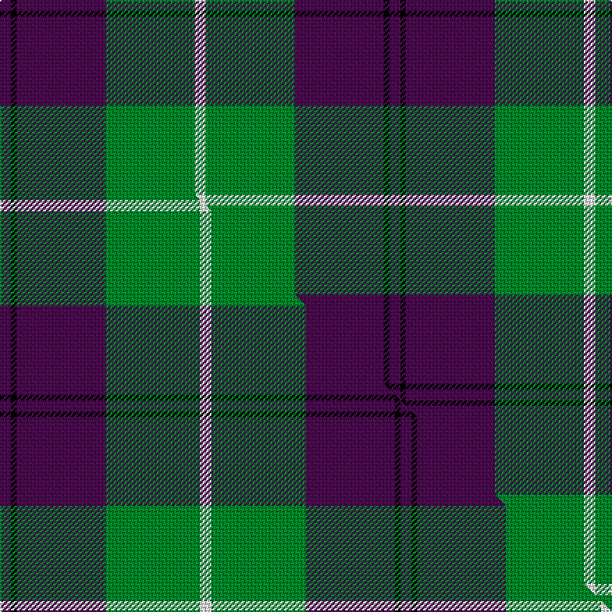

This is one **variant** — a specific cloth: this exact thread count and colourway, with its own
provenance below. It is one weaving of the [sett](/tartans/k/ka/kansai-highland-games/) (the scale-free proportion — the
same cloth at any scale or shade), whose colour order is pattern [BKBGW](/stripes/bkbgw/).

Part of the [Kansai Highland Games](/tartans/k/ka/kansai-highland-games/) tartan — the named design grouping this sett with its other cloths.

Sourced from house-of-tartan.  It is a [5 stripe tartan](/stripes/stripes5/).

Original link [http://www.house-of-tartan.scotland.net/house/TartanViewjs.asp?colr=Def&tnam=2708](http://www.house-of-tartan.scotland.net/house/TartanViewjs.asp?colr=Def&tnam=2708)

## Provenance

Earliest known date: 1999 Designed for the first Highland Games in Japan, started by Maud Robertson and heavy weight husband, Masonori Nomiyam.

Dataset <small>— provenance for this record, inherited from the source manifest</small>

<dl class="dataset-prov">
<dt>source</dt><dd><a href="/sources/house-of-tartan/">House of Tartan</a></dd>
<dt>data captured from</dt><dd><a href="https://github.com/thetartan/tartan-database/blob/master/data/house-of-tartan/data.csv">https://github.com/thetartan/tartan-database/blob/master/data/house-of-tartan/data.csv</a></dd>
<dt>data date</dt><dd>1999 <small>(this record)</small></dd>
<dt>licence</dt><dd><a href="https://creativecommons.org/licenses/by-nc-nd/4.0/">CC BY-NC-ND 4.0</a></dd>
</dl>

Capture chain <small>— the hands this data passed through, oldest first; each capture carries its own licence</small>

<ol class="capture-chain">
<li><a href="http://www.house-of-tartan.scotland.net/">House of Tartan</a> <small>the weaver/retailer's database — the site is now offline; the URL is kept as the ultimate source's identity</small></li>
<li><a href="https://github.com/thetartan/tartan-database">thetartan/tartan-database</a> <small>2016-2017</small> · <a href="https://creativecommons.org/licenses/by-nc-nd/4.0/">CC BY-NC-ND 4.0</a> <small>Levko Kravets's frozen compilation — the capture we vendored, and where its CC licence text came from</small></li>
<li>this dictionary <small>captured 2026-06-10 · commit 5bf86c7566</small> <small>each re-capture is a git commit to data/sources</small></li>
</ol>

## Thread count
DP/8 K4 DP64 G64 W/8

One full sett is **280 threads**.

## Palette
<table><thead><tr><th>Colour</th><th>Shade</th><th>OKLCh</th></tr></thead><tbody><tr><td>G</td><td><code style="background-color:#008B2A;">#008B2A</code> <small style="color:#888">#008B2A</small></td><td><small style="color:#888">oklch(55.4% 0.170 145.9)</small></td></tr><tr><td>K</td><td><code style="background-color:#000000;">#000000</code> <small style="color:#888">#000000</small></td><td><small style="color:#888">oklch(0.0% 0.000 0.0)</small></td></tr><tr><td>W</td><td><code style="background-color:#F7F7F7;">#F7F7F7</code> <small style="color:#888">#F7F7F7</small></td><td><small style="color:#888">oklch(97.6% 0.000 89.9)</small></td></tr><tr><td>DP</td><td><code style="background-color:#4B0B4F;">#4B0B4F</code> <small style="color:#888">#4B0B4F</small></td><td><small style="color:#888">oklch(30.1% 0.125 325.4)</small></td></tr></tbody></table>

# Sample pattern

[Sample sheet (PDF)](swatch.pdf) — the woven sample, thread count and palette on one printable A4, rendered on demand (the same sheet the TTD print page downloads).

## Compared to the master

This cloth is one sett of its design; the master sett (the exemplar the design is anchored on) is below for comparison.

Its **ΔTartan distance** from the master is **0.07** — the same measure the nearest-tartans table ranks by (0 is identical; a re-scale of the same cloth is near 0, a recolour or a different proportion further).

<figure class="master-compare" style="margin:0">

this sett
master sett ★

<figcaption style="color:#888;font-size:smaller">One weave of this sett against the <a href="/setts/dp2k1dp16g17w2/">master sett ★</a>, split on the diagonal: a shared proportion runs seamlessly across it with only the shades shifting; a different proportion breaks on it.</figcaption>
</figure>

## Nearest tartan variants

The nearest existing variants by ΔTartan distance, with this cloth at the top so the swatches line up against it.

ΔTartan

Threads

Variant

Sett

—

280

<a href="/variants/s5/dp2k1dp16g16w2~x4/">Kansai Highland Games Corporate Tartan</a>

<a href="/ttd/edit/#slug=dp2k1dp16g17w2~x4&amp;base=dp2k1dp16g16w2~x4" title="compare in the TTD">0.07</a>

288

<a href="/variants/s5/dp2k1dp16g17w2~x4/">Kansai Highland Games</a>

<a href="/ttd/edit/#slug=lb3k3lb3k3n15dr1~x4&amp;base=dp2k1dp16g16w2~x4" title="compare in the TTD">1.96</a>

208

<a href="/variants/s6/lb3k3lb3k3n15dr1~x4/">Tiree Grey</a>

<a href="/ttd/edit/#slug=k5w7k5n20db1~x4&amp;base=dp2k1dp16g16w2~x4" title="compare in the TTD">2.42</a>

280

<a href="/variants/s5/k5w7k5n20db1~x4/">Burberry Grey (Original)</a>

<a href="/ttd/edit/#slug=lb12g16k12g24dp75y4&amp;base=dp2k1dp16g16w2~x4" title="compare in the TTD">2.63</a>

270

<a href="/variants/s6/lb12g16k12g24dp75y4/">Widows Sons Scotland Dress</a>

<a href="/ttd/edit/#slug=g14dp11lb3k2lb3dp11g14dy1~x2~g5408159-dp2712327&amp;base=dp2k1dp16g16w2~x4" title="compare in the TTD">2.71</a>

206

<a href="/variants/s8/g14dp11lb3k2lb3dp11g14dy1~x2~g5408159-dp2712327/">Wellington (Wilson 122)</a>

<a href="/ttd/edit/#slug=lb12g12k12g24dp75ly4&amp;base=dp2k1dp16g16w2~x4" title="compare in the TTD">2.71</a>

262

<a href="/variants/s6/lb12g12k12g24dp75ly4/">Widows Sons Scotland Dress</a>

<a href="/ttd/edit/#slug=dp18g24k3db6dp2db5dp18~x2&amp;base=dp2k1dp16g16w2~x4" title="compare in the TTD">2.78</a>

232

<a href="/variants/s7/dp18g24k3db6dp2db5dp18~x2/">Saorsa</a>

<a href="/ttd/edit/#slug=g20k2g20dp25w2lb3~x2&amp;base=dp2k1dp16g16w2~x4" title="compare in the TTD">2.83</a>

242

<a href="/variants/s6/g20k2g20dp25w2lb3~x2/">Lawrence of Broughty Ferry</a>

<a href="/ttd/edit/#slug=y19k2w2k2n5k2n5~x4~y59-n43&amp;base=dp2k1dp16g16w2~x4" title="compare in the TTD">2.90</a>

200

<a href="/variants/s7/y19k2w2k2n5k2n5~x4~y59-n43/">Kyle</a>

<a href="/ttd/edit/#slug=t18k2t4k6dp12lo1~x2&amp;base=dp2k1dp16g16w2~x4" title="compare in the TTD">2.93</a>

134

<a href="/variants/s6/t18k2t4k6dp12lo1~x2/">Joker, The</a>

## Neighbour map

Every grey dot is one of 13662 variants placed by the first two principal components of the ΔTartan feature space (42% of its variance). Red is this tartan; blue dots are its nearest — click one to open its page. The map is a flat projection of a many-dimensional space — [how to read it](/posts/neighbourhood-maps/).

<svg viewBox="0 0 640 380" role="img" style="max-width:100%;height:auto;border:1px solid #e0e0e0;border-radius:4px;display:block" xmlns="http://www.w3.org/2000/svg"><image href="/nn/cloud.v1.png" width="640" height="380"/><a href="/variants/s5/dp2k1dp16g17w2~x4/"><circle cx="282.0" cy="177.2" r="4" fill="#3465a4"><title>Kansai Highland Games</title></circle></a><a href="/variants/s6/lb3k3lb3k3n15dr1~x4/"><circle cx="267.2" cy="164.5" r="4" fill="#3465a4"><title>Tiree Grey</title></circle></a><a href="/variants/s5/k5w7k5n20db1~x4/"><circle cx="252.1" cy="167.9" r="4" fill="#3465a4"><title>Burberry Grey (Original)</title></circle></a><a href="/variants/s6/lb12g16k12g24dp75y4/"><circle cx="260.9" cy="144.7" r="4" fill="#3465a4"><title>Widows Sons Scotland Dress</title></circle></a><a href="/variants/s8/g14dp11lb3k2lb3dp11g14dy1~x2~g5408159-dp2712327/"><circle cx="237.8" cy="182.4" r="4" fill="#3465a4"><title>Wellington (Wilson 122)</title></circle></a><a href="/variants/s6/lb12g12k12g24dp75ly4/"><circle cx="265.7" cy="139.7" r="4" fill="#3465a4"><title>Widows Sons Scotland Dress</title></circle></a><a href="/variants/s7/dp18g24k3db6dp2db5dp18~x2/"><circle cx="266.4" cy="199.1" r="4" fill="#3465a4"><title>Saorsa</title></circle></a><a href="/variants/s6/g20k2g20dp25w2lb3~x2/"><circle cx="267.9" cy="179.9" r="4" fill="#3465a4"><title>Lawrence of Broughty Ferry</title></circle></a><a href="/variants/s7/y19k2w2k2n5k2n5~x4~y59-n43/"><circle cx="253.0" cy="173.2" r="4" fill="#3465a4"><title>Kyle</title></circle></a><a href="/variants/s6/t18k2t4k6dp12lo1~x2/"><circle cx="260.8" cy="174.8" r="4" fill="#3465a4"><title>Joker, The</title></circle></a><circle cx="283.0" cy="179.2" r="5" fill="#c00000"/><text x="320" y="376" text-anchor="middle" font-size="11" fill="#999">ground</text><text x="11" y="190" text-anchor="middle" font-size="11" fill="#999" transform="rotate(-90 11 190)">complexity</text></svg>

ID: /variants/s5/dp2k1dp16g16w2~x4/
