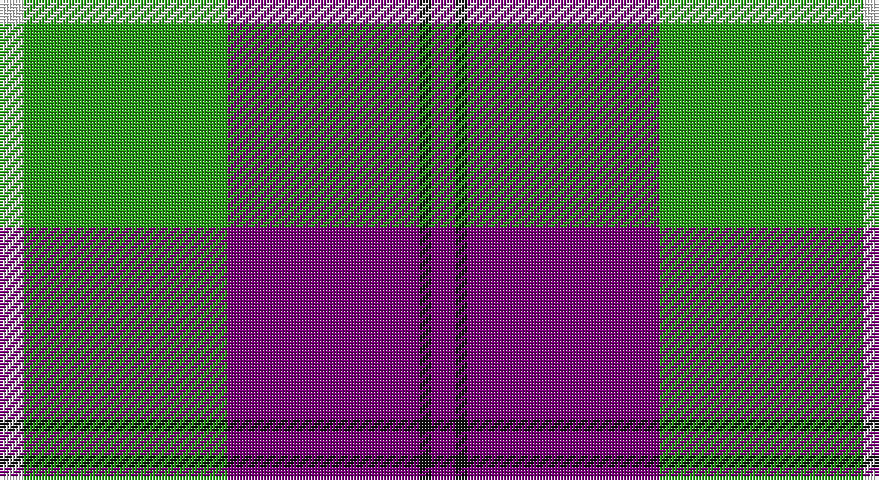

This page is one **sett** — a single exact thread-count. It belongs to the [tartan](/setts/dp2k1dp16g17w2/)
(the same proportion at any scale), whose colour order is pattern [BKBGW](/stripes/bkbgw/).

Part of the [Kansai Highland Games](/tartans/kansai-highland-games/) tartan — the named design grouping this sett with its other cloths.

Sourced from register-of-tartans.  It is a [5 stripe tartan](/stripes/stripes5/).

Original link https://www.tartanregister.gov.uk/tartanDetails.aspx?ref=1928

2 attestations — the source records this cloth was collapsed from (oldest owns this page)

<ul>
<li>01/08/1999 — Kansai Highland Games (register-of-tartans, <a href="https://www.tartanregister.gov.uk/tartanDetails.aspx?ref=1928">record</a>)</li>
<li>1999 — Kansai Highland Games (Corporate) (tartans-authority, <a href="http://www.tartansauthority.com/tartan-ferret/display/3988/">record</a>)</li>
</ul>

## Register references

External register numbers recorded for this tartan.

- Scottish Register of Tartans: [1928](https://www.tartanregister.gov.uk/tartanDetails.aspx?ref=1928)
- Scottish Tartans Authority (ITI): 3988
- Scottish Tartans World Register: 2708

## Thread count
W/8 G68 Pa64 K4 Pa/8

One full sett is **288 threads**.

## Palette

Palette: <strong>Tartan Register</strong> <small style="color:#888">(4 of 5 colours)</small>
<table><thead><tr><th>Colour</th><th>Threads</th><th>Shade</th><th>Base</th><th>OKLCh</th></tr></thead><tbody><tr><td>W/</td><td style="text-align:right;font-variant-numeric:tabular-nums">8</td><td><code style="background-color:#FCFCFC;">#FCFCFC</code> <small style="color:#888">#FCFCFC</small></td><td>W <code style="background-color:#F7F7F7;">#F7F7F7</code></td><td><small style="color:#888">oklch(99.1% 0.000 89.9)</small></td></tr><tr><td>G</td><td style="text-align:right;font-variant-numeric:tabular-nums">68</td><td><code style="background-color:#289C18;">#289C18</code> <small style="color:#888">#289C18</small></td><td>G <code style="background-color:#006100;">#006100</code></td><td><small style="color:#888">oklch(60.6% 0.191 141.6)</small></td></tr><tr><td>Pa</td><td style="text-align:right;font-variant-numeric:tabular-nums">64</td><td><code style="background-color:#780078;">#780078</code> <small style="color:#888">#780078</small></td><td>B <code style="background-color:#2A418A;">#2A418A</code></td><td><small style="color:#888">oklch(40.2% 0.185 328.4)</small></td></tr><tr><td>K</td><td style="text-align:right;font-variant-numeric:tabular-nums">4</td><td><code style="background-color:#101010;">#101010</code> <small style="color:#888">#101010</small></td><td>K <code style="background-color:#000000;">#000000</code></td><td><small style="color:#888">oklch(17.3% 0.000 89.9)</small></td></tr><tr><td>Pa/</td><td style="text-align:right;font-variant-numeric:tabular-nums">8</td><td><code style="background-color:#780078;">#780078</code> <small style="color:#888">#780078</small></td><td>B <code style="background-color:#2A418A;">#2A418A</code></td><td><small style="color:#888">oklch(40.2% 0.185 328.4)</small></td></tr></tbody></table>

# Sample pattern

## Nearest tartans

The nearest existing variants by ΔTartan distance, with this tartan at the top so the swatches line up against it.

ΔTartan

Tartan

Sett

—

<a href="/ttd/edit/#slug=dp2k1dp16g17w2~x4">Kansai Highland Games</a> <a class="nn-out" href="/variants/s5/dp2k1dp16g17w2~x4/" title="open its dictionary page">↗</a>

0.21

<a href="/ttd/edit/#slug=dp2k1dp16g16w2~x4&amp;base=dp2k1dp16g17w2~x4">Kansai Highland Games Corporate Tartan</a> <a class="nn-out" href="/variants/s5/dp2k1dp16g16w2~x4/" title="open its dictionary page">↗</a>

0.79

<a href="/ttd/edit/#slug=k5w7k5y20db1~x4&amp;base=dp2k1dp16g17w2~x4">Burberry Grey (Original)</a> <a class="nn-out" href="/variants/s5/k5w7k5y20db1~x4/" title="open its dictionary page">↗</a>

0.95

<a href="/ttd/edit/#slug=lb3k3lb3k3o15r1~x4&amp;base=dp2k1dp16g17w2~x4">Tiree Grey</a> <a class="nn-out" href="/variants/s6/lb3k3lb3k3o15r1~x4/" title="open its dictionary page">↗</a>

1.09

<a href="/ttd/edit/#slug=r2w30k15lo2k15r2~x2&amp;base=dp2k1dp16g17w2~x4">Brodie (WCWM)</a> <a class="nn-out" href="/variants/s6/r2w30k15lo2k15r2~x2/" title="open its dictionary page">↗</a>

1.22

<a href="/ttd/edit/#slug=k4ly18n44k3ly10k4&amp;base=dp2k1dp16g17w2~x4">Stutterheim</a> <a class="nn-out" href="/variants/s6/k4ly18n44k3ly10k4/" title="open its dictionary page">↗</a>

1.28

<a href="/ttd/edit/#slug=r4o41k5w14k18r4~x2&amp;base=dp2k1dp16g17w2~x4">Downside (Corporate)</a> <a class="nn-out" href="/variants/s6/r4o41k5w14k18r4~x2/" title="open its dictionary page">↗</a>

1.29

<a href="/ttd/edit/#slug=r1lb5k8o18lb1k1lb1~x4&amp;base=dp2k1dp16g17w2~x4">Merrick, Camel</a> <a class="nn-out" href="/variants/s7/r1lb5k8o18lb1k1lb1~x4/" title="open its dictionary page">↗</a>

1.29

<a href="/ttd/edit/#slug=k4ly18db44k3ly10k4&amp;base=dp2k1dp16g17w2~x4">Stutterheim (Corporate)</a> <a class="nn-out" href="/variants/s6/k4ly18db44k3ly10k4/" title="open its dictionary page">↗</a>

1.30

<a href="/ttd/edit/#slug=r4k2lb10k10y28k3~x2&amp;base=dp2k1dp16g17w2~x4">Thomson Camel (Jedburgh Mill)</a> <a class="nn-out" href="/variants/s6/r4k2lb10k10y28k3~x2/" title="open its dictionary page">↗</a>

1.31

<a href="/ttd/edit/#slug=k6w6k6lo21r2~x4&amp;base=dp2k1dp16g17w2~x4">Burberry Check Corporate Tartan</a> <a class="nn-out" href="/variants/s5/k6w6k6lo21r2~x4/" title="open its dictionary page">↗</a>

## Neighbour map

Every grey dot is one of 14360 variants placed by the first two principal components of the ΔTartan feature space (44% of its variance). Red is this tartan; blue dots are its nearest — click one to open its page.

<svg viewBox="0 0 640 380" role="img" style="max-width:100%;height:auto;border:1px solid #e0e0e0;border-radius:4px;display:block" xmlns="http://www.w3.org/2000/svg"><image href="/nn/cloud.v1.png" width="640" height="380"/><a href="/variants/s5/dp2k1dp16g16w2~x4/"><circle cx="292.1" cy="181.0" r="4" fill="#3465a4"><title>Kansai Highland Games Corporate Tartan</title></circle></a><a href="/variants/s5/k5w7k5y20db1~x4/"><circle cx="279.8" cy="176.8" r="4" fill="#3465a4"><title>Burberry Grey (Original)</title></circle></a><a href="/variants/s6/lb3k3lb3k3o15r1~x4/"><circle cx="290.6" cy="171.5" r="4" fill="#3465a4"><title>Tiree Grey</title></circle></a><a href="/variants/s6/r2w30k15lo2k15r2~x2/"><circle cx="241.9" cy="160.0" r="4" fill="#3465a4"><title>Brodie (WCWM)</title></circle></a><a href="/variants/s6/k4ly18n44k3ly10k4/"><circle cx="305.0" cy="178.3" r="4" fill="#3465a4"><title>Stutterheim</title></circle></a><a href="/variants/s6/r4o41k5w14k18r4~x2/"><circle cx="223.5" cy="182.6" r="4" fill="#3465a4"><title>Downside (Corporate)</title></circle></a><a href="/variants/s7/r1lb5k8o18lb1k1lb1~x4/"><circle cx="294.4" cy="143.3" r="4" fill="#3465a4"><title>Merrick, Camel</title></circle></a><a href="/variants/s6/k4ly18db44k3ly10k4/"><circle cx="297.5" cy="177.6" r="4" fill="#3465a4"><title>Stutterheim (Corporate)</title></circle></a><a href="/variants/s6/r4k2lb10k10y28k3~x2/"><circle cx="260.4" cy="177.6" r="4" fill="#3465a4"><title>Thomson Camel (Jedburgh Mill)</title></circle></a><a href="/variants/s5/k6w6k6lo21r2~x4/"><circle cx="243.9" cy="198.7" r="4" fill="#3465a4"><title>Burberry Check Corporate Tartan</title></circle></a><circle cx="287.5" cy="176.9" r="5" fill="#c00000"/></svg>

ID: /variants/s5/dp2k1dp16g17w2~x4/
