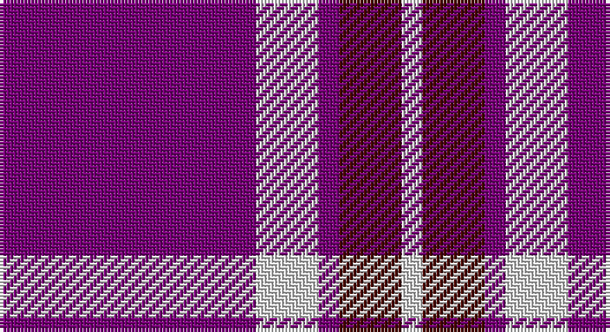

This page is one **sett** — a single exact thread-count. It belongs to the [tartan](/setts/dp37w9dp3dr9w3/)
(the same proportion at any scale), whose colour order is pattern [BWBBW](/stripes/bwbbw/).

Sourced from house-of-tartan.  It is a [5 stripe tartan](/stripes/stripes5/).

Original link http://www.house-of-tartan.scotland.net/house/TartanViewjs.asp?colr=Def&tnam=636

## Provenance

Earliest known date: pre 2003 A fashion check

## Thread count
P/74 LN18 P6 DR18 LN/6

One full sett is **164 threads**.

## Palette

Palette: <strong>Tartan Register</strong> <small style="color:#888">(2 of 3 colours)</small>
<table><thead><tr><th>Colour</th><th>Threads</th><th>Shade</th><th>Base</th><th>OKLCh</th></tr></thead><tbody><tr><td>P/</td><td style="text-align:right;font-variant-numeric:tabular-nums">74</td><td><code style="background-color:#780078;">#780078</code> <small style="color:#888">#780078</small></td><td>B <code style="background-color:#2A418A;">#2A418A</code></td><td><small style="color:#888">oklch(40.2% 0.185 328.4)</small></td></tr><tr><td>LN</td><td style="text-align:right;font-variant-numeric:tabular-nums">18</td><td><code style="background-color:#E0E0E0;">#E0E0E0</code> <small style="color:#888">#E0E0E0</small></td><td>W <code style="background-color:#F7F7F7;">#F7F7F7</code></td><td><small style="color:#888">oklch(90.7% 0.000 89.9)</small></td></tr><tr><td>P</td><td style="text-align:right;font-variant-numeric:tabular-nums">6</td><td><code style="background-color:#780078;">#780078</code> <small style="color:#888">#780078</small></td><td>B <code style="background-color:#2A418A;">#2A418A</code></td><td><small style="color:#888">oklch(40.2% 0.185 328.4)</small></td></tr><tr><td>DR</td><td style="text-align:right;font-variant-numeric:tabular-nums">18</td><td><code style="background-color:#480800;">#480800</code> <small style="color:#888">#480800</small></td><td>B <code style="background-color:#2A418A;">#2A418A</code></td><td><small style="color:#888">oklch(26.1% 0.096 33.1)</small></td></tr><tr><td>LN/</td><td style="text-align:right;font-variant-numeric:tabular-nums">6</td><td><code style="background-color:#E0E0E0;">#E0E0E0</code> <small style="color:#888">#E0E0E0</small></td><td>W <code style="background-color:#F7F7F7;">#F7F7F7</code></td><td><small style="color:#888">oklch(90.7% 0.000 89.9)</small></td></tr></tbody></table>

# Sample pattern

## Nearest tartans

The nearest existing variants by ΔTartan distance, with this tartan at the top so the swatches line up against it.

ΔTartan

Tartan

Sett

—

<a href="/ttd/edit/#slug=dp37w9dp3dr9w3~x2">Glen App Trade Tartan</a> <a class="nn-out" href="/variants/s5/dp37w9dp3dr9w3~x2/" title="open its dictionary page">↗</a>

0.35

<a href="/ttd/edit/#slug=p37w9p3o9w3~x2&amp;base=dp37w9dp3dr9w3~x2">Glen App</a> <a class="nn-out" href="/variants/s5/p37w9p3o9w3~x2/" title="open its dictionary page">↗</a>

1.49

<a href="/ttd/edit/#slug=db11w1r12db6r1db6w1~x4&amp;base=dp37w9dp3dr9w3~x2">Coronation (1936) #2</a> <a class="nn-out" href="/variants/s7/db11w1r12db6r1db6w1~x4/" title="open its dictionary page">↗</a>

1.55

<a href="/ttd/edit/#slug=db2r7db2r7db22ly2~x2&amp;base=dp37w9dp3dr9w3~x2">MacQueen variant</a> <a class="nn-out" href="/variants/s6/db2r7db2r7db22ly2~x2/" title="open its dictionary page">↗</a>

1.63

<a href="/ttd/edit/#slug=dp30m5dp5b4dp4g12~x2&amp;base=dp37w9dp3dr9w3~x2">International Festival of Authors (C</a> <a class="nn-out" href="/variants/s6/dp30m5dp5b4dp4g12~x2/" title="open its dictionary page">↗</a>

1.64

<a href="/ttd/edit/#slug=m3dg8m3db8m20w2m2~x4&amp;base=dp37w9dp3dr9w3~x2">Unnamed C21st (Lady's Jacket) (Fash)</a> <a class="nn-out" href="/variants/s7/m3dg8m3db8m20w2m2~x4/" title="open its dictionary page">↗</a>

1.68

<a href="/ttd/edit/#slug=db32r3db3r4w3r5db4r7~x2&amp;base=dp37w9dp3dr9w3~x2">Edinburgh TIC (Corporate)</a> <a class="nn-out" href="/variants/s8/db32r3db3r4w3r5db4r7~x2/" title="open its dictionary page">↗</a>

1.68

<a href="/variants/s6/db60ly6db11r25~x2/">South Australian Pipes &amp; Drums (Corp</a>

1.71

<a href="/ttd/edit/#slug=m13w3m1k3w1~x6&amp;base=dp37w9dp3dr9w3~x2">Glen App</a> <a class="nn-out" href="/variants/s5/m13w3m1k3w1~x6/" title="open its dictionary page">↗</a>

1.72

<a href="/ttd/edit/#slug=db15w2r20db2r4~x2&amp;base=dp37w9dp3dr9w3~x2">Masai Shuka 25 (Artefact)</a> <a class="nn-out" href="/variants/s5/db15w2r20db2r4~x2/" title="open its dictionary page">↗</a>

1.73

<a href="/ttd/edit/#slug=db3r24db3r3db25w3~x2&amp;base=dp37w9dp3dr9w3~x2">Matthews (Personal)</a> <a class="nn-out" href="/variants/s6/db3r24db3r3db25w3~x2/" title="open its dictionary page">↗</a>

## Neighbour map

Every grey dot is one of 14360 variants placed by the first two principal components of the ΔTartan feature space (44% of its variance). Red is this tartan; blue dots are its nearest — click one to open its page.

<svg viewBox="0 0 640 380" role="img" style="max-width:100%;height:auto;border:1px solid #e0e0e0;border-radius:4px;display:block" xmlns="http://www.w3.org/2000/svg"><image href="/nn/cloud.v1.png" width="640" height="380"/><a href="/variants/s5/p37w9p3o9w3~x2/"><circle cx="401.4" cy="193.2" r="4" fill="#3465a4"><title>Glen App</title></circle></a><a href="/variants/s7/db11w1r12db6r1db6w1~x4/"><circle cx="360.6" cy="209.9" r="4" fill="#3465a4"><title>Coronation (1936) #2</title></circle></a><a href="/variants/s6/db2r7db2r7db22ly2~x2/"><circle cx="393.5" cy="207.5" r="4" fill="#3465a4"><title>MacQueen variant</title></circle></a><a href="/variants/s6/dp30m5dp5b4dp4g12~x2/"><circle cx="363.9" cy="210.5" r="4" fill="#3465a4"><title>International Festival of Authors (C</title></circle></a><a href="/variants/s7/m3dg8m3db8m20w2m2~x4/"><circle cx="333.4" cy="186.0" r="4" fill="#3465a4"><title>Unnamed C21st (Lady's Jacket) (Fash)</title></circle></a><a href="/variants/s8/db32r3db3r4w3r5db4r7~x2/"><circle cx="411.3" cy="186.4" r="4" fill="#3465a4"><title>Edinburgh TIC (Corporate)</title></circle></a><a href="/variants/s6/db60ly6db11r25~x2/"><circle cx="409.5" cy="215.7" r="4" fill="#3465a4"><title>South Australian Pipes &amp; Drums (Corp</title></circle></a><a href="/variants/s5/m13w3m1k3w1~x6/"><circle cx="390.8" cy="185.7" r="4" fill="#3465a4"><title>Glen App</title></circle></a><a href="/variants/s5/db15w2r20db2r4~x2/"><circle cx="357.8" cy="219.9" r="4" fill="#3465a4"><title>Masai Shuka 25 (Artefact)</title></circle></a><a href="/variants/s6/db3r24db3r3db25w3~x2/"><circle cx="331.1" cy="212.1" r="4" fill="#3465a4"><title>Matthews (Personal)</title></circle></a><circle cx="396.0" cy="192.6" r="5" fill="#c00000"/></svg>

ID: /variants/s5/dp37w9dp3dr9w3~x2/
