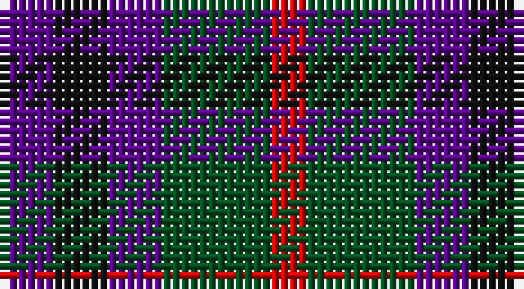

This page is one **sett** — a single exact thread-count. It belongs to the [tartan](/setts/dp3k3dp3dg6r2/)
(the same proportion at any scale), whose colour order is pattern [BKBGR](/stripes/bkbgr/).

Part of the [Austin](/tartans/austin/) tartan — the named design grouping this sett with its other cloths.

Sourced from register-of-tartans.  It is a [5 stripe tartan](/stripes/stripes5/).

Original link https://www.tartanregister.gov.uk/tartanDetails.aspx?ref=135

## Also known as

This cloth is also recorded under:

- Austin Clan
- Austin or Keith/Marshall
- Austin, or Keith
- Keith Austin and Marshall
- Keith and Austin

## Register references

External register numbers recorded for this tartan.

- Scottish Register of Tartans: [135](https://www.tartanregister.gov.uk/tartanDetails.aspx?ref=135)
- Scottish Tartans World Register: 269

## Thread count
P/6 K6 P6 G12 R/4

One full sett is **58 threads**.

## Palette

Palette: <strong>Tartan Register</strong>
<table><thead><tr><th>Colour</th><th>Threads</th><th>Shade</th><th>Base</th><th>OKLCh</th></tr></thead><tbody><tr><td>P/</td><td style="text-align:right;font-variant-numeric:tabular-nums">6</td><td><code style="background-color:#5A008C;">#5A008C</code> <small style="color:#888">#5A008C</small></td><td>B <code style="background-color:#2A418A;">#2A418A</code></td><td><small style="color:#888">oklch(37.0% 0.191 306.3)</small></td></tr><tr><td>K</td><td style="text-align:right;font-variant-numeric:tabular-nums">6</td><td><code style="background-color:#101010;">#101010</code> <small style="color:#888">#101010</small></td><td>K <code style="background-color:#000000;">#000000</code></td><td><small style="color:#888">oklch(17.3% 0.000 89.9)</small></td></tr><tr><td>P</td><td style="text-align:right;font-variant-numeric:tabular-nums">6</td><td><code style="background-color:#5A008C;">#5A008C</code> <small style="color:#888">#5A008C</small></td><td>B <code style="background-color:#2A418A;">#2A418A</code></td><td><small style="color:#888">oklch(37.0% 0.191 306.3)</small></td></tr><tr><td>G</td><td style="text-align:right;font-variant-numeric:tabular-nums">12</td><td><code style="background-color:#005020;">#005020</code> <small style="color:#888">#005020</small></td><td>G <code style="background-color:#006100;">#006100</code></td><td><small style="color:#888">oklch(37.7% 0.105 149.6)</small></td></tr><tr><td>R/</td><td style="text-align:right;font-variant-numeric:tabular-nums">4</td><td><code style="background-color:#DC0000;">#DC0000</code> <small style="color:#888">#DC0000</small></td><td>R <code style="background-color:#CC0000;">#CC0000</code></td><td><small style="color:#888">oklch(56.2% 0.230 29.2)</small></td></tr></tbody></table>

# Sample pattern

## Compared to the master

This cloth is one sett of its design; the master sett (the exemplar the design is anchored on) is below for comparison.

<figure style="margin:0"><figcaption style="color:#888;font-size:smaller">this sett</figcaption></figure>
<figure style="margin:0"><figcaption style="color:#888;font-size:smaller"><a href="/setts/db4k4db4g9k2/">master sett →</a></figcaption></figure>

## Nearest tartans

The nearest existing variants by ΔTartan distance, with this tartan at the top so the swatches line up against it.

ΔTartan

Tartan

Sett

—

<a href="/ttd/edit/#slug=dp3k3dp3dg6r2~x2">Austin (Wilson's No 137)</a> <a class="nn-out" href="/variants/s5/dp3k3dp3dg6r2~x2/" title="open its dictionary page">↗</a>

1.04

<a href="/ttd/edit/#slug=dp3k3dp3dg6ly2~x2&amp;base=dp3k3dp3dg6r2~x2">Austin (Wilson's No 173)</a> <a class="nn-out" href="/variants/s5/dp3k3dp3dg6ly2~x2/" title="open its dictionary page">↗</a>

1.05

<a href="/ttd/edit/#slug=k1g3k3db3r1~x4&amp;base=dp3k3dp3dg6r2~x2">Durham District Tartan</a> <a class="nn-out" href="/variants/s5/k1g3k3db3r1~x4/" title="open its dictionary page">↗</a>

1.15

<a href="/ttd/edit/#slug=t1dg3r1dp3t1~x4&amp;base=dp3k3dp3dg6r2~x2">Wilson's No.95</a> <a class="nn-out" href="/variants/s5/t1dg3r1dp3t1~x4/" title="open its dictionary page">↗</a>

1.26

<a href="/ttd/edit/#slug=dp8k11g9r2~x2&amp;base=dp3k3dp3dg6r2~x2">Norwich Collection No. 60</a> <a class="nn-out" href="/variants/s4/dp8k11g9r2~x2/" title="open its dictionary page">↗</a>

1.27

<a href="/ttd/edit/#slug=dp6k5dg5r1~x2&amp;base=dp3k3dp3dg6r2~x2">Unidentified No 60</a> <a class="nn-out" href="/variants/s4/dp6k5dg5r1~x2/" title="open its dictionary page">↗</a>

1.30

<a href="/ttd/edit/#slug=r2k1db2k1g2k1~x28&amp;base=dp3k3dp3dg6r2~x2">Burnicle (2015)</a> <a class="nn-out" href="/variants/s6/r2k1db2k1g2k1~x28/" title="open its dictionary page">↗</a>

1.32

<a href="/variants/s8/dg6dp3ki3dp3ki3dp3dg6k2~x2/">Wilson's No.173</a>

1.36

<a href="/ttd/edit/#slug=n2r1k1lr1~x10&amp;base=dp3k3dp3dg6r2~x2">Kucher, Gregory (Personal)</a> <a class="nn-out" href="/variants/s4/n2r1k1lr1~x10/" title="open its dictionary page">↗</a>

1.36

<a href="/ttd/edit/#slug=g6dp3k3dp3k3dp3g6r2~x2&amp;base=dp3k3dp3dg6r2~x2">Wilson's No.137</a> <a class="nn-out" href="/variants/s8/g6dp3k3dp3k3dp3g6r2~x2/" title="open its dictionary page">↗</a>

1.38

<a href="/ttd/edit/#slug=dp8k11dg9w2~x2&amp;base=dp3k3dp3dg6r2~x2">Wilson's No 220</a> <a class="nn-out" href="/variants/s4/dp8k11dg9w2~x2/" title="open its dictionary page">↗</a>

## Neighbour map

Every grey dot is one of 14360 variants placed by the first two principal components of the ΔTartan feature space (44% of its variance). Red is this tartan; blue dots are its nearest — click one to open its page.

<svg viewBox="0 0 640 380" role="img" style="max-width:100%;height:auto;border:1px solid #e0e0e0;border-radius:4px;display:block" xmlns="http://www.w3.org/2000/svg"><image href="/nn/cloud.v1.png" width="640" height="380"/><a href="/variants/s5/dp3k3dp3dg6ly2~x2/"><circle cx="93.5" cy="305.8" r="4" fill="#3465a4"><title>Austin (Wilson's No 173)</title></circle></a><a href="/variants/s5/k1g3k3db3r1~x4/"><circle cx="130.3" cy="319.2" r="4" fill="#3465a4"><title>Durham District Tartan</title></circle></a><a href="/variants/s5/t1dg3r1dp3t1~x4/"><circle cx="128.8" cy="296.7" r="4" fill="#3465a4"><title>Wilson's No.95</title></circle></a><a href="/variants/s4/dp8k11g9r2~x2/"><circle cx="157.2" cy="297.7" r="4" fill="#3465a4"><title>Norwich Collection No. 60</title></circle></a><a href="/variants/s4/dp6k5dg5r1~x2/"><circle cx="170.6" cy="302.8" r="4" fill="#3465a4"><title>Unidentified No 60</title></circle></a><a href="/variants/s6/r2k1db2k1g2k1~x28/"><circle cx="59.5" cy="324.7" r="4" fill="#3465a4"><title>Burnicle (2015)</title></circle></a><a href="/variants/s8/dg6dp3ki3dp3ki3dp3dg6k2~x2/"><circle cx="136.0" cy="301.9" r="4" fill="#3465a4"><title>Wilson's No.173</title></circle></a><a href="/variants/s4/n2r1k1lr1~x10/"><circle cx="104.6" cy="340.7" r="4" fill="#3465a4"><title>Kucher, Gregory (Personal)</title></circle></a><a href="/variants/s8/g6dp3k3dp3k3dp3g6r2~x2/"><circle cx="131.8" cy="296.9" r="4" fill="#3465a4"><title>Wilson's No.137</title></circle></a><a href="/variants/s4/dp8k11dg9w2~x2/"><circle cx="142.2" cy="295.5" r="4" fill="#3465a4"><title>Wilson's No 220</title></circle></a><circle cx="122.6" cy="317.4" r="5" fill="#c00000"/></svg>

ID: /variants/s5/dp3k3dp3dg6r2~x2/
