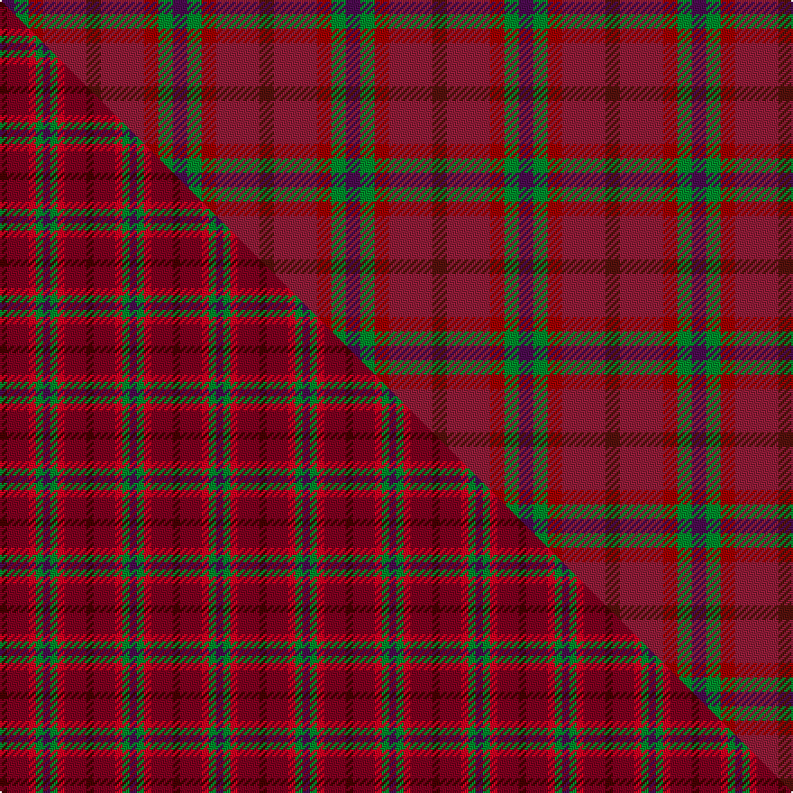

This page is one **sett** — a single exact thread-count. It belongs to the [tartan](/setts/dr1r3ri1g1dp1/)
(the same proportion at any scale), whose colour order is pattern [BGRRB](/stripes/bgrrb/).

Part of the [Blairgowrie Berries and Cherries](/tartans/blairgowrie-berries-and-cherries/) tartan — the named design grouping this sett with its other cloths.

Sourced from tartans-authority.  It is a [5 stripe tartan](/stripes/stripes5/).

Original link [https://www.tartanregister.gov.uk/tartanDetails.aspx?ref=11150](https://www.tartanregister.gov.uk/tartanDetails.aspx?ref=11150)

Dataset <small>— provenance for this record, inherited from the source manifest</small>

<dl class="dataset-prov">
<dt>source</dt><dd><a href="/sources/tartans-authority/">Scottish Tartans Authority</a></dd>
<dt>data captured from</dt><dd><a href="https://github.com/thetartan/tartan-database/blob/master/data/tartans-authority/data.csv">https://github.com/thetartan/tartan-database/blob/master/data/tartans-authority/data.csv</a></dd>
<dt>data date</dt><dd>2014 <small>(this record)</small></dd>
<dt>licence</dt><dd><a href="https://creativecommons.org/licenses/by-nc-nd/4.0/">CC BY-NC-ND 4.0</a></dd>
</dl>

Capture chain <small>— the hands this data passed through, oldest first; each capture carries its own licence</small>

<ol class="capture-chain">
<li><a href="https://www.tartansauthority.com/">Scottish Tartans Authority</a> <small>the heritage body's archive — its tartan-ferret record browser is retired (links repaired to the SRT, above)</small></li>
<li><a href="https://github.com/thetartan/tartan-database">thetartan/tartan-database</a> <small>2016-2017</small> · <a href="https://creativecommons.org/licenses/by-nc-nd/4.0/">CC BY-NC-ND 4.0</a> <small>Levko Kravets's frozen compilation — the capture we vendored, and where its CC licence text came from</small></li>
<li>this dictionary <small>captured 2026-06-10 · commit 5bf86c7566</small> <small>each re-capture is a git commit to data/sources</small></li>
</ol>

## Register references

External register numbers recorded for this tartan.

- Scottish Register of Tartans: [11150](https://www.tartanregister.gov.uk/tartanDetails?ref=11150)
- Scottish Tartans Authority (ITI): 11150

## Thread count
DP/8 G8 Ri8 R24 DR/8

One full sett is **96 threads**.

## Palette
<table><thead><tr><th>Colour</th><th>Shade</th><th>OKLCh</th></tr></thead><tbody><tr><td>DP</td><td><code style="background-color:#4B0B4F;">#4B0B4F</code> <small style="color:#888">#4B0B4F</small></td><td><small style="color:#888">oklch(30.1% 0.125 325.4)</small></td></tr><tr><td>R</td><td><code style="background-color:#A00000;">#A00000</code> <small style="color:#888">#A00000</small></td><td><small style="color:#888">oklch(44.3% 0.182 29.2)</small></td></tr><tr><td>R</td><td><code style="background-color:#901C38;">#901C38</code> <small style="color:#888">#901C38</small></td><td><small style="color:#888">oklch(43.2% 0.150 13.1)</small></td></tr><tr><td>DR</td><td><code style="background-color:#55120C;">#55120C</code> <small style="color:#888">#55120C</small></td><td><small style="color:#888">oklch(30.0% 0.099 29.3)</small></td></tr><tr><td>G</td><td><code style="background-color:#008B2A;">#008B2A</code> <small style="color:#888">#008B2A</small></td><td><small style="color:#888">oklch(55.4% 0.170 145.9)</small></td></tr></tbody></table>

# Sample pattern

## Compared to the master

This cloth is one sett of its design; the master sett (the exemplar the design is anchored on) is below for comparison.

Its **ΔTartan distance** from the master is **0.10** — the same measure the nearest-tartans table ranks by (0 is identical; a re-scale of the same cloth is near 0, a recolour or a different proportion further).

<figure class="master-compare" style="margin:0">

this sett
master sett ★

<figcaption style="color:#888;font-size:smaller">One weave of this sett against the <a href="/setts/dr1ri3r1g1dp1/">master sett ★</a>, split on the diagonal: a shared proportion runs seamlessly across it with only the shades shifting; a different proportion breaks on it.</figcaption>
</figure>

## Nearest tartan variants

The nearest existing variants by ΔTartan distance, with this cloth at the top so the swatches line up against it.

ΔTartan

Threads

Variant

Sett

—

96

<a href="/variants/s5/dr1r3ri1g1dp1~x8~r1706009-ri1807033/">Blairgowrie Berries and Cherries</a>

<a href="/ttd/edit/#slug=dr1ri3r1g1dp1~x4~dr1004029-ri1506019&amp;base=dr1r3ri1g1dp1~x8~r1706009-ri1807033" title="compare in the TTD">0.09</a>

48

<a href="/variants/s5/dr1ri3r1g1dp1~x4~dr1004029-ri1506019/">Blairgowrie Berries and Cherries</a>

<a href="/ttd/edit/#slug=dp2lb9dp3ri7r19y2~x2~ri2109032-r1706009&amp;base=dr1r3ri1g1dp1~x8~r1706009-ri1807033" title="compare in the TTD">2.64</a>

160

<a href="/variants/s6/dp2lb9dp3ri7r19y2~x2~ri2109032-r1706009/">Stevens #3</a>

<a href="/ttd/edit/#slug=db2dp3g3n6y2~x2&amp;base=dr1r3ri1g1dp1~x8~r1706009-ri1807033" title="compare in the TTD">3.07</a>

56

<a href="/variants/s5/db2dp3g3n6y2~x2/">Dunoon Burgh Hall Trust</a>

<a href="/ttd/edit/#slug=y1o5r5w1~x4&amp;base=dr1r3ri1g1dp1~x8~r1706009-ri1807033" title="compare in the TTD">3.35</a>

88

<a href="/variants/s4/y1o5r5w1~x4/">Manx, Mannin Plaid</a>

<a href="/ttd/edit/#slug=dgi3dg12o6dgii3dp15oi2dp2~x2~dgi1302166-dgii1602166-oi2402083&amp;base=dr1r3ri1g1dp1~x8~r1706009-ri1807033" title="compare in the TTD">3.88</a>

162

<a href="/variants/s7/dgi3dg12o6dgii3dp15oi2dp2~x2~dgi1302166-dgii1602166-oi2402083/">Myres Castle</a>

## Neighbour map

Every grey dot is one of 13621 variants placed by the first two principal components of the ΔTartan feature space (42% of its variance). Red is this tartan; blue dots are its nearest — click one to open its page.

<svg viewBox="0 0 640 380" role="img" style="max-width:100%;height:auto;border:1px solid #e0e0e0;border-radius:4px;display:block" xmlns="http://www.w3.org/2000/svg"><image href="/nn/cloud.v1.png" width="640" height="380"/><a href="/variants/s5/dr1ri3r1g1dp1~x4~dr1004029-ri1506019/"><circle cx="223.1" cy="294.0" r="4" fill="#3465a4"><title>Blairgowrie Berries and Cherries</title></circle></a><a href="/variants/s6/dp2lb9dp3ri7r19y2~x2~ri2109032-r1706009/"><circle cx="255.9" cy="202.5" r="4" fill="#3465a4"><title>Stevens #3</title></circle></a><a href="/variants/s5/db2dp3g3n6y2~x2/"><circle cx="208.4" cy="339.3" r="4" fill="#3465a4"><title>Dunoon Burgh Hall Trust</title></circle></a><a href="/variants/s4/y1o5r5w1~x4/"><circle cx="322.7" cy="297.1" r="4" fill="#3465a4"><title>Manx, Mannin Plaid</title></circle></a><a href="/variants/s7/dgi3dg12o6dgii3dp15oi2dp2~x2~dgi1302166-dgii1602166-oi2402083/"><circle cx="260.1" cy="230.2" r="4" fill="#3465a4"><title>Myres Castle</title></circle></a><circle cx="259.8" cy="308.9" r="5" fill="#c00000"/><text x="320" y="376" text-anchor="middle" font-size="11" fill="#999">ground</text><text x="11" y="190" text-anchor="middle" font-size="11" fill="#999" transform="rotate(-90 11 190)">complexity</text></svg>

ID: /variants/s5/dr1r3ri1g1dp1~x8~r1706009-ri1807033/
