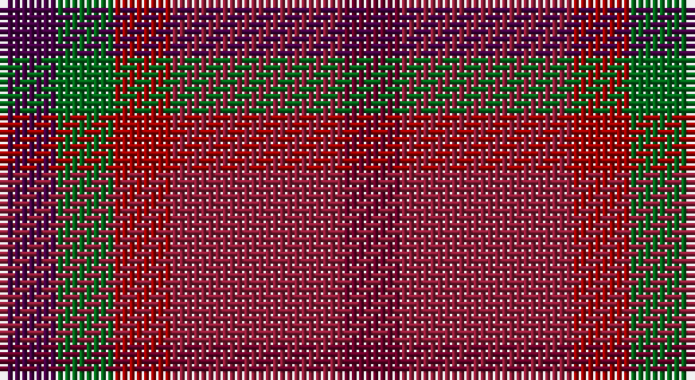

This page is one **sett** — a single exact thread-count. It belongs to the [tartan](/setts/dr1ri3r1g1dp1/)
(the same proportion at any scale), whose colour order is pattern [BGRRB](/stripes/bgrrb/).

Sourced from tartans-authority.  It is a [5 stripe tartan](/stripes/stripes5/).

Original link http://www.tartansauthority.com/tartan-ferret/display/11150/

## Register references

External register numbers recorded for this tartan.

- Scottish Register of Tartans: [11150](https://www.tartanregister.gov.uk/tartanDetails?ref=11150)
- Scottish Tartans Authority (ITI): 11150

## Thread count
DP/8 G8 DR8 DRa24 DRb/8

One full sett is **96 threads**.

## Palette

Palette: <strong>Tartan Register</strong>
<table><thead><tr><th>Colour</th><th>Threads</th><th>Shade</th><th>Base</th><th>OKLCh</th></tr></thead><tbody><tr><td>DP/</td><td style="text-align:right;font-variant-numeric:tabular-nums">8</td><td><code style="background-color:#440044;">#440044</code> <small style="color:#888">#440044</small></td><td>B <code style="background-color:#2A418A;">#2A418A</code></td><td><small style="color:#888">oklch(27.1% 0.125 328.4)</small></td></tr><tr><td>G</td><td style="text-align:right;font-variant-numeric:tabular-nums">8</td><td><code style="background-color:#006818;">#006818</code> <small style="color:#888">#006818</small></td><td>G <code style="background-color:#006100;">#006100</code></td><td><small style="color:#888">oklch(45.0% 0.142 145.0)</small></td></tr><tr><td>DR</td><td style="text-align:right;font-variant-numeric:tabular-nums">8</td><td><code style="background-color:#A00000;">#A00000</code> <small style="color:#888">#A00000</small></td><td>R <code style="background-color:#CC0000;">#CC0000</code></td><td><small style="color:#888">oklch(44.3% 0.182 29.2)</small></td></tr><tr><td>DRa</td><td style="text-align:right;font-variant-numeric:tabular-nums">24</td><td><code style="background-color:#901C38;">#901C38</code> <small style="color:#888">#901C38</small></td><td>R <code style="background-color:#CC0000;">#CC0000</code></td><td><small style="color:#888">oklch(43.2% 0.150 13.1)</small></td></tr><tr><td>DRb/</td><td style="text-align:right;font-variant-numeric:tabular-nums">8</td><td><code style="background-color:#680028;">#680028</code> <small style="color:#888">#680028</small></td><td>B <code style="background-color:#2A418A;">#2A418A</code></td><td><small style="color:#888">oklch(33.1% 0.133 8.3)</small></td></tr></tbody></table>

# Sample pattern

## Nearest tartans

The nearest existing variants by ΔTartan distance, with this tartan at the top so the swatches line up against it.

ΔTartan

Tartan

Sett

—

<a href="/ttd/edit/#slug=dr1ri3r1g1dp1~x8">Blairgowrie Berries and Cherries</a> <a class="nn-out" href="/variants/s5/dr1ri3r1g1dp1~x8/" title="open its dictionary page">↗</a>

0.99

<a href="/ttd/edit/#slug=dr1ri3r1y1dp1~x4&amp;base=dr1ri3r1g1dp1~x8">Blairgowrie Berries and Cherries</a> <a class="nn-out" href="/variants/s5/dr1ri3r1y1dp1~x4/" title="open its dictionary page">↗</a>

2.38

<a href="/ttd/edit/#slug=dg2dr12db11lo6dy6dr12dg2~x2&amp;base=dr1ri3r1g1dp1~x8">Heather MacRae</a> <a class="nn-out" href="/variants/s7/dg2dr12db11lo6dy6dr12dg2~x2/" title="open its dictionary page">↗</a>

2.42

<a href="/ttd/edit/#slug=riii2r2ri2r2rii6r1~x8&amp;base=dr1ri3r1g1dp1~x8">Youth on The Horizon (Fashion)</a> <a class="nn-out" href="/variants/s6/riii2r2ri2r2rii6r1~x8/" title="open its dictionary page">↗</a>

2.49

<a href="/ttd/edit/#slug=r10t5o5n4~x8&amp;base=dr1ri3r1g1dp1~x8">Haggis Hostels</a> <a class="nn-out" href="/variants/s4/r10t5o5n4~x8/" title="open its dictionary page">↗</a>

2.49

<a href="/ttd/edit/#slug=n7r1dt6r8lr1~x8&amp;base=dr1ri3r1g1dp1~x8">Callum (Buchan) (Name)</a> <a class="nn-out" href="/variants/s5/n7r1dt6r8lr1~x8/" title="open its dictionary page">↗</a>

2.53

<a href="/ttd/edit/#slug=ri12r4ri4r4ri4dt11dg12t4~x2&amp;base=dr1ri3r1g1dp1~x8">Akins Clan Tartan</a> <a class="nn-out" href="/variants/s8/ri12r4ri4r4ri4dt11dg12t4~x2/" title="open its dictionary page">↗</a>

2.57

<a href="/ttd/edit/#slug=k3r22dgi5dg10do10dg2~x2&amp;base=dr1ri3r1g1dp1~x8">Rowardennan</a> <a class="nn-out" href="/variants/s6/k3r22dgi5dg10do10dg2~x2/" title="open its dictionary page">↗</a>

2.58

<a href="/ttd/edit/#slug=dr20lo4dr20g35do20dy16dr28r8&amp;base=dr1ri3r1g1dp1~x8">Leighton (Personal)</a> <a class="nn-out" href="/variants/s8/dr20lo4dr20g35do20dy16dr28r8/" title="open its dictionary page">↗</a>

2.59

<a href="/ttd/edit/#slug=dy1db3dy1dg3dy4r1~x2&amp;base=dr1ri3r1g1dp1~x8">Fraser Hunting #2</a> <a class="nn-out" href="/variants/s6/dy1db3dy1dg3dy4r1~x2/" title="open its dictionary page">↗</a>

2.60

<a href="/ttd/edit/#slug=r4dg1yi6y3r2~x8&amp;base=dr1ri3r1g1dp1~x8">Belladrum Estate</a> <a class="nn-out" href="/variants/s5/r4dg1yi6y3r2~x8/" title="open its dictionary page">↗</a>

## Neighbour map

Every grey dot is one of 14360 variants placed by the first two principal components of the ΔTartan feature space (44% of its variance). Red is this tartan; blue dots are its nearest — click one to open its page.

<svg viewBox="0 0 640 380" role="img" style="max-width:100%;height:auto;border:1px solid #e0e0e0;border-radius:4px;display:block" xmlns="http://www.w3.org/2000/svg"><image href="/nn/cloud.v1.png" width="640" height="380"/><a href="/variants/s5/dr1ri3r1y1dp1~x4/"><circle cx="210.0" cy="296.8" r="4" fill="#3465a4"><title>Blairgowrie Berries and Cherries</title></circle></a><a href="/variants/s7/dg2dr12db11lo6dy6dr12dg2~x2/"><circle cx="228.0" cy="258.6" r="4" fill="#3465a4"><title>Heather MacRae</title></circle></a><a href="/variants/s6/riii2r2ri2r2rii6r1~x8/"><circle cx="302.4" cy="281.1" r="4" fill="#3465a4"><title>Youth on The Horizon (Fashion)</title></circle></a><a href="/variants/s4/r10t5o5n4~x8/"><circle cx="178.2" cy="345.6" r="4" fill="#3465a4"><title>Haggis Hostels</title></circle></a><a href="/variants/s5/n7r1dt6r8lr1~x8/"><circle cx="258.2" cy="263.9" r="4" fill="#3465a4"><title>Callum (Buchan) (Name)</title></circle></a><a href="/variants/s8/ri12r4ri4r4ri4dt11dg12t4~x2/"><circle cx="130.2" cy="270.6" r="4" fill="#3465a4"><title>Akins Clan Tartan</title></circle></a><a href="/variants/s6/k3r22dgi5dg10do10dg2~x2/"><circle cx="297.1" cy="247.7" r="4" fill="#3465a4"><title>Rowardennan</title></circle></a><a href="/variants/s8/dr20lo4dr20g35do20dy16dr28r8/"><circle cx="221.9" cy="243.7" r="4" fill="#3465a4"><title>Leighton (Personal)</title></circle></a><a href="/variants/s6/dy1db3dy1dg3dy4r1~x2/"><circle cx="271.2" cy="324.6" r="4" fill="#3465a4"><title>Fraser Hunting #2</title></circle></a><a href="/variants/s5/r4dg1yi6y3r2~x8/"><circle cx="273.9" cy="315.9" r="4" fill="#3465a4"><title>Belladrum Estate</title></circle></a><circle cx="227.9" cy="310.2" r="5" fill="#c00000"/></svg>

ID: /variants/s5/dr1ri3r1g1dp1~x8/
