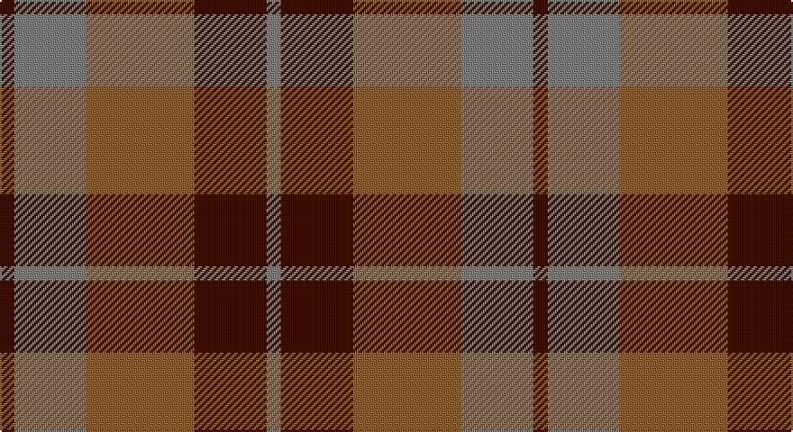

This page is one **sett** — a single exact thread-count. It belongs to the [tartan](/setts/dr2y10o15dr10y2/)
(the same proportion at any scale), whose colour order is pattern [BGRBG](/stripes/bgrbg/).

Part of the [Harmony 8](/tartans/harmony-8/) tartan — the named design grouping this sett with its other cloths.

Sourced from weddslist.  It is a [5 stripe tartan](/stripes/stripes5/).

Original link http://www.weddslist.com/cgi-bin/tartans/pg.pl?source=sts

## Thread count
DR/8 N40 LT60 DR40 N/8

One full sett is **296 threads**.

## Palette

Palette: <strong>Tartan Register</strong> <small style="color:#888">(1 of 3 colours)</small>
<table><thead><tr><th>Colour</th><th>Threads</th><th>Shade</th><th>Base</th><th>OKLCh</th></tr></thead><tbody><tr><td>DR/</td><td style="text-align:right;font-variant-numeric:tabular-nums">8</td><td><code style="background-color:#401000;">#401000</code> <small style="color:#888">#401000</small></td><td>B <code style="background-color:#2A418A;">#2A418A</code></td><td><small style="color:#888">oklch(25.3% 0.079 39.9)</small></td></tr><tr><td>N</td><td style="text-align:right;font-variant-numeric:tabular-nums">40</td><td><code style="background-color:#808080;">#808080</code> <small style="color:#888">#808080</small></td><td>G <code style="background-color:#006100;">#006100</code></td><td><small style="color:#888">oklch(60.0% 0.000 89.9)</small></td></tr><tr><td>LT</td><td style="text-align:right;font-variant-numeric:tabular-nums">60</td><td><code style="background-color:#906030;">#906030</code> <small style="color:#888">#906030</small></td><td>R <code style="background-color:#CC0000;">#CC0000</code></td><td><small style="color:#888">oklch(53.1% 0.089 63.7)</small></td></tr><tr><td>DR</td><td style="text-align:right;font-variant-numeric:tabular-nums">40</td><td><code style="background-color:#401000;">#401000</code> <small style="color:#888">#401000</small></td><td>B <code style="background-color:#2A418A;">#2A418A</code></td><td><small style="color:#888">oklch(25.3% 0.079 39.9)</small></td></tr><tr><td>N/</td><td style="text-align:right;font-variant-numeric:tabular-nums">8</td><td><code style="background-color:#808080;">#808080</code> <small style="color:#888">#808080</small></td><td>G <code style="background-color:#006100;">#006100</code></td><td><small style="color:#888">oklch(60.0% 0.000 89.9)</small></td></tr></tbody></table>

# Sample pattern

## Compared to the master

This cloth is one sett of its design; the master sett (the exemplar the design is anchored on) is below for comparison.

<figure style="margin:0"><figcaption style="color:#888;font-size:smaller">this sett</figcaption></figure>
<figure style="margin:0"><figcaption style="color:#888;font-size:smaller"><a href="/setts/dy2y10o15dy10y2/">master sett →</a></figcaption></figure>

## Nearest tartans

The nearest existing variants by ΔTartan distance, with this tartan at the top so the swatches line up against it.

ΔTartan

Tartan

Sett

—

<a href="/ttd/edit/#slug=dr2y10o15dr10y2~x4">Harmony 8</a> <a class="nn-out" href="/variants/s5/dr2y10o15dr10y2~x4/" title="open its dictionary page">↗</a>

0.59

<a href="/ttd/edit/#slug=dp2g10o15dp10g2~x4&amp;base=dr2y10o15dr10y2~x4">Harmony, 6</a> <a class="nn-out" href="/variants/s5/dp2g10o15dp10g2~x4/" title="open its dictionary page">↗</a>

1.03

<a href="/ttd/edit/#slug=dy2y10o15dy10y2~x4&amp;base=dr2y10o15dr10y2~x4">Harmony 8</a> <a class="nn-out" href="/variants/s5/dy2y10o15dy10y2~x4/" title="open its dictionary page">↗</a>

1.12

<a href="/ttd/edit/#slug=dg2r1dg8r5y5r1y2~x4&amp;base=dr2y10o15dr10y2~x4">Glen Esk (1993)</a> <a class="nn-out" href="/variants/s7/dg2r1dg8r5y5r1y2~x4/" title="open its dictionary page">↗</a>

1.13

<a href="/ttd/edit/#slug=g1m1g7m4r7m1~x4&amp;base=dr2y10o15dr10y2~x4">MacNab #2</a> <a class="nn-out" href="/variants/s6/g1m1g7m4r7m1~x4/" title="open its dictionary page">↗</a>

1.20

<a href="/ttd/edit/#slug=ri1r7ri4g7ri1g1~x4&amp;base=dr2y10o15dr10y2~x4">MacNab, Variant</a> <a class="nn-out" href="/variants/s6/ri1r7ri4g7ri1g1~x4/" title="open its dictionary page">↗</a>

1.39

<a href="/ttd/edit/#slug=n7r1dt6r8lr1~x8&amp;base=dr2y10o15dr10y2~x4">Callum (Buchan) (Name)</a> <a class="nn-out" href="/variants/s5/n7r1dt6r8lr1~x8/" title="open its dictionary page">↗</a>

1.43

<a href="/ttd/edit/#slug=o9do4o4do4o24dy19do19dy4~x2&amp;base=dr2y10o15dr10y2~x4">Chindecella Gorse (Kemete Heil)</a> <a class="nn-out" href="/variants/s8/o9do4o4do4o24dy19do19dy4~x2/" title="open its dictionary page">↗</a>

1.45

<a href="/ttd/edit/#slug=k3g13k10r13k2r3~x2&amp;base=dr2y10o15dr10y2~x4">MacCormick (Dress)</a> <a class="nn-out" href="/variants/s6/k3g13k10r13k2r3~x2/" title="open its dictionary page">↗</a>

1.46

<a href="/ttd/edit/#slug=dg25r4db24r21dg25r3db4~x2&amp;base=dr2y10o15dr10y2~x4">Glasgow #2</a> <a class="nn-out" href="/variants/s7/dg25r4db24r21dg25r3db4~x2/" title="open its dictionary page">↗</a>

1.48

<a href="/ttd/edit/#slug=ri8r1g4r1db4~x2&amp;base=dr2y10o15dr10y2~x4">Moray of Abercairney</a> <a class="nn-out" href="/variants/s5/ri8r1g4r1db4~x2/" title="open its dictionary page">↗</a>

## Neighbour map

Every grey dot is one of 14360 variants placed by the first two principal components of the ΔTartan feature space (44% of its variance). Red is this tartan; blue dots are its nearest — click one to open its page.

<svg viewBox="0 0 640 380" role="img" style="max-width:100%;height:auto;border:1px solid #e0e0e0;border-radius:4px;display:block" xmlns="http://www.w3.org/2000/svg"><image href="/nn/cloud.v1.png" width="640" height="380"/><a href="/variants/s5/dp2g10o15dp10g2~x4/"><circle cx="253.5" cy="278.7" r="4" fill="#3465a4"><title>Harmony, 6</title></circle></a><a href="/variants/s5/dy2y10o15dy10y2~x4/"><circle cx="228.6" cy="263.1" r="4" fill="#3465a4"><title>Harmony 8</title></circle></a><a href="/variants/s7/dg2r1dg8r5y5r1y2~x4/"><circle cx="270.7" cy="258.6" r="4" fill="#3465a4"><title>Glen Esk (1993)</title></circle></a><a href="/variants/s6/g1m1g7m4r7m1~x4/"><circle cx="261.0" cy="252.4" r="4" fill="#3465a4"><title>MacNab #2</title></circle></a><a href="/variants/s6/ri1r7ri4g7ri1g1~x4/"><circle cx="251.3" cy="249.2" r="4" fill="#3465a4"><title>MacNab, Variant</title></circle></a><a href="/variants/s5/n7r1dt6r8lr1~x8/"><circle cx="258.2" cy="263.9" r="4" fill="#3465a4"><title>Callum (Buchan) (Name)</title></circle></a><a href="/variants/s8/o9do4o4do4o24dy19do19dy4~x2/"><circle cx="281.2" cy="274.7" r="4" fill="#3465a4"><title>Chindecella Gorse (Kemete Heil)</title></circle></a><a href="/variants/s6/k3g13k10r13k2r3~x2/"><circle cx="228.1" cy="275.6" r="4" fill="#3465a4"><title>MacCormick (Dress)</title></circle></a><a href="/variants/s7/dg25r4db24r21dg25r3db4~x2/"><circle cx="281.5" cy="262.5" r="4" fill="#3465a4"><title>Glasgow #2</title></circle></a><a href="/variants/s5/ri8r1g4r1db4~x2/"><circle cx="241.6" cy="236.1" r="4" fill="#3465a4"><title>Moray of Abercairney</title></circle></a><circle cx="256.7" cy="277.8" r="5" fill="#c00000"/></svg>

ID: /variants/s5/dr2y10o15dr10y2~x4/
