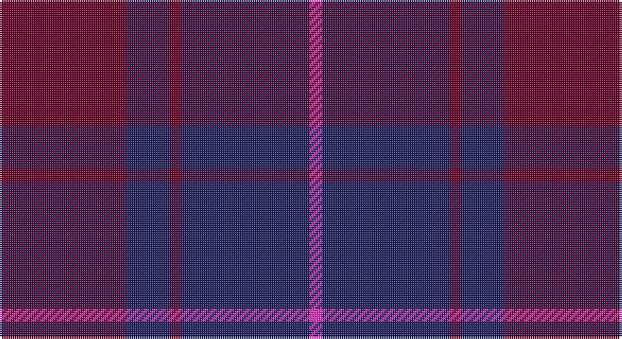

This page is one **sett** — a single exact thread-count. It belongs to the [tartan](/setts/dr30db10dr3db30m3/)
(the same proportion at any scale), whose colour order is pattern [BBBBR](/stripes/bbbbr/).

Sourced from tartans-authority.  It is a [5 stripe tartan](/stripes/stripes5/).

Original link http://www.tartansauthority.com/tartan-ferret/display/3996/

## Register references

External register numbers recorded for this tartan.

- Scottish Tartans Authority (ITI): 3996

## Thread count
DR/60 DB20 DR6 DB60 LR/6

One full sett is **238 threads**.

## Palette

Palette: <strong>Tartan Register</strong> <small style="color:#888">(2 of 3 colours)</small>
<table><thead><tr><th>Colour</th><th>Threads</th><th>Shade</th><th>Base</th><th>OKLCh</th></tr></thead><tbody><tr><td>DR/</td><td style="text-align:right;font-variant-numeric:tabular-nums">60</td><td><code style="background-color:#680028;">#680028</code> <small style="color:#888">#680028</small></td><td>B <code style="background-color:#2A418A;">#2A418A</code></td><td><small style="color:#888">oklch(33.1% 0.133 8.3)</small></td></tr><tr><td>DB</td><td style="text-align:right;font-variant-numeric:tabular-nums">20</td><td><code style="background-color:#202060;">#202060</code> <small style="color:#888">#202060</small></td><td>B <code style="background-color:#2A418A;">#2A418A</code></td><td><small style="color:#888">oklch(28.9% 0.111 276.9)</small></td></tr><tr><td>DR</td><td style="text-align:right;font-variant-numeric:tabular-nums">6</td><td><code style="background-color:#680028;">#680028</code> <small style="color:#888">#680028</small></td><td>B <code style="background-color:#2A418A;">#2A418A</code></td><td><small style="color:#888">oklch(33.1% 0.133 8.3)</small></td></tr><tr><td>DB</td><td style="text-align:right;font-variant-numeric:tabular-nums">60</td><td><code style="background-color:#202060;">#202060</code> <small style="color:#888">#202060</small></td><td>B <code style="background-color:#2A418A;">#2A418A</code></td><td><small style="color:#888">oklch(28.9% 0.111 276.9)</small></td></tr><tr><td>LR/</td><td style="text-align:right;font-variant-numeric:tabular-nums">6</td><td><code style="background-color:#EC34C4;">#EC34C4</code> <small style="color:#888">#EC34C4</small></td><td>R <code style="background-color:#CC0000;">#CC0000</code></td><td><small style="color:#888">oklch(65.8% 0.255 338.8)</small></td></tr></tbody></table>

# Sample pattern

## Nearest tartans

The nearest existing variants by ΔTartan distance, with this tartan at the top so the swatches line up against it.

ΔTartan

Tartan

Sett

—

<a href="/ttd/edit/#slug=dr30db10dr3db30m3~x2">Feniston (Personal)</a> <a class="nn-out" href="/variants/s5/dr30db10dr3db30m3~x2/" title="open its dictionary page">↗</a>

1.21

<a href="/ttd/edit/#slug=db13n6r51db51n5~x2&amp;base=dr30db10dr3db30m3~x2">Hillsdale (Corporate?)</a> <a class="nn-out" href="/variants/s5/db13n6r51db51n5~x2/" title="open its dictionary page">↗</a>

1.50

<a href="/ttd/edit/#slug=dy6dp2dy29dp29dy2dp6~x2&amp;base=dr30db10dr3db30m3~x2">Harmony 11</a> <a class="nn-out" href="/variants/s6/dy6dp2dy29dp29dy2dp6~x2/" title="open its dictionary page">↗</a>

1.52

<a href="/ttd/edit/#slug=db1r3db1r3db6g1~x4&amp;base=dr30db10dr3db30m3~x2">Robbins</a> <a class="nn-out" href="/variants/s6/db1r3db1r3db6g1~x4/" title="open its dictionary page">↗</a>

1.58

<a href="/ttd/edit/#slug=do3db3do3db27do40ly3&amp;base=dr30db10dr3db30m3~x2">Keeper of the Quaich Corporate Tartan</a> <a class="nn-out" href="/variants/s6/do3db3do3db27do40ly3/" title="open its dictionary page">↗</a>

1.66

<a href="/ttd/edit/#slug=db1m3db1m3db6g1~x4&amp;base=dr30db10dr3db30m3~x2">Robbins Family Tartan</a> <a class="nn-out" href="/variants/s6/db1m3db1m3db6g1~x4/" title="open its dictionary page">↗</a>

1.68

<a href="/ttd/edit/#slug=db16dy2db16dy19r4~x3&amp;base=dr30db10dr3db30m3~x2">Unidentified #24</a> <a class="nn-out" href="/variants/s5/db16dy2db16dy19r4~x3/" title="open its dictionary page">↗</a>

1.71

<a href="/ttd/edit/#slug=dp12r8k64dp75r8&amp;base=dr30db10dr3db30m3~x2">Laurel Cadre, The</a> <a class="nn-out" href="/variants/s5/dp12r8k64dp75r8/" title="open its dictionary page">↗</a>

1.73

<a href="/ttd/edit/#slug=k3db23k17r2~x2&amp;base=dr30db10dr3db30m3~x2">Wellington Variation</a> <a class="nn-out" href="/variants/s4/k3db23k17r2~x2/" title="open its dictionary page">↗</a>

1.76

<a href="/ttd/edit/#slug=db16o2db16o19r4~x3&amp;base=dr30db10dr3db30m3~x2">Unidentified 17</a> <a class="nn-out" href="/variants/s5/db16o2db16o19r4~x3/" title="open its dictionary page">↗</a>

1.78

<a href="/ttd/edit/#slug=db8k39db8k39db87r6&amp;base=dr30db10dr3db30m3~x2">Largan (?)</a> <a class="nn-out" href="/variants/s6/db8k39db8k39db87r6/" title="open its dictionary page">↗</a>

## Neighbour map

Every grey dot is one of 14360 variants placed by the first two principal components of the ΔTartan feature space (44% of its variance). Red is this tartan; blue dots are its nearest — click one to open its page.

<svg viewBox="0 0 640 380" role="img" style="max-width:100%;height:auto;border:1px solid #e0e0e0;border-radius:4px;display:block" xmlns="http://www.w3.org/2000/svg"><image href="/nn/cloud.v1.png" width="640" height="380"/><a href="/variants/s5/db13n6r51db51n5~x2/"><circle cx="386.6" cy="268.1" r="4" fill="#3465a4"><title>Hillsdale (Corporate?)</title></circle></a><a href="/variants/s6/dy6dp2dy29dp29dy2dp6~x2/"><circle cx="452.0" cy="259.4" r="4" fill="#3465a4"><title>Harmony 11</title></circle></a><a href="/variants/s6/db1r3db1r3db6g1~x4/"><circle cx="364.5" cy="288.0" r="4" fill="#3465a4"><title>Robbins</title></circle></a><a href="/variants/s6/do3db3do3db27do40ly3/"><circle cx="457.4" cy="239.2" r="4" fill="#3465a4"><title>Keeper of the Quaich Corporate Tartan</title></circle></a><a href="/variants/s6/db1m3db1m3db6g1~x4/"><circle cx="355.1" cy="281.2" r="4" fill="#3465a4"><title>Robbins Family Tartan</title></circle></a><a href="/variants/s5/db16dy2db16dy19r4~x3/"><circle cx="399.2" cy="307.0" r="4" fill="#3465a4"><title>Unidentified #24</title></circle></a><a href="/variants/s5/dp12r8k64dp75r8/"><circle cx="367.2" cy="260.0" r="4" fill="#3465a4"><title>Laurel Cadre, The</title></circle></a><a href="/variants/s4/k3db23k17r2~x2/"><circle cx="394.4" cy="286.2" r="4" fill="#3465a4"><title>Wellington Variation</title></circle></a><a href="/variants/s5/db16o2db16o19r4~x3/"><circle cx="408.0" cy="307.9" r="4" fill="#3465a4"><title>Unidentified 17</title></circle></a><a href="/variants/s6/db8k39db8k39db87r6/"><circle cx="429.8" cy="255.6" r="4" fill="#3465a4"><title>Largan (?)</title></circle></a><circle cx="424.9" cy="285.5" r="5" fill="#c00000"/></svg>

ID: /variants/s5/dr30db10dr3db30m3~x2/
