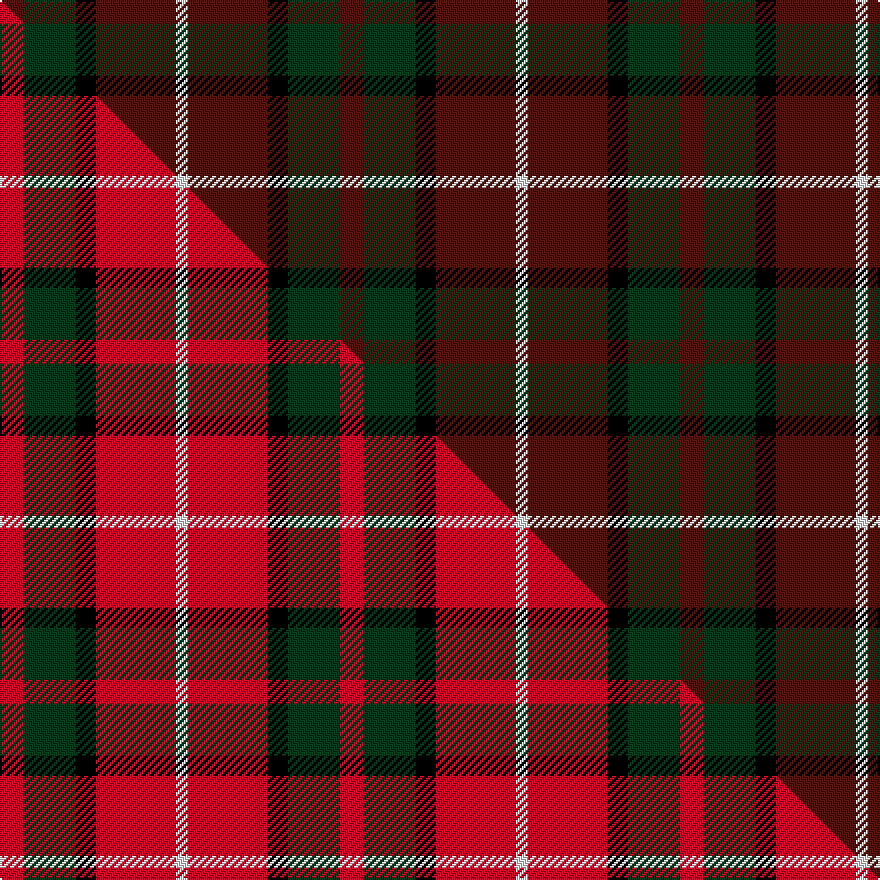

This page is one **sett** — a single exact thread-count. It belongs to the [tartan](/setts/dr6dg13k5dr20w3/)
(the same proportion at any scale), whose colour order is pattern [BGKBW](/stripes/bgkbw/).

Part of the [Ryutokukan Junior High School](/tartans/ryutokukan-junior-high-school/) tartan — the named design grouping this sett with its other cloths.

Sourced from tartans-authority.  It is a [5 stripe tartan](/stripes/stripes5/).

Original link http://www.tartansauthority.com/tartan-ferret/display/10647/

## Register references

External register numbers recorded for this tartan.

- Scottish Register of Tartans: [10647](https://www.tartanregister.gov.uk/tartanDetails?ref=10647)
- Scottish Tartans Authority (ITI): 10647

## Thread count
DR/12 DG26 K10 DR40 W/6

One full sett is **170 threads**.

## Palette
<table><thead><tr><th>Colour</th><th>Shade</th><th>OKLCh</th></tr></thead><tbody><tr><td>DG</td><td><code style="background-color:#053819;">#053819</code> <small style="color:#888">#053819</small></td><td><small style="color:#888">oklch(30.0% 0.075 151.3)</small></td></tr><tr><td>DR</td><td><code style="background-color:#55120C;">#55120C</code> <small style="color:#888">#55120C</small></td><td><small style="color:#888">oklch(30.0% 0.099 29.3)</small></td></tr><tr><td>K</td><td><code style="background-color:#000000;">#000000</code> <small style="color:#888">#000000</small></td><td><small style="color:#888">oklch(0.0% 0.000 0.0)</small></td></tr><tr><td>W</td><td><code style="background-color:#F7F7F7;">#F7F7F7</code> <small style="color:#888">#F7F7F7</small></td><td><small style="color:#888">oklch(97.6% 0.000 89.9)</small></td></tr></tbody></table>

# Sample pattern

## Compared to the master

This cloth is one sett of its design; the master sett (the exemplar the design is anchored on) is below for comparison.

Its **ΔTartan distance** from the master is **2.10** — the same measure the nearest-tartans table ranks by (0 is identical; a re-scale of the same cloth is near 0, a recolour or a different proportion further).

<figure class="master-compare" style="margin:0">

this sett
master sett ★

<figcaption style="color:#888;font-size:smaller">One weave of this sett against the <a href="/setts/r6dg13k5r20w3/">master sett ★</a>, split on the diagonal: a shared proportion runs seamlessly across it with only the shades shifting; a different proportion breaks on it.</figcaption>
</figure>

## Nearest variants

The nearest existing variants by ΔTartan distance, with this cloth at the top so the swatches line up against it.

ΔTartan

Threads

Variant

Sett

—

170

<a href="/variants/s5/dr6dg13k5dr20w3~x2/">Ryutokukan Junior High School (Corp)</a>

<a href="/ttd/edit/#slug=dr9k1dr5g6dr4k2~x4&amp;base=dr6dg13k5dr20w3~x2" title="compare in the TTD">1.87</a>

172

<a href="/variants/s6/dr9k1dr5g6dr4k2~x4/">MacAn of Lurgyvallan (Hose)</a>

<a href="/ttd/edit/#slug=g3k15dr8g2n8k2~x4&amp;base=dr6dg13k5dr20w3~x2" title="compare in the TTD">1.94</a>

284

<a href="/variants/s6/g3k15dr8g2n8k2~x4/">Lindsay Htg (Clan?)</a>

<a href="/ttd/edit/#slug=g3k15r8g2n8k2~x4&amp;base=dr6dg13k5dr20w3~x2" title="compare in the TTD">1.94</a>

284

<a href="/variants/s6/g3k15r8g2n8k2~x4/">Thompson Black (Fashion)</a>

<a href="/ttd/edit/#slug=r17db7y8dg58k6~x2&amp;base=dr6dg13k5dr20w3~x2" title="compare in the TTD">2.22</a>

338

<a href="/variants/s5/r17db7y8dg58k6~x2/">St Johns County's Sheriff's Office</a>

<a href="/ttd/edit/#slug=r1k8dg2db4r1~x8&amp;base=dr6dg13k5dr20w3~x2" title="compare in the TTD">2.23</a>

240

<a href="/variants/s5/r1k8dg2db4r1~x8/">Nairn</a>

<a href="/ttd/edit/#slug=dr11n3dr12k11t11w1~x2&amp;base=dr6dg13k5dr20w3~x2" title="compare in the TTD">2.25</a>

172

<a href="/variants/s6/dr11n3dr12k11t11w1~x2/">Dunfermline</a>

<a href="/ttd/edit/#slug=k4g5k2g5dr17db2~x2&amp;base=dr6dg13k5dr20w3~x2" title="compare in the TTD">2.75</a>

128

<a href="/variants/s6/k4g5k2g5dr17db2~x2/">Denny Hunting</a>

<a href="/ttd/edit/#slug=r3db15r3g8r20k2~x2&amp;base=dr6dg13k5dr20w3~x2" title="compare in the TTD">2.76</a>

194

<a href="/variants/s6/r3db15r3g8r20k2~x2/">Finnigan (Estimated threadcount)</a>

<a href="/ttd/edit/#slug=dy12k4w2n6r3~x2&amp;base=dr6dg13k5dr20w3~x2" title="compare in the TTD">2.79</a>

78

<a href="/variants/s5/dy12k4w2n6r3~x2/">Strathblane (Fashion)</a>

<a href="/ttd/edit/#slug=n24r11k6db4~x4&amp;base=dr6dg13k5dr20w3~x2" title="compare in the TTD">2.85</a>

248

<a href="/variants/s4/n24r11k6db4~x4/">Nebar (Corporate)</a>

## Neighbour map

Every grey dot is one of 13620 variants placed by the first two principal components of the ΔTartan feature space (42% of its variance). Red is this tartan; blue dots are its nearest — click one to open its page.

<svg viewBox="0 0 640 380" role="img" style="max-width:100%;height:auto;border:1px solid #e0e0e0;border-radius:4px;display:block" xmlns="http://www.w3.org/2000/svg"><image href="/nn/cloud.v1.png" width="640" height="380"/><a href="/variants/s6/dr9k1dr5g6dr4k2~x4/"><circle cx="367.6" cy="242.3" r="4" fill="#3465a4"><title>MacAn of Lurgyvallan (Hose)</title></circle></a><a href="/variants/s6/g3k15dr8g2n8k2~x4/"><circle cx="183.6" cy="213.8" r="4" fill="#3465a4"><title>Lindsay Htg (Clan?)</title></circle></a><a href="/variants/s6/g3k15r8g2n8k2~x4/"><circle cx="164.7" cy="204.3" r="4" fill="#3465a4"><title>Thompson Black (Fashion)</title></circle></a><a href="/variants/s5/r17db7y8dg58k6~x2/"><circle cx="318.9" cy="183.0" r="4" fill="#3465a4"><title>St Johns County's Sheriff's Office</title></circle></a><a href="/variants/s5/r1k8dg2db4r1~x8/"><circle cx="232.7" cy="208.2" r="4" fill="#3465a4"><title>Nairn</title></circle></a><a href="/variants/s6/dr11n3dr12k11t11w1~x2/"><circle cx="190.1" cy="207.5" r="4" fill="#3465a4"><title>Dunfermline</title></circle></a><a href="/variants/s6/k4g5k2g5dr17db2~x2/"><circle cx="239.6" cy="200.5" r="4" fill="#3465a4"><title>Denny Hunting</title></circle></a><a href="/variants/s6/r3db15r3g8r20k2~x2/"><circle cx="248.2" cy="190.5" r="4" fill="#3465a4"><title>Finnigan (Estimated threadcount)</title></circle></a><a href="/variants/s5/dy12k4w2n6r3~x2/"><circle cx="153.2" cy="222.7" r="4" fill="#3465a4"><title>Strathblane (Fashion)</title></circle></a><a href="/variants/s4/n24r11k6db4~x4/"><circle cx="252.5" cy="242.5" r="4" fill="#3465a4"><title>Nebar (Corporate)</title></circle></a><circle cx="274.2" cy="238.4" r="5" fill="#c00000"/><text x="320" y="376" text-anchor="middle" font-size="11" fill="#999">ground</text><text x="11" y="190" text-anchor="middle" font-size="11" fill="#999" transform="rotate(-90 11 190)">complexity</text></svg>

ID: /variants/s5/dr6dg13k5dr20w3~x2/
