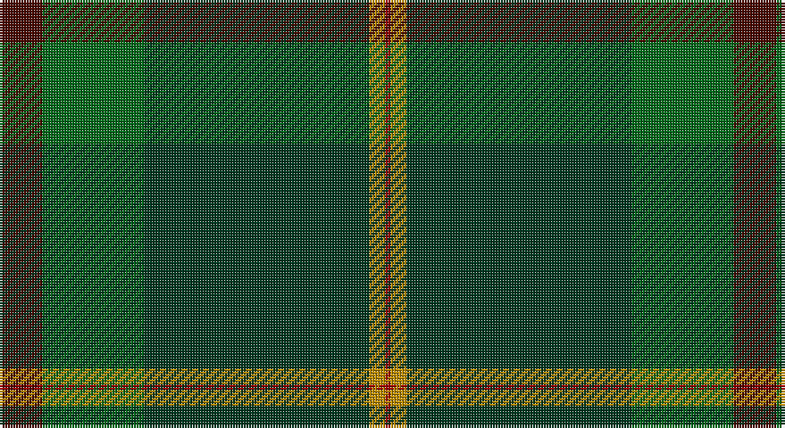

This page is one **sett** — a single exact thread-count. It belongs to the [tartan](/setts/dr8g19dg42lo3r1/)
(the same proportion at any scale), whose colour order is pattern [BGGYR](/stripes/bggyr/).

Sourced from tartans-authority.  It is a [5 stripe tartan](/stripes/stripes5/).

Original link http://www.tartansauthority.com/tartan-ferret/display/10542/

## Register references

External register numbers recorded for this tartan.

- Scottish Register of Tartans: [10542](https://www.tartanregister.gov.uk/tartanDetails?ref=10542)
- Scottish Tartans Authority (ITI): 10542

## Thread count
DRa/16 G38 DG84 DY6 DR/2

One full sett is **274 threads**.

## Palette

Palette: <strong>Tartan Register</strong> <small style="color:#888">(4 of 5 colours)</small>
<table><thead><tr><th>Colour</th><th>Threads</th><th>Shade</th><th>Base</th><th>OKLCh</th></tr></thead><tbody><tr><td>DRa/</td><td style="text-align:right;font-variant-numeric:tabular-nums">16</td><td><code style="background-color:#480800;">#480800</code> <small style="color:#888">#480800</small></td><td>B <code style="background-color:#2A418A;">#2A418A</code></td><td><small style="color:#888">oklch(26.1% 0.096 33.1)</small></td></tr><tr><td>G</td><td style="text-align:right;font-variant-numeric:tabular-nums">38</td><td><code style="background-color:#006818;">#006818</code> <small style="color:#888">#006818</small></td><td>G <code style="background-color:#006100;">#006100</code></td><td><small style="color:#888">oklch(45.0% 0.142 145.0)</small></td></tr><tr><td>DG</td><td style="text-align:right;font-variant-numeric:tabular-nums">84</td><td><code style="background-color:#003820;">#003820</code> <small style="color:#888">#003820</small></td><td>G <code style="background-color:#006100;">#006100</code></td><td><small style="color:#888">oklch(30.0% 0.070 158.3)</small></td></tr><tr><td>DY</td><td style="text-align:right;font-variant-numeric:tabular-nums">6</td><td><code style="background-color:#BC8C00;">#BC8C00</code> <small style="color:#888">#BC8C00</small></td><td>Y <code style="background-color:#F2BF00;">#F2BF00</code></td><td><small style="color:#888">oklch(66.8% 0.137 84.1)</small></td></tr><tr><td>DR/</td><td style="text-align:right;font-variant-numeric:tabular-nums">2</td><td><code style="background-color:#A00000;">#A00000</code> <small style="color:#888">#A00000</small></td><td>R <code style="background-color:#CC0000;">#CC0000</code></td><td><small style="color:#888">oklch(44.3% 0.182 29.2)</small></td></tr></tbody></table>

# Sample pattern

## Nearest tartans

The nearest existing variants by ΔTartan distance, with this tartan at the top so the swatches line up against it.

ΔTartan

Tartan

Sett

—

<a href="/ttd/edit/#slug=dr8g19dg42lo3r1~x2">Nolan (Personal)</a> <a class="nn-out" href="/variants/s5/dr8g19dg42lo3r1~x2/" title="open its dictionary page">↗</a>

1.53

<a href="/ttd/edit/#slug=dy2dg44k10r1db16r1~x2&amp;base=dr8g19dg42lo3r1~x2">MacWilliam Hunting</a> <a class="nn-out" href="/variants/s6/dy2dg44k10r1db16r1~x2/" title="open its dictionary page">↗</a>

1.55

<a href="/ttd/edit/#slug=g22dy40n8k9o1~x2&amp;base=dr8g19dg42lo3r1~x2">Holehouse, Dag (Personal)</a> <a class="nn-out" href="/variants/s5/g22dy40n8k9o1~x2/" title="open its dictionary page">↗</a>

1.62

<a href="/ttd/edit/#slug=k8r2k13ly2dg48db6~x2&amp;base=dr8g19dg42lo3r1~x2">Green Swamp Youth Campers</a> <a class="nn-out" href="/variants/s6/k8r2k13ly2dg48db6~x2/" title="open its dictionary page">↗</a>

1.82

<a href="/ttd/edit/#slug=r3n34db4g47lb3~x2&amp;base=dr8g19dg42lo3r1~x2">Exabyte</a> <a class="nn-out" href="/variants/s5/r3n34db4g47lb3~x2/" title="open its dictionary page">↗</a>

1.91

<a href="/ttd/edit/#slug=dg47ly2dg5ly2dg4k15db19r2~x2&amp;base=dr8g19dg42lo3r1~x2">Unidentified, Toy Bear</a> <a class="nn-out" href="/variants/s8/dg47ly2dg5ly2dg4k15db19r2~x2/" title="open its dictionary page">↗</a>

1.94

<a href="/ttd/edit/#slug=r4dg3dgi39dg40r2lo4~x2&amp;base=dr8g19dg42lo3r1~x2">McGeorge (Personal)</a> <a class="nn-out" href="/variants/s6/r4dg3dgi39dg40r2lo4~x2/" title="open its dictionary page">↗</a>

1.97

<a href="/ttd/edit/#slug=dy10k2y5k2dg46ly2k2~x2&amp;base=dr8g19dg42lo3r1~x2">Green Rover, The</a> <a class="nn-out" href="/variants/s7/dy10k2y5k2dg46ly2k2~x2/" title="open its dictionary page">↗</a>

1.99

<a href="/ttd/edit/#slug=dt50g26k9g4lb2r2g10~x2&amp;base=dr8g19dg42lo3r1~x2">Java Saint Andrew Society Hunting</a> <a class="nn-out" href="/variants/s7/dt50g26k9g4lb2r2g10~x2/" title="open its dictionary page">↗</a>

2.00

<a href="/ttd/edit/#slug=dt12k17y4dg51ly3g4~x2&amp;base=dr8g19dg42lo3r1~x2">US Army Regimental Tartan</a> <a class="nn-out" href="/variants/s6/dt12k17y4dg51ly3g4~x2/" title="open its dictionary page">↗</a>

2.02

<a href="/ttd/edit/#slug=dg36k52lo2k8dg8dy8lo2dy6dg36r1~x2&amp;base=dr8g19dg42lo3r1~x2">Grenauld</a> <a class="nn-out" href="/variants/s10/dg36k52lo2k8dg8dy8lo2dy6dg36r1~x2/" title="open its dictionary page">↗</a>

## Neighbour map

Every grey dot is one of 14360 variants placed by the first two principal components of the ΔTartan feature space (44% of its variance). Red is this tartan; blue dots are its nearest — click one to open its page.

<svg viewBox="0 0 640 380" role="img" style="max-width:100%;height:auto;border:1px solid #e0e0e0;border-radius:4px;display:block" xmlns="http://www.w3.org/2000/svg"><image href="/nn/cloud.v1.png" width="640" height="380"/><a href="/variants/s6/dy2dg44k10r1db16r1~x2/"><circle cx="427.6" cy="155.3" r="4" fill="#3465a4"><title>MacWilliam Hunting</title></circle></a><a href="/variants/s5/g22dy40n8k9o1~x2/"><circle cx="397.8" cy="211.9" r="4" fill="#3465a4"><title>Holehouse, Dag (Personal)</title></circle></a><a href="/variants/s6/k8r2k13ly2dg48db6~x2/"><circle cx="438.1" cy="192.8" r="4" fill="#3465a4"><title>Green Swamp Youth Campers</title></circle></a><a href="/variants/s5/r3n34db4g47lb3~x2/"><circle cx="380.5" cy="226.2" r="4" fill="#3465a4"><title>Exabyte</title></circle></a><a href="/variants/s8/dg47ly2dg5ly2dg4k15db19r2~x2/"><circle cx="391.7" cy="172.3" r="4" fill="#3465a4"><title>Unidentified, Toy Bear</title></circle></a><a href="/variants/s6/r4dg3dgi39dg40r2lo4~x2/"><circle cx="367.6" cy="210.7" r="4" fill="#3465a4"><title>McGeorge (Personal)</title></circle></a><a href="/variants/s7/dy10k2y5k2dg46ly2k2~x2/"><circle cx="509.2" cy="187.3" r="4" fill="#3465a4"><title>Green Rover, The</title></circle></a><a href="/variants/s7/dt50g26k9g4lb2r2g10~x2/"><circle cx="354.4" cy="181.3" r="4" fill="#3465a4"><title>Java Saint Andrew Society Hunting</title></circle></a><a href="/variants/s6/dt12k17y4dg51ly3g4~x2/"><circle cx="351.6" cy="191.7" r="4" fill="#3465a4"><title>US Army Regimental Tartan</title></circle></a><a href="/variants/s10/dg36k52lo2k8dg8dy8lo2dy6dg36r1~x2/"><circle cx="432.4" cy="170.4" r="4" fill="#3465a4"><title>Grenauld</title></circle></a><circle cx="439.5" cy="196.7" r="5" fill="#c00000"/></svg>

ID: /variants/s5/dr8g19dg42lo3r1~x2/
