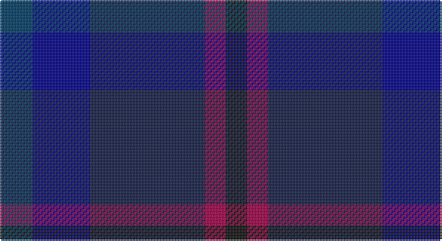

This page is one **sett** — a single exact thread-count. It belongs to the [tartan](/setts/dt11db19dbi38m7k7/)
(the same proportion at any scale), whose colour order is pattern [BBBRK](/stripes/bbbrk/).

Sourced from register-of-tartans.  It is a [5 stripe tartan](/stripes/stripes5/).

Original link https://www.tartanregister.gov.uk/tartanDetails.aspx?ref=11219

## Register references

External register numbers recorded for this tartan.

- Scottish Register of Tartans: [11219](https://www.tartanregister.gov.uk/tartanDetails.aspx?ref=11219)

## Thread count
DBb/22 DB38 DBa76 R14 K/14

One full sett is **292 threads**.

## Palette

Palette: <strong>Tartan Register</strong>
<table><thead><tr><th>Colour</th><th>Threads</th><th>Shade</th><th>Base</th><th>OKLCh</th></tr></thead><tbody><tr><td>DBb/</td><td style="text-align:right;font-variant-numeric:tabular-nums">22</td><td><code style="background-color:#003C64;">#003C64</code> <small style="color:#888">#003C64</small></td><td>B <code style="background-color:#2A418A;">#2A418A</code></td><td><small style="color:#888">oklch(34.5% 0.089 246.0)</small></td></tr><tr><td>DB</td><td style="text-align:right;font-variant-numeric:tabular-nums">38</td><td><code style="background-color:#00008C;">#00008C</code> <small style="color:#888">#00008C</small></td><td>B <code style="background-color:#2A418A;">#2A418A</code></td><td><small style="color:#888">oklch(28.9% 0.200 264.1)</small></td></tr><tr><td>DBa</td><td style="text-align:right;font-variant-numeric:tabular-nums">76</td><td><code style="background-color:#141E46;">#141E46</code> <small style="color:#888">#141E46</small></td><td>B <code style="background-color:#2A418A;">#2A418A</code></td><td><small style="color:#888">oklch(25.2% 0.076 269.7)</small></td></tr><tr><td>R</td><td style="text-align:right;font-variant-numeric:tabular-nums">14</td><td><code style="background-color:#A00048;">#A00048</code> <small style="color:#888">#A00048</small></td><td>R <code style="background-color:#CC0000;">#CC0000</code></td><td><small style="color:#888">oklch(45.4% 0.182 5.3)</small></td></tr><tr><td>K/</td><td style="text-align:right;font-variant-numeric:tabular-nums">14</td><td><code style="background-color:#101010;">#101010</code> <small style="color:#888">#101010</small></td><td>K <code style="background-color:#000000;">#000000</code></td><td><small style="color:#888">oklch(17.3% 0.000 89.9)</small></td></tr></tbody></table>

# Sample pattern

## Nearest tartans

The nearest existing variants by ΔTartan distance, with this tartan at the top so the swatches line up against it.

ΔTartan

Tartan

Sett

—

<a href="/ttd/edit/#slug=dt11db19dbi38m7k7~x2">Rose, Danny and Hanna (Personal)</a> <a class="nn-out" href="/variants/s5/dt11db19dbi38m7k7~x2/" title="open its dictionary page">↗</a>

1.61

<a href="/ttd/edit/#slug=r1dt8k6db10lo1~x4&amp;base=dt11db19dbi38m7k7~x2">Sanix Modern</a> <a class="nn-out" href="/variants/s5/r1dt8k6db10lo1~x4/" title="open its dictionary page">↗</a>

1.77

<a href="/ttd/edit/#slug=dy3dbi6db2lo2db11dbi2db2dy3~x2&amp;base=dt11db19dbi38m7k7~x2">Daks (Blue)</a> <a class="nn-out" href="/variants/s8/dy3dbi6db2lo2db11dbi2db2dy3~x2/" title="open its dictionary page">↗</a>

1.83

<a href="/variants/s7/dgi3dg12dt6dgii3db15o2db2~x2/">Myres Castle</a>

1.86

<a href="/ttd/edit/#slug=dg7db3dg7dt22db22w3db5~x2&amp;base=dt11db19dbi38m7k7~x2">United Colours of Scotland (Corporat</a> <a class="nn-out" href="/variants/s7/dg7db3dg7dt22db22w3db5~x2/" title="open its dictionary page">↗</a>

1.88

<a href="/ttd/edit/#slug=dy5dbi12db4lo4db22dbi3db4dy5&amp;base=dt11db19dbi38m7k7~x2">Daks Muted blue Trade Tartan</a> <a class="nn-out" href="/variants/s8/dy5dbi12db4lo4db22dbi3db4dy5/" title="open its dictionary page">↗</a>

2.01

<a href="/ttd/edit/#slug=dt8db10dt22dg7g10dg22dp3~x2&amp;base=dt11db19dbi38m7k7~x2">Baron of Crawfordjohn (Personal)</a> <a class="nn-out" href="/variants/s7/dt8db10dt22dg7g10dg22dp3~x2/" title="open its dictionary page">↗</a>

2.02

<a href="/ttd/edit/#slug=db12t6db52dt41m12dp6m12&amp;base=dt11db19dbi38m7k7~x2">Great Scot (Fashion)</a> <a class="nn-out" href="/variants/s7/db12t6db52dt41m12dp6m12/" title="open its dictionary page">↗</a>

2.12

<a href="/ttd/edit/#slug=dg7db1dg1k4dp4k1~x4&amp;base=dt11db19dbi38m7k7~x2">MacArthur of Milton Hunting</a> <a class="nn-out" href="/variants/s6/dg7db1dg1k4dp4k1~x4/" title="open its dictionary page">↗</a>

2.14

<a href="/ttd/edit/#slug=k4dg16k13db16t3db3~x2&amp;base=dt11db19dbi38m7k7~x2">I Y</a> <a class="nn-out" href="/variants/s6/k4dg16k13db16t3db3~x2/" title="open its dictionary page">↗</a>

2.22

<a href="/ttd/edit/#slug=db21k10dt8r3~x2&amp;base=dt11db19dbi38m7k7~x2">Rangers 1989 (Sports)</a> <a class="nn-out" href="/variants/s4/db21k10dt8r3~x2/" title="open its dictionary page">↗</a>

## Neighbour map

Every grey dot is one of 14360 variants placed by the first two principal components of the ΔTartan feature space (44% of its variance). Red is this tartan; blue dots are its nearest — click one to open its page.

<svg viewBox="0 0 640 380" role="img" style="max-width:100%;height:auto;border:1px solid #e0e0e0;border-radius:4px;display:block" xmlns="http://www.w3.org/2000/svg"><image href="/nn/cloud.v1.png" width="640" height="380"/><a href="/variants/s5/r1dt8k6db10lo1~x4/"><circle cx="262.0" cy="272.4" r="4" fill="#3465a4"><title>Sanix Modern</title></circle></a><a href="/variants/s8/dy3dbi6db2lo2db11dbi2db2dy3~x2/"><circle cx="305.5" cy="281.4" r="4" fill="#3465a4"><title>Daks (Blue)</title></circle></a><a href="/variants/s7/dgi3dg12dt6dgii3db15o2db2~x2/"><circle cx="255.6" cy="259.3" r="4" fill="#3465a4"><title>Myres Castle</title></circle></a><a href="/variants/s7/dg7db3dg7dt22db22w3db5~x2/"><circle cx="289.6" cy="276.2" r="4" fill="#3465a4"><title>United Colours of Scotland (Corporat</title></circle></a><a href="/variants/s8/dy5dbi12db4lo4db22dbi3db4dy5/"><circle cx="335.6" cy="267.3" r="4" fill="#3465a4"><title>Daks Muted blue Trade Tartan</title></circle></a><a href="/variants/s7/dt8db10dt22dg7g10dg22dp3~x2/"><circle cx="242.7" cy="295.1" r="4" fill="#3465a4"><title>Baron of Crawfordjohn (Personal)</title></circle></a><a href="/variants/s7/db12t6db52dt41m12dp6m12/"><circle cx="285.5" cy="239.3" r="4" fill="#3465a4"><title>Great Scot (Fashion)</title></circle></a><a href="/variants/s6/dg7db1dg1k4dp4k1~x4/"><circle cx="345.8" cy="314.7" r="4" fill="#3465a4"><title>MacArthur of Milton Hunting</title></circle></a><a href="/variants/s6/k4dg16k13db16t3db3~x2/"><circle cx="239.2" cy="311.5" r="4" fill="#3465a4"><title>I Y</title></circle></a><a href="/variants/s4/db21k10dt8r3~x2/"><circle cx="301.7" cy="304.5" r="4" fill="#3465a4"><title>Rangers 1989 (Sports)</title></circle></a><circle cx="293.8" cy="308.7" r="5" fill="#c00000"/></svg>

ID: /variants/s5/dt11db19dbi38m7k7~x2/
