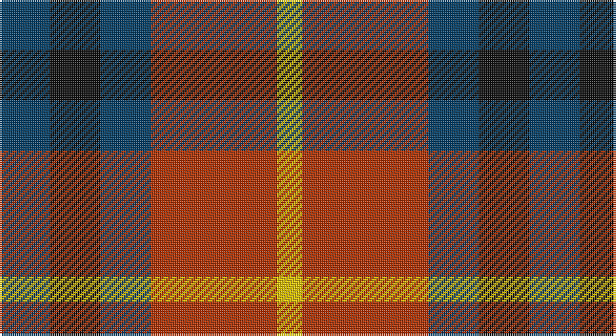

This page is one **sett** — a single exact thread-count. It belongs to the [tartan](/setts/dt2k2dt2r5ly1/)
(the same proportion at any scale), whose colour order is pattern [BKBRY](/stripes/bkbry/).

Part of the [Chivas Regal](/tartans/chivas-regal/) tartan — the named design grouping this sett with its other cloths.

Sourced from tartans-authority.  It is a [5 stripe tartan](/stripes/stripes5/).

Original link http://www.tartansauthority.com/tartan-ferret/display/3949/

## Register references

External register numbers recorded for this tartan.

- Scottish Tartans Authority (ITI): 3949

## Thread count
DB/24 K24 DB24 R60 Y/12

One full sett is **252 threads**.

## Palette

Palette: <strong>Tartan Register</strong>
<table><thead><tr><th>Colour</th><th>Threads</th><th>Shade</th><th>Base</th><th>OKLCh</th></tr></thead><tbody><tr><td>DB/</td><td style="text-align:right;font-variant-numeric:tabular-nums">24</td><td><code style="background-color:#003C64;">#003C64</code> <small style="color:#888">#003C64</small></td><td>B <code style="background-color:#2A418A;">#2A418A</code></td><td><small style="color:#888">oklch(34.5% 0.089 246.0)</small></td></tr><tr><td>K</td><td style="text-align:right;font-variant-numeric:tabular-nums">24</td><td><code style="background-color:#101010;">#101010</code> <small style="color:#888">#101010</small></td><td>K <code style="background-color:#000000;">#000000</code></td><td><small style="color:#888">oklch(17.3% 0.000 89.9)</small></td></tr><tr><td>DB</td><td style="text-align:right;font-variant-numeric:tabular-nums">24</td><td><code style="background-color:#003C64;">#003C64</code> <small style="color:#888">#003C64</small></td><td>B <code style="background-color:#2A418A;">#2A418A</code></td><td><small style="color:#888">oklch(34.5% 0.089 246.0)</small></td></tr><tr><td>R</td><td style="text-align:right;font-variant-numeric:tabular-nums">60</td><td><code style="background-color:#B03000;">#B03000</code> <small style="color:#888">#B03000</small></td><td>R <code style="background-color:#CC0000;">#CC0000</code></td><td><small style="color:#888">oklch(50.3% 0.171 36.3)</small></td></tr><tr><td>Y/</td><td style="text-align:right;font-variant-numeric:tabular-nums">12</td><td><code style="background-color:#E8C000;">#E8C000</code> <small style="color:#888">#E8C000</small></td><td>Y <code style="background-color:#F2BF00;">#F2BF00</code></td><td><small style="color:#888">oklch(81.9% 0.168 93.7)</small></td></tr></tbody></table>

# Sample pattern

## Compared to the master

This cloth is one sett of its design; the master sett (the exemplar the design is anchored on) is below for comparison.

<figure style="margin:0"><figcaption style="color:#888;font-size:smaller">this sett</figcaption></figure>
<figure style="margin:0"><figcaption style="color:#888;font-size:smaller"><a href="/setts/dt6k6dt6r14ly3/">master sett →</a></figcaption></figure>

## Nearest tartans

The nearest existing variants by ΔTartan distance, with this tartan at the top so the swatches line up against it.

ΔTartan

Tartan

Sett

—

<a href="/ttd/edit/#slug=dt2k2dt2r5ly1~x12">Chivas Regal (Corporate)</a> <a class="nn-out" href="/variants/s5/dt2k2dt2r5ly1~x12/" title="open its dictionary page">↗</a>

0.26

<a href="/ttd/edit/#slug=dt6k6dt6r14ly3~x2&amp;base=dt2k2dt2r5ly1~x12">Chivas Regal</a> <a class="nn-out" href="/variants/s5/dt6k6dt6r14ly3~x2/" title="open its dictionary page">↗</a>

0.88

<a href="/ttd/edit/#slug=db9r12dg9db5w2~x4&amp;base=dt2k2dt2r5ly1~x12">Battle of Prestonpans (1745) Herit</a> <a class="nn-out" href="/variants/s5/db9r12dg9db5w2~x4/" title="open its dictionary page">↗</a>

1.00

<a href="/ttd/edit/#slug=t1r6db1t3k3t1~x8&amp;base=dt2k2dt2r5ly1~x12">MacTavish #2</a> <a class="nn-out" href="/variants/s6/t1r6db1t3k3t1~x8/" title="open its dictionary page">↗</a>

1.03

<a href="/ttd/edit/#slug=r2g4db8r9g9k2r2~x4&amp;base=dt2k2dt2r5ly1~x12">Stewart (Artefact)</a> <a class="nn-out" href="/variants/s7/r2g4db8r9g9k2r2~x4/" title="open its dictionary page">↗</a>

1.07

<a href="/ttd/edit/#slug=r6dg5k5t1~x2&amp;base=dt2k2dt2r5ly1~x12">Unidentified No 28</a> <a class="nn-out" href="/variants/s4/r6dg5k5t1~x2/" title="open its dictionary page">↗</a>

1.18

<a href="/ttd/edit/#slug=db3r2g5r8db12w3~x2&amp;base=dt2k2dt2r5ly1~x12">Edinburgh Bus Company (Corporate)</a> <a class="nn-out" href="/variants/s6/db3r2g5r8db12w3~x2/" title="open its dictionary page">↗</a>

1.20

<a href="/ttd/edit/#slug=r2g4db8r9g9k2r2~x2&amp;base=dt2k2dt2r5ly1~x12">Stewart, Plaid</a> <a class="nn-out" href="/variants/s7/r2g4db8r9g9k2r2~x2/" title="open its dictionary page">↗</a>

1.22

<a href="/ttd/edit/#slug=g3k15r8g2o8k2~x4&amp;base=dt2k2dt2r5ly1~x12">Thompson Black (Fashion)</a> <a class="nn-out" href="/variants/s6/g3k15r8g2o8k2~x4/" title="open its dictionary page">↗</a>

1.23

<a href="/ttd/edit/#slug=db2g4ly1db1r2~x12&amp;base=dt2k2dt2r5ly1~x12">Creek Indian Nation</a> <a class="nn-out" href="/variants/s5/db2g4ly1db1r2~x12/" title="open its dictionary page">↗</a>

1.24

<a href="/ttd/edit/#slug=dy12k4w2o6r3~x2&amp;base=dt2k2dt2r5ly1~x12">Strathblane (Fashion)</a> <a class="nn-out" href="/variants/s5/dy12k4w2o6r3~x2/" title="open its dictionary page">↗</a>

## Neighbour map

Every grey dot is one of 14360 variants placed by the first two principal components of the ΔTartan feature space (44% of its variance). Red is this tartan; blue dots are its nearest — click one to open its page.

<svg viewBox="0 0 640 380" role="img" style="max-width:100%;height:auto;border:1px solid #e0e0e0;border-radius:4px;display:block" xmlns="http://www.w3.org/2000/svg"><image href="/nn/cloud.v1.png" width="640" height="380"/><a href="/variants/s5/dt6k6dt6r14ly3~x2/"><circle cx="160.5" cy="269.8" r="4" fill="#3465a4"><title>Chivas Regal</title></circle></a><a href="/variants/s5/db9r12dg9db5w2~x4/"><circle cx="150.2" cy="264.3" r="4" fill="#3465a4"><title>Battle of Prestonpans (1745) Herit</title></circle></a><a href="/variants/s6/t1r6db1t3k3t1~x8/"><circle cx="192.3" cy="235.8" r="4" fill="#3465a4"><title>MacTavish #2</title></circle></a><a href="/variants/s7/r2g4db8r9g9k2r2~x4/"><circle cx="159.8" cy="253.8" r="4" fill="#3465a4"><title>Stewart (Artefact)</title></circle></a><a href="/variants/s4/r6dg5k5t1~x2/"><circle cx="144.1" cy="278.8" r="4" fill="#3465a4"><title>Unidentified No 28</title></circle></a><a href="/variants/s6/db3r2g5r8db12w3~x2/"><circle cx="181.6" cy="231.2" r="4" fill="#3465a4"><title>Edinburgh Bus Company (Corporate)</title></circle></a><a href="/variants/s7/r2g4db8r9g9k2r2~x2/"><circle cx="145.6" cy="247.8" r="4" fill="#3465a4"><title>Stewart, Plaid</title></circle></a><a href="/variants/s6/g3k15r8g2o8k2~x4/"><circle cx="200.8" cy="224.2" r="4" fill="#3465a4"><title>Thompson Black (Fashion)</title></circle></a><a href="/variants/s5/db2g4ly1db1r2~x12/"><circle cx="144.2" cy="274.7" r="4" fill="#3465a4"><title>Creek Indian Nation</title></circle></a><a href="/variants/s5/dy12k4w2o6r3~x2/"><circle cx="173.0" cy="230.8" r="4" fill="#3465a4"><title>Strathblane (Fashion)</title></circle></a><circle cx="175.6" cy="262.7" r="5" fill="#c00000"/></svg>

ID: /variants/s5/dt2k2dt2r5ly1~x12/
